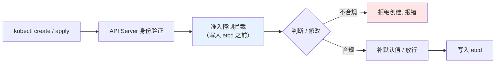
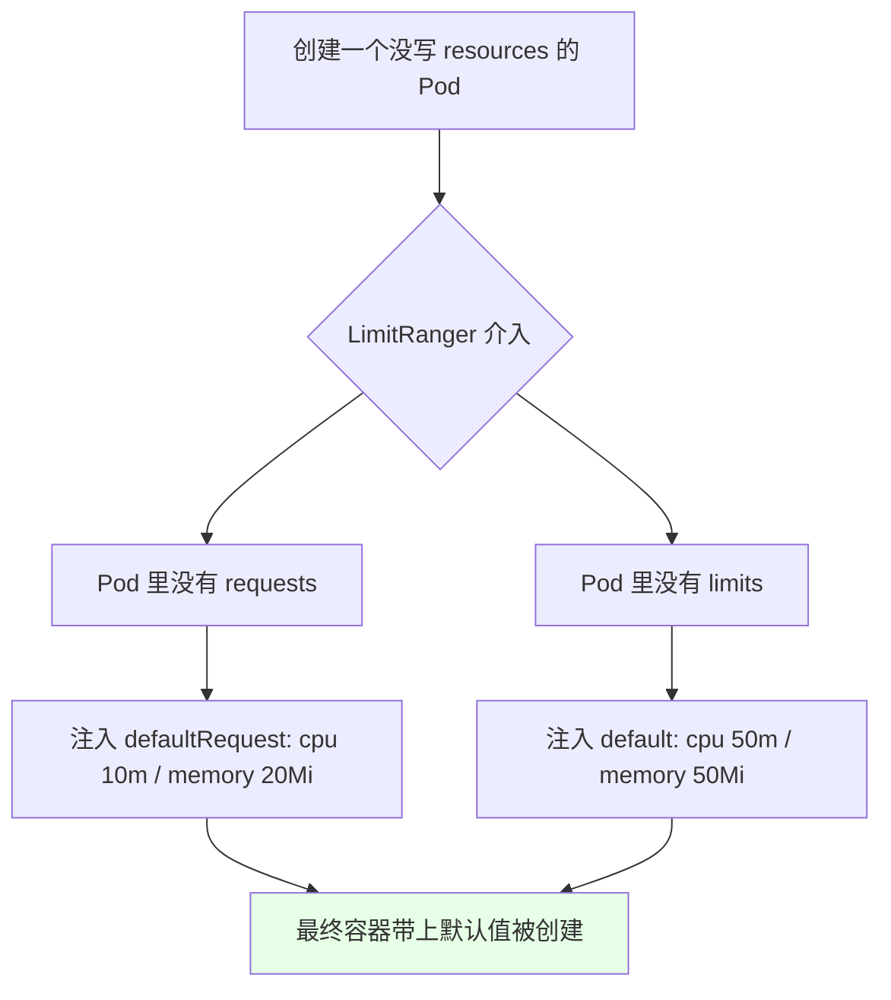
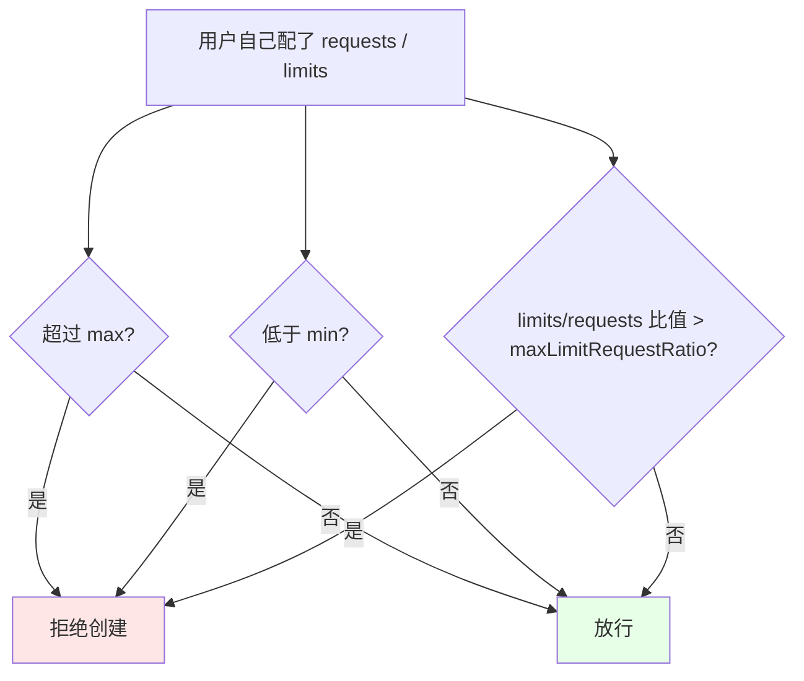
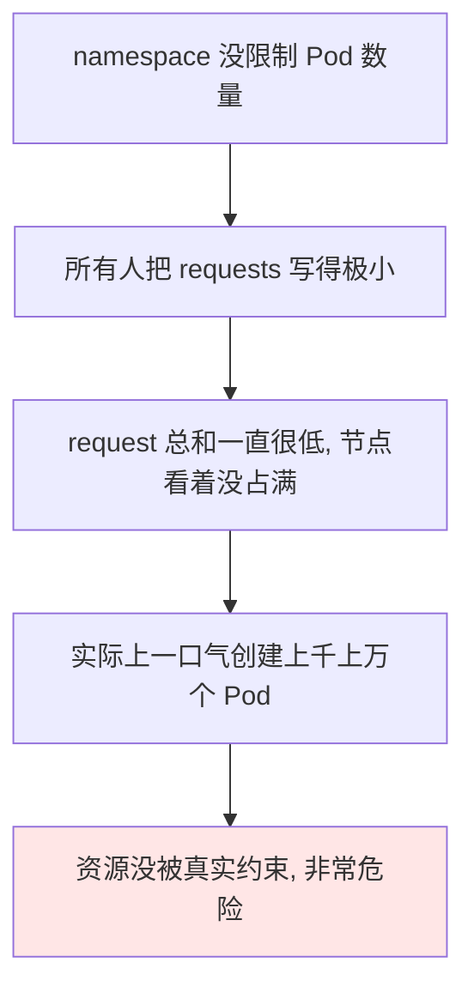

# Kubernetes 集群部署: 准入控制（ResourceQuota 与 LimitRange 的默认值注入和上下限约束）

上一节把 Pod 数量限制改成 3 之后资源就创建成功了。这一节把背后的机制讲清楚：**为什么一个没写 `requests` / `limits` 的 Pod，创建出来却自动带上了资源限制** —— 答案是准入控制（Admission Control）里的 `LimitRanger`。

结论先摆：

1. **准入控制的时机**：资源经过身份验证后、**API Server 写入 etcd 之前**做一次拦截，对资源做修改或正确性判断；
2. **三个最常用的准入插件**：`NamespaceLifecycle`（namespace 不存在就不让创建）、`LimitRanger`（给容器/Pod 加默认资源限制与上下限）、`ResourceQuota`（限制 namespace 的总量）；
3. **ResourceQuota 管 namespace 级别的总量**，能限制 Pod 数量、Service 的 NodePort 数量、LoadBalancer 数量等，而且**可以创建多个**；
4. **LimitRange 管单个对象**：`default` 补默认 `limits`、`defaultRequest` 补默认 `requests`、`max` 限上限、`min` 限下限、`maxLimitRequestRatio` 限两者比值；
5. **`type` 决定作用范围**：`Container` 是单个容器，`Pod` 是 Pod 内所有容器加一起，`PersistentVolumeClaim` 限制磁盘大小。

## 纲要

- 准入控制发生在哪个环节
- 三个常用准入插件
- ResourceQuota：namespace 总量限制
- LimitRange：default 与 defaultRequest 的默认值注入
- max / min / maxLimitRequestRatio
- type 的三种取值与区别
- 默认值注入实测

## 准入控制发生在哪个环节



关键点：**拦截发生在写入 etcd 之前**，所以准入插件既可以做「判断正误」（不符合就拒绝），也可以做「更改」（比如给没写资源限制的容器补上默认值）。上一节配置的 ResourceQuota 就是在这个环节判断「有没有超过我的资源限制」。

## 三个常用准入插件

| 插件 | 作用 |
| --- | --- |
| `NamespaceLifecycle` | 创建资源时指定的 namespace **不存在就不创建**，直接报错 |
| `LimitRanger` | 对 container / pod / PVC 做限制：补默认值、限上下限 |
| `ResourceQuota` | 对 **namespace** 做总量限制 |

这些是在 kubeadm 安装时（`kube-apiserver` 的准入插件参数里）指定的，新版本集群都是这样配的。

## ResourceQuota：namespace 总量限制

```yaml
apiVersion: v1
kind: ResourceQuota
metadata:
  name: compute-resources
  namespace: demo-ns
spec:
  hard:
    pods: "3"                    # ← 上一节改的就是这个，改成 3 后 Pod 才创建成功
    requests.cpu: "1"
    requests.memory: 1Gi
    limits.cpu: "2"
    limits.memory: 2Gi
    services.nodeports: "10"     # 限制 NodePort 类型的 Service 数量
    services.loadbalancers: "2"  # 限制 LoadBalancer 数量
```

| 可限制项 | 说明 |
| --- | --- |
| `pods` | namespace 内 Pod 总数 |
| `requests.cpu` / `requests.memory` | 所有 Pod 的 requests 总和 |
| `limits.cpu` / `limits.memory` | 所有 Pod 的 limits 总和 |
| `services.nodeports` | NodePort 类型的 Service 数量 |
| `services.loadbalancers` | LoadBalancer 数量 |

> **ResourceQuota 可以创建多个**，按需叠加，不必把全部限制塞进一个里。

## LimitRange：默认值注入

`LimitRange` 针对 container / pod / PVC 这类对象，最常用的是 `default` 和 `defaultRequest`：

```yaml
apiVersion: v1
kind: LimitRange
metadata:
  name: limit-range
  namespace: demo-ns
spec:
  limits:
    - type: Container
      default:            # 没配置 limits 时, 自动补的 limits
        cpu: 50m
        memory: 50Mi
      defaultRequest:     # 没配置 requests 时, 自动补的 requests
        cpu: 10m
        memory: 20Mi
```



实测过程：Deployment 清单里**没有**配 `requests` / `limits`（`kubectl get deploy -o yaml` 里这两块是 0 / 空），但创建出来的 Pod 里，容器被自动加上了默认的 `requests`（cpu 10m / memory 20Mi）和 `limits`（cpu 50m / memory 50Mi）—— 这就是 `LimitRanger` 的 `default` 用法。

```bash
# 看 Deployment 里没配资源限制
kubectl get deployment $NAME -n $NS -o yaml | grep -A 6 resources
# resources: {}   ← 没配

# 看它创建出来的 Pod，容器上却被补了默认值
kubectl get pod $POD -n $NS -o yaml | grep -A 8 resources
# requests: cpu 10m / memory 20Mi
# limits:   cpu 50m / memory 50Mi
```

## max / min / maxLimitRequestRatio

除了默认值，`LimitRange` 还能约束你自己写的值：

| 字段 | 约束对象 | 含义 |
| --- | --- | --- |
| `default` | `limits` | 没配 `limits` 时补的默认值 |
| `defaultRequest` | `requests` | 没配 `requests` 时补的默认值 |
| `max` | `limits` | **上限**：自己配的 `limits` 不能超过这个值 |
| `min` | `requests` | **下限**：自己配的 `requests` 不能低于这个值 |
| `maxLimitRequestRatio` | 两者比值 | `limits / requests` 的比值上限 |

```yaml
spec:
  limits:
    - type: Container
      max:                     # 单个容器的 limits 上限
        cpu: "1"
        memory: 1Gi
      min:                     # 单个容器的 requests 下限
        cpu: 100m
        memory: 100Mi
      maxLimitRequestRatio:    # limits / requests 的比值上限
        cpu: "3"
        memory: "3"
```



比值那个字段举例：`max.cpu` 设成 3、`requests.cpu` 写 0.5，比值就是 6；如果 `maxLimitRequestRatio.cpu` 设的是 3，**比值太大会直接创建失败**。

### 为什么要设 min



`min` 就是为了防止「requests 写得极小 → 一次性创建上万个 Pod 而配额始终不触发」这种情况。

## type 的三种取值

```text
LimitRange 的 type 取值与作用域:

type: Container
└── 作用于单个容器
    ├── max: 这个 Pod 里每个容器的 limits 都不能超过
    └── min: 每个容器的 requests 都不能低于

type: Pod
└── 作用于 Pod 内所有容器加在一起的总和
    └── max: 所有容器的 CPU / 内存加起来不能超过这个值

type: PersistentVolumeClaim
└── 作用于 PVC
    └── 限制申请的磁盘大小
```

`spec.limits` 是一个**数组（切片），可以写多项**，比如同时写一条 `type: Container` 和一条 `type: Pod`。

## API 速览

| 能力 | 做法 |
| --- | --- |
| 看 namespace 上的配额 | `kubectl get resourcequota -n <ns>` |
| 看 namespace 上的 LimitRange | `kubectl get limitrange -n <ns>` |
| 验证默认值是否注入 | `kubectl get pod <pod> -o yaml \| grep -A 8 resources` |
| 限 Pod 数量 | ResourceQuota 的 `hard.pods` |
| 限 NodePort 数量 | ResourceQuota 的 `hard.services.nodeports` |
| 补默认 limits | LimitRange 的 `default` |
| 补默认 requests | LimitRange 的 `defaultRequest` |
| 限上限 / 下限 | LimitRange 的 `max` / `min` |

## Demo 示例

```bash
# 1. 创建一个带默认值的 LimitRange
cat <<'EOF' | kubectl apply -f -
apiVersion: v1
kind: LimitRange
metadata:
  name: demo-limit-range
  namespace: demo-ns
spec:
  limits:
    - type: Container
      default:
        cpu: 50m
        memory: 50Mi
      defaultRequest:
        cpu: 10m
        memory: 20Mi
      max:
        cpu: "1"
        memory: 1Gi
      min:
        cpu: 10m
        memory: 10Mi
    - type: Pod
      max:
        cpu: "2"
        memory: 2Gi
EOF

# 2. 创建一个完全不写 resources 的 Deployment
kubectl create deployment demo --image=nginx -n $NS

# 3. 确认 Deployment 里确实没配资源
kubectl get deployment demo -n $NS -o yaml | grep -A 4 resources

# 4. 看 Pod 上被自动注入的默认值（LimitRanger 的功劳）
kubectl get pod -n $NS -o yaml | grep -A 8 resources
# 预期：requests cpu 10m / memory 20Mi，limits cpu 50m / memory 50Mi

# 5. 验证上限：手动写一个超过 max 的 limits，会被拒绝
kubectl run over --image=nginx -n $NS \
  --limits='cpu=4,memory=4Gi'
# 预期：被准入控制拒绝

# 6. 清理
kubectl delete deployment demo -n $NS
kubectl delete limitrange demo-limit-range -n $NS
```

### 总结

- **准入控制的拦截点在「身份验证之后、API Server 写入 etcd 之前」**，既能判断正误（不合规就拒绝创建），也能修改资源（比如给容器补默认值）；
- **三个最常用的准入插件**：`NamespaceLifecycle`（namespace 不存在就不让创建）、`LimitRanger`（管 container / pod / PVC）、`ResourceQuota`（管 namespace 总量）；
- **ResourceQuota 限制的是 namespace 的总量**，除了 Pod 数量，还能限制 Service 的 NodePort 数量、LoadBalancer 数量等，而且**可以创建多个配额叠加**；
- **LimitRange 的 `default` 补默认 `limits`、`defaultRequest` 补默认 `requests`**：实测一个完全没写 `resources` 的 Deployment，创建出的 Pod 里容器被自动补上 `requests`（cpu 10m / memory 20Mi）和 `limits`（cpu 50m / memory 50Mi）；
- **`max` 限上限、`min` 限下限、`maxLimitRequestRatio` 限两者比值**：`min` 的意义是防止所有人把 `requests` 写得极小、一口气创建上万 Pod 而配额始终不触发；比值超了同样会被拒绝；
- **`type` 决定作用域**：`Container` 针对单个容器、`Pod` 针对 Pod 内所有容器之和、`PersistentVolumeClaim` 限制磁盘大小；`spec.limits` 是数组，可以写多条。

