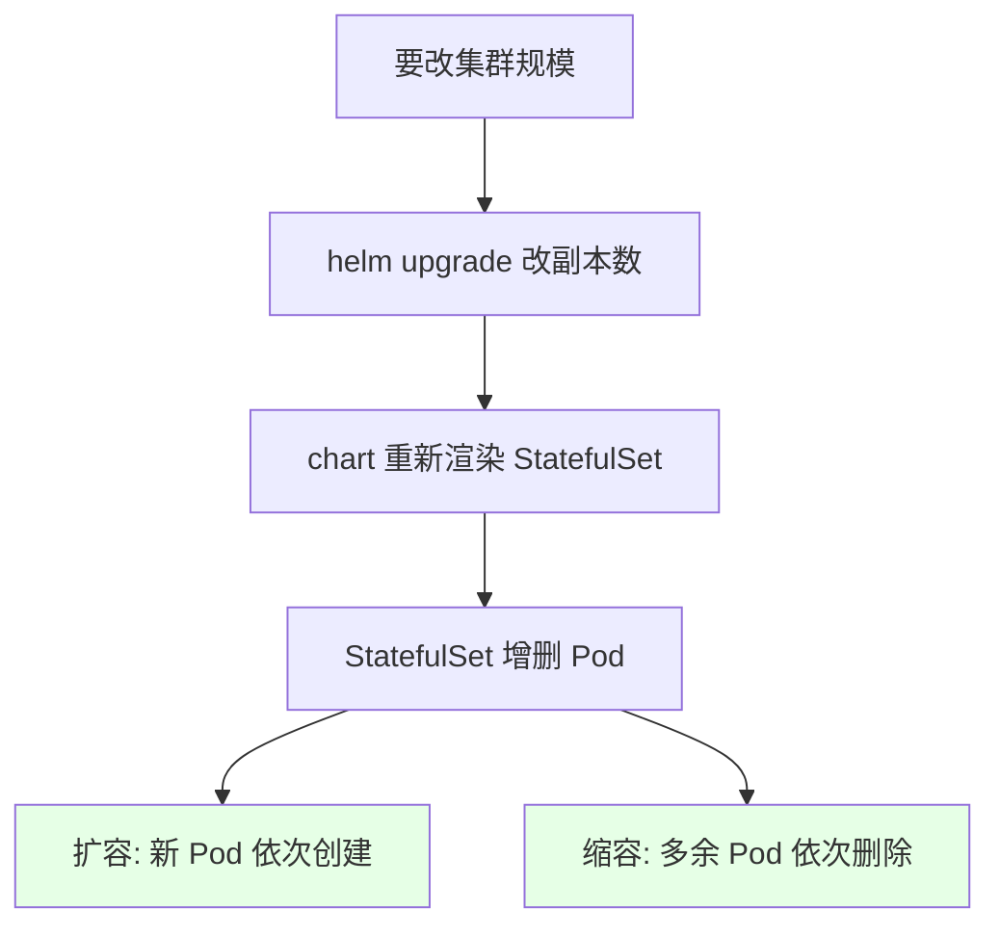
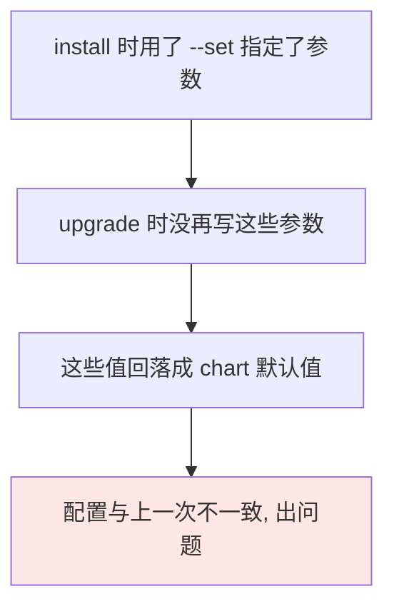
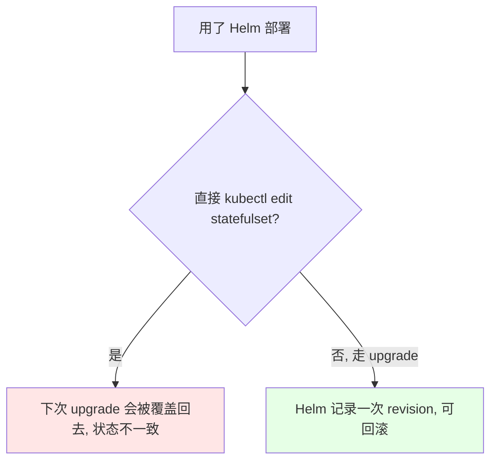

# Kubernetes 集群部署: Kafka 和 Zookeeper 集群扩容缩容（用 upgrade 改副本数与 --set 参数的回填陷阱）

这一节收尾 Kafka / Zookeeper 的扩缩容。原理和前面 Helm 装 RabbitMQ 那节完全一样，**用的是 `helm upgrade` 改副本数**，但有一个必须注意的坑。

结论先摆：

1. **扩容缩容就是 `helm upgrade` 改副本数**（或改 `values.yaml` 再升级），StatefulSet 会自动增删 Pod；
2. **如果 install 时用了 `--set` 指定参数，upgrade 时必须把同样的参数再写一遍**，否则配置会不一致 —— 这是最容易踩的坑；
3. **建议直接改 `values.yaml`**，这样就不用记住当初 set 过什么；
4. **用了 Helm 就不要直接去改 StatefulSet**，一律走 `upgrade`；
5. **生产环境不建议用 2 个副本**（偶数），容易脑裂，课程只是为了演示。

## 纲要

- 扩容缩容的原理与 RabbitMQ 一致
- 用 helm upgrade 升级
- 坑：install 用过的 --set，upgrade 必须回填
- 推荐直接改 values.yaml
- 不要直接改 StatefulSet
- 副本数的奇偶

## 扩容缩容的原理



和之前 Helm 部署 RabbitMQ 的扩容缩容**道理完全一样**，比较简单。

## 用 helm upgrade 升级

```bash
# 扩容 Zookeeper 到 2 个副本（课程演示用；生产不建议 2 个）
helm upgrade zookeeper ./zookeeper -n public-service --set replicaCount=2

# 扩容 Kafka 到 2 个副本
helm upgrade kafka ./kafka -n public-service --set replicaCount=2

# 缩容：把副本数改小即可
helm upgrade zookeeper ./zookeeper -n public-service --set replicaCount=2

# 看结果
kubectl get pod -n public-service
kubectl get statefulset -n public-service
```

## 坑：install 用过的 --set，upgrade 必须回填



**这是最容易踩的一处**：`install` 时用 `--set` 设过的参数，`upgrade` 时如果不再写一遍，那些值就会掉回 chart 的默认值，导致两次的配置不一样。

```bash
# install 时设了三个参数
helm install zookeeper ./zookeeper -n public-service \
  --set replicaCount=1 \
  --set auth.enabled=false \
  --set persistence.enabled=false

# upgrade 时必须把它们全部回填，只改要改的那一个
helm upgrade zookeeper ./zookeeper -n public-service \
  --set replicaCount=2 \
  --set auth.enabled=false \
  --set persistence.enabled=false
```

## 推荐直接改 values.yaml

```text
两种做法对比（课程推荐后者）:

用 --set
├── 临时方便
└── 时间久了不知道当初 set 了什么, upgrade 还得全部回填
    └── 有 history 可以查, 没有就麻烦了

改 values.yaml（推荐）
├── 参数进文件, 可追溯
└── upgrade 时不需要再记命令里有过什么
```

```bash
# 直接改 values.yaml 里的副本数
vi zookeeper/values.yaml
# replicaCount: 2

# 升级（不用再回填任何 --set）
helm upgrade zookeeper ./zookeeper -n public-service
```

> 参数一多，`--set` 就不方便了 —— **直接改 `values.yaml` 更省心**。

## 不要直接改 StatefulSet



既然用了 Helm，**就不要直接去改 StatefulSet 这类被它管理的资源**，一律用 `helm upgrade`。

## 副本数的奇偶

| 场景 | 副本数 |
| --- | --- |
| 课程演示 | 2（图省事） |
| **生产环境** | **至少 3 个，且必须是奇数**，防止脑裂 |

```bash
# 课程里第三次尝试改成 3 个（生产该用的规模）
helm upgrade zookeeper ./zookeeper -n public-service --set replicaCount=3
# 但新 Pod 因镜像拉不下来起不来（课程环境网络问题），于是又缩回 2
```

```text
扩缩容的完整操作顺序:

1. 决定目标副本数（生产用奇数, 至少 3）
2. 改 values.yaml（推荐）或准备 --set 参数（注意回填）
3. helm upgrade <release> ./<chart> -n <ns>
4. kubectl get pod / statefulset 观察增删
5. 有问题就 helm rollback 或改回原值
```

## API 速览

| 能力 | 做法 |
| --- | --- |
| 扩容 | `helm upgrade <release> ./<chart> -n <ns> --set replicaCount=N` |
| 缩容 | 同上，把 N 改小 |
| 推荐做法 | 改 `values.yaml` 里的 `replicaCount` 再 `upgrade` |
| 避免的坑 | install 用过 `--set`，upgrade 必须原样回填 |
| 禁止 | 直接 `kubectl edit` Helm 管理的 StatefulSet |
| 生产副本数 | 至少 3 个，奇数 |

## Demo 示例

```bash
NS=public-service

# 1. 先看当前规模
helm list -n $NS
kubectl get statefulset -n $NS

# 2. 推荐：改 values.yaml（不用记 --set，也不会漏回填）
vi zookeeper/values.yaml     # replicaCount: 2
vi kafka/values.yaml         # replicaCount: 2

# 3. 升级
helm upgrade zookeeper ./zookeeper -n $NS
helm upgrade kafka ./kafka -n $NS

# 4. 观察 Pod 增删
kubectl get pod -n $NS -w
kubectl get statefulset -n $NS

# 5. 若必须用 --set，记得把 install 时的参数全部回填
helm upgrade zookeeper ./zookeeper -n $NS \
  --set replicaCount=2 \
  --set auth.enabled=false \
  --set persistence.enabled=false

# 6. 缩容：把副本数改小
helm upgrade kafka ./kafka -n $NS --set replicaCount=1
kubectl get pod -n $NS -w
```

### 总结

- **Kafka / Zookeeper 的扩容缩容就是 `helm upgrade` 改副本数**，StatefulSet 会自动增删 Pod，原理和前面 Helm 部署 RabbitMQ 那节完全一致；
- **最容易踩的坑是 `--set` 的回填**：`install` 时用 `--set` 设过的参数，`upgrade` 时若不原样写一遍，那些值会掉回 chart 默认值，导致两次配置不一致；
- **推荐直接改 `values.yaml` 再 `upgrade`** —— 参数进文件可追溯，不用去记当初 set 过什么，参数一多时 `--set` 尤其不方便（有 history 可以查，没有就只能靠记）；
- **用了 Helm 就不要直接 `kubectl edit` StatefulSet**，否则下次 `upgrade` 会被覆盖回去、状态不一致，一律走 `helm upgrade`；
- **副本数上生产不建议用 2（偶数）**，容易脑裂，至少 3 个且为奇数；课程里用 2 只是为了演示，后来尝试改到 3 时因为课程环境网络问题、镜像拉不下来而缩回 2。

