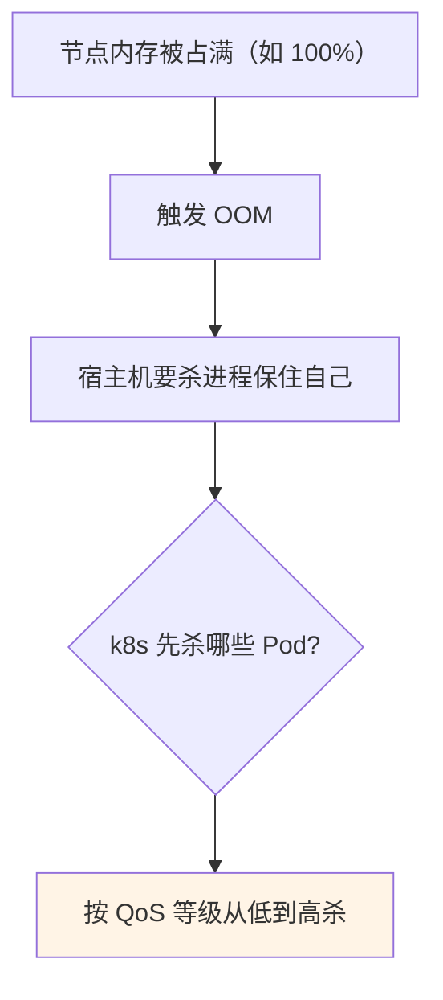
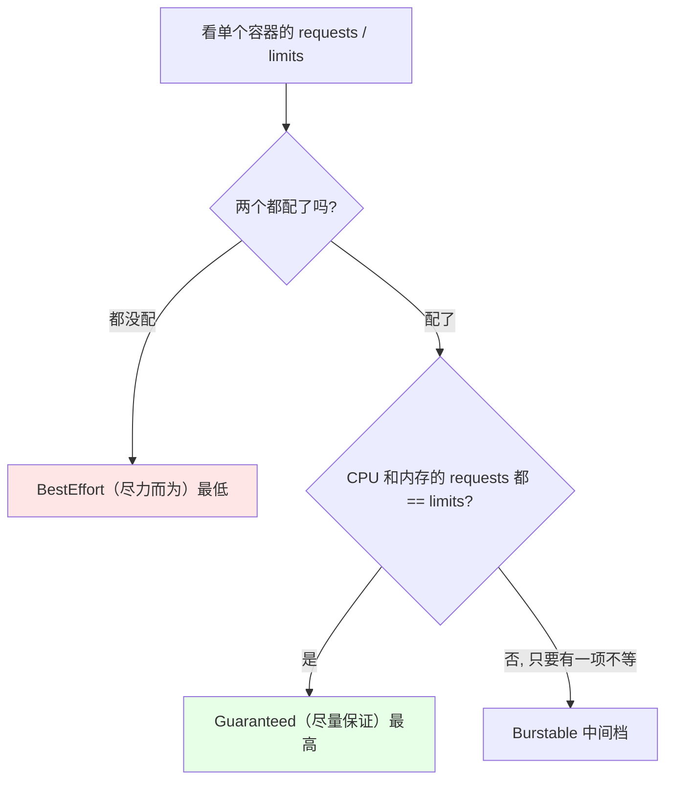
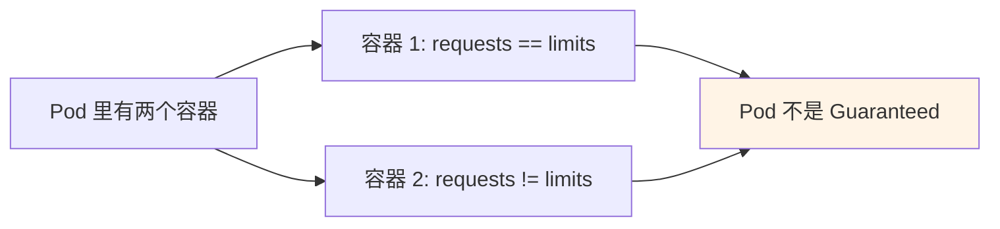
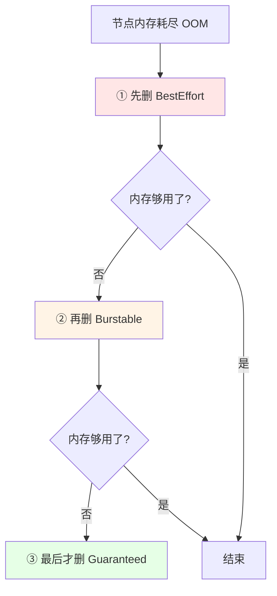
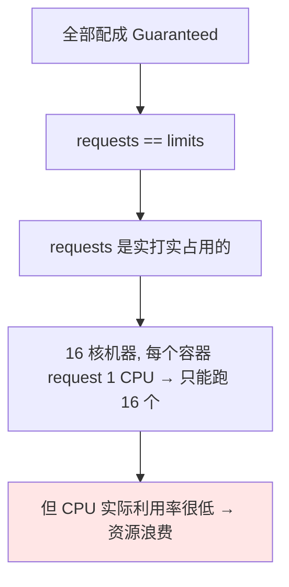

# Kubernetes 集群部署: Kubernetes 服务质量 QoS（三个等级判定与 OOM 时的驱逐顺序）

上一节讲了准入控制里的 ResourceQuota 和 LimitRange，既然讲到了 `requests` 和 `limits`，这一节就回答那个最关键的问题：**为什么非得设这两个值** —— 因为节点内存耗尽（OOM）时，k8s 决定「先杀哪个 Pod」的依据就是服务质量（QoS）。

结论先摆：

1. **QoS 分三档，从高到低是 `Guaranteed` > `Burstable` > `BestEffort`**，判定依据是**单个容器**的 `requests` 与 `limits`；
2. **`Guaranteed`**：CPU 和内存的 `requests` **等于** `limits`；Pod 里每个容器都要满足，才算这个等级；
3. **`Burstable`**：配了 `requests` / `limits` 但**不相等**（只要有一项不一样就不是 Guaranteed）；
4. **`BestEffort`**：什么都没配；
5. **节点内存耗尽时的删除顺序**：先 `BestEffort` → 再 `Burstable` → **最后才 `Guaranteed`**；
6. **别把所有容器都配成 Guaranteed** —— `requests` 是实打实占用的，会造成严重的资源浪费。

## 纲要

- 为什么要有 QoS：节点 OOM 时先杀谁
- 三个等级的判定条件
- QoS 是容器级的，与 Deployment 无关
- OOM 时的驱逐顺序
- 重要的应用配成 Guaranteed
- 为什么不能全都配成 Guaranteed
- requests / limits 的取值建议

## 为什么要有 QoS



节点上内存不够用时会报 OOM，为了不让宿主机被拖垮，k8s 会挑容器删掉 —— **这个选择不是随机的，就是按 QoS 来**。

## 三个等级的判定条件



| 等级 | 判定条件 | 含义 |
| --- | --- | --- |
| **Guaranteed**（最高） | 容器 CPU 和内存的 `requests` **等于** `limits` | 尽最大努力保证 Pod 正常 |
| **Burstable** | 配了 `requests` / `limits`，但**不相等** | 次一级 |
| **BestEffort**（最低） | **什么都没配** | 尽力而为 |

```yaml
# Guaranteed：requests 与 limits 完全相等
resources:
  requests:
    cpu: 30m
    memory: 30Mi
  limits:
    cpu: 30m
    memory: 30Mi
```

```yaml
# Burstable：只要有一项不相等
resources:
  requests:
    cpu: 10m
    memory: 10Mi
  limits:
    cpu: 50m
    memory: 50Mi
```

```yaml
# BestEffort：什么都不写
# （没有 resources 段）
```

## QoS 是容器级的



**QoS 是针对于单个容器来讲的，和 Deployment 没有关系**。Pod 里有两个容器时，**每个容器的 `requests` 和 `limits` 都一样**，才达到 `Guaranteed`；任意一个容器不一样，就达不到这个标准。

```bash
# 看 Pod 的 QoS 等级
# 下面命令中的变量按你的集群环境赋值后再执行
kubectl get pod $POD -n $NS -o yaml | grep -i 'qosClass'
# qosClass: Guaranteed / Burstable / BestEffort
```

## OOM 时的驱逐顺序



| 顺序 | 等级 | 说明 |
| --- | --- | --- |
| 1 | `BestEffort` | 服务质量最低，先被杀 |
| 2 | `Burstable` | 杀完还不够才轮到它 |
| 3 | `Guaranteed` | 最后才动，**一般删不到这一档** |

> 三类全删完内存还不够的情况基本不会存在 —— 通常最多删到 `Burstable` 就够了。

## 重要的应用配成 Guaranteed


## 为什么不能全都配成 Guaranteed



`requests` 是**实打实**占掉的：你请求多少就占多少。一台 16 核的机器，如果每个容器 `requests` 都设成 1 CPU（太小的值也不现实），跑满 16 个容器就把机器「占满」了，无法再调度新 Pod —— 但**此时节点 CPU 的真实利用率其实很低**，内存也没用完，白白浪费。

反过来，如果把 `requests` 设得很小（比如 100m），那 `limits` 也得是 100m，应用**在高峰期或处理数据时会变得非常慢**，这个问题比「被删掉」还严重。

```text
两种极端都不可取:

requests = limits = 1 CPU
└── 节点很快被「占满」, 实际利用率却很低 → 资源浪费

requests = limits = 100m
└── 应用高峰时被限死在 100m → 运行极慢, 比被驱逐还糟

正确做法:
└── 只把重要的应用配成 Guaranteed, 其余按需配成 Burstable
```

## requests / limits 的取值建议

| 资源 | 建议 |
| --- | --- |
| **内存 requests** | **可以设大一点**，设得太低非常容易造成宿主机 OOM |
| **limits** | 一般要比 `requests` **高一点**（宿主机自身进程也要占内存） |
| **Guaranteed 场景** | `requests == limits`，且这个值要**大于应用的实际用量**（应用约需 3G，就设 3.5G） |
| **CPU** | 平常利用率很低，可按需适度超分；虚拟机时代 CPU 常见 1:16 超分、内存 1:1.5，但为保证线上稳定内存一般按 1:1 来 |

```yaml
# 典型配置：内存 requests 给足，limits 略高
resources:
  requests:
    cpu: 500m
    memory: 3Gi      # 按应用实际用量给，别设太低
  limits:
    cpu: 1
    memory: 3.5Gi    # 比 requests 高一点
```

> 注意：这份配置是 `Burstable`，不是 `Guaranteed` —— 要 `Guaranteed` 就得两者相等。

## API 速览

| 能力 | 做法 |
| --- | --- |
| 看 QoS 等级 | `kubectl get pod <pod> -o yaml \| grep qosClass` |
| 配成 Guaranteed | 容器 CPU / 内存的 `requests` 与 `limits` **完全相等** |
| 配成 Burstable | 配了但两者不等 |
| 变成 BestEffort | 不写 `resources`（且 namespace 上没有 LimitRange 补默认值） |
| 判断 Pod 是否 Guaranteed | Pod 内**每个**容器都要满足相等 |

## Demo 示例

```bash
NS=demo
kubectl create namespace $NS

# 1. 先建一个 Guaranteed 的 Pod（requests == limits）
cat <<'EOF' | kubectl apply -f -
apiVersion: v1
kind: Pod
metadata:
  name: qos-guaranteed
  namespace: demo
spec:
  containers:
    - name: c
      image: nginx
      resources:
        requests:
          cpu: 30m
          memory: 30Mi
        limits:
          cpu: 30m
          memory: 30Mi
---
apiVersion: v1
kind: Pod
metadata:
  name: qos-burstable
  namespace: demo
spec:
  containers:
    - name: c
      image: nginx
      resources:
        requests:
          cpu: 10m
          memory: 10Mi
        limits:
          cpu: 50m
          memory: 50Mi
---
apiVersion: v1
kind: Pod
metadata:
  name: qos-besteffort
  namespace: demo
spec:
  containers:
    - name: c
      image: nginx
EOF

# 2. 看三个 Pod 各自的 QoS 等级
for p in qos-guaranteed qos-burstable qos-besteffort; do
  echo -n "$p: "
  kubectl get pod $p -n $NS -o jsonpath='{.status.qosClass}'
  echo
done
# 预期：Guaranteed / Burstable / BestEffort

# 3. 改成只有一个值不等，再看等级会掉到 Burstable
kubectl run qos-mix -n $NS --image=nginx \
  --requests='cpu=30m,memory=30Mi' --limits='cpu=30m,memory=50Mi'
kubectl get pod qos-mix -n $NS -o jsonpath='{.status.qosClass}'
# 预期：Burstable

# 4. 清理
kubectl delete namespace $NS
```

### 总结

- **QoS（服务质量）存在的意义是：节点内存耗尽触发 OOM 时，k8s 决定先杀哪个 Pod** —— 不是随机删，而是严格按等级来；
- **三个等级从高到低**：`Guaranteed`（容器 CPU 和内存的 `requests` **等于** `limits`）、`Burstable`（配了但**不相等**，只要有一项不等就不算 Guaranteed）、`BestEffort`（**什么都没配**）；
- **QoS 是针对于单个容器判定的，和 Deployment 无关**：Pod 里有多个容器时，**每个容器的 requests 都要等于 limits** 才是 `Guaranteed`，任意一个不等就掉档；用 `kubectl get pod -o yaml | grep qosClass` 可以直接看到等级；
- **OOM 时的驱逐顺序是 `BestEffort` → `Burstable` → `Guaranteed`**，先删服务质量最低的，删完还不够才往上，一般删不到 `Guaranteed` 那一档；
- **重要的应用建议配成 `Guaranteed`**，但**不要所有容器都这么配** —— `requests` 是实打实占用的，全配成相等会让节点很快被「占满」而实际利用率很低，造成资源浪费；反过来把值设得很小则会让应用在高峰期被限死，问题比被驱逐还严重；
- **取值上：内存 `requests` 可以设大一点（设太低极易造成宿主机 OOM），`limits` 一般比 `requests` 高一点（宿主机自身进程也要占内存）**；要做 `Guaranteed` 则两者相等且这个值要大于应用实际用量（应用约需 3G 就设 3.5G）。

