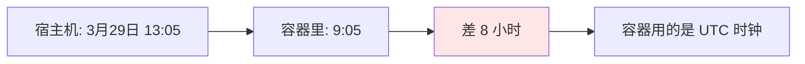
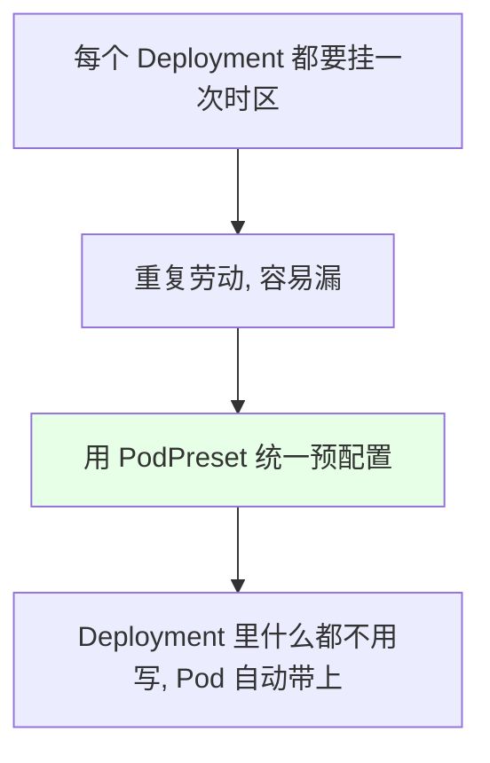
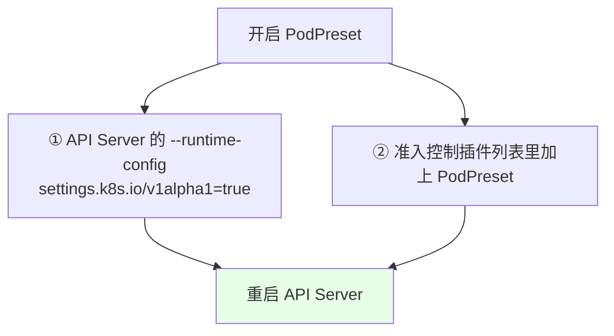
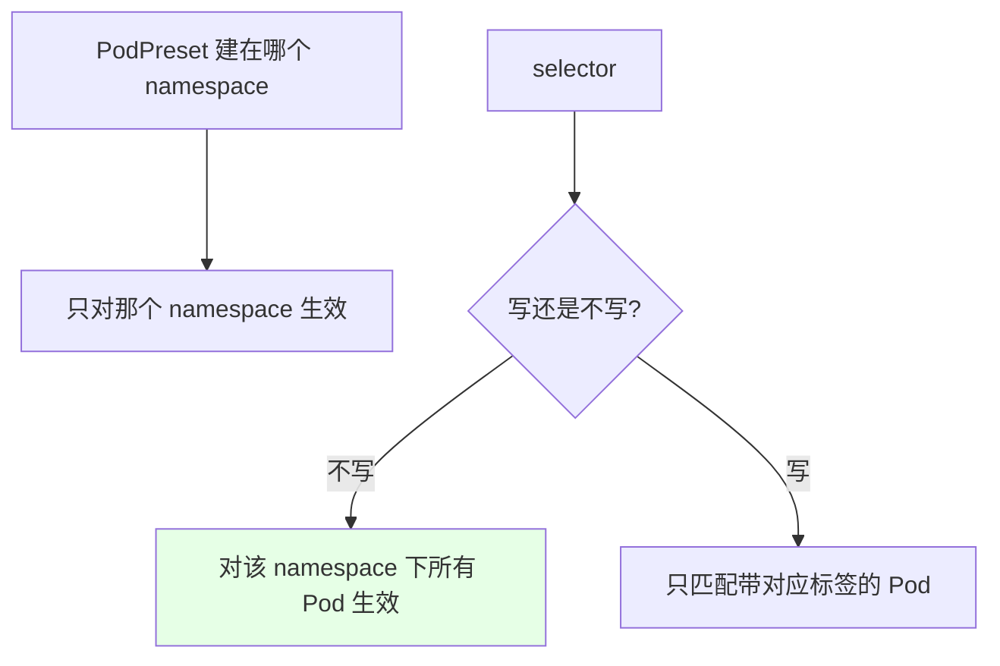
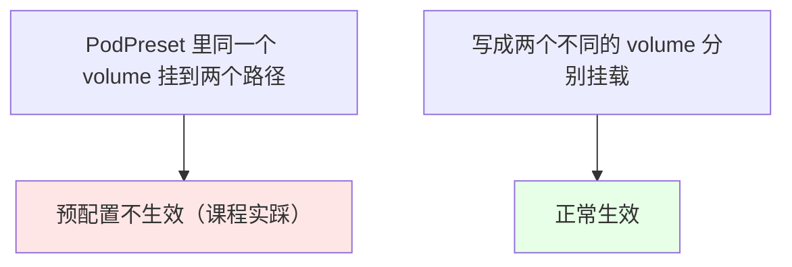
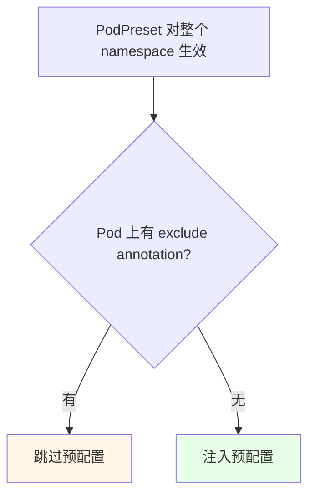
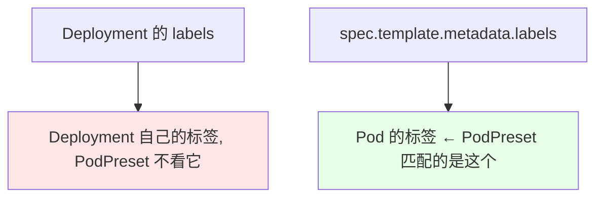
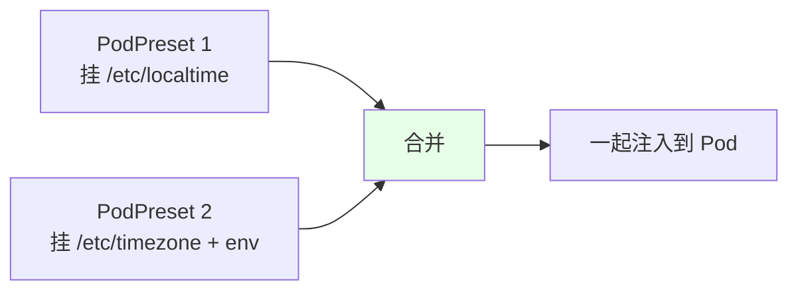
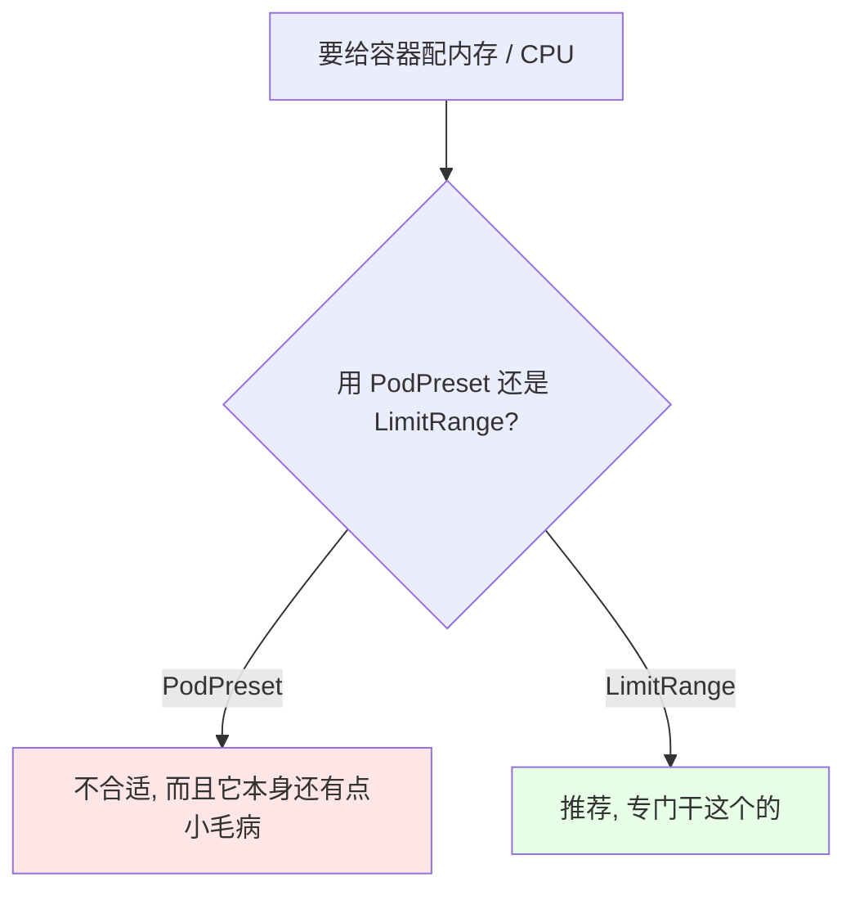

# Kubernetes 集群部署: 使用 PodPreset 预配置容器时区（准入插件开启、hostPath 挂载与 selector 匹配）

准入控制除了前面讲的 `ResourceQuota` 和 `LimitRanger`，还有一个很实用的：**PodPreset** —— 它在 **Pod 启动之前**给它做预配置（注入环境变量、挂载卷、配时区等）。

结论先摆：

1. **容器默认用 UTC 时钟，比北京时间差 8 小时**，生产不能这么用；
2. **PodPreset 让我们不必给每个 Deployment 手工挂时区文件**，一次配置、整个 namespace 的 Pod 都生效；
3. **开启要动两处**：API Server 的 `--runtime-config` 打开 `settings.k8s.io/v1alpha1=true`，并把 `PodPreset` 加进准入插件列表，然后重启 API Server；
4. **PodPreset 是 namespace 级的**（在哪个 namespace 建就只对它生效），**selector 是 Pod 级的**（不写就对该 namespace 所有 Pod 生效）；
5. **同一个 volume 不能挂到两个路径**（PodPreset 的限制；单独创建 Pod 是允许的），要写成两个不同的 volume；
6. **不想被预配置的 Pod 加 annotation 忽略**；**多个 PodPreset 会合并后注入**。

## 纲要

- 问题：容器时钟差 8 小时
- 传统做法的麻烦
- 开启 PodPreset 的两处配置
- PodPreset 的作用范围
- 时区预配置的写法
- 同一个 volume 不能挂两个路径
- 用 annotation 忽略预配置
- 用 selector 精确匹配
- 多个 PodPreset 会合并
- 不要用 PodPreset 配资源限制

## 问题：容器时钟差 8 小时



```bash
# 进容器看时间
# 下面命令中的变量按你的集群环境赋值后再执行
kubectl exec -it $POD -- date
# 与宿主机 date 对比，差 8 小时
```

## 传统做法的麻烦

```yaml
# 手工给每个 Deployment 挂两个时区文件 —— 每个都要加一遍，很麻烦
spec:
  template:
    spec:
      volumes:
        - name: tz-config
          hostPath:
            path: /etc/localtime
        - name: tz-name
          hostPath:
            path: /etc/timezone
      containers:
        - name: app
          volumeMounts:
            - name: tz-config
              mountPath: /etc/localtime
              readOnly: true
            - name: tz-name
              mountPath: /etc/timezone
              readOnly: true
```



## 开启 PodPreset 的两处配置



```yaml
# kube-apiserver 的配置（静态 Pod 清单里）
spec:
  containers:
    - command:
        - kube-apiserver
        - --runtime-config=settings.k8s.io/v1alpha1=true    # ① 打开 PodPreset 的 API
        - --enable-admission-plugins=NamespaceLifecycle,LimitRanger,ServiceAccount,\
ResourceQuota,PodPreset                                      # ② 加入准入插件
```

> 用 kubeadm 装的集群改 `/etc/kubernetes/manifests/kube-apiserver.yaml`，改完 kubelet 会自动重启它。**同时操作多个终端窗口时，注意光标位置，别改错文件。**

## PodPreset 的作用范围



| 维度 | 说明 |
| --- | --- |
| namespace | **在哪个 namespace 创建，就只对那个 namespace 生效** |
| selector | **Pod 级别**（不是 Deployment / StatefulSet 级别）；不写则对整个 namespace 的 Pod 生效 |

## 时区预配置的写法

```yaml
apiVersion: settings.k8s.io/v1alpha1
kind: PodPreset
metadata:
  name: timezone-preset
  namespace: <命名空间>
spec:
  # selector 先注释掉 —— 让整个 namespace 的 Pod 都生效
  # selector:
  #   matchLabels:
  #     podpreset: "true"
  env:
    - name: LANG
      value: C.UTF-8          # 中文支持（是否生效取决于镜像底层系统）
  volumeMounts:
    - name: tz-config
      mountPath: /etc/localtime
      readOnly: true
    - name: tz-name
      mountPath: /etc/timezone
      readOnly: true
  volumes:
    - name: tz-config
      hostPath:
        path: /etc/localtime
    - name: tz-name
      hostPath:
        path: /etc/timezone
```

```text
PodPreset 生效后，Pod 会自动带上:

Pod（由 Deployment 创建，清单里没写 volumes / volumeMounts）
├── env: LANG=C.UTF-8
├── volumeMounts
│   ├── tz-config → /etc/localtime (readOnly)
│   └── tz-name   → /etc/timezone  (readOnly)
└── volumes
    ├── tz-config (hostPath /etc/localtime)
    └── tz-name   (hostPath /etc/timezone)
```

> 关于中文变量：`C.UTF-8` 是**针对 alpine 镜像**的，非 alpine 镜像要用不带 `C` 的那个 —— **具体配什么取决于镜像最底层的系统**。

## 同一个 volume 不能挂两个路径



**单独创建 Pod 时，一个 volume 挂到两个路径是允许的；但在 PodPreset 里不允许** —— 只能拆成两个不同的 volume 再分别挂载。课程里就是在这里卡了很久。

## 用 annotation 忽略预配置

selector 不写（对整个 namespace 生效）时，如果**某个 Pod 不想被预配置**，给它加一条 annotation：

```yaml
spec:
  template:
    metadata:
      annotations:
        podpreset.admission.kubernetes.io/exclude: "true"    # ← 忽略 PodPreset
    spec:
      containers:
        - name: app
          image: nginx
```



> **annotation 必须写在 `spec.template.metadata` 下**（对 Pod 生效）；写在 Deployment 自己的 metadata 下只对 Deployment 生效、对 Pod 没用。另外：**只改 `template` 以外的内容不会重启 Pod，改了 `template.spec` 才会**。

## 用 selector 精确匹配

```yaml
apiVersion: settings.k8s.io/v1alpha1
kind: PodPreset
metadata:
  name: timezone-preset
  namespace: <命名空间>
spec:
  selector:
    matchLabels:
      podpreset: "true"     # ← 只匹配带这个标签的 Pod
  volumeMounts:
    - name: tz-config
      mountPath: /etc/localtime
      readOnly: true
  volumes:
    - name: tz-config
      hostPath:
        path: /etc/localtime
```

```yaml
# Deployment 里：标签要加在 template.metadata.labels（Pod 级）
spec:
  template:
    metadata:
      labels:
        app: demo
        podpreset: "true"    # ← 加在这里才会被 PodPreset 匹配到
```



**带标签的 Pod 会被预配置，不带标签的不会** —— 这就是精确匹配的效果。

> 注意：**修改已有 PodPreset 的 selector 很危险**（新版本会直接拒绝修改），要改就删掉重建。

## 多个 PodPreset 会合并



可以创建多个 PodPreset，**它们会累加合并后再注入 Pod**。

## 不要用 PodPreset 配资源限制



内存、CPU 这类限制交给上一节讲的 `LimitRange` 更合适，不要用 PodPreset 来做。

## API 速览

| 能力 | 做法 |
| --- | --- |
| 开启 PodPreset | `--runtime-config=settings.k8s.io/v1alpha1=true` + 准入插件加 `PodPreset`，重启 API Server |
| 建 PodPreset | `apiVersion: settings.k8s.io/v1alpha1` |
| 对整个 namespace 生效 | 不写 `selector` |
| 精确匹配 | 写 `selector.matchLabels`，标签加在 `spec.template.metadata.labels` |
| 忽略某个 Pod | annotation `podpreset.admission.kubernetes.io/exclude: "true"` |
| 挂时区 | 两个 `hostPath` volume 分别挂 `/etc/localtime` 和 `/etc/timezone` |
| 多个 PodPreset | 会合并后注入 |

## Demo 示例

```bash
NS=demo
kubectl create namespace $NS

# 1. 建一个对整个 namespace 生效的时区 PodPreset
cat <<'EOF' | kubectl apply -f -
apiVersion: settings.k8s.io/v1alpha1
kind: PodPreset
metadata:
  name: timezone-preset
  namespace: demo
spec:
  env:
    - name: LANG
      value: C.UTF-8
  volumeMounts:
    - name: tz-config
      mountPath: /etc/localtime
      readOnly: true
    - name: tz-name
      mountPath: /etc/timezone
      readOnly: true
  volumes:
    - name: tz-config
      hostPath:
        path: /etc/localtime
    - name: tz-name
      hostPath:
        path: /etc/timezone
EOF

# 2. 建一个什么都不挂的 Deployment，看 Pod 是否被自动注入
kubectl create deployment demo --image=nginx -n $NS
kubectl get pod -n $NS -o yaml | grep -A 12 'volumeMounts'
# 预期：即使 Deployment 里没写，Pod 上也出现了时区挂载

# 3. 验证时区正确
# 下面命令中的变量按你的集群环境赋值后再执行
kubectl exec -it $POD -n $NS -- date

# 4. 用 annotation 让某个 Pod 跳过预配置
kubectl patch deployment demo -n $NS --type merge \
  -p '{"spec":{"template":{"metadata":{"annotations":{"podpreset.admission.kubernetes.io/exclude":"true"}}}}}'
kubectl get pod -n $NS -o yaml | grep -c 'localtime'
# 预期：新的 Pod 不再带时区挂载

# 5. 清理
kubectl delete deployment demo -n $NS
kubectl delete podpreset timezone-preset -n $NS
```

### 总结

- **容器默认使用 UTC 时钟，比北京时间差 8 小时**，生产环境必须修；传统做法是给每个 Deployment 手工挂 `/etc/localtime` 和 `/etc/timezone`，重复且易漏；
- **PodPreset 是准入控制的一种，在 Pod 启动之前给它做预配置**（注入环境变量、挂载卷、配时区），让 Deployment 清单里什么都不用写；
- **开启要动两处并重启 API Server**：`--runtime-config=settings.k8s.io/v1alpha1=true`，以及把 `PodPreset` 加进 `--enable-admission-plugins`；
- **作用范围**：namespace 级（在哪个 namespace 建就只对它生效）；`selector` 是 **Pod 级**的，不写就对该 namespace 所有 Pod 生效，写了就只匹配带标签的 Pod（**标签要加在 `spec.template.metadata.labels`**）；
- **两个易踩的坑**：一是 **PodPreset 里同一个 volume 不能挂到两个路径**（单独创建 Pod 可以），必须拆成两个 volume；二是**修改已有 PodPreset 的 selector 很危险**（新版本直接拒绝），要改就删掉重建；
- **不想被预配置的 Pod 加 annotation `podpreset.admission.kubernetes.io/exclude: "true"`**（必须写在 `spec.template.metadata` 下才对 Pod 生效）；**多个 PodPreset 会合并后注入**；另外**内存 / CPU 限制不要用 PodPreset 配，交给 LimitRange 更合适**。

