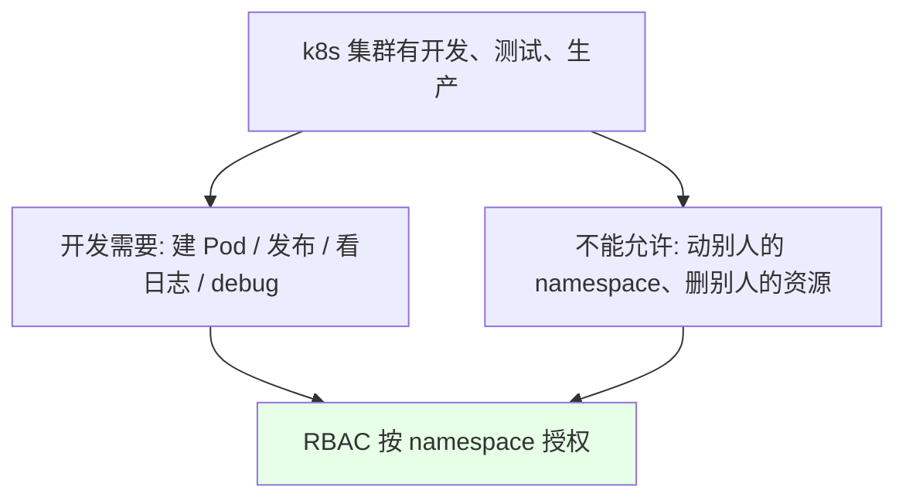
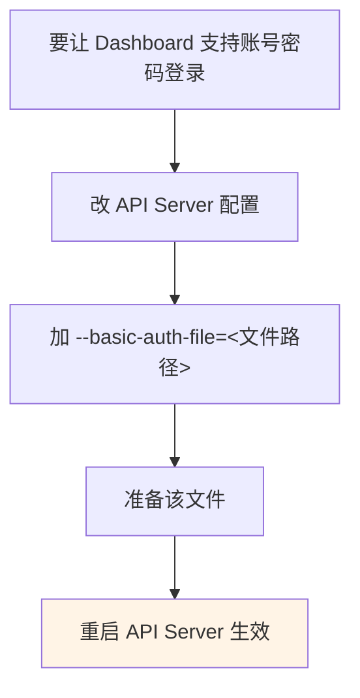
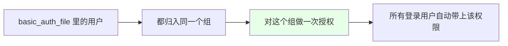
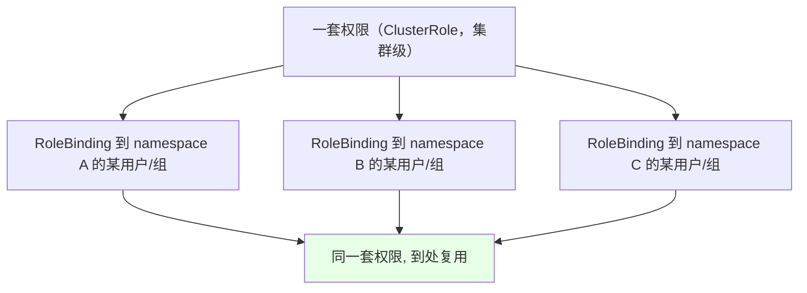
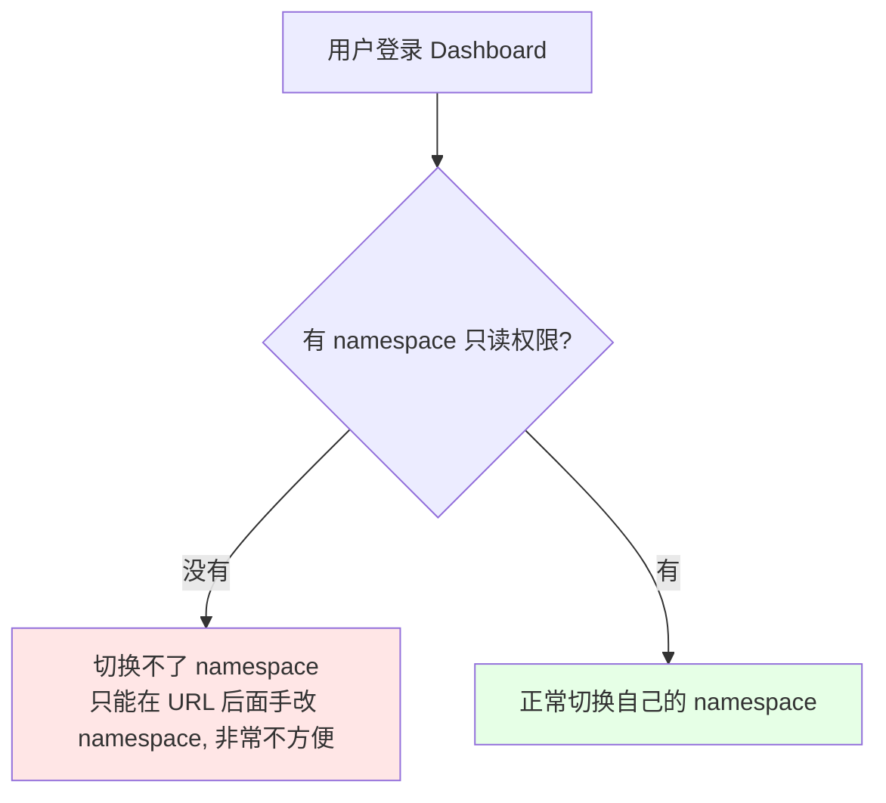
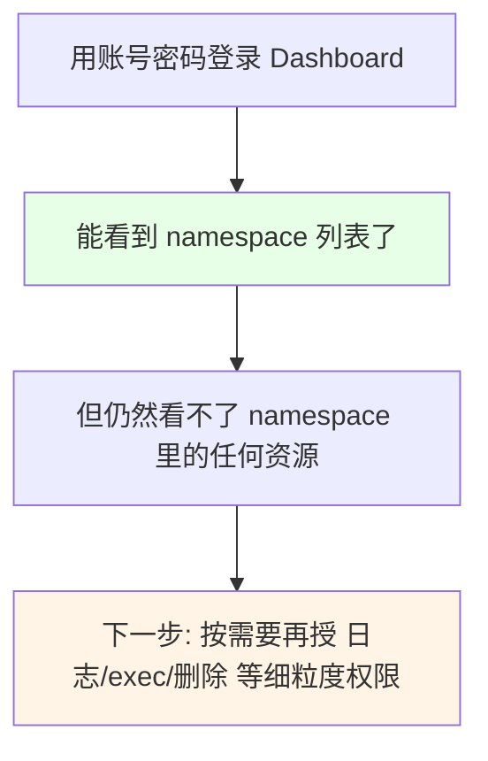

# Kubernetes 集群部署: Dashboard 基于用户名密码认证（basic-auth-file 开启与 ClusterRole 通配授权）

上一节讲了 RBAC 的概念，这一节落到实际工作场景：**让每个开发 / 项目组有自己的账号，只能操作自己 namespace 下的资源**。第一步是让 Dashboard 支持用户名密码登录。

结论先摆：

1. **生产环境不该让开发直接进 Pod 执行命令**（看日志走日志收集 + Kibana），测试 / 开发环境可以放开，但**必须限制在自己 namespace 内**；
2. **Dashboard 用账号密码登录要改 API Server 配置**：加 `--basic-auth-file=<文件>`；
3. **`basic-auth-file` 的硬伤是改完必须重启 API Server 才生效**，不太好用（公司一般对接 LDAP，这里用文件方式演示）；
4. **权限设计用「ClusterRole + 指定 namespace 的 RoleBinding」这套通配模式**：一套权限模板到处绑，不用每个 namespace 写一遍；
5. **必须给「namespace 只读」权限**，否则登录后没法切换 namespace，只能在 URL 上手改，非常不方便。

## 纲要

- 为什么要做权限控制
- 生产与测试环境的权限差异
- Dashboard 改用 NodePort + HTTPS 访问
- 开启 basic-auth-file
- 文件格式与「组」的设计
- ClusterRole + RoleBinding 的通配授权模式
- namespace 只读权限为什么必须给
- 下一步：细粒度授权

## 为什么要做权限控制



| 环境 | 允许开发做什么 |
| --- | --- |
| **生产环境** | 基本**不允许**直接进 Pod 执行命令；看日志走日志收集（容器打到终端的日志、容器内的日志都能收集）落到 ES，再用 Kibana 看；只有 k8s 管理员才直接操作 |
| **测试 / 开发环境** | 允许创建 Pod、Deployment、执行命令、看日志、debug —— **但只能在自己项目的 namespace 内** |

公司如果有自己的 k8s 管理平台，权限控制机制底层**也离不开 RBAC**；没有自研平台的话，用官方 Dashboard 就足够满足日常工作需求。

## Dashboard 改用 NodePort + HTTPS 访问

```bash
# 把 Dashboard 的 Service 改成 NodePort（本节不配域名，Ingress 章节再讲）
kubectl edit svc kubernetes-dashboard -n kubernetes-dashboard
# spec.type: NodePort

# 看它落到哪个端口（课程环境是 32444，各自环境不同）
kubectl get svc -n kubernetes-dashboard
```

> **访问必须是 HTTPS**（`https://<节点IP>:<NodePort>`），HTTP 打不开。

## 开启 basic-auth-file



```yaml
# /etc/kubernetes/manifests/kube-apiserver.yaml
spec:
  containers:
    - command:
        - kube-apiserver
        - --basic-auth-file=/etc/kubernetes/pki/basic_auth_file    # ← 新增
```

> **这个方式的硬伤**：**每次改这个文件里的用户，都必须重启 API Server 才能生效**，不好用。公司里一般对接 LDAP / ID 系统，这里用文件方式演示。

## 文件格式与「组」的设计

```text
/etc/kubernetes/pki/basic_auth_file 的格式:

<密码>,<用户名>,<UID>,<组>

示例:
password1,user1,10001,system:authenticated
password2,user2,10002,system:authenticated
│        │     │     └── 组
│        │     └── UID
│        └── 用户名
└── 密码（前面是密码，别写反）
```



把用户都归到**已认证组**（`system:authenticated`）里，然后**对这个组统一授权** —— 不用给每个人单独配一遍。

## ClusterRole + RoleBinding 的通配授权模式



**因为同一套权限可能要适用于很多 namespace，所以定义成 ClusterRole（集群级），再用 RoleBinding 绑到指定 namespace 下的指定用户/组** —— 这就是「通配」的权限配置方式，不用每个 namespace 都写一份 Role。

课程里会创建这么几个通用 ClusterRole：

```text
通用 ClusterRole 清单（按实际需要增减）:

ClusterRole
├── namespace 只读            ← 登录后切换 namespace 用（必须给）
├── 容器日志查看权限           ← 看 Pod 日志
├── 容器执行命令权限           ← exec 进容器
└── 容器删除权限               ← 删 Pod（最常用）
```

## namespace 只读权限为什么必须给



```yaml
# namespace 只读的 ClusterRole + 绑定到组
apiVersion: rbac.authorization.k8s.io/v1
kind: ClusterRole
metadata:
  name: namespace-readonly
rules:
  - apiGroups: [""]
    resources: ["namespaces"]
    verbs: ["get", "list", "watch"]
  - apiGroups: ["metrics.k8s.io"]        # 顺便给看 CPU / 内存 metrics 的权限
    resources: ["pods", "nodes"]
    verbs: ["get", "list", "watch"]
---
apiVersion: rbac.authorization.k8s.io/v1
kind: ClusterRoleBinding
metadata:
  name: namespace-readonly
roleRef:
  apiGroup: rbac.authorization.k8s.io
  kind: ClusterRole
  name: namespace-readonly
subjects:
  - kind: Group
    name: system:authenticated         # ← 授权给组，所有登录用户自动获得
    apiGroup: rbac.authorization.k8s.io
```

> 因为 `basic_auth_file` 里把所有用户都归到了这个组，**只要登录进去就有了 namespace 只读的权限**。

## 登录验证



课程实测：加上 namespace 只读权限后，登录进去能看到 namespace 了，但**里面任何资源都看不了** —— 说明细粒度授权还没做，下一步就是把「日志查看 / 执行命令 / 删除容器」这些 ClusterRole 绑到具体 namespace 上。

## API 速览

| 能力 | 做法 |
| --- | --- |
| 改 Dashboard 为 NodePort | `kubectl edit svc kubernetes-dashboard -n kubernetes-dashboard` |
| 访问地址 | `https://<节点IP>:<NodePort>`（**必须 HTTPS**） |
| 开启账号密码认证 | API Server 加 `--basic-auth-file=<文件>` |
| 文件格式 | `密码,用户名,UID,组` |
| 权限模板 | 定义成 **ClusterRole**（集群级，可复用） |
| 授权到 namespace | **RoleBinding** 把 ClusterRole 绑到指定 namespace 的用户/组 |
| 登录必需权限 | namespace 的 `get` / `list` / `watch` |

## Demo 示例

```bash
# 1. 准备 basic_auth_file（注意：前面是密码，后面是用户名）
cat > /etc/kubernetes/pki/basic_auth_file <<'EOF'
password1,user1,10001,system:authenticated
password2,user2,10002,system:authenticated
EOF

# 2. 改 API Server 配置，加 --basic-auth-file
vi /etc/kubernetes/manifests/kube-apiserver.yaml
#   - --basic-auth-file=/etc/kubernetes/pki/basic_auth_file
# 改完 kubelet 会自动重启它（静态 Pod）

# 3. 建 namespace 只读的 ClusterRole 并绑到组
cat <<'EOF' | kubectl apply -f -
apiVersion: rbac.authorization.k8s.io/v1
kind: ClusterRole
metadata:
  name: namespace-readonly
rules:
  - apiGroups: [""]
    resources: ["namespaces"]
    verbs: ["get", "list", "watch"]
---
apiVersion: rbac.authorization.k8s.io/v1
kind: ClusterRoleBinding
metadata:
  name: namespace-readonly
roleRef:
  apiGroup: rbac.authorization.k8s.io
  kind: ClusterRole
  name: namespace-readonly
subjects:
  - kind: Group
    name: system:authenticated
    apiGroup: rbac.authorization.k8s.io
EOF

# 4. 把 Dashboard 改成 NodePort，拿端口
kubectl edit svc kubernetes-dashboard -n kubernetes-dashboard
kubectl get svc -n kubernetes-dashboard | grep dashboard

# 5. 浏览器用 HTTPS 打开，用 user1 / password1 登录
#    https://<节点IP>:<NodePort>

# 6. 验证：能看到 namespace 列表，但里面的资源还看不了（细粒度授权待补）
```

### 总结

- **权限控制的现实需求**：生产环境不该让开发直接进 Pod（看日志走日志收集 + Kibana），测试 / 开发环境可以放开创建、执行、debug，但**必须限制在自己项目的 namespace 内**；公司自研平台的权限机制底层也离不开 RBAC，没有的话用官方 Dashboard 已经够用；
- **Dashboard 支持账号密码登录要改 API Server 配置**，加 `--basic-auth-file=<文件>`；**它的硬伤是改完文件必须重启 API Server 才生效**，公司通常对接 LDAP；
- **`basic_auth_file` 的格式是 `密码,用户名,UID,组`**（密码在前，别写反），把用户都归入同一个组后，**对这个组统一授权**即可，不用给每个人配一遍；
- **权限设计用「ClusterRole + RoleBinding 到指定 namespace」这套通配模式**：同一套权限模板（namespace 只读 / 日志查看 / 执行命令 / 删除容器）可以在多个 namespace 间复用，不用每个 namespace 写一份 Role；
- **「namespace 只读」权限必须给**，否则登录后切换不了 namespace，只能在 URL 后面手改，非常不方便；给 `namespaces` 的 `get` / `list` / `watch`，顺带可以加上 `metrics.k8s.io` 让 Dashboard 能显示 CPU / 内存；
- **本节只做到「能登录、能看到 namespace」这一层**：实测登录后仍看不了 namespace 内的任何资源，细粒度的日志 / exec / 删除权限需要在下一步按 namespace 继续绑定（下一节的内容）。

