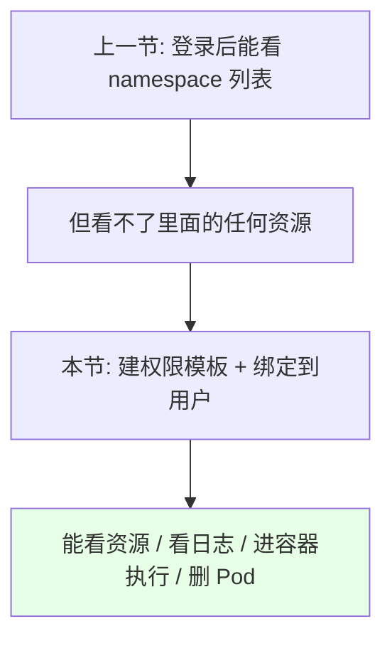
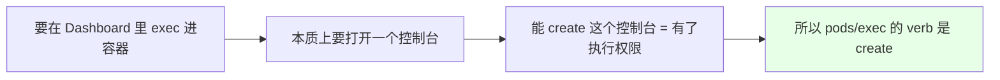
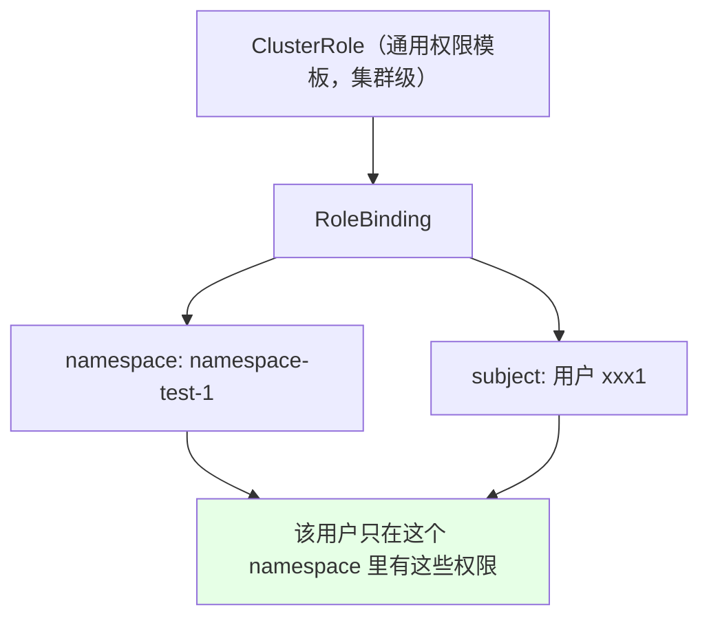
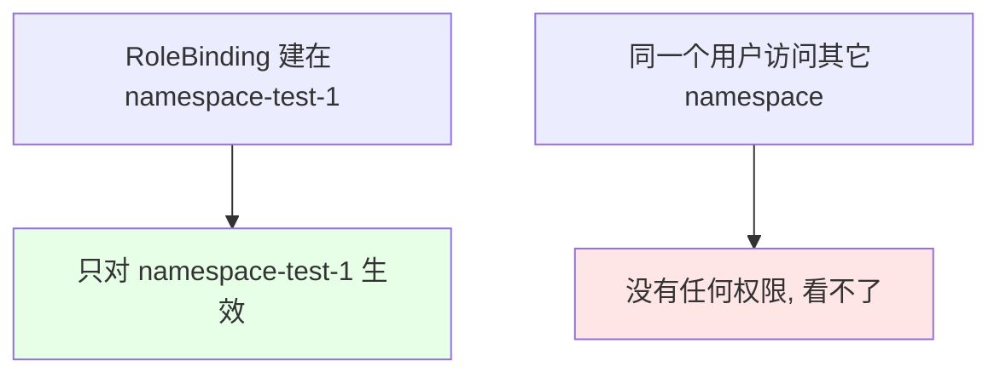
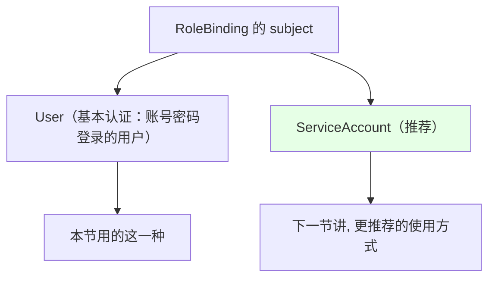

# Kubernetes 集群部署: RBAC 实现不同用户不同权限（ClusterRole 模板加 RoleBinding 按 namespace 下发）

上一节让账号密码登录的用户能看到 namespace 了，但还看不了里面的资源。这一节把**具体的权限做出来并发给指定用户** —— 核心就是那套「**通用 ClusterRole + 按 namespace 的 RoleBinding**」。

结论先摆：

1. **先建通用权限模板（ClusterRole）**：资源查看、日志查看 + 执行、容器删除这几套；
2. **再用 RoleBinding 把模板绑到「指定 namespace 下的指定用户」** —— `RoleBinding` 有 namespace 隔离，只对当前 namespace 生效；
3. **`exec` 权限给的是 `create`**：执行要打开一个控制台，能创建这个「控制台」就等于有了执行权限；
4. **ClusterRole 与 Role 可以互相替换**，把通用规则放进 ClusterRole 能省掉「每个 namespace 都建一份」的重复劳动；
5. **绑定对象有两种**：基本认证（账号密码）的用户，和 ServiceAccount（**更推荐，下一节讲**）。

## 纲要

- 从「能看 namespace」到「能看资源」
- 第一步：建通用 ClusterRole
- exec 权限为什么是 create
- 第二步：RoleBinding 绑定到指定 namespace 的用户
- RoleBinding 的 namespace 隔离
- 登录验证效果
- 两种绑定对象：用户与 ServiceAccount

## 从「能看 namespace」到「能看资源」



## 第一步：建通用 ClusterRole

课程里创建了这么几套通用权限：

```text
通用 ClusterRole 清单:

ClusterRole
├── 资源查看权限      ← 查看该 namespace 下所有资源（只读）
├── 日志 + 执行权限    ← 查看 Pod 日志 + exec 进容器
└── 容器删除权限      ← 删除 Pod
```

```yaml
# ① 资源查看（只读）
apiVersion: rbac.authorization.k8s.io/v1
kind: ClusterRole
metadata:
  name: resource-view
rules:
  - apiGroups: ["", "apps", "batch", "extensions"]
    resources: ["*"]
    verbs: ["get", "list", "watch"]
```

```yaml
# ② 日志查看 + 执行命令
apiVersion: rbac.authorization.k8s.io/v1
kind: ClusterRole
metadata:
  name: pod-log-exec
rules:
  - apiGroups: [""]
    resources: ["pods", "pods/log"]
    verbs: ["get", "list"]
  - apiGroups: [""]
    resources: ["pods/exec"]
    verbs: ["create"]        # ← 注意是 create，见下节说明
```

```yaml
# ③ 容器删除
apiVersion: rbac.authorization.k8s.io/v1
kind: ClusterRole
metadata:
  name: pod-delete
rules:
  - apiGroups: [""]
    resources: ["pods"]
    verbs: ["delete", "get", "list"]
```

| ClusterRole | 作用 | 关键 verbs |
| --- | --- | --- |
| 资源查看 | 看 namespace 下所有资源 | `get` / `list` / `watch` |
| 日志 + 执行 | 看日志、进容器 | `get` / `list` + `pods/exec` 的 **`create`** |
| 容器删除 | 删 Pod | `delete` |

> 权限内容**按需配置**：课程里那套「资源查看」给的是查看全部资源的权限，实际要按自己公司的风格收窄。

## exec 权限为什么是 create



这一点很容易想当然写成 `get` —— **exec 用的是 `create`**，因为它创建的是一个「控制台」会话。

## 第二步：RoleBinding 绑定到指定 namespace 的用户

```yaml
apiVersion: rbac.authorization.k8s.io/v1
kind: RoleBinding
metadata:
  name: user1-permission
  namespace: namespace-test-1        # ← 只在这个 namespace 生效
roleRef:
  apiGroup: rbac.authorization.k8s.io
  kind: ClusterRole
  name: pod-log-exec                 # ← 引用上面的通用模板
subjects:
  - kind: User
    name: xxx1                       # ← basic-auth-file 里的用户名
    apiGroup: rbac.authorization.k8s.io
```



把三套权限（资源查看 / 日志+执行 / 删除）都绑给同一个用户，他就在这个 namespace 下拥有这些能力。

## RoleBinding 的 namespace 隔离



**RoleBinding 是 namespace 隔离的** —— 绑在哪个 namespace，权限就只在那一个 namespace 里有效。这正是「开发只能操作自己项目 namespace」的实现方式。

## 登录验证效果

```bash
# 用 xxx1 登录 Dashboard 后：
# ① 其它 namespace 的资源 —— 看不了
# ② 被授权的 namespace-test-1 —— Pod 等资源都能看到
# ③ 点进容器 —— 能执行 exec（控制台打得开）
```

```text
验证清单（用被授权账号登录 Dashboard）:

namespace-test-1（已授权）
├── 资源列表        → 能看
├── Pod 日志        → 能看
├── exec 进容器      → 能进（控制台可打开）
└── 删除 Pod        → 能删

其它 namespace（未授权）
└── 全部            → 看不了
```

> 顺带一提，进容器后看到**时区已经和宿主机一致**（上一节 PodPreset 的预配置生效了）。

## 两种绑定对象



| 绑定对象 | 说明 |
| --- | --- |
| `User` | 用 `basic-auth-file`（基本认证）登录的用户，本节用的这种 |
| `ServiceAccount` | **更推荐**的方式，下一节展开 |

## 通用套路总结

```text
RBAC 下发的标准套路（照着做即可）:

1. 用 ClusterRole 创建通用权限
   └── 日志查看 / 执行命令 / 容器删除 / 资源查看 …

2. 用 RoleBinding 绑定到指定 namespace 下
   └── subjects: 某个 User 或某个 ServiceAccount

3. 该 User / ServiceAccount 就获得了这套 ClusterRole 的权限
   └── 且只在这个 namespace 内有效
```

## API 速览

| 能力 | 做法 |
| --- | --- |
| 建通用权限模板 | `kind: ClusterRole`，rules 里写 apiGroups / resources / verbs |
| 看日志 | `resources: ["pods/log"]`，`verbs: ["get", "list"]` |
| 进容器执行 | `resources: ["pods/exec"]`，`verbs: ["create"]` |
| 删 Pod | `resources: ["pods"]`，`verbs: ["delete"]` |
| 下发到 namespace | `kind: RoleBinding`，指定 `namespace` 与 `subjects` |
| 绑用户 | `subjects.kind: User`，name 写 basic-auth-file 里的用户名 |
| 绑服务账号 | `subjects.kind: ServiceAccount`（推荐） |

## Demo 示例

```bash
NS=namespace-test-1
USER=xxx1

# 1. 建三套通用 ClusterRole
cat <<'EOF' | kubectl apply -f -
apiVersion: rbac.authorization.k8s.io/v1
kind: ClusterRole
metadata:
  name: resource-view
rules:
  - apiGroups: ["", "apps", "batch"]
    resources: ["*"]
    verbs: ["get", "list", "watch"]
---
apiVersion: rbac.authorization.k8s.io/v1
kind: ClusterRole
metadata:
  name: pod-log-exec
rules:
  - apiGroups: [""]
    resources: ["pods", "pods/log"]
    verbs: ["get", "list"]
  - apiGroups: [""]
    resources: ["pods/exec"]
    verbs: ["create"]
---
apiVersion: rbac.authorization.k8s.io/v1
kind: ClusterRole
metadata:
  name: pod-delete
rules:
  - apiGroups: [""]
    resources: ["pods"]
    verbs: ["delete", "get", "list"]
EOF

# 2. 把权限绑到指定 namespace 下的指定用户
for role in resource-view pod-log-exec pod-delete; do
  kubectl create rolebinding ${USER}-${role} \
    --clusterrole=${role} --user=${USER} -n $NS
done

# 3. 查看绑定结果
kubectl get rolebinding -n $NS

# 4. 用 kubectl 验证权限是否生效
kubectl auth can-i get pods -n $NS --as=$USER
kubectl auth can-i create pods/exec -n $NS --as=$USER
kubectl auth can-i delete pods -n $NS --as=$USER

# 5. 验证对其它 namespace 无权限
kubectl auth can-i get pods -n default --as=$USER
# 预期：no
```

### 总结

- **从上节「能看到 namespace 但看不了资源」推进到本节的「不同用户不同权限」**，做法就两步：建通用权限模板，再绑到指定 namespace 的指定用户上；
- **通用权限用 ClusterRole 定义**（资源查看、日志查看 + 执行、容器删除等），**ClusterRole 和 Role 可以互相替换**，把通用规则放进 ClusterRole 能避免每个 namespace 都建一份的重复劳动；
- **`exec` 权限的 verb 是 `create` 而不是 `get`** —— 因为执行本质上是打开一个控制台，能创建这个控制台就有了执行权限，这一点最容易想当然写错；
- **下发用 `RoleBinding`，它有 namespace 隔离**：绑在哪个 namespace，用户就只在那个 namespace 里有这些权限，其它 namespace 一律看不了 —— 这正是「开发只能操作自己项目 namespace」的实现机制；
- **绑定对象有两种**：基本认证（账号密码）的 `User`（本节用的）和 `ServiceAccount`（**更推荐，下一节讲**）；
- **标准套路就是「ClusterRole 建通用权限 → RoleBinding 绑到指定 namespace 下的 User / ServiceAccount → 该主体获得这套权限」**，具体权限内容按自己公司的风格设计即可；实测登录后能看资源、看日志、进容器执行，且容器时区已与宿主机一致（PodPreset 生效）。

