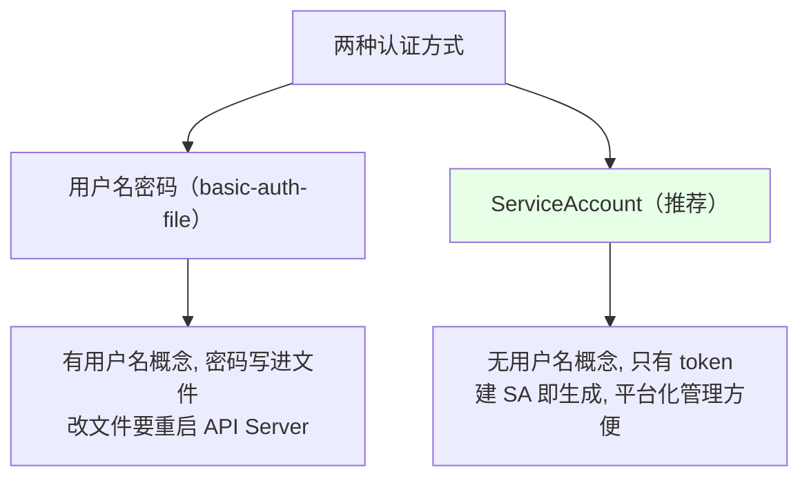
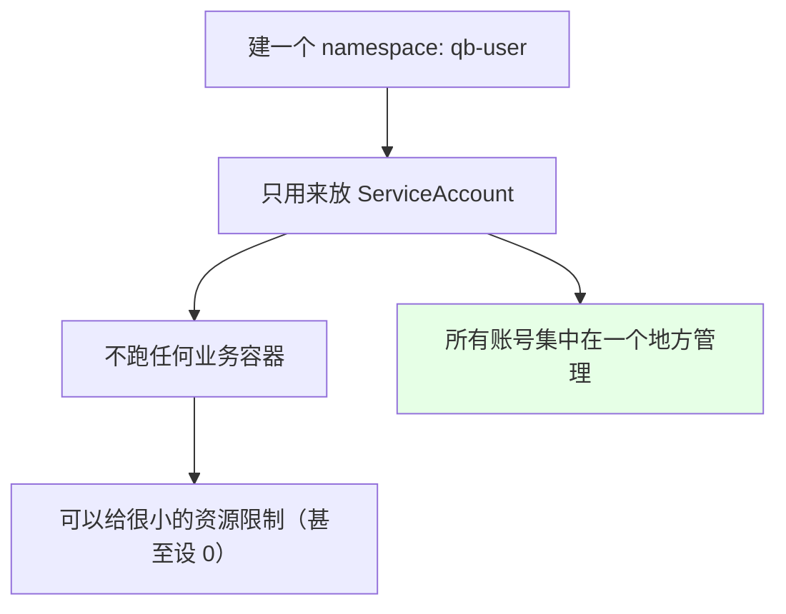
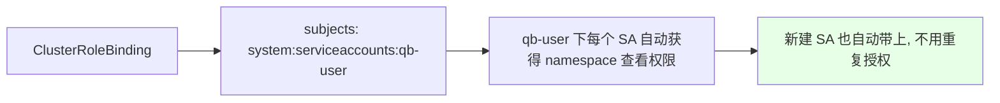
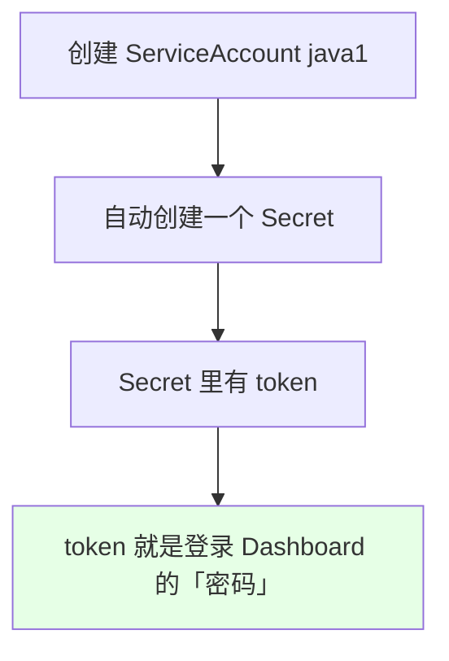
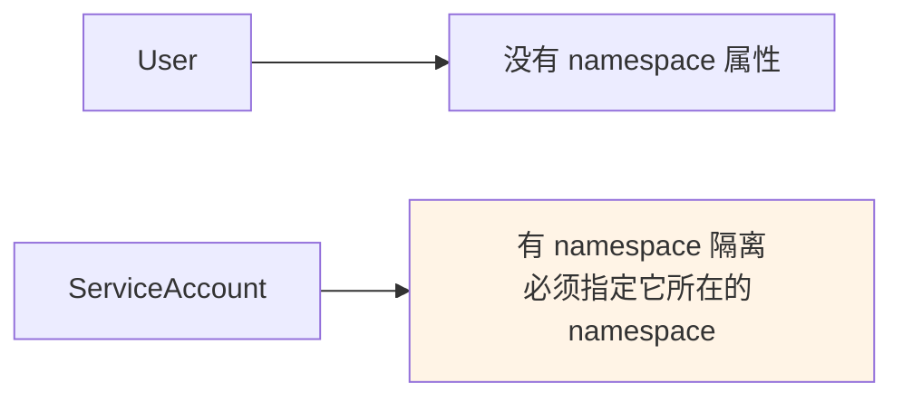
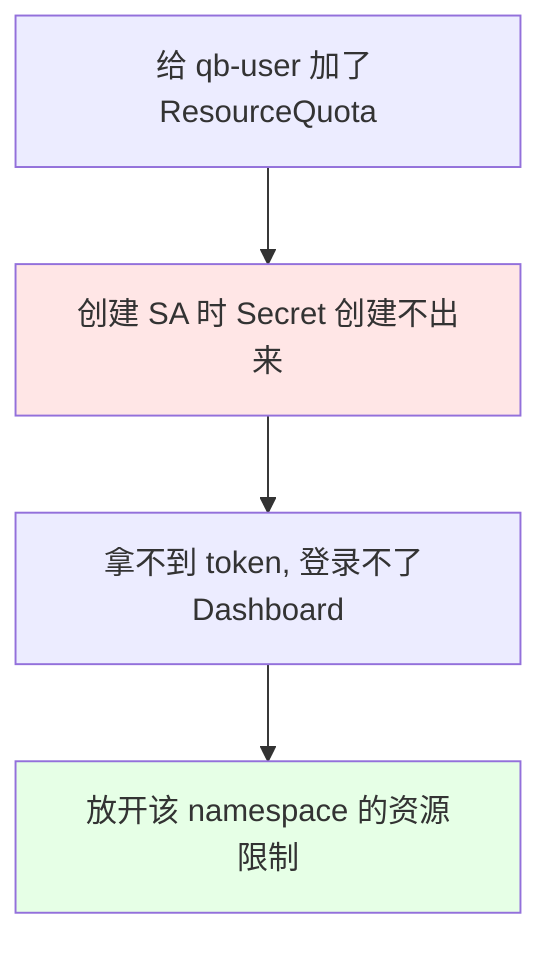
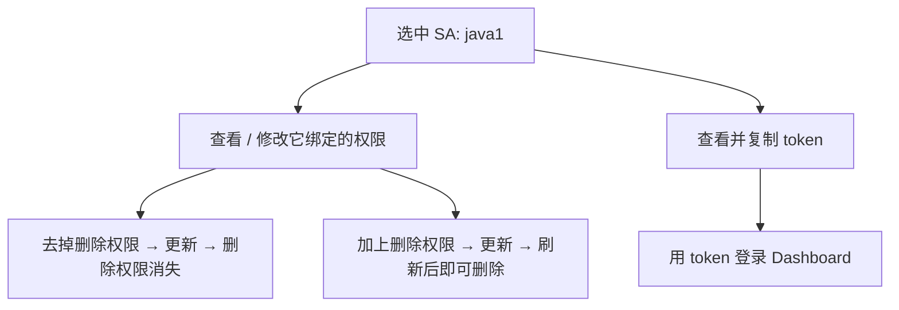
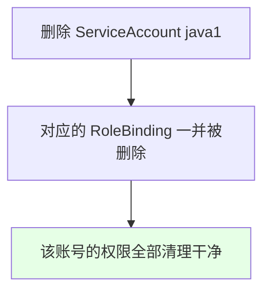

# Kubernetes 集群部署: ServiceAccount 权限管理（专用 namespace 集中托管与 token 登录）

上一节用「用户名密码」做 RBAC，这一节换成 **ServiceAccount（SA）** —— 原理几乎一样，**区别只在 `subjects` 和「没有用户名、只有 token」**。这也是课程里更推荐的方式。

结论先摆：

1. **建一个专用 namespace（如 `qb-user`）只放 ServiceAccount**，不跑任何业务容器，集中管理账号；
2. **把「namespace 查看权限」从绑「组」改成绑「该 namespace 下的所有 SA」**（`system:serviceaccounts:qb-user`），这样新建的 SA 自动就有这个权限，不用重复加；
3. **用 SA 之后就没有用户名概念了，只有 token** —— 一个开发或一个项目组对应一个 SA，每个 SA 自带一个含 token 的 Secret，token 就是登录 Dashboard 的凭据；
4. **`subjects` 的写法不同**：用户方式写 `kind: User` + `name`；SA 方式写 `kind: ServiceAccount` + `name` + **`namespace`**（SA 有 namespace 隔离）；
5. **踩坑**：给这个专用 namespace 加了 ResourceQuota 会导致 SA 的 Secret 创建不出来（token 就没了），那个限制必须放开。

## 纲要

- 与用户名密码方式的对比
- 专用 namespace 集中托管 SA
- 把所有 SA 统一授予 namespace 查看权限
- token：SA 的登录凭据
- subjects 的写法差异
- 踩坑：ResourceQuota 挡住了 Secret
- 权限的增删改查与验证
- 删除 SA 会连带清理绑定

## 与用户名密码方式的对比



| 对比项 | 用户名密码 | ServiceAccount |
| --- | --- | --- |
| 凭据 | 用户名 + 密码 | **token** |
| 凭据来源 | `basic-auth-file`（改完要重启 API Server） | SA 自带的 Secret |
| subjects 写法 | `kind: User` + `name` | `kind: ServiceAccount` + `name` + **`namespace`** |
| 管理便利度 | 一般 | **更好用**（可查看/改权限/复制 token） |

## 专用 namespace 集中托管 SA



```bash
kubectl create namespace qb-user
```

```text
账号与业务的分离:

qb-user（账号专用 namespace）
├── ServiceAccount java1        ← 一个开发 / 一个项目组
├── ServiceAccount java2
└── ServiceAccount …
    （每个 SA 自带一个含 token 的 Secret）

namespace-test-1（业务 namespace）
├── Deployment / Pod …
└── RoleBinding → subjects 指向 qb-user 下的某个 SA
```

## 把所有 SA 统一授予 namespace 查看权限

用户名密码方式是把权限绑给「组」；SA 方式改成绑给**该 namespace 下的所有 ServiceAccount** —— 这样**新建的 SA 自动就带这个权限，不用再一个个加**：

```yaml
apiVersion: rbac.authorization.k8s.io/v1
kind: ClusterRoleBinding
metadata:
  name: namespace-readonly-for-sa
roleRef:
  apiGroup: rbac.authorization.k8s.io
  kind: ClusterRole
  name: namespace-readonly
subjects:
  - kind: Group
    name: system:serviceaccounts:qb-user    # ← qb-user 下的所有 SA
    apiGroup: rbac.authorization.k8s.io
```



| 认证方式 | namespace 查看权限绑给谁 |
| --- | --- |
| 用户名密码 | `Group: system:authenticated`（所有登录用户） |
| **ServiceAccount** | **`Group: system:serviceaccounts:<专用namespace>`** |

之后具体的业务权限（资源查看 / 日志执行 / 删除）还是按上一节的套路：用 `RoleBinding` 把通用 ClusterRole 绑到目标 namespace 下。

## token：SA 的登录凭据



```bash
# 创建 SA（在专用 namespace 下）
kubectl create serviceaccount java1 -n qb-user

# 找到它对应的 Secret
kubectl get sa java1 -n qb-user -o yaml | grep -A 3 secrets
kubectl get secret -n qb-user | grep java1

# 取出 token
# 下面命令中的变量按你的集群环境赋值后再执行
kubectl describe secret $RES_NAME -n qb-user
# 或
kubectl get secret $RES_NAME -n qb-user -o jsonpath='{.data.token}' | base64 -d
```

> 用 SA 之后**没有「用户名」这个概念了** —— 一个开发建一个 SA，或者一个项目组建一个 SA，凭 token 登录。

## subjects 的写法差异

```yaml
# 用户名密码方式：subjects 是 User（没有 namespace 属性）
subjects:
  - kind: User
    name: xxx1
    apiGroup: rbac.authorization.k8s.io
```

```yaml
# ServiceAccount 方式：必须带上 namespace（SA 有 namespace 隔离）
subjects:
  - kind: ServiceAccount
    name: java1
    namespace: qb-user
    apiGroup: rbac.authorization.k8s.io
```



**RoleBinding 建在「被授权的业务 namespace」里，subjects 指向「账号 namespace 里的那个 SA」** —— 这就是跨 namespace 授权 SA 的写法。

## 踩坑：ResourceQuota 挡住了 Secret



课程里第一次创建 SA 后发现**没有生成对应的 Secret**（一开始还以为是新版本不支持）—— 根源是给这个 namespace 配了 ResourceQuota，把 Secret 也挡住了。**账号专用 namespace 不能限制这个**，把限制去掉后重建 SA，Secret 就正常生成了。

> 这个 namespace 不跑容器，资源限制可以设得很小（甚至设 0），但**不能挡住 Secret 的创建**。

## 权限的增删改查与验证

用 SA + 平台化管理，权限调整非常方便：



```text
实测验证流程:

1. 用 token 登录 Dashboard
2. 在已授权的 namespace（如 namespace-test-1）下 → 能看 Pod
3. 尝试删除 → 提示没有权限（因为没给删除权限）
4. 加上删除权限并更新 → 刷新后再删 → 删除成功（控制器会重建 Pod）
```

```bash
# 用 kubectl 验证某个 SA 的权限
kubectl auth can-i delete pods -n namespace-test-1 \
  --as=system:serviceaccount:qb-user:java1
# 预期：授权前 no，授权后 yes
```

要再加别的 namespace 的权限，就在平台上选目标 namespace 勾上即可，和上一节的绑定方式一致。

## 删除 SA 会连带清理绑定



不用了就把 SA 删掉，它对应的 RoleBinding 会一起被清掉，不会留下悬空授权 —— **基于 SA 的权限管理非常方便，这是推荐它的原因**。

## API 速览

| 能力 | 做法 |
| --- | --- |
| 建账号专用 namespace | `kubectl create namespace qb-user` |
| 建 SA | `kubectl create serviceaccount <名> -n qb-user` |
| 取 token | `kubectl get secret <secret名> -n qb-user -o jsonpath='{.data.token}' \| base64 -d` |
| 给所有 SA 授 namespace 查看权 | subjects 用 `Group: system:serviceaccounts:<ns>` |
| 给单个 SA 授权 | `RoleBinding` 的 subjects 用 `ServiceAccount` + `name` + `namespace` |
| 验证权限 | `kubectl auth can-i <verb> <resource> -n <ns> --as=system:serviceaccount:<ns>:<sa名>` |
| 清理 | 删 SA → 绑定一并清理 |

## Demo 示例

```bash
# 1. 建账号专用 namespace（不要给它加会挡住 Secret 的资源限制）
kubectl create namespace qb-user

# 2. 把 namespace 查看权限授给该 namespace 下的所有 SA
cat <<'EOF' | kubectl apply -f -
apiVersion: rbac.authorization.k8s.io/v1
kind: ClusterRoleBinding
metadata:
  name: namespace-readonly-for-sa
roleRef:
  apiGroup: rbac.authorization.k8s.io
  kind: ClusterRole
  name: namespace-readonly
subjects:
  - kind: Group
    name: system:serviceaccounts:qb-user
    apiGroup: rbac.authorization.k8s.io
EOF

# 3. 建 SA
kubectl create serviceaccount java1 -n qb-user

# 4. 确认 Secret（token）已生成 —— 没生成多半是资源限制挡住了
kubectl get secret -n qb-user | grep java1

# 5. 把业务权限绑到目标 namespace 下，subjects 指向该 SA
kubectl create rolebinding java1-view \
  --clusterrole=resource-view \
  --serviceaccount=qb-user:java1 \
  -n namespace-test-1

# 6. 取 token 登录 Dashboard
kubectl get secret $(kubectl get sa java1 -n qb-user -o jsonpath='{.secrets[0].name}') \
  -n qb-user -o jsonpath='{.data.token}' | base64 -d

# 7. 验证权限
kubectl auth can-i delete pods -n namespace-test-1 \
  --as=system:serviceaccount:qb-user:java1

# 8. 不用了就删掉 SA，绑定会一并清理
kubectl delete serviceaccount java1 -n qb-user
kubectl get rolebinding -n namespace-test-1 | grep java1
```

### 总结

- **基于 ServiceAccount 的 RBAC 和基于用户名密码的原理几乎一样，区别只在 `subjects` 写法和「没有用户名、只有 token」**；这是课程更推荐的方式；
- **做法是建一个专用 namespace（如 `qb-user`）只放 ServiceAccount**，不跑任何业务容器，账号集中管理；
- **把「namespace 查看权限」从绑「组」改成绑 `system:serviceaccounts:<专用namespace>`**，这样该 namespace 下**新建的 SA 自动带上这个权限**，不用重复添加；
- **用 SA 就没有用户名概念了**：一个开发或一个项目组对应一个 SA，创建 SA 会自动生成含 token 的 Secret，**token 就是登录 Dashboard 的凭据**；
- **`subjects` 写法**：用户方式写 `kind: User` + `name`（无 namespace）；SA 方式写 `kind: ServiceAccount` + `name` + **`namespace`**（SA 有 namespace 隔离）；`RoleBinding` 建在被授权的业务 namespace 里，指向账号 namespace 里的 SA；
- **踩坑**：给账号专用 namespace 加 ResourceQuota 会导致 SA 的 Secret 创建不出来、拿不到 token，那个限制必须放开（该 namespace 不跑容器，资源可以给很小但不能挡 Secret）；
- **权限增删改查很方便**：去掉 / 加上某个权限后更新立即生效（实测删除权限从「提示无权限」到「删除成功」），可查看并复制 token；**删掉 SA 时它对应的 RoleBinding 会一并清理**，不留悬空授权。

