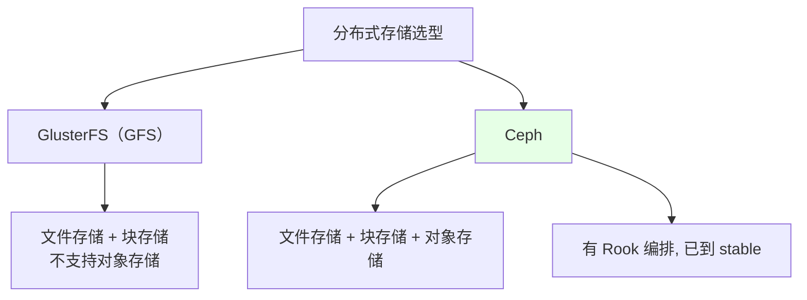
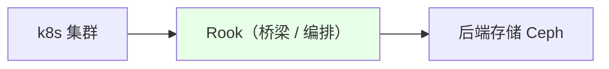
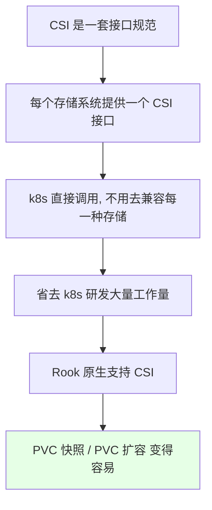
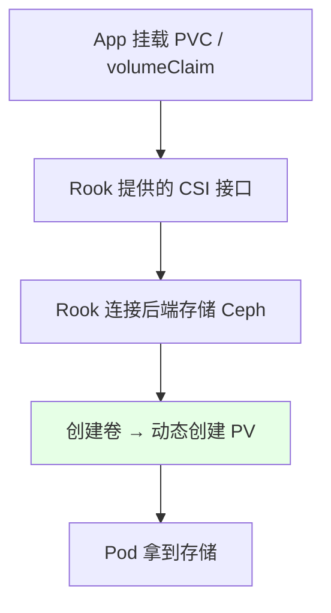
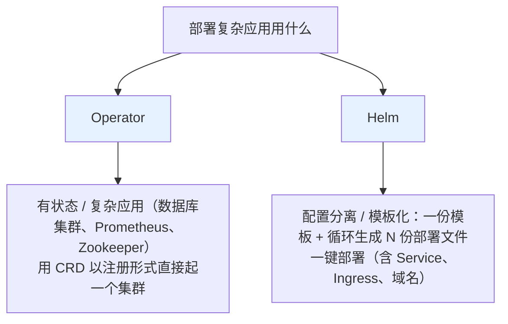
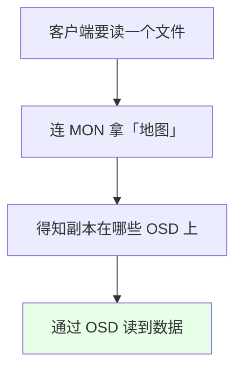
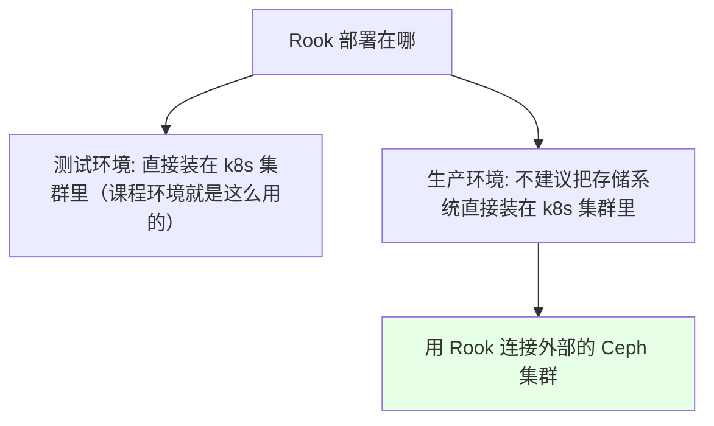

# Kubernetes 集群部署: 云原生存储 Rook 介绍（在 k8s 与 Ceph 之间搭桥的编排工具与组件拆解）

前面几节都在讲权限，这一节回到存储 —— 讲 **Rook**。它是目前 k8s 存储领域做得最好的编排工具：**本身不提供存储，而是在存储和 k8s 之间搭一座桥**，让 Ceph 这类分布式存储的搭建和维护变得很简单。

结论先摆：

1. **Ceph 比 GlusterFS 强大**：Ceph 支持文件存储、块存储**和对象存储**，GlusterFS 不支持对象存储；而且 Ceph 有 Rook 这个云原生编排工具，对它的支持**已到 stable 版本，可以上生产**；
2. **Rook 本身不提供存储**，它是自我管理的分布式存储编排工具，架在 k8s 与后端存储之间；
3. **Rook 原生支持 CSI** —— CSI 是 k8s 存储的未来（接口规范），符合它之后做 **PVC 快照、PVC 扩容**都很简单；
4. **生产环境不建议把存储系统直接装在 k8s 集群里**，Rook 可以连接外部的 Ceph 集群；
5. **核心组件**：Operator（编排）、Agent（每节点一个，做挂载/格式化等存储操作）、**OSD**（直连物理磁盘，最重要）、**MON**（维护集群地图，无状态）、MDS、RGW、MGR。

## 纲要

- Ceph 与 GlusterFS 的选型对比
- Rook 是什么：桥梁而非存储
- CSI：k8s 存储的未来
- 动态 PV 的流程
- Operator 与 Helm 的分工
- 组件拆解：Agent / OSD / MON / MDS / RGW / MGR
- 安装方式与生产建议

## Ceph 与 GlusterFS 的选型对比



| 对比项 | GlusterFS | Ceph |
| --- | --- | --- |
| 文件存储 | 支持 | 支持 |
| 块存储 | 支持 | 支持 |
| **对象存储** | **不支持** | **支持** |
| 云原生编排 | 无成熟方案 | **Rook（stable，可上生产）** |
| 性能 / 扩容 | 一般 | **性能强大、扩容简单** |

Rook 也支持其它存储中间件，但**除了 Ceph 之外的多半还停留在 alpha 版本**，所以选 Ceph。

## Rook 是什么：桥梁而非存储



**Rook 本身不提供存储**，它是一个可以自我管理的分布式存储编排工具，在存储和 k8s 之间搭桥 —— 有了它，存储的**搭建和维护变得非常简单**。

## CSI：k8s 存储的未来



**CSI 是 k8s 存储的未来**：它把「k8s 要兼容每一种存储」变成「存储自己提供一个标准接口」。Rook 本身就是云原生的，**原生支持 CSI**，所以可以直接利用它做 **PVC 的快照**和 **PVC 的扩容**。

## 动态 PV 的流程



| 方式 | 说明 |
| --- | --- |
| 手动创建 PV | 比较麻烦 |
| **动态创建（StorageClass）** | k8s 提供的动态存储方案，用 `StorageClass` 动态创建 PV |

`StorageClass` 后端可以接 Ceph、GlusterFS 或其它存储；**用 Rook 之后这部分工作被大幅简化** —— 直接写 Rook 提供的 CSI 接口即可创建 PVC / PV 并控制 Ceph。

## Operator 与 Helm 的分工



| 工具 | 定位 |
| --- | --- |
| 直接用 Deployment / Ingress | 无状态应用，创建简单 |
| **Operator** | **复杂 / 有状态应用**：利用 CRD（自定义资源类型）以「注册」的形式直接起一个集群（数据库集群、Prometheus、Zookeeper） |
| **Helm** | **配置分离 / 模板化**：把应用写成模板，一个模板用循环生成 20 份部署文件，一条 `helm install` 把整个应用（含 Service、Ingress、域名）全部搭起来 |

> 例如公司做私有化平台、要给别的公司部署 20 个 Java 应用 —— 启动命令和参数都一样，用 Helm 一个模板加一个循环就能全生成，一键部署。

## 组件拆解

```text
Rook + Ceph 的组件构成:

k8s 集群
├── Rook Operator        ← 编排（CRD 注册式创建集群）
├── Rook Agent（每存储节点一个, 类似 DaemonSet）
│   └── 挂载 / 加载存储卷 / 格式化文件系统 / 挂网络
└── Ceph 侧
    ├── OSD   ← ★ 直连物理磁盘或目录, 最重要
    ├── MON   ← 维护集群地图（拓扑 + 副本位置）, 无状态
    ├── MDS   ← 元数据服务器, 跟踪文件层次结构
    ├── RGW   ← 对象存储网关, 兼容 S3 / Swift, 支持多租户
    └── MGR   ← 额外的监控与界面
```

| 组件 | 作用 |
| --- | --- |
| **Agent** | **每个存储节点上都跑一个**（类似 DaemonSet）；负责挂载文件、加载存储卷、格式化文件系统、挂载网络等**具体存储操作** |
| **OSD** | **直连物理磁盘或目录**，是 Ceph 里**最重要的组件 —— 什么都能缺，就它不能缺**；管理集群副本数、高可用与容错；某个 OSD 故障会与其它 OSD 通讯发起恢复 |
| **MON** | 集群监控：所有节点向它汇报；**维护一张「地图」**，记录集群拓扑与元数据（每个副本放在哪个位置）；客户端先连 MON 拿到 OSD 位置，再通过 OSD 找到文件；**MON 无状态，本身不存数据** |
| **MDS** | 元数据服务器，跟踪文件层次结构并存放 Ceph 元数据 |
| **RGW** | 对象存储网关，提供 RESTful API，主要用来**兼容其它对象存储**（如 OpenStack Swift），支持多租户与身份验证；用得不多 |
| **MGR** | 提供额外的监控和界面 |



## 安装方式与生产建议

```bash
# Rook 官方提供了非常简单的安装文件，直接 apply 即可
kubectl apply -f https://github.com/rook/rook/raw/master/deploy/examples/crds.yaml
kubectl apply -f https://github.com/rook/rook/raw/master/deploy/examples/common.yaml
kubectl apply -f https://github.com/rook/rook/raw/master/deploy/examples/operator.yaml
```



> Rook 也支持用 Helm 部署，但它官方那份安装文件已经足够简单（直接 apply 就装好），没必要再套一层 Helm —— 当然自己尝试写一份 Helm 也是可以的。

## API 速览

| 能力 | 做法 |
| --- | --- |
| 装 Rook | 直接 `kubectl apply` 官方 `crds.yaml` / `common.yaml` / `operator.yaml` |
| 动态创建 PV | 用 Rook 提供的 CSI 接口 + `StorageClass` |
| PVC 快照 / 扩容 | 因为支持 CSI，这两件事变得容易 |
| 找数据在哪 | 客户端连 MON 拿地图 → 定位 OSD |
| 副本与容错 | 由 OSD 管理，故障 OSD 会与其它 OSD 通讯恢复 |
| 生产建议 | 存储系统不装在 k8s 内，用 Rook 连接外部 Ceph |

## Demo 示例

```bash
# 1. 装 Rook Operator（官方安装文件，直接 apply）
kubectl apply -f crds.yaml
kubectl apply -f common.yaml
kubectl apply -f operator.yaml

# 2. 确认 Operator 起来了
kubectl get pod -n rook-ceph

# 3. 创建 Ceph 集群（CRD 声明式）
kubectl apply -f cluster.yaml
kubectl get pod -n rook-ceph -w

# 4. 看各个组件：OSD / MON / MGR 等
kubectl get pod -n rook-ceph | grep -E 'osd|mon|mgr|mds'

# 5. 确认 StorageClass 已就绪（动态 PV 靠它）
kubectl get storageclass

# 6. 建一个 PVC 验证动态创建 PV
cat <<'EOF' | kubectl apply -f -
apiVersion: v1
kind: PersistentVolumeClaim
metadata:
  name: rook-demo-pvc
spec:
  storageClassName: rook-ceph-block
  accessModes: ["ReadWriteOnce"]
  resources:
    requests:
      storage: 1Gi
EOF
kubectl get pvc rook-demo-pvc
kubectl get pv
```

### 总结

- **选 Ceph 而不是 GlusterFS**：Ceph 支持文件存储、块存储**和对象存储**（GFS 不支持对象存储），性能更强、扩容更简单，而且有 **Rook 这个云原生编排工具，对 Ceph 的支持已到 stable，可以上生产**；Rook 支持的其它存储中间件多半还是 alpha；
- **Rook 本身不提供存储**，它是一个自我管理的分布式存储编排工具，**在 k8s 和后端存储之间搭桥**，让存储的搭建与维护变得非常简单；
- **Rook 原生支持 CSI** —— CSI 是接口规范、是 k8s 存储的未来，每个存储系统提供一个 CSI 接口，k8s 就不用去兼容每一种存储；符合 CSI 之后，**PVC 的快照和扩容都变得容易**；
- **动态 PV 的流程**：App 挂载 PVC → Rook 的 CSI 接口 → 连接 Ceph 创建卷 → 动态生成 PV；相比手动创建 PV，`StorageClass` 动态创建省事得多，而 Rook 把 `StorageClass` 到后端存储这一层的工作也简化了；
- **Operator 与 Helm 分工不同**：Operator 用 CRD 以「注册」形式起复杂 / 有状态应用（数据库集群、Prometheus、Zookeeper），Helm 做配置分离与模板化（一份模板循环生成 N 份部署文件，一键把 Service、Ingress、域名全搭起来）；
- **组件上记住三个就够了**：**Agent** 每存储节点一个、负责挂载 / 格式化等存储操作；**OSD** 直连物理磁盘或目录，是 Ceph 里**什么都能缺就它不能缺**的组件，管副本数、高可用与容错；**MON** 维护集群「地图」（记录每个副本的位置），客户端先连它拿 OSD 位置，**MON 无状态、本身不存数据**；另外 MDS 管元数据、RGW 是兼容其它对象存储的网关、MGR 提供监控与界面；
- **安装**：Rook 官方安装文件非常简洁，直接 `kubectl apply` 即可（也支持 Helm，但没必要）；**生产环境不建议把存储系统直接装在 k8s 集群里**，应让 Rook 连接外部的 Ceph 集群 —— 课程环境是测试环境，全部用 Rook 直接起，生产则直连后台存储。

