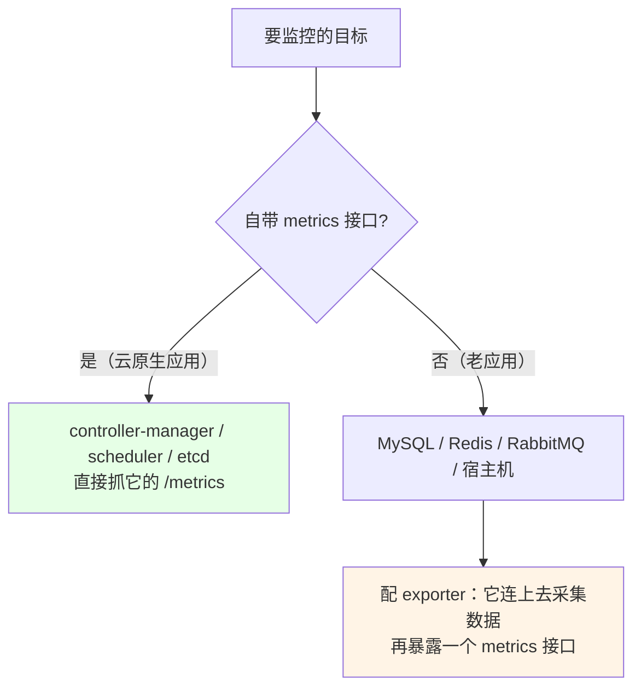
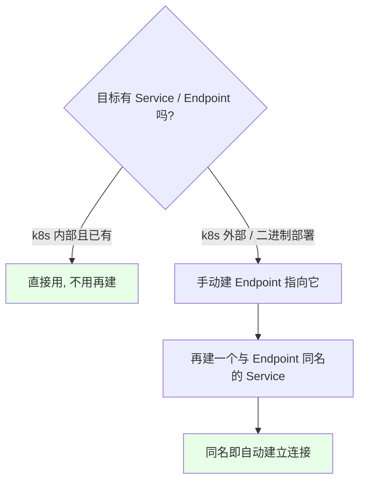
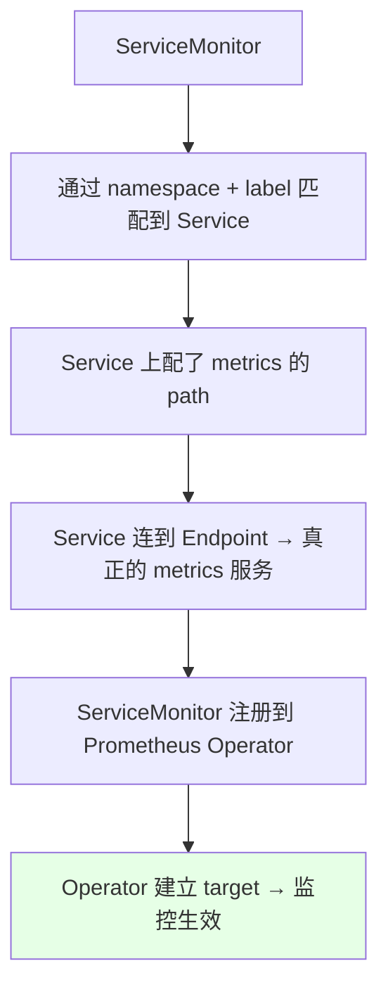
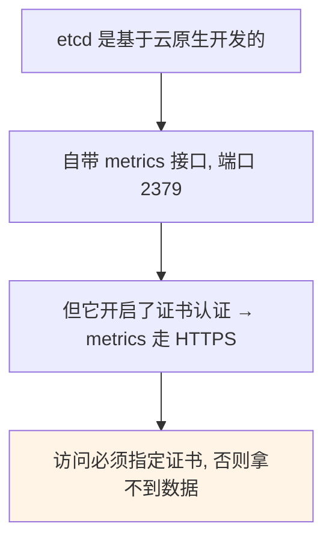
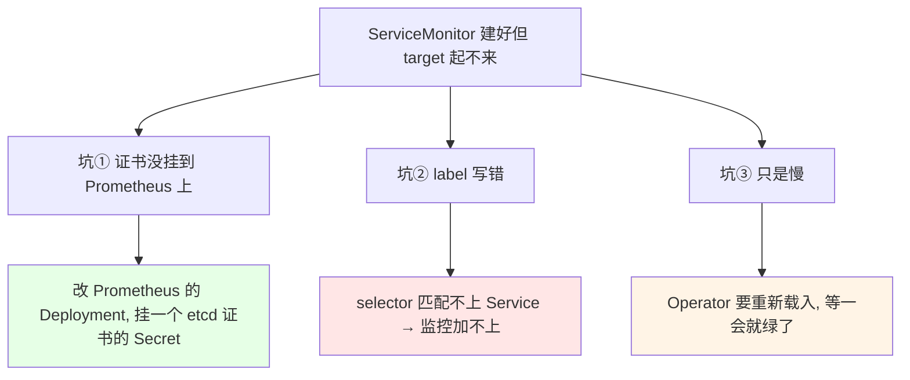
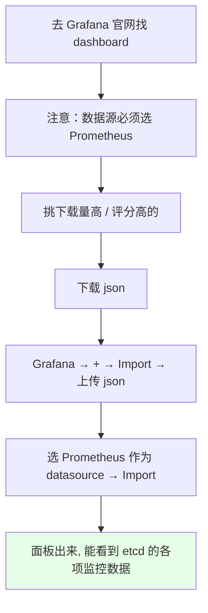

# Kubernetes 集群部署: Prometheus 监控 etcd 集群（Endpoint、ServiceMonitor 与 HTTPS 证书接入）

前面解决了 scheduler、controller-manager 的监控，这一节讲**怎么给自己的业务应用 / 中间件做监控**。分成两类：**自带 metrics 接口的**和**不带 metrics 接口的**。本节用 etcd 演示前者。

结论先摆：

1. **自带 metrics 接口的应用**（云原生开发的，如 controller-manager、scheduler、**etcd**）直接抓；**不带接口的**（MySQL、Redis、RabbitMQ、宿主机）要配 **exporter**，由它连上去采集数据再暴露一个 metrics 接口；
2. **监控链路是「Endpoint + 同名 Service + ServiceMonitor」**：Endpoint 指向真正提供 metrics 的服务（集群内已有 Service/Endpoint 就不用建，集群外的如 etcd 必须建），**Service 要和 Endpoint 同名**才会自动建立连接，ServiceMonitor 再通过 namespace + label 匹配到它；
3. **etcd 的 metrics 走 HTTPS 且必须带证书**，ServiceMonitor 里 `scheme` 要改成 `https`，并配 `caFile` / `certFile` / `keyFile`；
4. **三个实踩的坑**：① **证书没挂到 Prometheus 上**（改 Prometheus 的 Deployment 挂 Secret）；② **label 写错导致匹配不上**；③ **重载很慢**，要等一会才转绿；
5. **Grafana 面板去官网找**（数据源必须选 Prometheus），下载 json 后 import 即可。

## 纲要

- 两类应用：自带 metrics 与需要 exporter
- Endpoint 与 Service 的配合
- ServiceMonitor：Operator 的服务注册发现
- etcd 的 metrics：HTTPS + 证书
- 三个实踩的坑
- Grafana 面板的导入
- 通用套路总结

## 两类应用



| 类型 | 例子 | 做法 |
| --- | --- | --- |
| **自带 metrics 接口** | controller-manager、scheduler、**etcd** | 直接抓 |
| **不带接口** | MySQL、Redis、RabbitMQ、宿主机 | 用 **exporter** 代理采集（下一节） |

## Endpoint 与 Service 的配合



| 场景 | 要不要建 Endpoint |
| --- | --- |
| 部署在 k8s 内部、已有 Service / Endpoint | **不需要**，直接用 |
| 在 k8s 外部（如外部 ES 集群、**etcd**） | **必须建** Endpoint 连到外部服务 |
| 二进制安装的 scheduler / controller-manager | 需要手动建（kubeadm 装的会自动建好） |

```yaml
# 1) Endpoint：指向真正提供 metrics 的服务（这里是集群外的 etcd）
apiVersion: v1
kind: Endpoints
metadata:
  name: etcd-monitor
  namespace: monitoring
  labels:
    app: etcd-monitor        # ← 后面 ServiceMonitor 靠这个 label 匹配
subsets:
  - addresses:
      - ip: 192.168.1.18     # ← etcd 所在节点 IP
    ports:
      - name: etcd
        port: 2379
        protocol: TCP
```

```yaml
# 2) Service：名称必须与 Endpoint 完全一致，两者自动建立连接
apiVersion: v1
kind: Service
metadata:
  name: etcd-monitor
  namespace: monitoring
  labels:
    app: etcd-monitor
spec:
  ports:
    - name: etcd
      port: 2379
      targetPort: 2379
      protocol: TCP
  type: ClusterIP
  clusterIP: None
```

> 新版本在创建 Endpoint 时可以直接把 Service 一并勾上自动生成；老版本要手动再添加一次 Service。

## ServiceMonitor：Operator 的服务注册发现

Prometheus 是用 Operator 装的，Operator 提供了**服务注册发现**机制，载体就是 `ServiceMonitor`：



```yaml
apiVersion: monitoring.coreos.com/v1
kind: ServiceMonitor
metadata:
  name: etcd-monitor
  namespace: monitoring
  labels:
    app: etcd-monitor
spec:
  namespaceSelector:
    matchNames:
      - monitoring                  # ← 匹配 Service 所在的 namespace
  selector:
    matchLabels:
      app: etcd-monitor             # ← 匹配 Service / Endpoint 的 label（写错就匹配不上）
  endpoints:
    - port: etcd
      interval: 30s                 # ← 采集间隔
      scheme: https                 # ← etcd 是 HTTPS，默认是 http 必须改
      path: /metrics
      tlsConfig:
        insecureSkipVerify: true    # ← 客户端忽略服务端证书
        caFile: /etc/prometheus/secrets/etcd-certs/etcd-ca.pem
        certFile: /etc/prometheus/secrets/etcd-certs/etcd.pem
        keyFile: /etc/prometheus/secrets/etcd-certs/etcd-key.pem
```

| 字段 | 说明 |
| --- | --- |
| `namespaceSelector` | 匹配 Service 所在的 namespace |
| `selector.matchLabels` | 匹配 Service / Endpoint 的 label |
| `endpoints.port` | 对应 Service 里 port 的 name（这里是 `etcd`） |
| `endpoints.interval` | 采集间隔 |
| `endpoints.scheme` | **默认 `http`，etcd 必须改成 `https`** |
| `tlsConfig` | 证书三件套（`caFile` / `certFile` / `keyFile`） |

## etcd 的 metrics：HTTPS + 证书



```bash
# 用 curl 指定证书验证 etcd 的 metrics 是否可访问
curl --cacert /etc/etcd/ssl/etcd-ca.pem \
     --cert   /etc/etcd/ssl/etcd.pem \
     --key    /etc/etcd/ssl/etcd-key.pem \
     https://192.168.1.18:2379/metrics
# 能看到一堆 etcd_ 开头的指标即为正常
```

## 三个实踩的坑



| 坑 | 现象 | 解决 |
| --- | --- | --- |
| **① 证书没挂载** | 日志报「找不到证书」 | 改 Prometheus 的 Deployment，**挂一个含 etcd 证书的 Secret**（证书是集群安装时生成的） |
| **② label 写错** | 匹配不上 Service，监控加不上 | 核对 Service / Endpoint 与 ServiceMonitor 的 label 是否一致 |
| **③ 只是慢** | 配置都对但状态一直是 0/0 | Operator 重新载入需要时间，**等一会即可转绿** |

```bash
# 挂证书后确认容器里确实有这些文件
kubectl exec -it $PROM_POD -n monitoring -- \
  ls /etc/prometheus/secrets/etcd-certs/
# 预期：etcd-ca.pem  etcd.pem  etcd-key.pem

# ServiceMonitor 里的证书路径要按实际挂载路径写
kubectl describe servicemonitor etcd-monitor -n monitoring
```

> 也可以一键安装 Prometheus Operator（有些方案已经把 etcd 集成进去了），但那些方案版本往往偏低；用最新版 Operator 就得手动把这套走一遍。Prometheus 的资源请求、数据保留天数等也可以在 Operator 的 CR 里改。

## Grafana 面板的导入



```text
dashboard 存放的两种方式:

存进 ConfigMap
├── 可行, 但重启可能丢失
└── 监控项非常多时, 全塞 ConfigMap 对 etcd 压力也不好

单独部署一个 Grafana（建议）
├── 找一台宿主机, 或随便一个 k8s 节点装一个
├── 单机版也够用, 挂了也不影响业务
└── dashboard 多了以后更好维护
```

> 告警规则要自己写，后面的课程再讲。

## 通用套路总结

```text
给一个应用加监控的标准流程:

1. 判断有没有 metrics 接口
   ├── 有（etcd / controller-manager / scheduler）→ 走下面
   └── 没有（MySQL / Redis / RabbitMQ / 宿主机）→ 用 exporter

2. 看有没有现成的 Service / Endpoint
   ├── k8s 内部应用: 一般都有 → 直接用
   └── 集群外部 / 二进制部署: 手动建 Endpoint + 同名 Service

3. 建 ServiceMonitor
   ├── namespaceSelector 匹配 namespace
   ├── selector 匹配 label（最容易写错）
   ├── scheme / path / 证书按实际情况配
   └── Operator 自动生成 target

4. Grafana 里导入面板看数据
```

## API 速览

| 能力 | 做法 |
| --- | --- |
| 验证 metrics 可访问 | `curl --cacert … --cert … --key … https://<ip>:2379/metrics` |
| 建 Endpoint | `kind: Endpoints`，subsets 里写 IP 与端口 |
| 建 Service | **名称与 Endpoint 完全一致** |
| 建 ServiceMonitor | `namespaceSelector` + `selector` + `endpoints` |
| HTTPS 目标 | `scheme: https` + `tlsConfig`（caFile / certFile / keyFile） |
| 挂证书 | 改 Prometheus 的 Deployment 挂 Secret |
| 排错 | `kubectl describe servicemonitor` + 看 Prometheus 日志 |
| 导入面板 | Grafana → Import 上传 json，datasource 选 Prometheus |

## Demo 示例

```bash
NS=monitoring
ETCD_IP=192.168.1.18

# 1. 先验证 etcd 的 metrics 能不能拿到（必须带证书）
curl --cacert /etc/etcd/ssl/etcd-ca.pem \
     --cert   /etc/etcd/ssl/etcd.pem \
     --key    /etc/etcd/ssl/etcd-key.pem \
     https://${ETCD_IP}:2379/metrics | head

# 2. 把 etcd 证书做成 Secret，供 Prometheus 挂载
kubectl create secret generic etcd-certs -n $NS \
  --from-file=etcd-ca.pem=/etc/etcd/ssl/etcd-ca.pem \
  --from-file=etcd.pem=/etc/etcd/ssl/etcd.pem \
  --from-file=etcd-key.pem=/etc/etcd/ssl/etcd-key.pem

# 3. 改 Prometheus 的 Deployment，挂上这个 Secret
kubectl edit prometheus -n $NS          # 在 spec 里加 secrets: ["etcd-certs"]

# 4. 建 Endpoint + 同名 Service（etcd 在集群外，必须建）
kubectl apply -f etcd-endpoint.yaml -n $NS
kubectl apply -f etcd-service.yaml -n $NS
kubectl get endpoints etcd-monitor -n $NS
kubectl get svc etcd-monitor -n $NS

# 5. 建 ServiceMonitor（scheme 改 https + 证书路径）
kubectl apply -f etcd-servicemonitor.yaml -n $NS
kubectl describe servicemonitor etcd-monitor -n $NS

# 6. 确认证书确实挂进了 Prometheus 容器
kubectl exec -it $PROM_POD -n $NS -- \
  ls /etc/prometheus/secrets/etcd-certs/

# 7. 看 Prometheus 日志排错（匹配不上 / 证书找不到都会在这里）
kubectl logs -n $NS $PROM_POD | tail -30

# 8. 打开 Prometheus 的 Targets 页面等它转绿（可能需要等一会儿）
```

### 总结

- **监控目标分两类**：自带 metrics 接口的云原生应用（controller-manager、scheduler、**etcd**）直接抓；不带接口的老应用（MySQL、Redis、RabbitMQ、宿主机）要配 **exporter** 代采再暴露 metrics（下一节讲）；
- **监控链路是「Endpoint + 同名 Service + ServiceMonitor」**：k8s 内部且已有 Service/Endpoint 的直接用，**etcd 这类集群外的服务必须手动建 Endpoint**，并且**再建一个与 Endpoint 同名的 Service**，同名会自动建立连接；
- **ServiceMonitor 是 Prometheus Operator 的服务注册发现载体**：通过 `namespaceSelector` + `selector`（label）匹配到 Service，Service 上配了 metrics 的 path，再由 Service 连到 Endpoint 背后的真实服务，最后 ServiceMonitor 注册给 Operator、由它建立 target；
- **etcd 的 metrics 走 HTTPS 且必须带证书**（它基于云原生开发、自带 /metrics，但开了证书认证），所以 ServiceMonitor 里 **`scheme` 要从默认的 `http` 改成 `https`**，并配好 `caFile` / `certFile` / `keyFile`，必要时加 `insecureSkipVerify`；
- **三个实踩的坑**：① **证书没挂到 Prometheus 上**（日志报找不到证书 —— 改 Prometheus 的 Deployment 挂一个证书 Secret，挂载有默认路径，ServiceMonitor 里的证书地址要对应）；② **label 写错导致 selector 匹配不上**（监控死活加不上）；③ **只是 Operator 重载慢**，等一会就转绿了；
- **Grafana 面板去官网找**（数据源必须选 Prometheus，挑下载量高 / 评分高的），下载 json 后 Import 即可；dashboard 建议单独部署一个 Grafana 来放而不是全塞进 ConfigMap（重启可能丢，多了对 etcd 也有压力）；告警规则则需要自己编写。

