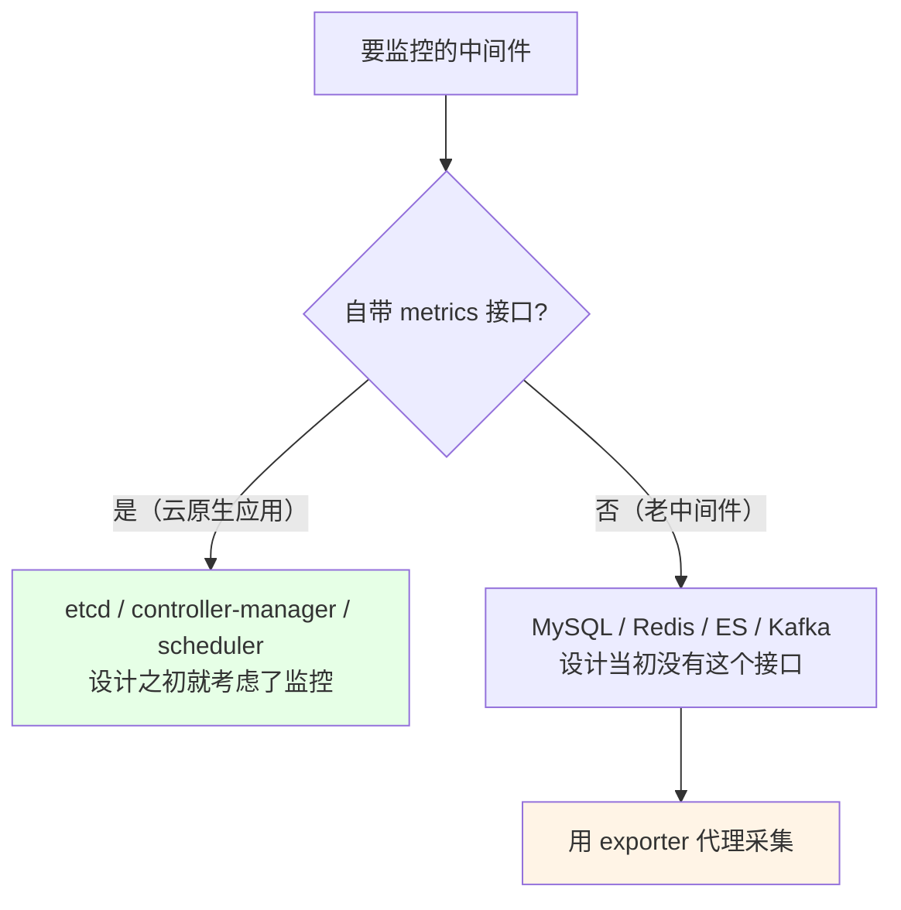
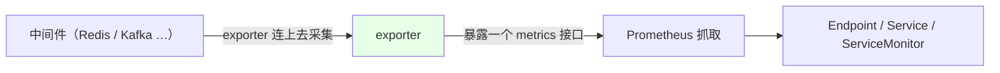
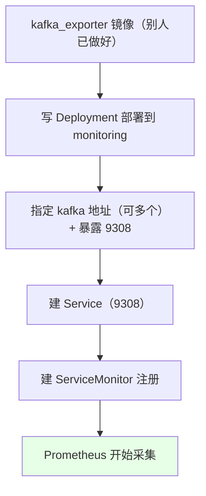
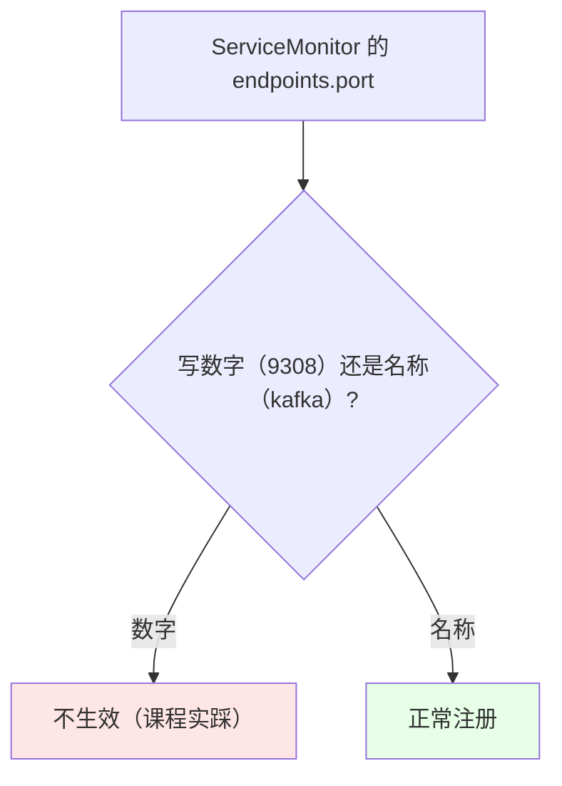
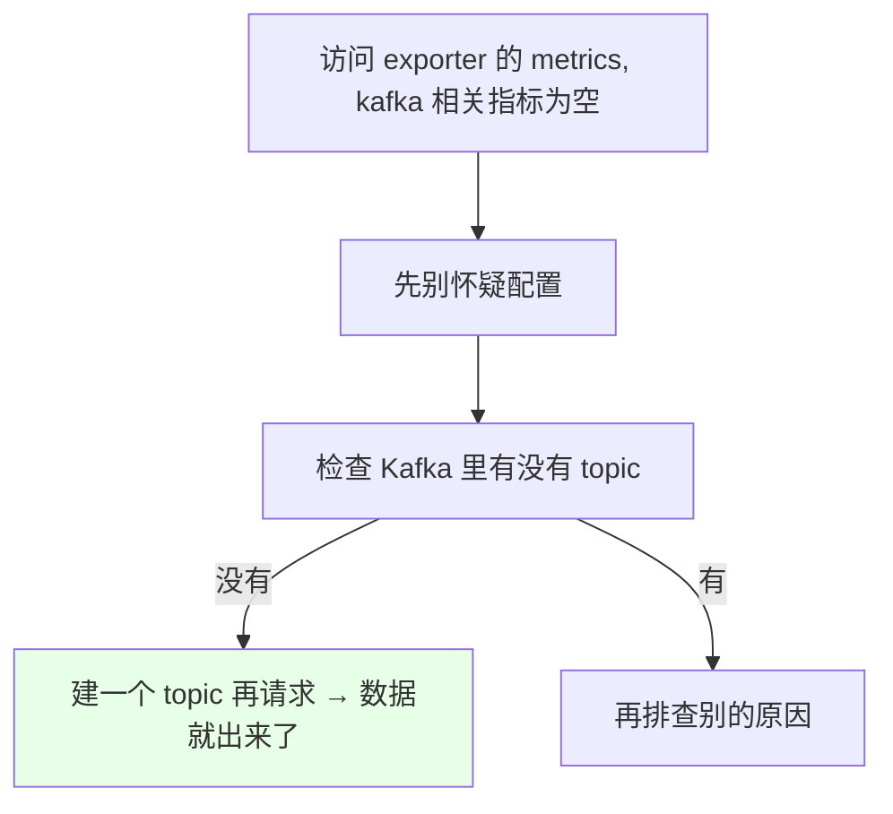
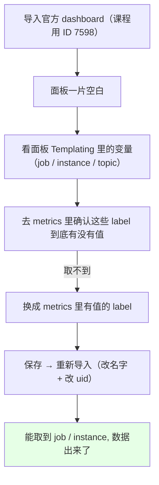

# Kubernetes 集群部署: Prometheus Exporter（给没有 metrics 接口的中间件做代理采集）

上一节用 etcd 演示了「自带 metrics 接口」的应用怎么接进 Prometheus。这一节解决另一半：**MySQL、Redis、ES、Kafka 这些老中间件，设计当初压根没有 metrics 接口，怎么监控** —— 答案是 **exporter**。

结论先摆：

1. **exporter 是一个代理**：它连到中间件上采集数据（比如对 Redis 执行命令看有多少 key、每个 key 多大），再自己暴露一个 metrics 接口，**对被监控的应用零改动**；
2. **exporter 基本不用自己写**：开源社区现成的很多（官方写的 `node_exporter`、别人写的 `redis_exporter` / `kafka_exporter` / `elasticsearch_exporter`），**star 高的就能直接用**；
3. **接入方式和有 metrics 接口的应用完全一样**（Deployment → Service → ServiceMonitor），唯一区别是中间多了一层 exporter；
4. **两个实踩的坑**：ServiceMonitor 的 `port` **必须写名称不能写数字**；面板没数据往往**不是配置问题**，而是 Kafka 里没建 topic / 没有消费组，字段取不到值；
5. **面板空值的排查套路**：看 Grafana 面板 Templating 里用的 label 在 metrics 里到底有没有值，取不到的就换成有值的 label。

## 纲要

- 为什么需要 exporter
- exporter 的工作方式
- 现成的 exporter 去哪找
- 实战：部署 kafka_exporter
- ServiceMonitor 的接入
- 坑一：port 必须写名称
- 坑二：没数据不是配置问题
- Grafana 面板空值的排查

## 为什么需要 exporter



| 类型 | 例子 | 做法 |
| --- | --- | --- |
| 云原生应用 | etcd、controller-manager、scheduler | 直接抓自带接口 |
| 老中间件 | MySQL、Redis、ES、Kafka | **exporter** |
| 自研业务应用 | Java / NodeJS 应用 | 各语言有自带插件可暴露 metrics；没做设计就需要自己写 |

## exporter 的工作方式



**exporter 相当于做了一层代理**：它去执行中间件的命令、拿到内部信息（如有多少个 key、每个 key 的大小），再把这些转成 Prometheus 认识的 metrics 暴露出来 —— **完全不需要改动被监控的应用**，两者彻底分离，这是推荐用它的原因。

> 有的中间件**自带 exporter 插件**（比如 RabbitMQ 有 exporter 插件，打开就能采集），也可以用别人写好的独立 exporter。

## 现成的 exporter 去哪找

```text
常用 exporter 一览（几乎不用自己写）:

Prometheus 官方维护
├── node_exporter        ← 宿主机监控（前面讲过）
└── blackbox_exporter    ← 黑盒监控（后续课程讲）

社区维护（star 高的都能用）
├── redis_exporter
├── kafka_exporter
├── elasticsearch_exporter
├── mysqld_exporter
└── rabbitmq_exporter
```

> 不一定非要官方写的，**star 高的就可以拿来用**；常用的中间件基本都有现成的 exporter，不要重复造轮子。只有公司自研业务应用要暴露业务指标时，才可能需要自己写。

## 实战：部署 kafka_exporter



```yaml
apiVersion: apps/v1
kind: Deployment
metadata:
  name: kafka-exporter
  namespace: monitoring
  labels:
    app: kafka-exporter
spec:
  replicas: 1
  selector:
    matchLabels:
      app: kafka-exporter
  template:
    metadata:
      labels:
        app: kafka-exporter
    spec:
      containers:
        - name: kafka-exporter
          image: danielqsj/kafka-exporter
          args:
            - --kafka.server=kafka-0.kafka-headless.public-service:9092   # ← 写无头 Service
          ports:
            - name: kafka          # ← ServiceMonitor 要引用这个 name
              containerPort: 9308
          resources:
            requests:
              memory: 128Mi
            limits:
              memory: 256Mi
```

```yaml
apiVersion: v1
kind: Service
metadata:
  name: kafka-exporter
  namespace: monitoring
  labels:
    app: kafka-exporter
spec:
  selector:
    app: kafka-exporter
  ports:
    - name: kafka
      port: 9308
      targetPort: 9308
```

| 要点 | 说明 |
| --- | --- |
| 镜像 | 别人已经做好了，**不需要自己构建** |
| kafka 地址 | 可以指定多个；**最好写无头 Service**（`<pod名>.<service>.<ns>`，Pod 名称固定） |
| 端口 | `9308` |
| 资源 | exporter 很轻，内存不用给太大 |

## ServiceMonitor 的接入

```yaml
apiVersion: monitoring.coreos.com/v1
kind: ServiceMonitor
metadata:
  name: kafka-exporter
  namespace: monitoring
  labels:
    app: kafka-exporter
spec:
  namespaceSelector:
    matchNames:
      - monitoring                 # ← 匹配 Service 所在的 namespace
  selector:
    matchLabels:
      app: kafka-exporter          # ← 匹配 Service 的 label
  endpoints:
    - port: kafka                  # ← 必须写 Service 里 port 的 name，不能写数字
      interval: 30s
      path: /metrics
```

**和上一节有 metrics 接口的应用相比，ServiceMonitor 的写法完全一样** —— 唯一的区别只是中间多了一层 exporter。

## 坑一：port 必须写名称



**必须写 Service 里 port 的 `name`（如 `kafka`），写数字不行**。

## 坑二：没数据不是配置问题



课程里一开始 `kafka_topic_*` 之类的指标全是空的，**原因是 Kafka 里根本没建 topic**（按之前讲过的方式创建一个 topic 后，再请求 metrics 就有数据了）—— 配置本身没有任何问题。

## Grafana 面板空值的排查



```text
面板空值的排查步骤:

1. 打开面板的 Templating（变量）设置
2. 看它用哪个 label 取值（如 job = label_values(...metrics 的某个 label)）
3. 到 Prometheus 里查这个 label 到底有没有值
   └── 没有值 → 该字段在刚装的 Kafka 里根本不存在
4. 换成 metrics 里确实有值的 label（如 kafka_exporter 自身暴露的那些）
5. 保存后重新导入（名字和 uid 都要改，否则提示已存在）
```

> **消费组（consumer group）相关的图必然是空的** —— 因为没有生产者 / 消费者，那个字段取不到值。生产环境用了很久的 Kafka 数据齐全，面板自然就能展示。

**展示数据其实不是必须的，告警那一块才更重要** —— 面板有现成的就用（找 exporter 时顺带看它有没有提供 dashboard），没有也可以自己写或者干脆不写。

```bash
# 课后建议练手（Kafka 没数据不好展示，换个有数据的）
# 按同样的步骤试 redis_exporter 或 elasticsearch_exporter
```

> 下一节讲黑盒监控，以及**在 Prometheus Operator 部署方式下用传统配置文件**（添加一个 additional 的 yaml 配置）来监控。

## API 速览

| 能力 | 做法 |
| --- | --- |
| 找 exporter | 开源社区现成的，star 高的即可用 |
| 部署 | Deployment（指定目标地址 + 暴露端口）+ Service |
| 目标地址 | 写无头 Service（`<pod名>.<svc>.<ns>`） |
| 接入 | ServiceMonitor（`namespaceSelector` + `selector` + `endpoints.port`） |
| port 写法 | **写名称，不能写数字** |
| 验证 | 访问 exporter 的 `/metrics` 看有没有数据 |
| 面板 | 找 exporter 时看它有没有自带 dashboard，导入时注意 datasource 选 Prometheus |
| 面板空值 | 查 Templating 变量用的 label 在 metrics 里有没有值 |

## Demo 示例

```bash
NS=monitoring

# 1. 部署 kafka_exporter（镜像用现成的，指定 kafka 地址）
kubectl apply -f kafka-exporter-deployment.yaml -n $NS
kubectl apply -f kafka-exporter-service.yaml -n $NS
kubectl get pod,svc -n $NS | grep kafka-exporter

# 2. 本地验证 exporter 的 metrics 有没有数据
kubectl run curl-test --rm -it --image=curlimages/curl -- \
  curl http://kafka-exporter.${NS}:9308/metrics | head

# 3. 没有数据？先确认 Kafka 里建了 topic（不是配置问题）
kubectl exec -it $KAFKA_POD -n public-service -- \
  kafka-topics.sh --list --bootstrap-server kafka:9092

# 4. 建 ServiceMonitor（port 写名称 kafka，别写 9308）
kubectl apply -f kafka-exporter-servicemonitor.yaml -n $NS
kubectl describe servicemonitor kafka-exporter -n $NS

# 5. 看 Prometheus 的 Targets 是否已 UP

# 6. Grafana 导入 dashboard（如 ID 7598），datasource 选 Prometheus

# 7. 面板空值排查：核对 Templating 里的变量 label 在 metrics 里有没有值
kubectl run curl-test --rm -it --image=curlimages/curl -- \
  curl http://kafka-exporter.${NS}:9308/metrics | grep kafka_topic
```

### 总结

- **没有 metrics 接口的老中间件（MySQL、Redis、ES、Kafka）用 exporter 监控**：exporter 连上去采集数据（如执行 Redis 命令看 key 数量与大小）再暴露自己的 metrics 接口，**对被监控应用零改动、完全分离，这是推荐做法**；自研业务应用则要靠各语言的插件或自己写；
- **exporter 基本不用自己写**：Prometheus 官方维护了 `node_exporter`、`blackbox_exporter`，社区有 `redis_exporter`、`kafka_exporter`、`elasticsearch_exporter` 等，**star 高的就能直接用**，不要重复造轮子；
- **接入方式和有 metrics 接口的应用完全一样**（Deployment → Service → ServiceMonitor），本节用 kafka_exporter 演示：镜像直接用现成的、指定 Kafka 地址（**最好写无头 Service**）、暴露 9308、内存不用给太大；
- **坑一：ServiceMonitor 的 `endpoints.port` 必须写 Service 里 port 的 name，写数字不生效**；
- **坑二：指标为空往往不是配置问题** —— 课程里 kafka_topic 相关指标全空，是因为 Kafka 里**没建 topic**，建一个就有了；排查时先别怀疑配置；
- **Grafana 面板空值的排查套路**：看面板 Templating 里变量用的是哪个 label → 到 metrics 里确认该 label 有没有值 → 没有就换成有值的 label → 保存后重新导入（名字和 uid 都要改）；**消费组相关的图必然是空的**（没有生产者/消费者），生产环境数据齐全就不会这样；
- **展示不是必须的，告警更重要** —— 面板有现成的就用（找 exporter 时顺带看它有没有提供 dashboard），没有也可以自己写或不写；课后建议用 redis_exporter 或 elasticsearch_exporter 按同样步骤练手（Kafka 没数据不好展示）。

