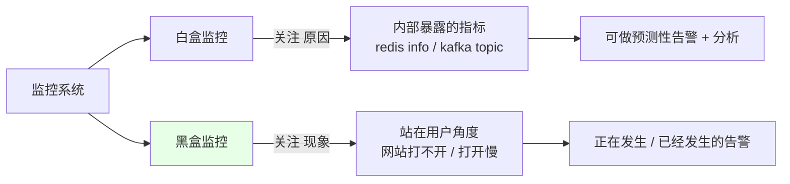
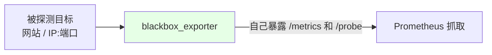
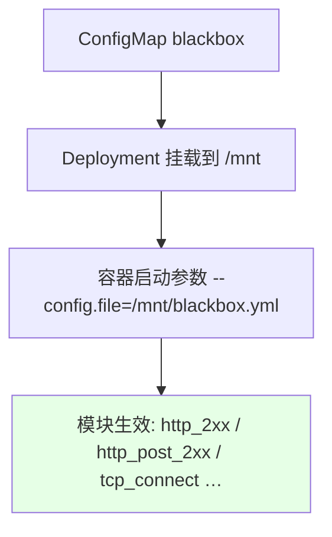
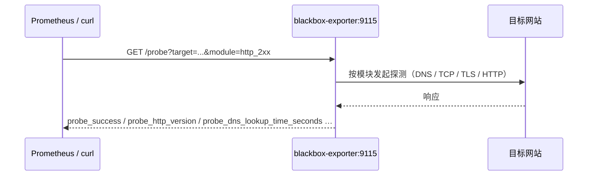
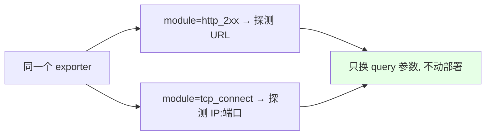

# Kubernetes 集群部署: Prometheus 黑盒监控（blackbox_exporter 部署与 URL / TCP 探测）

前面几节监控的都是**应用自己暴露出来的内部指标**（etcd、controller-manager、kafka_exporter 采集到的 topic 数据），这类叫白盒监控。这一节解决另一半：**站在用户角度，网站到底能不能打开、打开得慢不慢** —— 这就是黑盒监控。

结论先摆：

1. **Prometheus 官方已经写好了黑盒监控组件 `blackbox_exporter`**，不需要自己写；
2. 部署是三件套：**ConfigMap（定义探测模块）→ Deployment（挂配置 + 暴露 9115）→ Service**；
3. 用起来就是打个 HTTP 请求：`/probe?target=<目标>&module=<模块>`，返回 `probe_success`、`probe_http_version`、`probe_ip_protocol`、`probe_dns_lookup_time_seconds` 这些指标；
4. **换 module 就能换探测方式**：HTTP GET / POST、TCP 端口连通性、SSH  banner 等，都是同一个 exporter。

## 纲要

- 白盒监控与黑盒监控的分工
- blackbox_exporter 是什么
- 步骤一：用 ConfigMap 定义探测模块
- 步骤二：Deployment 挂载配置并暴露 9115
- 步骤三：用 Service 代理 9115
- 探测一个 URL：/probe 的用法与返回字段
- 换模块探测 TCP 端口
- 本节只讲安装，注册到下节课讲

## 白盒监控与黑盒监控的分工



| 维度 | 白盒监控 | 黑盒监控 |
| --- | --- | --- |
| 视角 | 站在**系统内部** | 站在**用户角度** |
| 数据来源 | 应用自己暴露的 metrics 接口 | 从**外面**探测（像用户一样发请求） |
| 关注什么 | **原因** | **现象** |
| 典型场景 | 监控 Redis 的内存、key 的大小；`redis info` 看到的运行状态；Kafka 的 topic 数据 | 网站打不开、网站打开慢、DNS 解析耗时高 |
| 告警形态 | 偏**预测性**告警，可做各种分析 | 偏**正在发生 / 已发生**的告警 |

> 类比测试里的白盒测试与黑盒测试：一个看内部实现，一个只看外部表现。

## blackbox_exporter 是什么



**Prometheus 官方提供的黑盒监控组件**，课程里用到的地址就是官方那份。它启动后监听 `9115`，你告诉它「探测谁、用哪个模块」，它就把探测结果以 Prometheus 指标的形式吐出来。

## 步骤一：用 ConfigMap 定义探测模块



配置文件叫 `blackbox.yml`，**里面全部是「模块」**。所谓模块就是**探测的方法**：

```yaml
apiVersion: v1
kind: ConfigMap
metadata:
  name: blackbox
  namespace: monitoring
data:
  blackbox.yml: |
    modules:
      http_2xx:                 # HTTP GET 探测
        prober: http
        http:
          method: GET
      http_post_2xx:            # HTTP POST 探测
        prober: http
        http:
          method: POST
      tcp_connect:              # TCP 端口连通性
        prober: tcp
      ssh_banner:               # SSH banner 探测
        prober: tcp
        tcp:
          query_response:
            - expect: "^SSH-2.0-"
```

| 模块 | 作用 |
| --- | --- |
| `http_2xx` | HTTP **GET** 探测（课程里直接用这个测网站） |
| `http_post_2xx` | HTTP **POST** 探测，参数写在模块里 |
| `tcp_connect` | TCP 探测，检查 **IP 地址 + 端口** 通不通 |
| `ssh_banner` | 连上去看 SSH banner |
| POP3 / SNMP 等 | 官方配置文件里还有更多，**按需取用即可** |

> 创建方式：直接在平台上以 **ConfigMap** 形式创建（课程里在 `monitoring` 这个 namespace 下建，名称沿用 `blackbox`）。**这个文件基本不用改**，官方给的默认模块就能用。

## 步骤二：Deployment 挂载配置并暴露 9115

```yaml
apiVersion: apps/v1
kind: Deployment
metadata:
  name: blackbox-exporter
  namespace: monitoring
  labels:
    app: blackbox-exporter
spec:
  replicas: 1                    # 副本数 1 个足够
  selector:
    matchLabels:
      app: blackbox-exporter
  template:
    metadata:
      labels:
        app: blackbox-exporter
    spec:
      containers:
        - name: blackbox-exporter
          image: prom/blackbox-exporter
          args:
            - --config.file=/mnt/blackbox.yml   # ← 指定上面那份 ConfigMap
          ports:
            - name: blackbox      # ← ServiceMonitor 要引用这个 name
              containerPort: 9115
          volumeMounts:
            - name: config
              mountPath: /mnt     # ← 挂载点
      volumes:
        - name: config
          configMap:
            name: blackbox
```

| 配置项 | 取值 | 说明 |
| --- | --- | --- |
| 镜像 | `prom/blackbox-exporter` | 官方镜像 |
| 启动参数 | `--config.file=/mnt/blackbox.yml` | 必须是 ConfigMap 挂进来的路径 |
| 端口 | `9115` | 默认监听端口 |
| 资源 | **不用给太大** | exporter 很轻 |
| 挂载 | ConfigMap → `/mnt` | 路径要和配置文件的文件名对上 |

## 步骤三：用 Service 代理 9115

```yaml
apiVersion: v1
kind: Service
metadata:
  name: blackbox-exporter
  namespace: monitoring
  labels:
    app: blackbox-exporter
spec:
  selector:
    app: blackbox-exporter
  ports:
    - name: blackbox
      port: 9115
      targetPort: 9115
```

```text
blackbox_exporter 部署的三件套（monitoring namespace）:

monitoring
├── ConfigMap  blackbox              ← 定义探测模块（http / tcp / ssh …）
├── Deployment blackbox-exporter     ← 挂 ConfigMap 到 /mnt，暴露 9115
└── Service    blackbox-exporter     ← 代理 9115，供 Prometheus / 手动 curl 探测
```

> 课程里是从平台导出 yaml 再创建的，**多余字段（`configMap` 之外的杂项、Service 里的无用片段）建议删掉** —— 不删也能创建成功，但清干净更好维护。创建完看一眼 Pod 日志确认正常启动。

## 探测一个 URL：/probe 的用法与返回字段



官方给的示例是探测 `google.com`，**国内访问不了，换成百度**即可：

```bash
NS=monitoring
SVC=blackbox-exporter

kubectl run curl-test --rm -it --image=curlimages/curl --restart=Never -n $NS -- \
  curl -s "http://${SVC}.${NS}:9115/probe?target=https://www.baidu.com&module=http_2xx"
```

返回的关键字段：

```text
# 探测是否成功：1 = 在线
probe_success 1

# 使用的 IP 协议：4 = IPv4
probe_ip_protocol 4

# SSL 是否启用
probe_ssl_earliest_cert_expiry ...

# HTTP 版本
probe_http_version 1.1

# DNS 解析耗时
probe_dns_lookup_time_seconds 0.00xxx
```

| 返回字段 | 含义 |
| --- | --- |
| `probe_success` | 探测成功与否，`1` 表示在线 |
| `probe_ip_protocol` | IP 协议版本（`4` = IPv4） |
| `probe_http_version` | 对端返回的 HTTP 版本 |
| `probe_dns_lookup_time_seconds` | DNS 解析耗时 |
| SSL 相关字段 | 证书是否启用、有效期 |

> **把 target 换成自己的业务应用地址或其他接口，就能直接监控自己的服务**，不用改任何代码。

## 换模块探测 TCP 端口



**不同探测方式只体现在 `module` 参数上**，exporter 本身不用重装：

```bash
NS=monitoring
SVC=blackbox-exporter
TARGET=10.0.0.10:3306

kubectl run curl-test --rm -it --image=curlimages/curl --restart=Never -n $NS -- \
  curl -s "http://${SVC}.${NS}:9115/probe?target=${TARGET}&module=tcp_connect"
```

> 本节**只讲安装 + 手动探测**。把它注册进 Prometheus 的方式下节课讲 —— 而且下节课不是用 ServiceMonitor，**是按传统配置方式手写配置文件**去监控应用。

## API 速览

| 能力 | 做法 |
| --- | --- |
| 黑盒监控组件 | 官方 `prom/blackbox-exporter` |
| 定义探测方法 | ConfigMap 里的 `blackbox.yml` → `modules` |
| 常用模块 | `http_2xx`（GET）、`http_post_2xx`（POST）、`tcp_connect`（IP:端口）、`ssh_banner` |
| 配置文件挂载 | ConfigMap → `/mnt`，启动参数 `--config.file=/mnt/blackbox.yml` |
| 端口 | `9115`（Deployment 容器端口 + Service 端口） |
| 探测入口 | `http://<svc>:9115/probe?target=<目标>&module=<模块>` |
| 成功判定 | `probe_success 1` |
| 延迟判定 | `probe_dns_lookup_time_seconds` / `probe_duration_seconds` |
| 换探测方式 | **只改 `module` 参数，不用重新部署** |

## Demo 示例

```bash
NS=monitoring

# 1. 创建 ConfigMap（blackbox.yml 里定义探测模块）
kubectl create configmap blackbox \
  --from-file=blackbox.yml=./blackbox.yml -n $NS
kubectl get cm blackbox -n $NS

# 2. 部署 Deployment（挂配置 + 暴露 9115）
kubectl apply -f blackbox-exporter-deploy.yaml -n $NS
kubectl get pod -n $NS | grep blackbox

# 3. 建 Service
kubectl apply -f blackbox-exporter-svc.yaml -n $NS
kubectl get svc blackbox-exporter -n $NS

# 4. 看启动日志，确认配置加载成功
kubectl logs -n $NS deploy/blackbox-exporter

# 5. 探一个 URL（国内把官方示例的 google.com 换成 baidu.com）
kubectl run curl-test --rm -it --image=curlimages/curl --restart=Never -n $NS -- \
  curl -s "http://blackbox-exporter.${NS}:9115/probe?target=https://www.baidu.com&module=http_2xx"

# 6. 换成 TCP 端口探测，只改 module 和 target
kubectl run curl-test --rm -it --image=curlimages/curl --restart=Never -n $NS -- \
  curl -s "http://blackbox-exporter.${NS}:9115/probe?target=10.0.0.10:3306&module=tcp_connect"
```

### 总结

- **白盒监控看原因、黑盒监控看现象**：白盒是应用自己暴露的内部指标（Redis 的内存与 key 大小、`redis info` 的运行状态、Kafka 的 topic 数据），偏预测性告警与分析；黑盒是**站在用户角度**从外面探测（网站打不开、打开慢、DNS 解析慢），偏「正在发生 / 已发生」的告警；
- **黑盒监控不用自己写**，Prometheus 官方提供的 `blackbox_exporter` 直接部署即可，监听 `9115`；
- **部署三件套**：ConfigMap（定义 modules → 探测方法）→ Deployment（挂到 `/mnt` + `--config.file=/mnt/blackbox.yml` + 暴露 9115）→ Service（代理 9115），副本 1 个、资源不用给太大；
- **配置文件基本不用改**，官方默认模块就有 HTTP GET / POST、TCP、SSH、POP3、SNMP 等，按需取用；导出 yaml 时**建议删掉多余字段**再创建；
- **用法就是一个 HTTP 请求**：`/probe?target=<目标>&module=<模块>`，返回 `probe_success`（1 = 在线）、`probe_ip_protocol`、`probe_http_version`、`probe_dns_lookup_time_seconds` 等字段；把 target 换成自己的业务地址就能监控自己的服务；
- **换探测方式只改 `module` 参数**（URL 用 `http_2xx`，IP:端口用 `tcp_connect`），不需要重新部署 exporter；本节只讲安装与手动探测，注册进 Prometheus 的方式下节课按**传统配置方式**讲。

