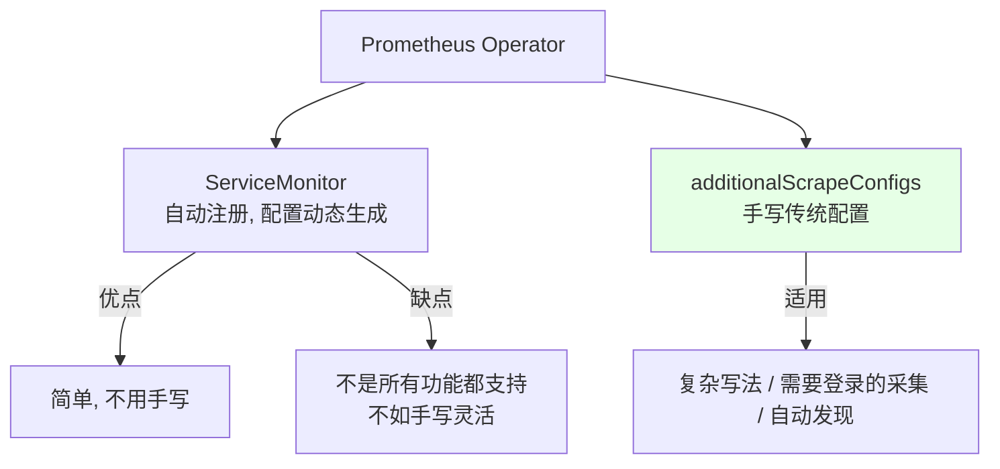
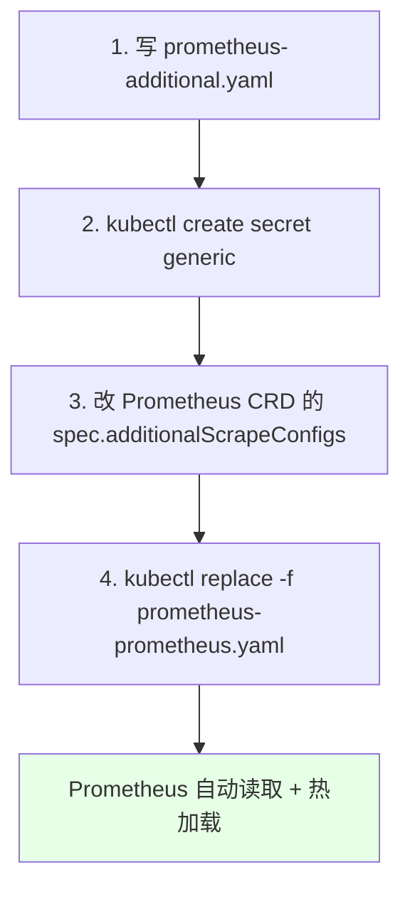
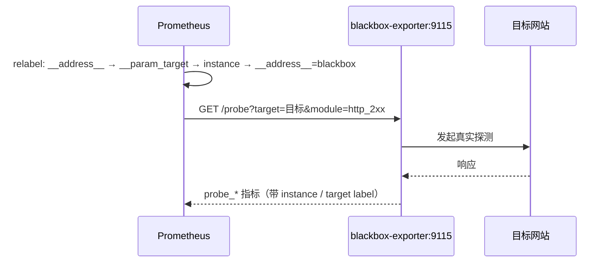
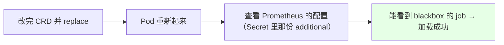
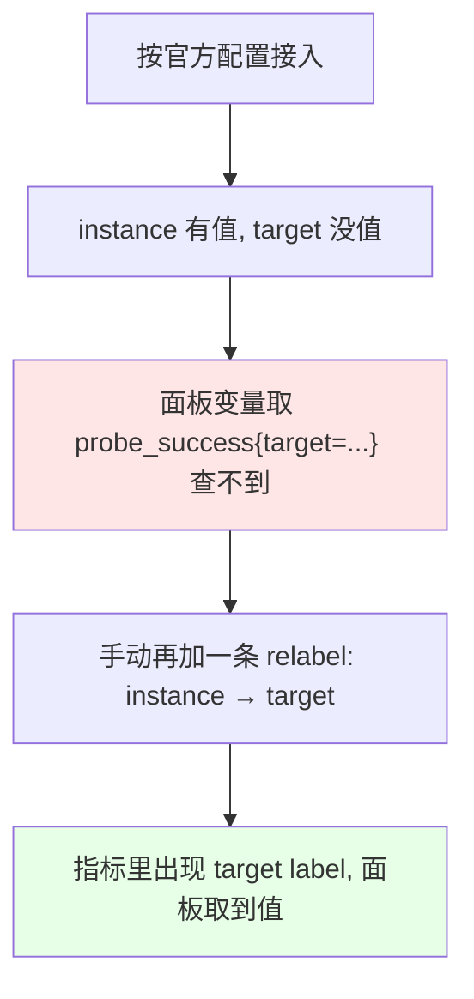
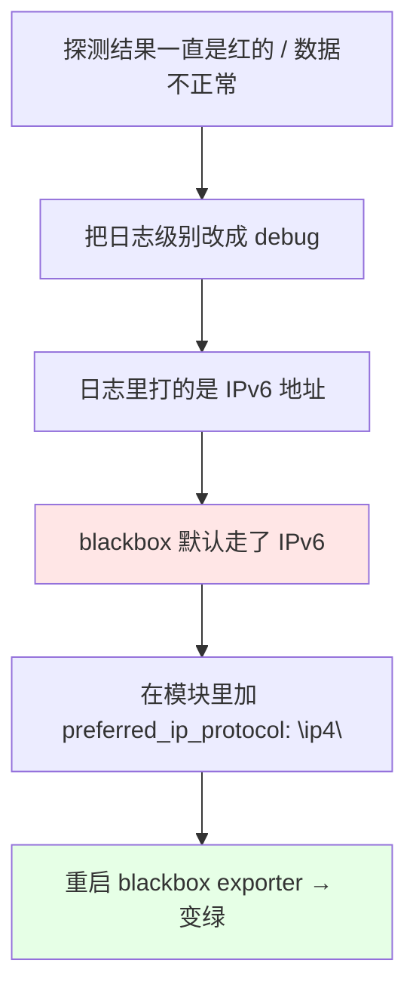
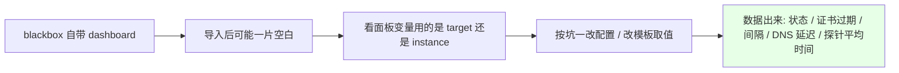

# Kubernetes 集群部署: Prometheus 传统配置方式（additionalScrapeConfigs 接入黑盒监控）

上一节把 `blackbox_exporter` 部署起来了，但**还没把它注册进 Prometheus**。这一节就干这件事，而且**不用 ServiceMonitor**，走的是 Prometheus Operator 的 **`additionalScrapeConfigs`** —— 也就是把你手写的传统 `prometheus.yml` 片段塞进 Operator 管理的 Prometheus 里。

结论先摆：

1. **ServiceMonitor 是自动注册的**，配置由 Operator 动态生成，简单场景够用；但**它不是所有功能都支持，也不如手写灵活**（复杂写法、需要登录的采集、自动发现等），所以 Operator 留了 `additionalScrapeConfigs` 这个口子；
2. 用法四步：**写传统配置 yaml → 存成 Secret → 改 Prometheus 这个 CRD 的 `spec.additionalScrapeConfigs` → `replace` 生效**；
3. 黑盒监控的配置核心是 **`relabel_configs` 三段**：把目标地址塞进 `param_target`，把 `param_target` 抄给 `instance`，最后把 `__address__` 替换成 blackbox exporter 的地址；
4. **两个实踩的坑**：① 官方配置下 `target` 这个 label 取不到值（版本问题），得**再手动加一条 relabel**；② blackbox 走 **IPv6** 导致指标异常，必须在模块里加 `preferred_ip_protocol`。

## 纲要

- 为什么还需要传统配置方式
- additionalScrapeConfigs 的四步接入
- 步骤一：写黑盒监控的传统配置
- 步骤二：存成 Secret
- 步骤三：改 Prometheus CRD 并 replace
- 验证配置被加载
- 坑一：target label 取不到值
- 坑二：IPv6 导致指标异常
- Grafana 面板与告警阈值
- 多区域部署的思路

## 为什么还需要传统配置方式



| 方式 | 谁生成配置 | 优点 | 局限 |
| --- | --- | --- | --- |
| ServiceMonitor | Prometheus Operator 自动 | 简单，改 CR 即可，不用手写配置文件 | **不是所有功能都支持**，复杂写法不如手写灵活 |
| `additionalScrapeConfigs` | **自己手写** | 熟悉、灵活，和自建 Prometheus 写法一致 | 需要自己懂传统配置语法 |

> 如果之前自己装过 Prometheus、写过 `prometheus.yml`，`additionalScrapeConfigs` 会非常亲切 —— **它就是你熟悉的那套 `scrape_configs`**。

## additionalScrapeConfigs 的四步接入



```text
接入链路:

prometheus-additional.yaml        (手写的传统 scrape_configs)
        │
        ├──> Secret  additional-scrape-configs        ← --from-file 存进来
        │
        └──> Prometheus CRD
                spec:
                  additionalScrapeConfigs:
                    name: additional-scrape-configs   ← Secret 名
                    key:  prometheus-additional.yaml  ← Secret 里的 key
```

## 步骤一：写黑盒监控的传统配置

文件名 `prometheus-additional.yaml`，内容就是传统 Prometheus 配置：

```yaml
- job_name: 'blackbox'
  metrics_path: /probe
  params:
    module: [http_2xx]
  static_configs:
    - targets:
        - https://www.baidu.com
  relabel_configs:
    # 1. 把目标地址赋值给 __param_target（作为 /probe 的 target 参数）
    - source_labels: [__address__]
      target_label: __param_target
    # 2. 把 __param_target 的值抄给 instance（让面板能看到域名）
    - source_labels: [__param_target]
      target_label: instance
    # 3. 把真正的请求地址改成 blackbox exporter 的地址
    - target_label: __address__
      replacement: blackbox-exporter.monitoring.svc:9115
```



| relabel 段 | 作用 |
| --- | --- |
| `__address__` → `__param_target` | 把目标地址变成 `/probe` 的 **target 参数** |
| `__param_target` → `instance` | 让指标带上可读的域名 label |
| `replacement` → `__address__` | **不改这句 Prometheus 就会直接请求目标网站**，而不是请求 blackbox；必须改成 exporter 的地址 |
| 同 namespace | blackbox 和 Prometheus 在一个 namespace，**直接写 Service 名即可** |

> 官方文档给的写法就是这样。**改配置时注意别用 `delete` + `create`**（数据会丢），直接 `replace` 同一份 yaml。

## 步骤二：存成 Secret

```bash
NS=monitoring
CONFIG_FILE=prometheus-additional.yaml
SECRET_NAME=additional-scrape-configs

kubectl create secret generic $SECRET_NAME \
  --from-file=${CONFIG_FILE} -n $NS

kubectl get secret $SECRET_NAME -n $NS
```

> 生成的 Secret 里，**key 就是文件名**（`prometheus-additional.yaml`），下一步 CRD 里要填的就是这个 key。

## 步骤三：改 Prometheus CRD 并 replace

Prometheus 这个资源**不是 Kubernetes 自带的**，是 Operator 通过 **CRD** 扩展出来的。

```yaml
apiVersion: monitoring.coreos.com/v1
kind: Prometheus
metadata:
  name: k8s
  namespace: monitoring
spec:
  # … 原有配置保持不变 …
  additionalScrapeConfigs:
    name: additional-scrape-configs      # ← Secret 名称
    key: prometheus-additional.yaml      # ← Secret 里的 key
```

```bash
NS=monitoring
PROM_FILE=prometheus-prometheus.yaml

kubectl get -n $NS prometheus
kubectl replace -f $PROM_FILE -n $NS

# 等 Pod 重新起来（Prometheus 没有做数据持久化，重启会丢数据）
kubectl get pod -n $NS | grep prometheus
```

> **别用 `delete` 重建**：课程里明确说「没有做数据持久化，一删数据就没了」，用 `replace` 覆盖即可。

## 验证配置被加载



```bash
NS=monitoring

# 看 additional 配置有没有被加载进来
kubectl get secret prometheus-k8s-additional -n $NS \
  -o jsonpath='{.data.prometheus-additional\.yaml}' | base64 -d

# 看 Prometheus 是否完成热加载（配置写错会在这里打印报错）
kubectl logs -n $NS prometheus-k8s-0 -c prometheus | grep -i reload
```

- 黑盒监控的指标**都以 `probe_` 开头**，加载成功后就能查到 `probe_dns_lookup_time_seconds`、`probe_success` 等；
- **配置改完不会立刻生效**：Operator 的 ConfigMap/Secret 更新有刷新间隔，改完正好错过一次更新就要等下一轮，**需要耐心等一会儿**；
- **写错的话去 Prometheus 容器里看 reload 日志**，报错会直接打出来，比瞎猜快。

## 坑一：target label 取不到值



课程里的现象：**`instance` 已经赋值成功，但 `target` 没有**（怀疑是版本问题，官方配置没把参数正确传给 `target`），于是面板里 `target` 变量取不到值，图全空。

修法：**再手动补一条 relabel**，把 `instance` 的值抄给 `target`：

```yaml
  relabel_configs:
    - source_labels: [__address__]
      target_label: __param_target
    - source_labels: [__param_target]
      target_label: instance
    # ↓ 新增：官方配置下 target 取不到值，手动补一条
    - source_labels: [instance]
      target_label: target
    - target_label: __address__
      replacement: blackbox-exporter.monitoring.svc:9115
```

> 加了这条之后，指标里就会生成一个**带 `target` 的 label**，面板用 `probe_success{target="..."}` 就能取到值了。也可以不改配置、**直接改面板的模板取值**（把变量从 `target` 换成 `instance`），同样能用。

## 坑二：IPv6 导致指标异常



一开始以为是版本问题，把日志级别改成 `debug` 才看出来 —— **日志里打的是 IPv6**，环境里 IPv6 不通，导致部分监控项获取不到。

修法：在 ConfigMap 的模块里加 `preferred_ip_protocol`：

```yaml
apiVersion: v1
kind: ConfigMap
metadata:
  name: blackbox
  namespace: monitoring
data:
  blackbox.yml: |
    modules:
      http_2xx:
        prober: http
        timeout: 10s
        http:
          method: GET
          preferred_ip_protocol: "ip4"    # ← 强制走 IPv4，不加会走 IPv6
      tcp_connect:
        prober: tcp
        timeout: 10s
        tcp:
          preferred_ip_protocol: "ip4"
```

```bash
NS=monitoring

# 改完 ConfigMap：blackbox 不会热加载配置，必须重启
kubectl rollout restart deploy/blackbox-exporter -n $NS
kubectl get pod -n $NS | grep blackbox

# 再看指标：状态 UP、证书已启用、DNS 延迟、探针平均时间都有了
```

| 组件 | 改配置后要不要重启 |
| --- | --- |
| Prometheus（additional 配置） | **不用**，Operator 会自动热加载，只是有刷新间隔 |
| blackbox_exporter（ConfigMap） | **要重启**，它自己不会热加载配置 |

## Grafana 面板与告警阈值



- **黑盒监控有自己的 dashboard**，直接去 Grafana 官网找现成的导入即可，不需要自己写；
- 导入后如果没数据，**按上节那个套路排查**：看面板变量（Templating）取的是哪个 label，到 metrics 里确认有没有值；
- 面板能看到的指标：**状态（UP / 连通）、证书是否启用与过期时间、调用间隔、DNS 延迟、探针平均时间**；
- **告警阈值参考**：探针时间超过 **2 秒或 3 秒**就该告警了 —— 「一个网站 5 秒钟还打不开，那就废了」。
- 顺带一句：**Grafana 建议找台裸机部署，别放容器里** —— 不常看、面板又经常改，放容器里没做持久化的话改配置很麻烦。

## 多区域部署的思路

```text
多机房 / 多区域的黑盒监控:

中心 Prometheus
├── 本区域 blackbox_exporter（集群内部署，本节的做法）
├── A 机房 blackbox_exporter     ← 二进制包直接起
├── B 机房 blackbox_exporter     ← 二进制包直接起
└── C 机房 blackbox_exporter     ← 二进制包直接起

排查价值:
└── A 地区可用 / B 地区不可用
    └── 能断定「不是服务出了问题, 而是 B 区域自身的问题」
```

**blackbox_exporter 可以直接用二进制文件起**（下载二进制包直接跑），不一定非要放容器里。服务器遍布多地时，**每个区域各搭一个 blackbox**，由中心 Prometheus 去调用 —— 这样出现「A 地区服务可用、B 地区不可用」时能立刻定位是区域问题还是服务问题，排查价值很高。

## API 速览

| 能力 | 做法 |
| --- | --- |
| 接入传统配置 | `spec.additionalScrapeConfigs`（name + key） |
| 配置载体 | Secret（`--from-file=<文件名>`，key = 文件名） |
| 生效方式 | `kubectl replace -f prometheus-prometheus.yaml`（**别 delete**） |
| 黑盒 job 关键字段 | `metrics_path: /probe` + `params.module` + `static_configs.targets` |
| 核心 relabel 1 | `__address__` → `__param_target` |
| 核心 relabel 2 | `__param_target` → `instance` |
| 核心 relabel 3 | `target_label: __address__` + `replacement: blackbox 地址` |
| 补坑 relabel | `instance` → `target`（官方配置下 target 取不到值） |
| 强制 IPv4 | 模块里加 `http.preferred_ip_protocol: "ip4"` |
| 配置热加载 | Prometheus **自动**；blackbox **要 rollout restart** |
| 写错排查 | 看 Prometheus 容器的 reload 日志 |
| 指标前缀 | `probe_`（`probe_success` / `probe_dns_lookup_time_seconds` …） |

## Demo 示例

```bash
NS=monitoring
SECRET_NAME=additional-scrape-configs

# 1. 写传统配置文件（黑盒监控 job）
cat > prometheus-additional.yaml <<'EOF'
- job_name: 'blackbox'
  metrics_path: /probe
  params:
    module: [http_2xx]
  static_configs:
    - targets:
        - https://www.baidu.com
  relabel_configs:
    - source_labels: [__address__]
      target_label: __param_target
    - source_labels: [__param_target]
      target_label: instance
    - source_labels: [instance]
      target_label: target
    - target_label: __address__
      replacement: blackbox-exporter.monitoring.svc:9115
EOF

# 2. 存成 Secret
kubectl create secret generic $SECRET_NAME \
  --from-file=prometheus-additional.yaml -n $NS

# 3. 改 Prometheus CRD，加上 additionalScrapeConfigs
kubectl edit -n $NS prometheus k8s

# 4. 用 replace 生效（别 delete，没做持久化会丢数据）
kubectl replace -f prometheus-prometheus.yaml -n $NS
kubectl get pod -n $NS | grep prometheus

# 5. 确认配置被加载
kubectl get secret prometheus-k8s-additional -n $NS \
  -o jsonpath='{.data.prometheus-additional\.yaml}' | base64 -d

# 6. 排查热加载报错
kubectl logs -n $NS prometheus-k8s-0 -c prometheus | grep -i reload

# 7. 强制 IPv4（改 blackbox 的 ConfigMap 后必须重启）
kubectl edit cm blackbox -n $NS
kubectl rollout restart deploy/blackbox-exporter -n $NS

# 8. 查指标是否带上了 target / instance
kubectl run curl-test --rm -it --image=curlimages/curl --restart=Never -n $NS -- \
  curl -s "http://blackbox-exporter.${NS}:9115/probe?target=https://www.baidu.com&module=http_2xx" | grep probe_
```

### 总结

- **ServiceMonitor 是 Operator 自动注册、动态生成配置的**，简单场景够用，但**不是所有功能都支持、也不如手写灵活**；复杂写法、需要登录的采集、自动发现这类场景，要用 Operator 留的口子 **`additionalScrapeConfigs`**（就是手写的传统 `scrape_configs`）；
- **接入四步**：写 `prometheus-additional.yaml` → `kubectl create secret generic`（key 就是文件名）→ 改 Prometheus CRD 的 `spec.additionalScrapeConfigs`（name + key）→ `kubectl replace` 生效；**千万别 delete 重建**，没做持久化会丢数据；
- **黑盒 job 的核心是三段 relabel**：目标地址 → `__param_target`（作为 `/probe` 的 target 参数）→ 抄给 `instance` → 最后把 `__address__` 替换成 blackbox exporter 的地址（**不换这句 Prometheus 会直接去请求目标网站**）；
- **坑一：`target` label 取不到值**（`instance` 有值但 `target` 没有，怀疑是版本问题）→ 手动补一条 `instance` → `target` 的 relabel，或者**改面板模板把变量从 `target` 换成 `instance`**；
- **坑二：blackbox 默认走了 IPv6** 导致探测一直是红的 → 模块里加 `preferred_ip_protocol: "ip4"`，**并且要 `rollout restart`**（blackbox 不热加载，Prometheus 会自动热加载但有刷新间隔，改完要等）；
- **面板与告警**：blackbox 有现成的官方 dashboard，导入后按「查面板变量用的 label 在 metrics 里有没有值」的老套路排查；**探针时间超过 2~3 秒就该告警**（网站 5 秒打不开基本就废了）；Grafana 建议裸机部署，不放容器；
- **多区域部署**：blackbox 可以用二进制直接起，各机房各搭一个由中心 Prometheus 调用，出现「A 地区可用、B 地区不可用」时能立刻断定是区域问题而非服务问题。

