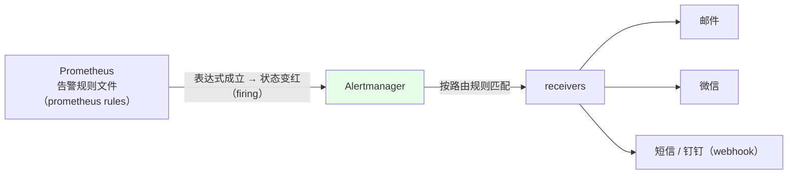
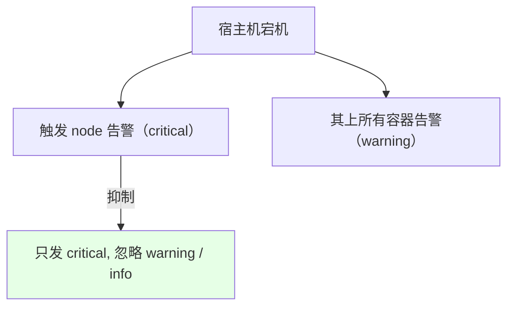
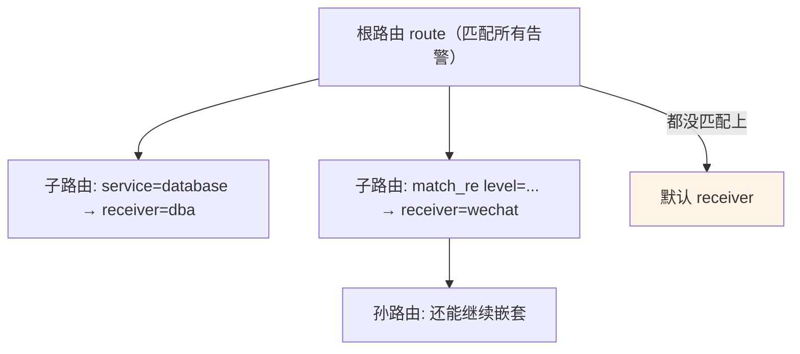
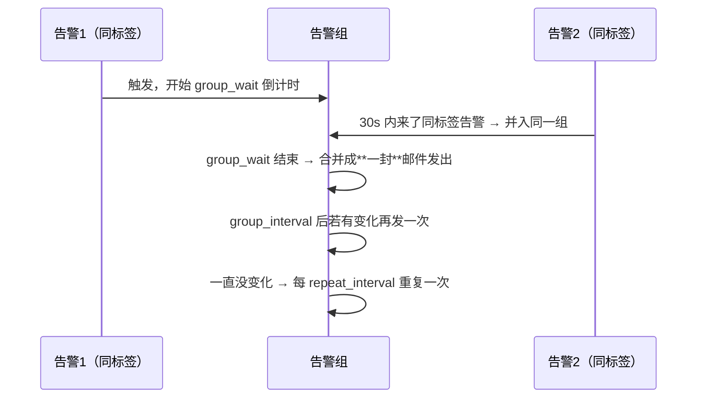
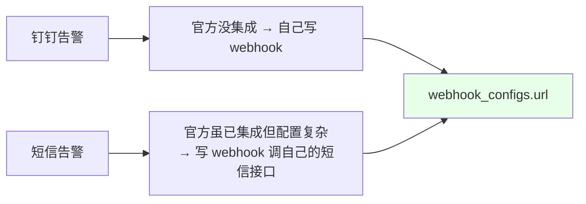

# Kubernetes 集群部署: Alertmanager 入门（告警路由、分组、抑制与收件人配置）

监控配完了，接下来是**告警怎么到人手里**。这一节讲 Alertmanager：它是 Prometheus 生态里专门负责「把告警通过邮件 / 微信 / 短信等介质发给对应的人」的组件。

结论先摆：

1. **Prometheus 负责判定告警（规则 + 表达式），Alertmanager 负责发送告警** —— 两者是分开的组件；用 Operator 搭完之后，**告警规则其实已经配好了，只是没配介质，所以你收不到**，配个 receiver 就能收到；
2. Alertmanager 的配置就四块：**`global`（全局介质）、`inhibit_rules`（告警抑制）、`route`（路由分发）、`receivers`（收件人）**；
3. **路由是树形结构**：根路由必须匹配所有告警（一般只写 `alertname` 这种必然存在的标签），再由子路由按标签分发给不同的人（数据库告警给 DBA，前端告警给前端）；
4. **分组（`group_by` + `group_wait`）是防止邮件轰炸的关键**：同类型告警攒成一组，用一封邮件发出去。

## 纲要

- Prometheus 与 Alertmanager 的分工
- 配置文件在哪：Operator 下的 Secret
- global：全局介质配置
- inhibit_rules：告警抑制
- route：根路由与子路由
- group_by / group_wait / group_interval / repeat_interval
- receivers：邮件 / 微信 / webhook
- 没有集成的介质怎么办
- 告警规则（PrometheusRule）怎么配

## Prometheus 与 Alertmanager 的分工



| 组件 | 职责 |
| --- | --- |
| Prometheus | 加载告警规则文件，**用 PromQL 表达式判定是否触发**（触发后在界面上就是红色 / firing 状态） |
| Alertmanager | **独立的 Prometheus 组件**，按路由规则和告警规则，通过不同介质把告警发给指定的人 |

> 用 Operator 部署完之后，**告警那一套其实已经配置完成了**，只是没有配接收介质，所以收不到 —— 补上 receiver 即可。

## 配置文件在哪：Operator 下的 Secret

```text
Operator 部署下的 Alertmanager 配置位置:

monitoring namespace
└── Secret  alertmanager-main
        └── key: alertmanager.yaml        ← 就是 Alertmanager 的完整配置

配置文件的四大块:
├── global            ← 全局配置（邮箱 / 微信 / 短信等介质）
├── inhibit_rules     ← 告警抑制（严重的忽略不严重的）
├── route             ← 告警路由（根路由 + 可多层嵌套的子路由）
└── receivers         ← 收件人（邮件 / 微信 / webhook / slack …）
```

```bash
NS=monitoring

# 看配置（Secret 里是 base64）
kubectl get secret alertmanager-main -n $NS \
  -o jsonpath='{.data.alertmanager\.yaml}' | base64 -d

# 改完回写
kubectl create secret generic alertmanager-main \
  --from-file=alertmanager.yaml -n $NS \
  --dry-run=client -o yaml | kubectl apply -f -
```

## global：全局介质配置

```yaml
global:
  # 告警组在这么久没有再触发后，自动置为 resolve（不再告警）
  resolve_timeout: 1h

  # 邮件告警
  smtp_smarthost: 'smtp.example.com:465'
  smtp_from: 'alert@example.com'
  smtp_auth_username: 'alert@example.com'
  smtp_auth_password: '邮箱授权码'
  smtp_require_tls: false

  # 企业微信告警
  wechat_api_url: 'https://qyapi.weixin.qq.com/cgi-bin/'
  wechat_api_corp_id: '企业微信 corp id'
  wechat_api_secret: '企业微信 secret'
```

| 参数 | 说明 |
| --- | --- |
| `resolve_timeout` | 比如设为 `1h`：告警组**一小时内没有再次触发**就置为已解决状态，不再告警（课程里的 `watchdog` 一直红色，就是靠这个收敛） |
| 邮件段 | `smtp_smarthost` / `smtp_from` / 账号 / 授权码 |
| 微信段 | 走**企业微信**，`wechat_api_url` + `corp_id` + `secret` |
| 自定义模板 | `templates` 段可以指定自己的告警模板 —— **但官方自带的模板已经挺全了，一般没必要自己写** |

> `global` 里配的是**全局默认值**，下面 `receiver` 里可以逐条覆盖。

## inhibit_rules：告警抑制



**告警抑制相当于「清理」：有更严重的告警时，忽略掉不严重的告警。**

```yaml
inhibit_rules:
  - source_match:
      severity: critical
    target_match:
      severity: warning
    equal: ['alertname', 'instance']
  - source_match:
      severity: warning
    target_match:
      severity: info
    equal: ['alertname', 'instance']
```

| 规则 | 效果 |
| --- | --- |
| `critical` → 忽略 `warning` | 有 critical 级别告警时，同类的 warning 不再发 |
| `warning` → 忽略 `info` | 有 warning 级别告警时，同类的 info 不再发 |
| `equal` | **三个值都相等**才算同一类告警，才会被抑制 |

> 典型场景：宿主机挂掉必然引起它上面所有容器告警，但我们**只想知道「node 宕机」这一件事**，容器那一堆告警就用抑制规则压掉。

## route：根路由与子路由



```yaml
route:
  group_by: ['alertname']      # 按哪个 label 分组
  group_wait: 30s              # 组内第一个告警先等 30s
  group_interval: 5m           # 组有变化时多久再发一次
  repeat_interval: 12h         # 组无变化时多久重复一次
  receiver: 'wechat'           # 默认收件人
  routes:
    - match:
        service: database
      receiver: 'dba'
    - match_re:
        level: 'a|b|c'         # 正则匹配
      receiver: 'wechat'
```

| 字段 | 说明 |
| --- | --- |
| 根路由 | **必须匹配所有告警**，否则会丢告警。写简单点，比如只写 `job` 或一个必然存在的 `alertname` |
| `match` | **绝对匹配** |
| `match_re` | **正则匹配** |
| 嵌套 | 子路由下面**还能再套子路由**，可以多层嵌套 |
| 分发逻辑 | 数据库告警发给 DBA，前端告警发给前端 —— 就是这个意思 |
| 默认 receiver | 没有任何子路由匹配上的告警，发给根路由指定的默认收件人 |

## group_by / group_wait / group_interval / repeat_interval



| 参数 | 作用 | 课程给的参考值 |
| --- | --- | --- |
| `group_by` | 按哪些 label 的值分成一个组 | `alertname` |
| `group_wait` | 组里第一个告警先**等多少秒**，期间来的同标签告警并入该组，**一起发一封** | `30s` |
| `group_interval` | 组**有变化**时，多久再发一次 | `5m` |
| `repeat_interval` | 组**没有变化**、状态也没被置为 resolve 时，多久重复发一次 | `12h` |
| `resolve_timeout` | 多久没再触发就置为 resolve | `1h` |

> **分组是 Alertmanager 做得比较好的一点**：收到一个告警就直接发一封邮件，很容易造成**邮件轰炸**；把多个同类型告警放进一个 group 用同一封邮件发出去，这个能力 Alertmanager 有而 elk 那套没有。

## receivers：邮件 / 微信 / webhook

```yaml
receivers:
  # 邮件告警
  - name: 'mail'
    email_configs:
      - to: 'ops@example.com'
        send_resolved: true        # 告警恢复后是否发「已解决」通知，一般设 true

  # 企业微信告警
  - name: 'wechat'
    wechat_configs:
      - to_user: '@all'
        agent_id: '企业微信应用 ID'
        api_secret: '企业微信 secret'
        send_resolved: true

  # 数据库告警专用收件人
  - name: 'dba'
    email_configs:
      - to: 'dba@example.com'
        send_resolved: true

  # 通用 webhook
  - name: 'webhook'
    webhook_configs:
      - url: 'http://your-service/hook'
        send_resolved: true
```

| 介质 | 配置段 | 备注 |
| --- | --- | --- |
| 邮件 | `email_configs` | 配 `to` + `send_resolved` |
| 企业微信 | `wechat_configs` | **Alertmanager 已集成微信告警**，注册一个企业微信即可 |
| Slack | `slack_configs` | 官方支持 |
| Webhook | `webhook_configs` | 自己写服务接收 |

> `send_resolved: true` 表示**告警解决后也发一条「已解决」通知**，一般都会设成 true。

## 没有集成的介质怎么办



- **微信**：官方已经集成，配 `wechat_configs` 即可（课程里先讲邮件告警，再讲微信告警）；
- **钉钉**：**Alertmanager 没有集成钉钉**，只能自己写一个 webhook 服务去实现；
- **短信**：虽然好像已经集成了，但配置比较复杂，**更常见的做法是写一个 webhook 去调用自己的短信接口**。

> 企业里最常用的就是**短信、微信、邮件**这三种。

## 告警规则（PrometheusRule）怎么配

```yaml
apiVersion: monitoring.coreos.com/v1
kind: PrometheusRule
metadata:
  name: node-rules
  namespace: monitoring
  labels:
    role: alert-rules          # ← 要能被 Prometheus 的 ruleSelector 选中
spec:
  groups:
    - name: node
      rules:
        - alert: NodeDown                        # 告警名称
          expr: up{job="node-exporter"} == 0     # PromQL 表达式
          for: 1m                                # 等待时间（持续多久才真正触发）
          labels:
            severity: critical                   # ← 给 Alertmanager 路由匹配用
            service: node
          annotations:
            summary: 节点不可达
            description: 节点已经 down 超过 1 分钟
```

| 字段 | 说明 |
| --- | --- |
| `alert` | 告警名称 |
| `expr` | **PromQL 表达式**（就是前面讲的查询语法）：延迟、服务器宕机、容量不可达都能写成表达式 |
| `for` | **等待时间**。表达式一成立本来会立刻触发，设个等待时间可以过滤误判 —— **告警越严重，`for` 越短** |
| `labels` | 自定义标签，比如 `service: database`；**这些标签就是 Alertmanager 路由里 `match` / `match_re` 要匹配的东西** |
| `annotations` | 告警信息，会原样出现在邮件 / 短信通知里 |

## API 速览

| 能力 | 做法 |
| --- | --- |
| 改配置 | 改 `monitoring` 下的 Secret `alertmanager-main`（key = `alertmanager.yaml`） |
| 全局介质 | `global` 段（smtp / wechat / `resolve_timeout`） |
| 抑制告警 | `inhibit_rules`（`source_match` 严重的 → `target_match` 不严重的 + `equal`） |
| 路由 | `route`（根路由匹配全部） + `routes`（子路由可多层嵌套） |
| 匹配方式 | `match` 绝对匹配 / `match_re` 正则匹配 |
| 防轰炸 | `group_by` + `group_wait` 合并同组告警成一封 |
| 重复发送 | `repeat_interval`（如 `12h`） |
| 自动恢复 | `resolve_timeout`（如 `1h`） |
| 收件人 | `receivers`（`email_configs` / `wechat_configs` / `slack_configs` / `webhook_configs`） |
| 恢复通知 | `send_resolved: true` |
| 自定义介质 | 自己写 webhook（钉钉、短信） |
| 告警规则 | `PrometheusRule` 的 `alert` / `expr` / `for` / `labels` / `annotations` |

## Demo 示例

```bash
NS=monitoring

# 1. 查看当前 Alertmanager 配置
kubectl get secret alertmanager-main -n $NS \
  -o jsonpath='{.data.alertmanager\.yaml}' | base64 -d

# 2. 导出到本地改
kubectl get secret alertmanager-main -n $NS \
  -o jsonpath='{.data.alertmanager\.yaml}' | base64 -d > alertmanager.yaml

# 3. 改完回写（用 dry-run + apply 覆盖，别直接 delete）
kubectl create secret generic alertmanager-main \
  --from-file=alertmanager.yaml -n $NS \
  --dry-run=client -o yaml | kubectl apply -f -

# 4. 确认 Alertmanager 已重新加载配置
kubectl logs -n $NS alertmanager-main-0 | tail -20

# 5. 看 Prometheus 侧已经加载的告警规则（Operator 默认已配好一批）
kubectl get prometheusrule -n $NS

# 6. 加一条自己的告警规则
kubectl apply -f node-rules.yaml -n $NS
kubectl get prometheusrule node-rules -n $NS -o yaml

# 7. 触发/查看告警状态（界面上红色 = firing）
#    再到 Alertmanager 页面看是否被正确路由到对应 receiver
```

### 总结

- **Prometheus 负责判定告警、Alertmanager 负责发送告警**，两者是分开的组件；Operator 部署完之后**告警规则其实已经配好了，只是没配介质（receiver）所以收不到**，补上即可；
- **配置文件在 `monitoring` 下的 Secret `alertmanager-main`（key 为 `alertmanager.yaml`）**，四块结构：`global`（全局介质 + `resolve_timeout`）、`inhibit_rules`（抑制）、`route`（路由）、`receivers`（收件人）；改完用 `dry-run + apply` 回写；
- **告警抑制就是「严重的忽略不严重的」**：`critical` 抑制 `warning`、`warning` 抑制 `info`，靠 `equal` 里**三个值都相等**来认定同一类告警 —— 典型场景是宿主机宕机只发 node 告警，压掉上面一堆容器告警；
- **路由是树形且可多层嵌套**：根路由**必须匹配所有告警**（写 `alertname` 这种必然存在的标签，否则会丢告警），子路由再按 `service=database` 之类分发给 DBA / 前端；`match` 绝对匹配、`match_re` 正则匹配，都没匹配上就走默认 receiver；
- **分组是防邮件轰炸的关键**：`group_by` 按标签分组 + `group_wait` 攒够同组告警后**合并成一封邮件**发出；`group_interval` 管有变化时的重发，`repeat_interval`（如 12h）管无变化时的重复，`resolve_timeout`（如 1h）管自动置为已解决；
- **介质支持**：邮件（`email_configs`）、企业微信（`wechat_configs`，官方已集成）、Slack、**webhook**；**钉钉官方没集成、短信配置复杂，都靠自己写 webhook 解决**；`send_resolved: true` 让恢复时也发通知；
- **告警规则用 `PrometheusRule` 配**：`alert`（名称）+ `expr`（PromQL 表达式）+ `for`（等待时间，越严重的告警设得越短，用来过滤误判）+ `labels`（给 Alertmanager 路由匹配用，如 `service: database`）+ `annotations`（告警信息，会出现在通知正文里）。

