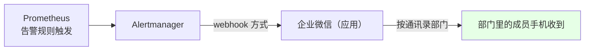
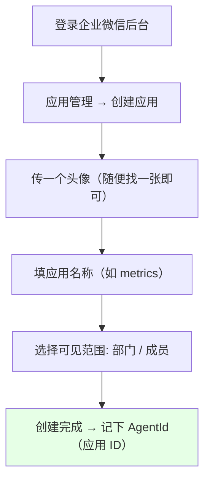
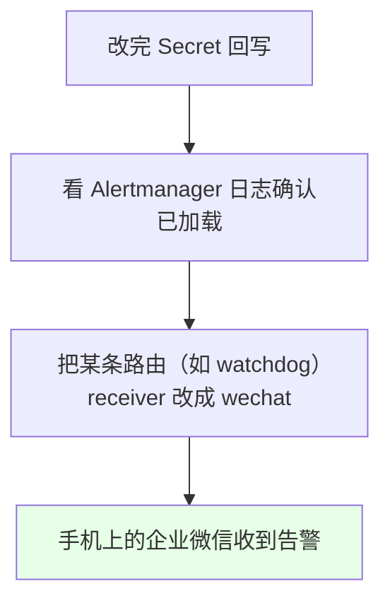

# Kubernetes 集群部署: Prometheus 使用微信告警（企业微信应用创建与 wechat_configs 配置）

上一节配了**邮件告警**，这是最常用的一种。这一节配**企业微信告警** —— Alertmanager 官方已经集成了微信，所以配置本身很简单，麻烦的部分在**企业微信那边的账号申请**。

结论先摆：

1. **链路是 webhook 式的**：Alertmanager 把告警信息通过 webhook 通知到企业微信，企业微信再按**通讯录部门**发给指定的人；
2. 企业微信侧要做两件事：**创建一个「应用」**（专门用来被 Alertmanager 调用）+ **准备一个「部门」**（收件人都在部门里，且**部门 ID 要用**）；
3. Alertmanager 侧改两处：**`global` 里填企业 ID（`corp_id`）和 `secret`**；**`receivers` 里加一个 `wechat_configs`**（填 `agent_id` 应用 ID + `to_tag` 部门 ID）；
4. 最后把**某条告警路由的 receiver 改成 wechat**（课程里拿 `watchdog` 做的验证），看日志确认加载成功，手机就能收到。

## 纲要

- 企业微信告警的整体链路
- 步骤一：在企业微信里创建应用
- 步骤二：准备通讯录部门并记下部门 ID
- 步骤三：改 Alertmanager 的 global 段
- 步骤四：新增 wechat receiver
- 步骤五：把路由指向 wechat 并验证
- 收到的告警长什么样
- 邮件告警与微信告警的取舍

## 企业微信告警的整体链路



| 环节 | 说明 |
| --- | --- |
| 企业微信 | **任何人都可以注册**（公司没有的话自己注册一个体验也行） |
| 应用 | 在企业微信后台「应用管理」里创建，**专门用来被 Alertmanager 调用** |
| 通讯录 | 建一个部门，把需要接收告警的人加进去；**部门 ID 后面要填进配置** |
| 发送 | Alertmanager → 企业微信应用 → 指定通讯录部门 |

## 步骤一：在企业微信里创建应用



创建时必填的三样：

| 项目 | 说明 |
| --- | --- |
| 头像 | 随便传一张就行 |
| 应用名称 | 自定义（课程里叫 `metrics`） |
| 可见范围 | 选择**部门**或**成员**，也就是谁能收到这个应用发的消息 |

> 创建完成后这个应用就**既能接收消息也能发送消息**了。

## 步骤二：准备通讯录部门并记下部门 ID

```text
企业微信通讯录结构（示意）:

通讯录
├── 主部门（根）                 ← 也可以直接用主部门
│   ├── 子部门 A                 ← 可继续加子部门
│   │   ├── 成员 1
│   │   └── 成员 2
│   └── 子部门 B（如 DBA）
│       └── 成员 3
└── 每个部门都有自己的「部门 ID」   ← 配置里的 to_tag 要填这个
```

| 项目 | 说明 |
| --- | --- |
| 部门 | 创建一个部门，也可以加子部门；**需要接收告警的人加到这个部门里** |
| 部门 ID | **一会配置要用**，先记下来（课程里演示环境只有一个部门，填 `1`；如果有多个部门，比如 DBA 部门是 `2`，就填 `2`） |

## 步骤三：改 Alertmanager 的 global 段

```yaml
global:
  resolve_timeout: 1h

  # 微信告警：这一段 URL 是固定的，不用改
  wechat_api_url: 'https://qyapi.weixin.qq.com/cgi-bin/'
  wechat_api_corp_id: '企业ID'      # ← 我的企业 → 企业信息 里能看到
  wechat_api_secret: '应用的 Secret'  # ← 应用管理里该应用的 Secret
```

| 字段 | 取值 | 是否要改 |
| --- | --- | --- |
| `wechat_api_url` | `https://qyapi.weixin.qq.com/cgi-bin/` | **固定值，不用改** |
| `wechat_api_corp_id` | 企业 ID（「我的企业」里看） | **要改** |
| `wechat_api_secret` | 应用的 Secret | **要改** |

> 配置参考官方文档即可，写法都是一样的。

## 步骤四：新增 wechat receiver

```yaml
receivers:
  - name: 'wechat'
    wechat_configs:
      - send_resolved: true      # 恢复通知也接收
        to_tag: '1'              # ← 通讯录「部门」的 ID
        agent_id: '1000002'      # ← 应用管理里那个「应用 ID」
```

| 字段 | 说明 |
| --- | --- |
| `send_resolved` | 是否接收「已恢复」通知，设 `true` |
| `to_tag` | **通讯录部门的 ID**（课程里演示环境只有一个部门所以是 `1`，实际按自己的部门 ID 填） |
| `agent_id` | **应用管理里那个应用的应用 ID** |
| `corp_id` / `api_secret` | **在 `global` 里已经写过了，这里就不用再写** |

> 引号可以不写，YAML 里裸写数字/字符串都能解析。

## 步骤五：把路由指向 wechat 并验证

```yaml
route:
  group_by: ['alertname']
  group_wait: 30s
  group_interval: 5m
  repeat_interval: 12h
  receiver: 'wechat'
  routes:
    - match:
        alertname: Watchdog
      receiver: 'wechat'         # ← 课程里拿 watchdog 这条做验证
```

```bash
NS=monitoring

# 1. 导出当前配置
kubectl get secret alertmanager-main -n $NS \
  -o jsonpath='{.data.alertmanager\.yaml}' | base64 -d > alertmanager.yaml

# 2. 改完回写
kubectl create secret generic alertmanager-main \
  --from-file=alertmanager.yaml -n $NS \
  --dry-run=client -o yaml | kubectl apply -f -

# 3. 看日志确认加载成功（注意日志时间戳比本地时间差 8 小时）
kubectl logs -n $NS alertmanager-main-0 | tail -30
```



## 收到的告警长什么样

```text
企业微信收到的告警内容（示意）:

[告警]
告警名称: Watchdog
告警级别: critical
labels:
  alertname = Watchdog
  severity  = none
annotations:
  message = This is an alert meant to ensure that the entire alerting pipeline is functional.
```

- **微信告警比邮件告警简单，配置也简单**；
- 消息里能看到 **labels**，也能看到 **annotation 里的 message**，告警信息已经很清楚；
- **缺点：默认模板没有邮件的好看**，下一节就来讲怎么自定义告警模板。

## 邮件告警与微信告警的取舍

| 介质 | Alertmanager 支持 | 特点 |
| --- | --- | --- |
| 邮件 | 原生支持（`email_configs`） | **最常用**，模板最好看 |
| 企业微信 | 原生支持（`wechat_configs`） | 配置简单，手机上就能收；默认模板较朴素 |
| 钉钉 | **未集成** | 需要自己写 webhook |
| 短信 | 已集成但配置复杂 | 通常也改成自己写 webhook 调短信接口 |

## API 速览

| 能力 | 做法 |
| --- | --- |
| 注册企业微信 | 任何人可注册，公司没有可自己注册体验 |
| 创建应用 | 企业微信后台 → 应用管理 → 创建应用（头像 / 名称 / 可见部门） |
| 收件人组织 | 通讯录建部门 → 加成员 → **记下部门 ID** |
| 全局配置 | `global.wechat_api_url`（固定）+ `wechat_api_corp_id` + `wechat_api_secret` |
| 收件人 | `receivers[].wechat_configs`（`agent_id` + `to_tag` + `send_resolved`） |
| 分发 | 在 `route` / `routes` 里把 `receiver` 指向 wechat 那个 receiver |
| 生效 | 改 Secret `alertmanager-main` 回写，看日志确认加载 |
| 时区注意 | 容器日志时间戳比本地**差 8 小时**，别误判成没加载 |
| 验证 | 拿一条必然触发的告警（如 `Watchdog`）做接收测试 |

## Demo 示例

```bash
NS=monitoring

# 1. 企业微信侧：应用管理 → 创建应用 → 记下 AgentId（应用 ID）
# 2. 企业微信侧：通讯录 → 建部门加成员 → 记下 部门 ID
# 3. 企业微信侧：我的企业 → 记下 企业 ID；应用详情 → 记下 Secret

# 4. 导出 Alertmanager 配置
kubectl get secret alertmanager-main -n $NS \
  -o jsonpath='{.data.alertmanager\.yaml}' | base64 -d > alertmanager.yaml

# 5. 在 global 里补上微信三件套，在 receivers 里加 wechat，
#    再把 Watchdog 这条路由的 receiver 改成 wechat

# 6. 回写配置
kubectl create secret generic alertmanager-main \
  --from-file=alertmanager.yaml -n $NS \
  --dry-run=client -o yaml | kubectl apply -f -

# 7. 看日志确认重新加载（时间戳差 8 小时属正常）
kubectl logs -n $NS alertmanager-main-0 | tail -30

# 8. 确认 Alertmanager Pod 正常
kubectl get pod -n $NS | grep alertmanager

# 9. 手机上企业微信应收到告警：能看到 labels 与 annotations.message
```

### 总结

- **企业微信告警的链路**：Alertmanager 通过 webhook 把告警信息推给企业微信的**应用**，企业微信再按**通讯录部门**发给部门里的成员；**企业微信任何人都可以注册**，公司没有的话自己注册一个体验即可；
- **企业微信侧两件事**：① 在「应用管理」里**创建一个应用**（传头像、起名称、选可见的部门/成员），这个应用就是专门被 Alertmanager 调用的，**记下它的应用 ID（AgentId）**；② 在通讯录里建部门、把收件人加进去，**记下部门 ID**（演示环境只有一个部门所以填 `1`，多个部门按实际填，比如 DBA 部门是 `2`）；
- **Alertmanager 的 `global` 段**：`wechat_api_url` 是**固定值不用改**，要改的是**企业 ID（`wechat_api_corp_id`，在「我的企业」里看）**和**应用的 Secret（`wechat_api_secret`）**；
- **新增 `wechat` receiver**：`wechat_configs` 里填 `agent_id`（应用 ID）+ `to_tag`（部门 ID）+ `send_resolved: true`；`corp_id` / `api_secret` 在 `global` 里写过了，**这里不用重复写**；
- **验证方式**：把某条必然触发的告警（课程用 `Watchdog`）的路由 `receiver` 改成 `wechat`，回写 Secret 后**看 Alertmanager 日志确认加载成功**（注意日志时间戳比本地差 8 小时，别当成没加载），手机上就能收到 —— 消息里有 labels 也有 annotation 的 message，信息很清楚；
- **微信告警配置简单但默认模板没邮件好看**，下一节讲自定义告警模板；四种介质里**邮件最常用**，钉钉官方没集成、短信配置复杂，都要靠自己写 webhook。

