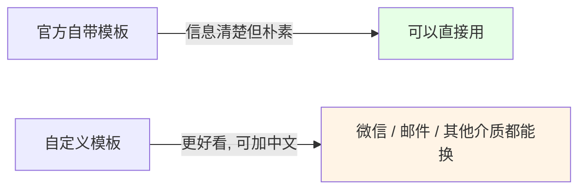
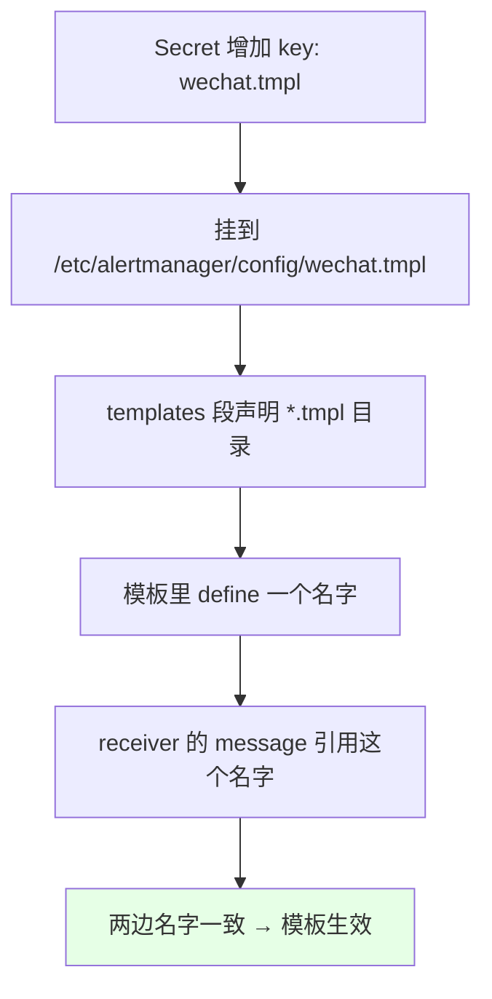
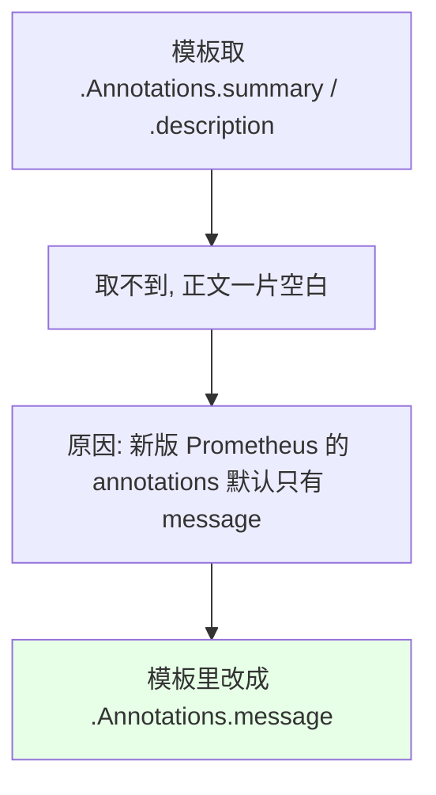
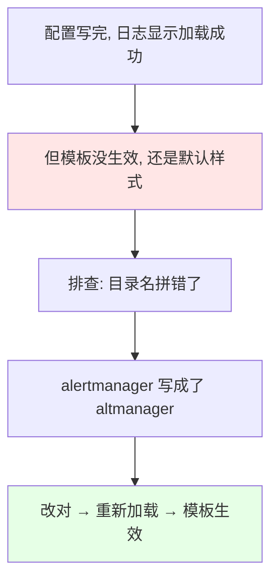

# Kubernetes 集群部署: Prometheus 自定义告警模板（templates 目录挂载与微信模板改造）

上一节把微信告警配通了，但**默认模板没有邮件的好看**。这一节就把它换成自定义模板 —— 顺带把 Operator 环境下**模板文件到底该放哪**这件事讲清楚。

结论先摆：

1. 模板不是单独挂载的，而是**塞进 Alertmanager 那个 Secret 里**，Operator 会把 Secret 的每一个 key 挂到 `/etc/alertmanager/config/` 目录下，所以**多加一个 `.tmpl` 的 key 就等于多了一个模板文件**；
2. `templates` 段配 `'/etc/alertmanager/config/*.tmpl'`，**文件名必须和你引用的模板名对得上**，否则找不到；
3. 模板分**两块**：告警模板 + resolve 模板（**恢复模板要多一个恢复时间，没有会报错**）；
4. **两个实踩的坑**：① 新版 Prometheus 的 `annotations` 里默认只有 `message`，没有 `summary` / `description`，模板取旧字段就取不到；② 目录名拼错（`alertmanager` 写成 `altmanager`）会导致模板**静默不生效**。

## 纲要

- 为什么要用自定义模板
- 模板文件该放哪：Secret 与挂载目录
- 配置 templates 段
- 模板的两块：告警 + 恢复
- 坑一：annotations 只有 message
- 坑二：目录名拼错导致静默失效
- 告警链接与触发时间的写法
- 在 receiver 里引用模板

## 为什么要用自定义模板



> 其实**官方自带的告警模板已经写得挺全、挺清楚**，没必要花太多精力在这上面。真要改，就按这一节的方式改 —— **微信、邮件、其他告警方式都能换模板**。

## 模板文件该放哪：Secret 与挂载目录

```text
Operator 环境下 Secret 与容器目录的对应关系:

Secret  alertmanager-main
├── data: alertmanager.yaml   ──挂载──>  /etc/alertmanager/config/alertmanager.yaml
└── data: wechat.tmpl         ──挂载──>  /etc/alertmanager/config/wechat.tmpl
                                              ↑
                              templates 段配的就是这个目录（*.tmpl）

所以：往 Secret 里多加一个模板的 data
      = 往该目录下多放一个模板文件
      = 不用另外挂 ConfigMap
```

> **不要用平台界面去改 Prometheus Operator 创建的 Secret** —— 平台虽然能显示也能编辑，但**改了一般不生效**。正确做法是**直接编辑这个 Secret**，在下面增加一个模板的 `data`，它就会被挂到对应目录。

## 配置 templates 段

```yaml
global:
  resolve_timeout: 1h
  wechat_api_url: 'https://qyapi.weixin.qq.com/cgi-bin/'
  wechat_api_corp_id: '企业ID'
  wechat_api_secret: '应用 Secret'

# ↓ 新增：模板目录。*.tmpl 结尾的文件都会被读到
templates:
  - '/etc/alertmanager/config/*.tmpl'

route:
  group_by: ['alertname']
  group_wait: 30s
  group_interval: 5m
  repeat_interval: 12h
  receiver: 'wechat'

receivers:
  - name: 'wechat'
    wechat_configs:
      - send_resolved: true
        to_tag: '1'
        agent_id: '1000002'
        # ↓ 引用模板里定义的名字，两边必须一致
        message: '{{ template "wechat.default.message" . }}'
```



## 模板的两块：告警 + 恢复

```text
{{ define "wechat.default.message" }}
【告警状态】{{ if eq .Status "firing" }}告警触发{{ else }}告警恢复{{ end }}
【告警级别】{{ .Labels.severity }}
【告警类型】{{ .Labels.alertname }}
【告警分组】{{ .Labels.group }}
【告警详情】{{ .Annotations.message }}
【触发时间】{{ (.StartsAt.Add 28800e9).Format "2006-01-02 15:04:05" }}
【告警链接】http://alertmanager.example.com/#/alerts
{{ end }}
```

```text
{{ define "wechat.default.resolve.message" }}
【告警状态】已恢复
【告警级别】{{ .Labels.severity }}
【告警类型】{{ .Labels.alertname }}
【告警分组】{{ .Labels.group }}
【告警详情】{{ .Annotations.message }}
【触发时间】{{ (.StartsAt.Add 28800e9).Format "2006-01-02 15:04:05" }}
【恢复时间】{{ (.EndsAt.Add 28800e9).Format "2006-01-02 15:04:05" }}
{{ end }}
```

| 块 | 用途 | 差异 |
| --- | --- | --- |
| `wechat.default.message` | **告警触发**时的正文 | 只有触发时间 |
| `wechat.default.resolve.message` | **告警恢复**时的正文 | **多一个恢复时间** —— 没有这个字段会报错，所以必须分成两块 |

> Go 语言格式化时间有个特性：**必须写成 `2006-01-02 15:04:05` 这个参考时间**（就是常说的「一二三四五」），写成别的格式串是不生效的。课程里用 `.Add 28800e9` 补了 8 小时 —— 容器里的时间戳比本地时间**差 8 小时**。

## 坑一：annotations 只有 message



**新版本的 Prometheus，告警信息 `annotations` 里默认已经不加 `summary` 和 `description` 了，只剩一个 `message`**。所以网上抄来的老模板里写「报警详情 = summary」的地方会取空，**直接改成 `message`** 即可。

> 当然也可以自己在告警规则里把 `summary` / `description` 加回去，两边对上就行。

## 坑二：目录名拼错导致静默失效



课程里实踩：日志明明显示配置已加载，但**模板就是没生效**，最后发现是 **目录名单词写错了**（`alertmanager` 被敲成了 `altmanager`）。**这种错误不会报错，只会静默失效**，排查时优先核对路径拼写。

## 告警链接与触发时间的写法

| 项 | 说明 |
| --- | --- |
| 告警链接 | 默认读出的是 **Service 的 URL，不好使**（点不开）；**直接写死成 Alertmanager 的访问地址**即可，这样消息里的链接是可点击的 |
| 触发时间 | Go 时间格式必须写 `2006-01-02 15:04:05`；容器时区差 8 小时，用 `.Add 28800e9` 校正 |
| 分组名称 | 用 Go template 语法取即可；**取不到说明这条告警本来就没有这个 label**，有就能取到 |
| 告警详情 | **可以写中文，完全可以自己定制** |

改完之后的效果：**告警级别、告警类型、告警分组、告警详情、触发时间、可点击的告警 URL** 都有了，比默认模板好看不少。

## 在 receiver 里引用模板

```yaml
receivers:
  - name: 'wechat'
    wechat_configs:
      - send_resolved: true
        to_tag: '1'
        agent_id: '1000002'
        # 这两个名字必须完全一致，否则模板不生效
        message: '{{ template "wechat.default.message" . }}'
```

> **`define` 的模板名 和 `message` 里 `template` 引用的名字必须一致**，这是最容易漏的一步。邮件（`email_configs` 的 `html`）和其他介质也是同样的改法。

## API 速览

| 能力 | 做法 |
| --- | --- |
| 放模板 | **往 Secret `alertmanager-main` 里多加一个 `.tmpl` 的 data**，不用另挂 ConfigMap |
| 挂载目录 | `/etc/alertmanager/config/`（Operator 把 Secret 的 key 逐个挂进去） |
| 声明模板 | `templates: - '/etc/alertmanager/config/*.tmpl'` |
| 定义模板 | `{{ define "名字" }} … {{ end }}` |
| 引用模板 | receiver 里的 `message`：`{{ template "名字" . }}` |
| 恢复模板 | 单独 define 一块，**多一个恢复时间** |
| 取字段 | `{{ .Labels.xxx }}` / `{{ .Annotations.message }}` |
| 时间格式 | `.Format "2006-01-02 15:04:05"`；时区用 `.Add 28800e9` 补 8 小时 |
| 告警链接 | 别用默认的 Service URL，**写死 Alertmanager 地址** |
| 生效检查 | 看日志确认加载 + **核对目录名拼写**（拼错会静默失效） |

## Demo 示例

```bash
NS=monitoring

# 1. 导出当前 Alertmanager 配置
kubectl get secret alertmanager-main -n $NS \
  -o jsonpath='{.data.alertmanager\.yaml}' | base64 -d > alertmanager.yaml

# 2. 在 alertmanager.yaml 里加 templates 段，并把 wechat_configs 的 message
#    指向自定义模板（名字要和模板里 define 的一致）

# 3. 准备模板文件 wechat.tmpl（define 两块：告警 + 恢复）

# 4. 把模板塞进同一个 Secret —— 多加一个 key 即可
kubectl create secret generic alertmanager-main \
  --from-file=alertmanager.yaml \
  --from-file=wechat.tmpl -n $NS \
  --dry-run=client -o yaml | kubectl apply -f -

# 5. 确认模板文件确实挂进了容器目录（重点核对目录名拼写！）
kubectl exec -n $NS alertmanager-main-0 -- \
  ls -l /etc/alertmanager/config/

# 6. 看日志确认重新加载
kubectl logs -n $NS alertmanager-main-0 | tail -30

# 7. 触发一条告警（如 Watchdog），手机上看模板是否生效
```

### 总结

- **自定义模板的价值有限**：官方自带模板信息已经很清楚了，不必花太多精力；真要改，**微信、邮件、其他告警介质都能按同一套方式换模板**；
- **模板不用另外挂 ConfigMap**：Operator 会把 Secret `alertmanager-main` 的**每个 key 挂到 `/etc/alertmanager/config/`** 下，所以**往 Secret 里多加一个 `.tmpl` 的 data 就等于多放了一个模板文件**；**千万别用平台界面改 Operator 创建的 Secret，改了不生效**；
- **三步接线**：`templates: - '/etc/alertmanager/config/*.tmpl'` 声明目录 → 模板里 `define` 一个名字 → receiver 的 `message` 里 `template` 引用**同一个名字**，**两边名字不一致模板就不生效**；
- **模板要分成两块**：告警模板只有触发时间，**恢复模板必须多一个恢复时间**（没有会报错），所以要单独 define；
- **坑一：新版 Prometheus 的 `annotations` 默认只有 `message`**，网上抄的老模板取 `summary` / `description` 会取空 —— 把「报警详情」改成 `.Annotations.message`（也可以在告警规则里把那两个字段加回去）；
- **坑二：目录名拼错会静默失效**（课程里把 `alertmanager` 敲成了 `altmanager`），日志显示加载成功但模板还是默认的，**排查优先核对路径拼写**；另外**告警链接默认取的是 Service URL 点不开，直接写死 Alertmanager 地址**；
- **时间写法是 Go 的特例**：格式化串必须写成 `2006-01-02 15:04:05`，容器时区差 8 小时用 `.Add 28800e9` 校正；告警详情**可以写中文**，分组名称取不到说明这条告警本来就没有这个 label。

