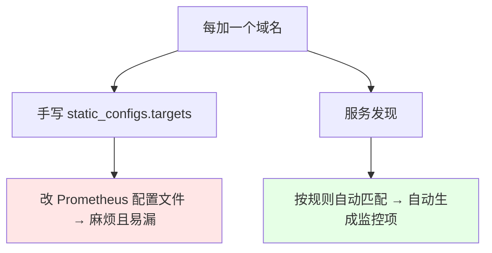
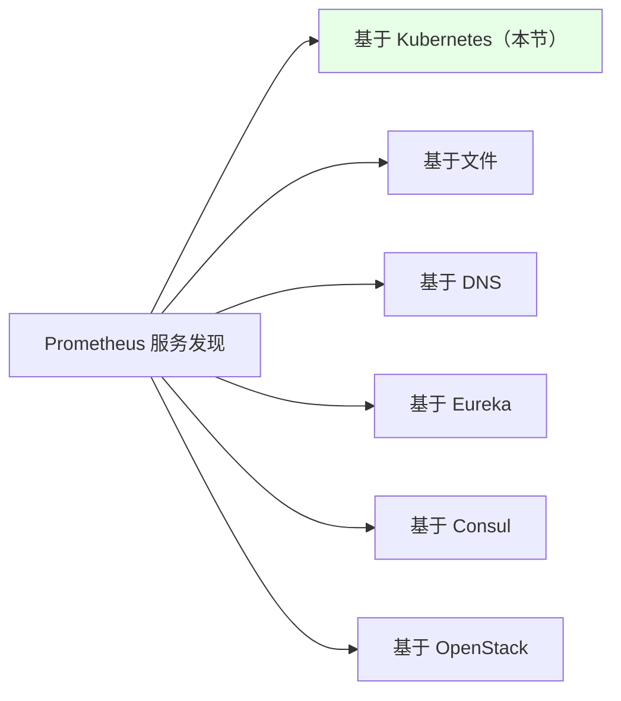
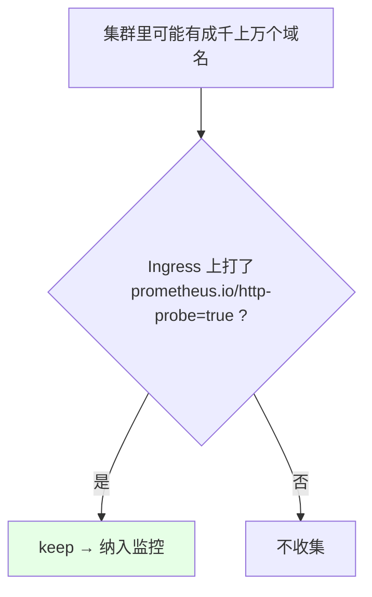
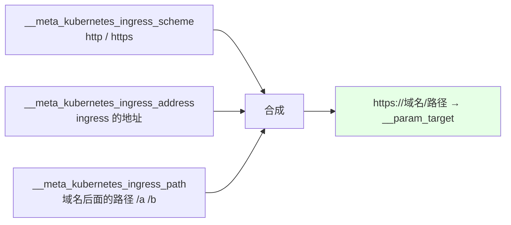
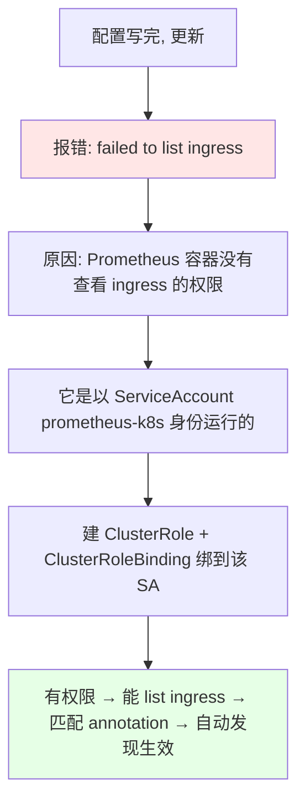

# Kubernetes 集群部署: Prometheus 自动发现（kubernetes_sd_configs 自动监控 Ingress 域名）

前面监控域名是**一条一条手写 `static_configs.targets`** 的。域名少还行，多了就非常麻烦 —— 每加一个域名都要去改 Prometheus 的配置。这一节用 Prometheus 的**服务发现**把这件事自动化。

结论先摆：

1. Prometheus 的服务发现机制很多：**基于 Kubernetes、文件、DNS、Eureka、Consul、OpenStack** 等，原理都一样 —— **配了发现规则后按规则做匹配，自动生成监控项**；
2. 这节用 `kubernetes_sd_configs` 的 `role: ingress`，**自动发现集群里所有 Ingress 上配置的域名**并交给 blackbox 探测；
3. **不是所有域名都要监控**，所以用 annotation 做筛选：**Ingress 上打了 `prometheus.io/http-probe: "true"` 才收集**（`keep` = 符合才保留，`drop` = 符合就踢掉）；
4. **最大的坑是 RBAC**：Prometheus 容器默认**没有权限 list ingress**，会报 `failed to list ingress`，必须给它的 ServiceAccount 绑一个 ClusterRole。

## 纲要

- 为什么需要服务发现
- Prometheus 支持哪些服务发现
- 配置：基于 ingress 的自动发现 job
- 用 annotation 做筛选（keep / drop）
- 三个 meta 值合成完整域名
- 坑一：target 取不到值（沿用上节的补法）
- 坑二：RBAC 权限不足导致 failed to list ingress
- 给 Ingress 打 annotation 触发发现
- 其他 role 与 Eureka / Consul 场景

## 为什么需要服务发现



| 场景 | 做法 |
| --- | --- |
| 场景小、域名少 | 内部手写配置即可 |
| 域名多 / 经常变 | **服务发现**，配一次规则，之后只管给资源打标记 |

## Prometheus 支持哪些服务发现



> **原理都差不多**：配置完发现规则后按规则做匹配，然后生成监控项。其它监控系统（如 Zabbix）也有自动发现机制，属于同类能力。

## 配置：基于 ingress 的自动发现 job

还是写在那份 `additionalScrapeConfigs` 里：

```yaml
- job_name: 'blackbox-auto-discovery'
  metrics_path: /probe
  params:
    module: [http_2xx]
  kubernetes_sd_configs:
    - role: ingress            # ← 基于 ingress 发现（也可 pod / service / endpoint / node）
  relabel_configs:
    # 1) 只保留打了 prometheus.io/http-probe=true 的 ingress
    - source_labels: [__meta_kubernetes_ingress_annotation_prometheus_io_http_probe]
      regex: "true"
      action: keep

    # 2) 用 scheme + address + path 合成完整域名，作为 /probe 的 target 参数
    - source_labels:
        - __meta_kubernetes_ingress_scheme
        - __meta_kubernetes_ingress_address
        - __meta_kubernetes_ingress_path
      regex: "(.+);(.+);(.+)"        # 三个值以分号分隔
      replacement: "${1}://${2}${3}"
      target_label: __param_target

    # 3) 把 __param_target 抄给 instance（沿用上节的补法）
    - source_labels: [__param_target]
      target_label: instance
    - source_labels: [instance]
      target_label: target

    # 4) 真正的请求地址改成 blackbox exporter
    - target_label: __address__
      replacement: blackbox-exporter.monitoring.svc:9115

    # 5) 把 ingress 的信息转成指标的 label
    - source_labels: [__meta_kubernetes_namespace]
      target_label: namespace
    - source_labels: [__meta_kubernetes_ingress_name]
      target_label: ingress_name
```

| 字段 | 说明 |
| --- | --- |
| `kubernetes_sd_configs.role` | `ingress`（本节）；**换成 `pod` / `service` / `endpoint` / `node` 也可以**，原理一样 |
| `metrics_path` / `params` | 和手写的 blackbox job 完全一致（`/probe` + `module`） |
| job 名 | 课程里叫 `blackbox-auto-discovery` |

## 用 annotation 做筛选（keep / drop）



| action | 含义 |
| --- | --- |
| `keep` | **符合规则的才收集** |
| `drop` | **符合规则的踢出去** |

> 域名有外置的、内置的、重要的、不重要的，**不是所有域名都需要监控**，所以用 annotation 做开关。注意 annotation 的 key 里 **`.` 和 `/` 在 meta 标签里会被转成下划线**（`prometheus.io/http-probe` → `prometheus_io_http_probe`）。

## 三个 meta 值合成完整域名



| meta 变量 | 含义 | 正则捕获 |
| --- | --- | --- |
| `__meta_kubernetes_ingress_scheme` | `http` 或 `https` | `$1` |
| `__meta_kubernetes_ingress_address` | Ingress 的地址 | `$2` |
| `__meta_kubernetes_ingress_path` | **域名后面跟的路径**（如 `/a`、`/b`） | `$3` |

- 三个 source_labels 取到的值**以分号分隔**，正则里用 `(.+);(.+);(.+)` 匹配；
- **括号代表一个捕获组**，后面用 `$1` `$2` `$3` 取它的值，拼成 `scheme://address/path` 这样一个完整的域名。

## 坑一：target 取不到值（沿用上节的补法）

```yaml
    # 官方配置下 target 取不到值，仍需手动补这两条
    - source_labels: [__param_target]
      target_label: instance
    - source_labels: [instance]
      target_label: target
```

> 和上一节的坑完全一样：`__param_target` 能赋给 `instance`，但 `target` 取不到，必须**再补一条 `instance` → `target`**，否则面板变量取不到值。

## 坑二：RBAC 权限不足导致 failed to list ingress



**容器以某个 ServiceAccount 的身份运行，就拥有这个 ServiceAccount 的权限** —— Prometheus 用的是 `monitoring` 下的 `prometheus-k8s`。

```yaml
apiVersion: rbac.authorization.k8s.io/v1
kind: ClusterRole
metadata:
  name: prometheus-ingress-read
rules:
  - apiGroups: ["extensions", "networking.k8s.io"]
    resources: ["ingresses"]
    verbs: ["get", "list", "watch"]
---
apiVersion: rbac.authorization.k8s.io/v1
kind: ClusterRoleBinding
metadata:
  name: prometheus-ingress-read
subjects:
  - kind: ServiceAccount
    name: prometheus-k8s      # ← Prometheus 容器用的那个 SA
    namespace: monitoring
roleRef:
  kind: ClusterRole
  name: prometheus-ingress-read
  apiGroup: rbac.authorization.k8s.io
```

> 课程里直接复用了现成的 **`resource-readonly` 这个 ClusterRole**（权限比较大，「懒得改」），**自己写最小权限也完全可以**。另外这个 ClusterRoleBinding 在 Operator 部署里不一定自动创建，**需要手动建**。

## 给 Ingress 打 annotation 触发发现

```yaml
apiVersion: networking.k8s.io/v1
kind: Ingress
metadata:
  name: demo
  namespace: default
  annotations:
    prometheus.io/http-probe: "true"    # ← 打了这个才会被自动发现
spec:
  rules:
    - host: demo.example.com
      http:
        paths:
          - path: /
            pathType: Prefix
            backend:
              service:
                name: demo-svc
                port:
                  number: 80
```

```bash
NS=default
ING=demo

kubectl annotate ingress $ING prometheus.io/http-probe=true -n $NS --overwrite
kubectl get ingress $ING -n $NS -o yaml | grep -A3 annotations
```

更新之后：

```text
自动发现生效后 target 上能看到的值:

host       = demo.example.com      ← 域名
name       = demo                  ← ingress 名称
path       = /                     ← 路径
scheme     = https                 ← 协议
address    = x.x.x.x               ← ingress 地址
level(标签) = 点/斜线已被转成下划线

合成结果 → __param_target = https://demo.example.com/
状态 UP → probe 指标出现 → 自动发现成功
```

> **想监控哪个 Ingress，就给它加一个 annotation 即可**，再也不用手动改 target 了。

## 其他 role 与 Eureka / Consul 场景

```text
kubernetes_sd_configs 可用的 role（原理都一样）:

kubernetes_sd_configs
├── role: ingress      ← 本节：自动监控 Ingress 域名
├── role: pod
├── role: service
├── role: endpoint
└── role: node

其它服务发现按需选用
├── 基于文件            ← 自己维护一个目标列表文件
├── 基于 DNS
├── 基于 Eureka         ← 监控 Java 程序 JVM 时常用
├── 基于 Consul         ← 同上
└── 基于 OpenStack
```

> **监控 Java 程序的 JVM 情况时，一般用 Eureka / Consul 的自动发现**：匹配到所有注册进 Eureka 的服务就自动加监控 —— 因为**服务名是注册中心给的，你根本没法手动改**，只能靠自动发现。

## API 速览

| 能力 | 做法 |
| --- | --- |
| 服务发现类型 | Kubernetes / 文件 / DNS / Eureka / Consul / OpenStack |
| K8s 发现配置 | `kubernetes_sd_configs` + `role` |
| 可用 role | `ingress` / `pod` / `service` / `endpoint` / `node` |
| 筛选 | `relabel_configs` + `action: keep`（符合才收）/ `drop`（符合就踢） |
| 筛选标记 | Ingress 上打 annotation（`.` 与 `/` 在 meta 里转成 `_`） |
| 取 meta 值 | `__meta_kubernetes_ingress_scheme` / `_address` / `_path` / `_name` / `_namespace` |
| 合成域名 | `source_labels` 多值 + 正则捕获组 `$1` `$2` `$3`（值以分号分隔） |
| 请求地址 | `__address__` 的 `replacement` 改成 blackbox exporter |
| 权限 | 给 `prometheus-k8s` 这个 ServiceAccount 绑 **ClusterRole + ClusterRoleBinding** |
| 权限不足报错 | `failed to list ingress` |
| 生效验证 | 看 target 是否出现、是否 UP、`probe_` 指标是否出现 |

## Demo 示例

```bash
NS=monitoring

# 1. 在 additional 配置里加 blackbox-auto-discovery 这个 job
kubectl get secret prometheus-k8s-additional -n $NS \
  -o jsonpath='{.data.prometheus-additional\.yaml}' | base64 -d > prometheus-additional.yaml

# 2. 改完回写
kubectl create secret generic prometheus-k8s-additional \
  --from-file=prometheus-additional.yaml -n $NS \
  --dry-run=client -o yaml | kubectl apply -f -

# 3. 看日志：大概率会报 failed to list ingress（权限不足）
kubectl logs -n $NS prometheus-k8s-0 -c prometheus | grep -i ingress

# 4. 给 Prometheus 的 ServiceAccount 授予读 ingress 的权限
kubectl apply -f prometheus-ingress-read.yaml
kubectl get clusterrolebinding prometheus-ingress-read

# 5. 给要监控的 Ingress 打 annotation
kubectl annotate ingress demo prometheus.io/http-probe=true -n default --overwrite

# 6. 等 Prometheus 刷新（配置更新有刷新间隔），再看 target
kubectl logs -n $NS prometheus-k8s-0 -c prometheus | grep -i reload

# 7. 确认自动发现的 target 已 UP，probe_ 指标出现
```

### 总结

- **手写配置适合小场景**：域名一多、一经常变，每次都去改 Prometheus 配置文件就非常麻烦，这时候要用**服务发现** —— 配好规则后按规则自动匹配、自动生成监控项；
- **Prometheus 的服务发现机制很多**（Kubernetes / 文件 / DNS / Eureka / Consul / OpenStack），**原理都一样**，会一种就能举一反三（Zabbix 也有同类机制）；
- **本节用 `kubernetes_sd_configs` 的 `role: ingress`** 自动发现集群里 Ingress 配置的域名，配合 blackbox 的 `/probe` 做探测；**换成 `pod` / `service` / `endpoint` / `node` 也完全可行**；
- **不是所有域名都要监控**：用 `relabel_configs` 的 `action` 做筛选 —— **`keep` 是「符合才收集」，`drop` 是「符合就踢掉」**，本节靠 Ingress 上打 `prometheus.io/http-probe: "true"` 这个 annotation 当开关（注意 **`.` 和 `/` 在 meta 标签里会被转成下划线**）；
- **完整域名由三个 meta 值合成**：`__meta_kubernetes_ingress_scheme`（http/https）+ `_address`（Ingress 地址）+ `_path`（域名后的路径），**三个值以分号分隔**，正则里用括号做捕获组、用 `$1` `$2` `$3` 拼成 `scheme://address/path`；
- **坑一：`target` 取不到值**（和上一节同源）→ 仍需手动补 `instance` → `target` 这条 relabel，否则面板变量取不到；
- **坑二：RBAC 权限不足** → 报 `failed to list ingress`，因为 Prometheus 容器是以 `monitoring` 下 **`prometheus-k8s` 这个 ServiceAccount** 的身份运行的，**容器只有这个 SA 的权限** → 建一个能读 ingress 的 **ClusterRole + ClusterRoleBinding** 绑到它上面（课程里直接复用了权限较大的 `resource-readonly`，自己写最小权限也行）；
- **最后给 Ingress 打上 annotation 就能触发发现**，target 上能看到 host / name / path / scheme / address 这些值，状态变 UP、`probe_` 指标出现即成功；**监控 Java 应用 JVM 时一般用 Eureka / Consul 自动发现**，因为服务名是注册中心给的、没法手动改。

