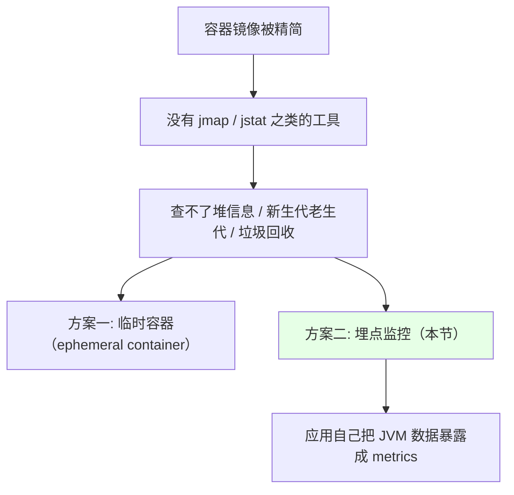
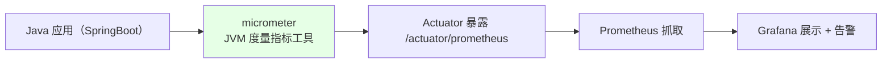
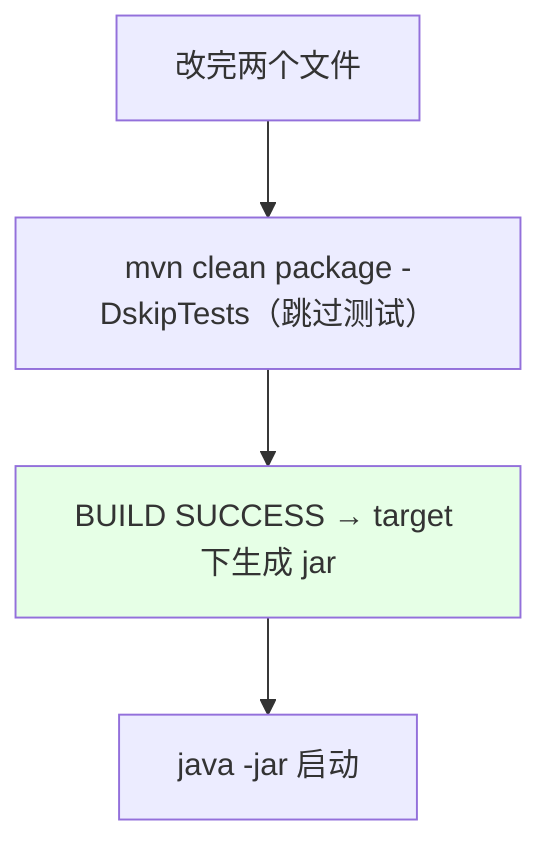
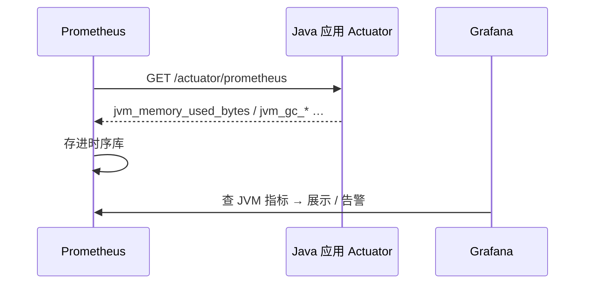
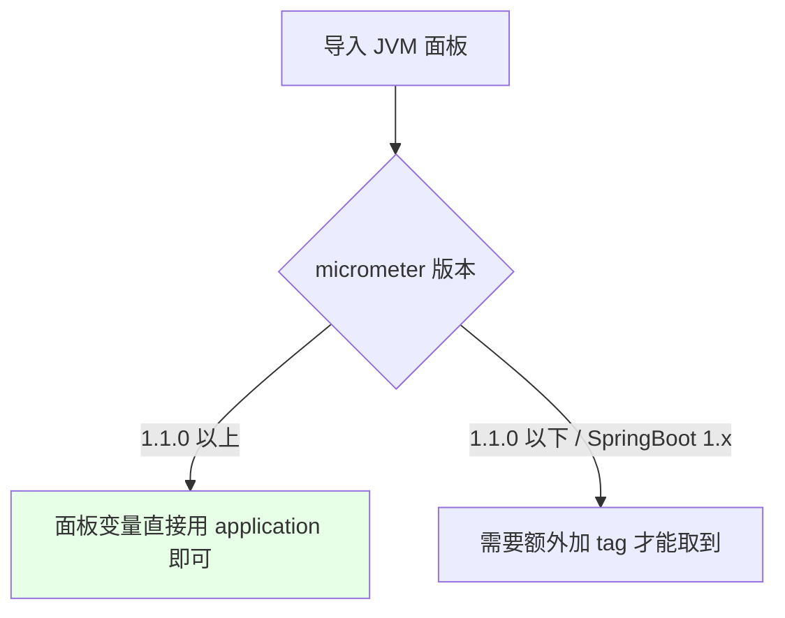

# Kubernetes 集群部署: Prometheus 监控 Java JVM（micrometer 埋点与 Actuator 接入）

前面把黑盒监控、白盒监控、中间件监控、宿主机监控都做完了，**唯独缺一块：业务应用自己的监控**。容器镜像往往被精简过，`jmap` / `jstat` 这类工具根本没装，想看堆、新生代老生代、垃圾回收状态都看不了。这一节用**埋点监控**解决这个问题。

结论先摆：

1. **业务应用自身的监控叫「埋点监控」** —— 对 Java 应用来说，就是在应用里加一个度量插件，把 JVM 内部数据暴露成 Prometheus 认识的指标；
2. 用的工具是 **micrometer**（JVM 的度量指标工具），配合 SpringBoot 的 **Actuator** 暴露接口；
3. **改造量极小，只动两个文件**：`pom.xml` 加依赖 + `application.properties` 暴露端点并加 tag；
4. Prometheus 侧还是在 `additionalScrapeConfigs` 里加一个 job，抓 `/actuator/prometheus` 即可。

## 纲要

- 为什么业务应用要单独做监控
- micrometer 与 Actuator 的角色
- 步骤一：pom.xml 加依赖
- 步骤二：application.properties 暴露端点
- 步骤三：用 maven 容器编译打包
- 步骤四：启动并验证 metrics 接口
- 步骤五：Prometheus 加 job
- Grafana 面板与 application tag 的版本差异
- 其他语言怎么办

## 为什么业务应用要单独做监控



| 监控对象 | 是否已有 |
| --- | --- |
| 黑盒监控（域名/端口） | 已做 |
| 白盒监控（etcd / controller-manager） | 已做 |
| 中间件（Redis / Kafka / ES） | 已做 |
| 宿主机 | 已做 |
| **业务应用自身（Java / NodeJS / PHP）** | **缺 —— 本节补上** |

> **埋点监控的价值**：Java 进程经常出现内存不够用的情况，把堆、GC 这些数据暴露出来做**预测性告警**非常合适；对开发来说也**不用再登到容器或服务器上敲命令去查**了。

## micrometer 与 Actuator 的角色



| 组件 | 作用 |
| --- | --- |
| micrometer | **JVM 的度量指标工具**，负责采集 JVM 的各类数据 |
| SpringBoot Actuator | 把采集到的数据**通过 HTTP 接口暴露出去** |

> 如果是 Java 开发工程师，这些代码改动一目了然；**如果只是运维，就推着开发做** —— 开发工作量非常小，改几个地方即可。

## 步骤一：pom.xml 加依赖

```xml
<dependency>
    <groupId>org.springframework.boot</groupId>
    <artifactId>spring-boot-starter-actuator</artifactId>
</dependency>
<dependency>
    <groupId>io.micrometer</groupId>
    <artifactId>micrometer-registry-prometheus</artifactId>
</dependency>
```

> **SpringBoot 版本要求 2.0 以上**（演示项目用的是 2.1.9，1.x 和 2.x 差别不大）。

## 步骤二：application.properties 暴露端点

```properties
# 把监控接口暴露出来（图省事直接写 *，也可以按需列具体的）
management.endpoints.web.exposure.include=*

# 关掉 shutdown 端点，防止别人远程把进程关掉
management.endpoint.shutdown.enabled=false

# 加一个 tag：把 spring.application.name 的值作为 label 带进监控数据
management.metrics.tags.application=${spring.application.name}
```

```text
改造一个 SpringBoot 应用，只需动两个文件:

项目根目录
├── pom.xml                              ← 步骤一：加 micrometer 依赖
└── src/main/resources/
    └── application.properties           ← 步骤二：暴露端点 + 关 shutdown + 加 tag
```

| 配置项 | 作用 |
| --- | --- |
| `management.endpoints.web.exposure.include` | **暴露监控接口**，`*` 是全开 |
| `management.endpoint.shutdown.enabled=false` | **关掉 shutdown**，防止远程把进程关掉 |
| `management.metrics.tags.application` | 给监控数据**加一个 label**（值为应用名），面板里靠它区分应用 |

## 步骤三：用 maven 容器编译打包

```bash
# 起一个 maven 容器来编译（不用在宿主机上装 maven）
docker run -it --rm \
  -v "$HOME/.m2":/root/.m2 \
  -v "$(pwd)":/opt/app \
  -w /opt/app \
  -p 18761:8761 \
  maven:3.5.3-jdk-8 bash

# 容器内执行编译（跳过单元测试）
mvn clean package -DskipTests
```

| 参数 | 说明 |
| --- | --- |
| `-v "$HOME/.m2":/root/.m2` | **把 maven 缓存目录持久化到宿主机** —— 容器退出会清空数据，不挂的话每次都要重新下一堆插件 |
| `-v "$(pwd)":/opt/app -w /opt/app` | 把当前目录挂成容器工作目录 |
| `-p 18761:8761` | 把 Eureka 的 8761 映射到宿主机 18761，方便在外面取监控数据 |
| `maven:3.5.3-jdk-8` | 课程用的 maven 镜像版本 |



> 公司自己的项目**可能是 `package` 也可能是 `install`**，还有内置单元测试，加 `-DskipTests` 跳过即可（这里只是为了做监控，不需要跑测试）。后期讲流水线时，所有构建都会在容器里做，不在虚拟机上装 maven。

## 步骤四：启动并验证 metrics 接口

```bash
# 启动（课程里是直接用虚拟机起的 jar，没做容器化，仅为演示监控）
java -jar target/eureka-server.jar
```

启动后：

1. 访问 Eureka 界面（8761 / 宿主机 18761）确认应用起来了；
2. **访问 `/actuator` 监控数据就出来了** —— 这就是 Prometheus 要抓的接口。

```text
访问路径:

http://<宿主机IP>:18761/actuator             ← 端点列表
http://<宿主机IP>:18761/actuator/prometheus  ← Prometheus 抓取用的就是这个
```

> **在 Kubernetes 里**：应用有自己的 Service 地址，**直接拿 Service 地址去监控**即可；在集群外部就用 IP + 端口的方式抓。

## 步骤五：Prometheus 加 job

还是写在那份 `additionalScrapeConfigs` 里，加在最上面：

```yaml
- job_name: 'java-jvm'
  metrics_path: /actuator/prometheus
  static_configs:
    - targets:
        - '192.168.1.100:18761'
```



- 改完保存，**等 Prometheus 刷新**（配置更新有刷新间隔，ConfigMap 刷新后监控项就出来了）；
- 之后就能在 Prometheus 里查到大量 JVM 监控数据，**基于这些数据做告警或预警**。

| 数据类别 | 例子 |
| --- | --- |
| 堆 / 非堆 | heap、nonheap（面板里都有） |
| 分代 | 新生代 / 老生代 |
| 垃圾回收 | GC 次数、GC 耗时 |
| 业务可扩展 | 按前面讲的四种 metrics 类型自己加埋点 |

## Grafana 面板与 application tag 的版本差异



- 演示用的 micrometer 是 **1.1.0 以上版本**，所以面板里**直接加一个 `application` label 就能筛出对应应用**（如 `application=cloud-eureka`）；
- SpringBoot **2.x 只需要加 `application` 这个 tag** 就行；版本更老的可能还要额外加；
- 加 tag 的代码位置：`src/main/java/...` **一直找到最后一层**（就是主类所在位置）；
- 面板能展示**垃圾回收、JVM 各类信息**，开发直接看图就行，**不用再登服务器用命令查**。

> 展示其实是次要的，**监控和告警才是重点**。

## 其他语言怎么办

| 语言 | 做法 |
| --- | --- |
| Java | **有现成插件**（micrometer），直接用 |
| NodeJS | 一般也有现成插件可以暴露 metrics |
| 其他语言 | 用 Prometheus 的客户端库**自己写**，按四种 metrics 类型暴露重要指标 |

> 主流开发语言基本都有现成插件，**不要重复造轮子**；实在没有就自己暴露几个关键指标。

## API 速览

| 能力 | 做法 |
| --- | --- |
| 埋点工具 | micrometer（JVM 度量指标工具） |
| 依赖 | `micrometer-registry-prometheus` + `spring-boot-starter-actuator` |
| 暴露端点 | `management.endpoints.web.exposure.include=*` |
| 安全 | `management.endpoint.shutdown.enabled=false` |
| 区分应用 | `management.metrics.tags.application=${spring.application.name}` |
| SpringBoot 版本 | **2.0 以上** |
| 编译 | `mvn clean package -DskipTests`（maven 容器里跑，挂 `$HOME/.m2` 缓存） |
| metrics 地址 | `/actuator/prometheus` |
| Prometheus 侧 | `additionalScrapeConfigs` 加 job，`metrics_path` 指过去 |
| K8s 内 | 直接写 Service 地址；集群外写 IP:端口 |
| 面板 | 导入现成 JVM dashboard，用 `application` label 筛选 |
| 告警 | 堆 / GC 数据非常适合做**预测性告警** |

## Demo 示例

```bash
# 1. 改 pom.xml 加 micrometer + actuator 依赖
# 2. 改 application.properties：暴露端点、关 shutdown、加 application tag

# 3. 用 maven 容器编译（挂 m2 缓存，避免每次重下插件）
docker run -it --rm \
  -v "$HOME/.m2":/root/.m2 \
  -v "$(pwd)":/opt/app \
  -w /opt/app \
  -p 18761:8761 \
  maven:3.5.3-jdk-8 bash

mvn clean package -DskipTests

# 4. 启动应用
java -jar target/eureka-server.jar

# 5. 验证 metrics 接口
curl http://127.0.0.1:18761/actuator
curl http://127.0.0.1:18761/actuator/prometheus

# 6. 在 additional 配置里加 java-jvm 这个 job
kubectl get secret prometheus-k8s-additional -n monitoring \
  -o jsonpath='{.data.prometheus-additional\.yaml}' | base64 -d > prometheus-additional.yaml

kubectl create secret generic prometheus-k8s-additional \
  --from-file=prometheus-additional.yaml -n monitoring \
  --dry-run=client -o yaml | kubectl apply -f -

# 7. 等 Prometheus 刷新后查 JVM 指标
kubectl logs -n monitoring prometheus-k8s-0 -c prometheus | grep -i reload

# 8. Grafana 导入 JVM 面板，用 application label 筛选应用
```

### 总结

- **前面做的都是基础设施层的监控，业务应用自身的监控还没做** —— 这块叫**埋点监控**；容器镜像被精简后 `jmap` / `jstat` 这类工具没法用，看不了堆、新生代老生代、垃圾回收，埋点监控就是标准解法（另一条路是用**临时容器**）；
- **工具选型**：**micrometer**（JVM 度量指标工具）负责采集，**SpringBoot Actuator** 负责把数据暴露成 HTTP 接口；SpringBoot 要求 **2.0 以上**；
- **改造量极小，只动两个文件**：`pom.xml` 加 `micrometer-registry-prometheus` + `spring-boot-starter-actuator`；`application.properties` 里 `management.endpoints.web.exposure.include=*` 暴露端点、**`shutdown` 端点要关掉（防止远程被关进程）**、并加 `management.metrics.tags.application` 把应用名作为 label 带进指标；
- **编译用 maven 容器跑** `mvn clean package -DskipTests`，**一定要把 `$HOME/.m2` 缓存目录挂到宿主机**（容器退出会清数据，不挂每次都要重下一堆插件）；后期讲流水线时构建都会放容器里做；
- **验证与接入**：启动后访问 `/actuator`（Prometheus 抓的是 `/actuator/prometheus`）确认数据出来了 —— **在 K8s 里直接写 Service 地址，集群外就写 IP:端口**；Prometheus 侧还是在 `additionalScrapeConfigs` 里加一个 job，改完**等 Prometheus 刷新**（ConfigMap 刷新后监控项就出来）；
- **面板与告警**：导入现成的 JVM dashboard 即可，micrometer **1.1.0 以上**直接用 `application` label 筛选应用（SpringBoot 2.x 只需加这一个 tag）；面板能展示 heap / nonheap / 新生代老生代 / 垃圾回收等 —— **开发直接看图就行，不用再登服务器敲命令**；Java 进程经常内存不够用，**用这些数据做预测性告警非常合适**；
- **其他语言同理**：主流语言基本都有现成插件可直接用（NodeJS 也有），实在没有就用 Prometheus 客户端库按四种 metrics 类型自己暴露几个关键指标。

