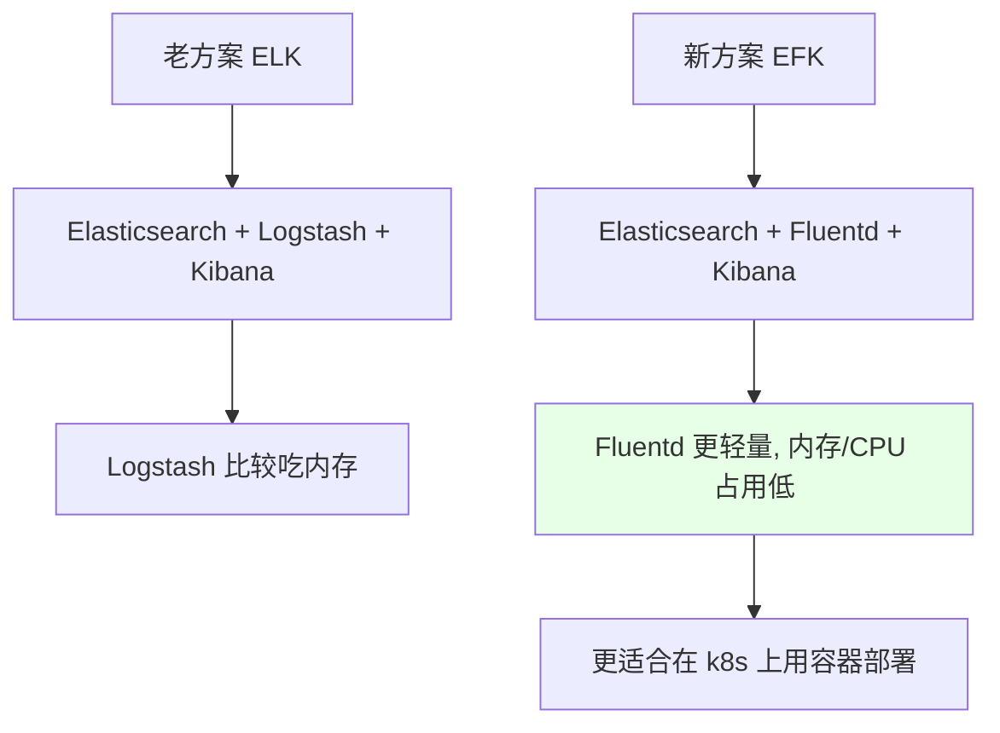
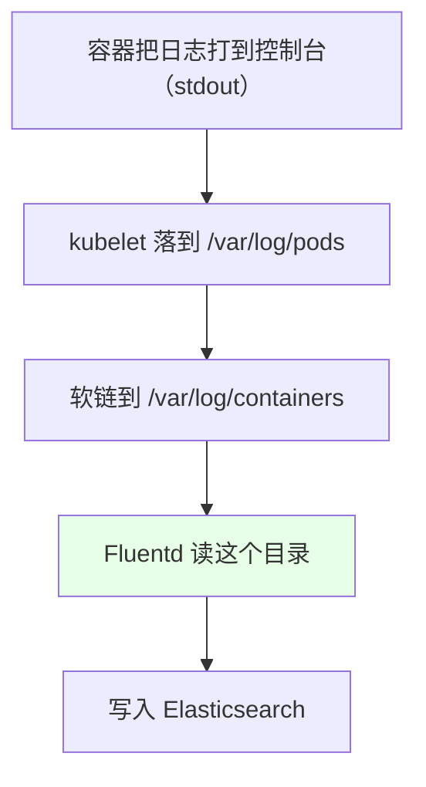
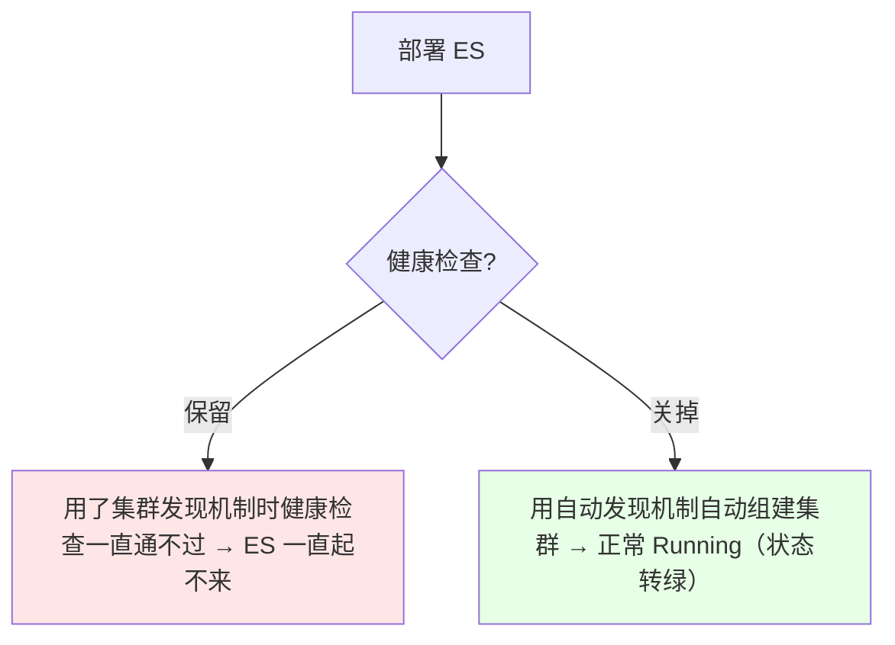
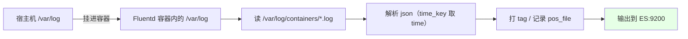
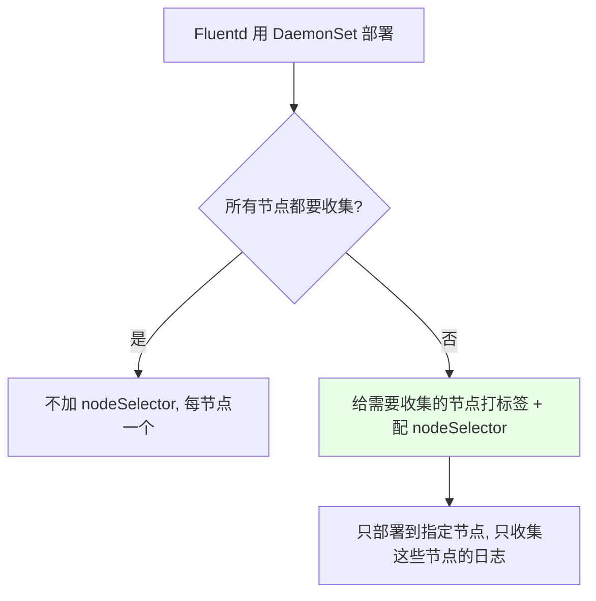
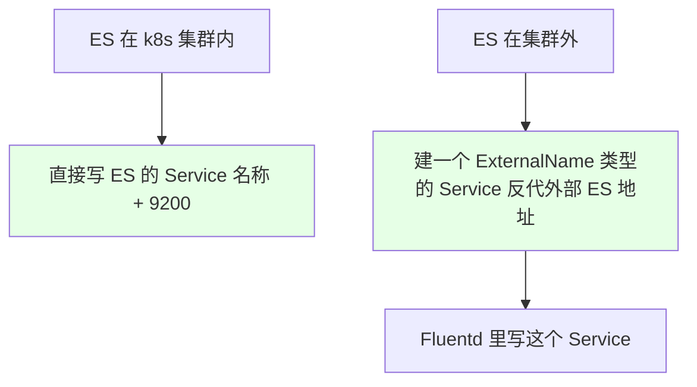
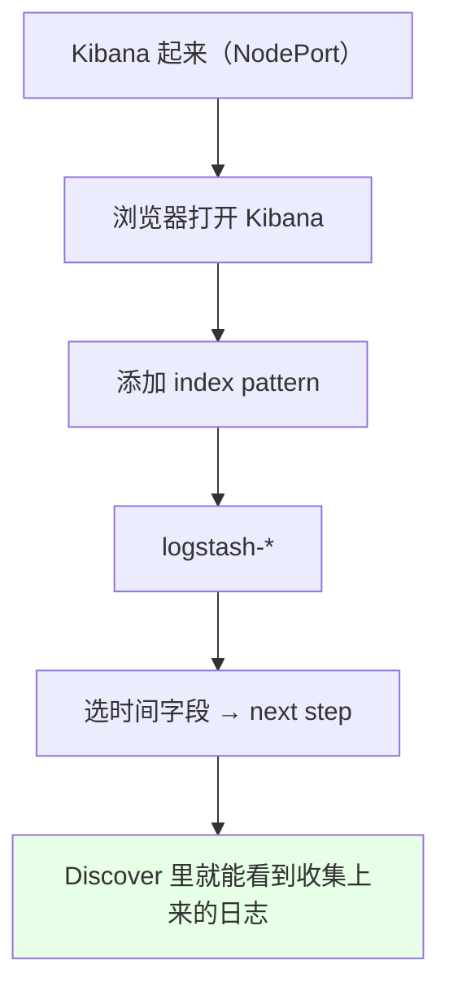
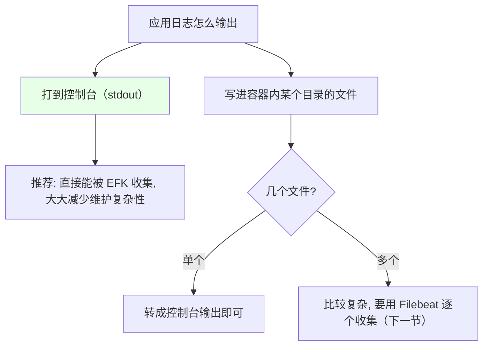

# Kubernetes 集群部署: EFK 日志收集（Fluentd 收集容器控制台日志写入 Elasticsearch）

从这一章开始讲 k8s 里的监控与日志收集。日志收集分两部分：本节讲 **EFK**（收集宿主机上、即容器打到控制台的日志），下一节讲 Filebeat（收集容器**内部文件**的日志）。

结论先摆：

1. **EFK = Elasticsearch + Fluentd + Kibana**；老方案 ELK 里的 Logstash **比较吃内存**，**Fluentd 更轻量**，更适合在 k8s 里以容器方式部署；
2. **Fluentd 主要收集 `/var/log/containers/` 下的日志**（新版本路径在此，**版本不同路径可能不同**），这些文件是从 `/var/log/pods` 软链过来的；
3. **EFK 部署几乎不用改配置** —— 把官方 `cluster/addons` 目录里的文件下载下来直接部署就能收日志；
4. **两个必改点**：ES 的**健康检查要关掉**（用了集群发现机制时健康检查一直通不过、ES 起不来）；**Kibana 的 Deployment 里有一处要注释掉**（否则会用 proxy 地址访问而不是 Service 地址）；
5. **ES 不建议部署在 k8s 里**（特别消耗资源），生产用外部 ES 集群，通过 Service 反代进去；
6. **Fluentd 版本要和 ES 版本对应**，不能太高，否则 ES 不支持某些语法。

## 纲要

- EFK 与 ELK：为什么换掉 Logstash
- 日志从哪来：/var/log/containers
- 部署文件在哪
- ES 的部署注意点
- Fluentd 的 ConfigMap 要点
- Fluentd DaemonSet 与 nodeSelector
- 输出到 ES 与外部 ES 的接法
- Kibana 的两处改动与索引配置
- 控制台输出 vs 文件输出
- 生产要考虑的事

## EFK 与 ELK：为什么换掉 Logstash



| 方案 | 组成 | 特点 |
| --- | --- | --- |
| ELK | Elasticsearch + **Logstash** + Kibana | Logstash 较重，内存占用高 |
| **EFK** | Elasticsearch + **Fluentd** + Kibana | **轻量**，适合容器化部署 |

## 日志从哪来



| 路径 | 说明 |
| --- | --- |
| `/var/log/containers/` | **Fluentd 主要收集这里**（新版本路径在此） |
| `/var/log/pods/` | 真实日志所在，`/var/log/containers` 是软链过来的 |

> **版本不同，日志文件路径可能不同** —— 部署前先 `ls /var/log/containers` 确认一下。

## 部署文件在哪

```text
官方仓库（kubernetes/cluster/addons/fluentd-elasticsearch）里的文件清单:

├── es-service.yaml               ← ES 的 Service（名称 elasticsearch-logging）
├── es-statefulset.yaml           ← ES 的 StatefulSet（课程版本 7.4.2）
├── fluentd-es-configmap.yaml     ← Fluentd 的配置（核心）
├── fluentd-es-ds.yaml            ← Fluentd 的 DaemonSet
├── kibana-deployment.yaml        ← Kibana（课程版本 7.2）
└── kibana-service.yaml           ← Kibana 的 Service（NodePort）
```

跟着官方仓库的版本走（EFK 会更新版本），**下载下来几乎不需要做任何改动就能直接部署**。

## ES 的部署注意点



| 注意点 | 说明 |
| --- | --- |
| **健康检查要关掉** | ES 用了 k8s 集群发现机制来组建集群，这种情况下**健康检查一直通不过、ES 一直起不来**，先关掉 |
| 不挂数据盘（课程测试） | 生产环境应该有自己的 ES 集群（规模可能几百上千台） |
| **不建议部署在 k8s 里** | **ES 特别消耗资源**；除非有 k8s 专用节点给它用，否则**用外部 ES 集群** |
| Service 名称 | `elasticsearch-logging`，Fluentd / Kibana 都按这个名字找它 |

```yaml
# es-statefulset.yaml：把 readinessProbe 相关段落注掉（课程做法）
# readinessProbe:
#   httpGet:
#     path: /_cluster/health?local=true
#     port: 9200
```

## Fluentd 的 ConfigMap 要点



| 配置项 | 作用 |
| --- | --- |
| 目录挂载 | DaemonSet 把宿主机的 `/var/log` 挂到容器内的同路径，Fluentd 才能读到宿主机日志 |
| `pos_file` | **记录上次读到文件的哪一行**（断点续读，重启不重复采集） |
| `time_key` / 格式化 | Docker 输出的日志是 **json 文件**，取其中的 `time` 字段做时间键并格式化 |
| tag / match 语法 | Fluentd 自己的语法，参数很多，一般不用改 |

ConfigMap 里收集的内容分两类：

```text
fluentd-es-configmap 收集的日志:

容器输出类
└── /var/log/containers/*.log   ← 程序打到控制台的日志（主要目标）

系统 / 组件类
├── /var/log/salt（系统日志）
├── docker 守护进程日志（手动指定输出路径时也要收集）
├── etcd 日志
├── kubelet 日志
├── kube-apiserver 日志
├── kube-controller-manager 日志
└── kube-scheduler 日志
```

> 组件日志的路径如果没做单独配置也能收集 —— 配置里都已经列好了，按需打开即可。Fluentd 的配置比 Logstash 简单些但也挺复杂，**一般不用自己改，需要调的只是一些优化参数**。

## Fluentd DaemonSet 与 nodeSelector



```bash
# 给需要收集日志的节点打标签
kubectl label node node02 fluentd=true
kubectl get node -l fluentd=true
```

> 课程只部署在了 node02 上，所以**只收集到该节点的日志** —— 查数据时别的节点没有，就是这个原因。

## 输出到 ES 与外部 ES 的接法

```yaml
# fluentd-es-configmap.yaml 的输出段（节选）
<match **>
  @type elasticsearch
  host elasticsearch-logging      # ← 就是 ES 的 Service 名称
  port 9200
  ...
</match>
```



**如果 ES 在集群外部**：用之前讲过的 `ExternalName` 类型的 Service 把外部 ES 地址反代进来，然后在配置里写这个 Service 即可。

> **Fluentd 版本要和 ES 版本对应，不能太高** —— 版本过高时 ES 可能不支持 Fluentd 用到的语法。

## Kibana 的两处改动与索引配置

```text
Kibana 部署时要注意的两处:

1. kibana-deployment.yaml 里有一处要注释掉
   └── 原因: 用 NodePort Service 访问时, 它却用 proxy 那个地址去访问
       └── 不注释掉就访问不到（课程实踩）

2. 连接 ES 的地址
   └── 集群内: 写 ES 的 Service 名称
   └── 集群外: 用 Service 把外部地址映射进来
```



```bash
# 拿 Kibana 的 NodePort（课程环境是 31223，各自不同）
kubectl get svc -n public-service | grep kibana
# 也可以装 Ingress 配域名访问（更规范）
```

查日志时一般按 **namespace → Deployment 名称 → Pod 名称** 这个顺序去搜。索引建好之后相当于做了一次索引，能定位到对应 Pod / 对应文件里的日志。

## 控制台输出 vs 文件输出



**建议应用的日志打到控制台** —— 这样 `kubectl logs -f` 能看到，宿主机 `/var/log/containers` 下也能找到，EFK 直接就能收。不可能让每个开发都去改日志输出方式，所以输出到文件的情况要用 Filebeat 兜底。

## 生产要考虑的事

```text
生产环境用 EFK 要额外考虑的:

├── ES 放哪
│   └── 不建议放 k8s 里（太耗资源）, 用外部 ES 集群
├── Fluentd 挂了会不会丢日志
│   └── pos_file 能保证重启后接着读, 但要考虑缓冲与积压
├── Fluentd 的优化参数
│   └── 默认配置能用, 但生产场景多, 一般还是要改
└── 只收集需要的节点
    └── 用 nodeSelector 精确控制
```

## API 速览

| 能力 | 做法 |
| --- | --- |
| 拿部署文件 | kubernetes 官方仓库 `cluster/addons/fluentd-elasticsearch` |
| 确认日志路径 | `ls /var/log/containers`（版本不同路径可能不同） |
| 让 ES 起来 | 关掉健康检查（集群发现机制下它一直通不过） |
| 只收集部分节点 | 给节点打标签 + DaemonSet 配 `nodeSelector` |
| 接外部 ES | 用 `ExternalName` Service 反代，配置里写这个 Service |
| 让 Kibana 能访问 | 注掉 Deployment 里 proxy 相关那处 |
| 建索引 | Kibana 里加 `logstash-*` 的 index pattern → Discover |
| 查日志 | 按 namespace → Deployment 名 → Pod 名 顺序搜 |

## Demo 示例

```bash
NS=public-service

# 1. 确认容器日志路径存在（版本不同路径可能不同）
ls /var/log/containers | head

# 2. 部署 ES（先关掉健康检查）
kubectl apply -f es-service.yaml -n $NS
kubectl apply -f es-statefulset.yaml -n $NS
kubectl get pod -n $NS | grep elasticsearch

# 3. 部署 Fluentd（ConfigMap + DaemonSet）
kubectl apply -f fluentd-es-configmap.yaml -n $NS
kubectl apply -f fluentd-es-ds.yaml -n $NS

# 4. 只让打了标签的节点参与收集
kubectl label node node02 fluentd=true
kubectl get pod -n $NS -o wide | grep fluentd

# 5. 部署 Kibana（注掉 proxy 那处）并拿 NodePort
kubectl apply -f kibana-deployment.yaml -n $NS
kubectl apply -f kibana-service.yaml -n $NS
kubectl get svc -n $NS | grep kibana

# 6. 浏览器打开 Kibana → 加 logstash-* 索引 → Discover 看日志

# 7. 看 Fluentd 有没有报错
kubectl logs -n $NS $FLUENTD_POD
```

### 总结

- **EFK = Elasticsearch + Fluentd + Kibana**，替换 ELK 里的 Logstash 是因为 **Logstash 比较吃内存、Fluentd 更轻量**，更适合在 k8s 里以容器方式部署；
- **Fluentd 主要收集 `/var/log/containers/` 下的日志**（该目录是从 `/var/log/pods` 软链过来的），**版本不同路径可能不同**，部署前先确认；
- **部署文件来自 kubernetes 官方仓库的 `cluster/addons/fluentd-elasticsearch`**，跟着版本走，**下载下来几乎不用改就能直接部署收日志**；
- **两个必改点**：一是 **ES 的健康检查要关掉**（它用 k8s 集群发现机制组建集群时，健康检查一直通不过、ES 一直起不来，关掉后用自动发现就能正常 Running 并转绿）；二是 **Kibana 的 Deployment 里有一处要注释掉**，否则用 NodePort Service 访问时它会去用 proxy 那个地址，导致访问不到；
- **ES 不建议部署在 k8s 里**（特别消耗资源），生产用外部 ES 集群，通过 `ExternalName` Service 反代后在 Fluentd / Kibana 的配置里写这个 Service；另外 **Fluentd 版本要与 ES 版本对应，不能太高**；
- **Fluentd 的配置核心**：把宿主机 `/var/log` 挂进容器、用 `pos_file` 记录上次读到的行（断点续读）、按 json 解析并取 `time` 做时间键；它既收集容器控制台输出，也收集 etcd / kubelet / kube-apiserver 等组件日志；**DaemonSet 用 `nodeSelector` 控制只部署到打了标签的节点**（课程只部署在 node02，所以只收到该节点的日志）；
- **建议应用把日志打到控制台**（`kubectl logs` 能看到、EFK 直接能收，维护复杂性大大降低）；输出到文件的场景，单个文件可转成控制台输出，多个文件就要用下一节的 Filebeat 逐个收集；生产上还要额外考虑 Fluentd 挂了会不会丢日志、优化参数等问题。

