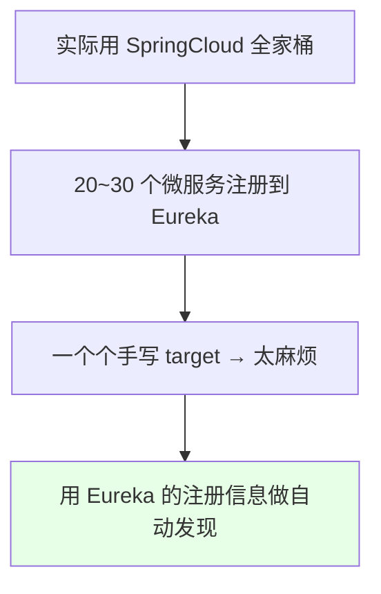
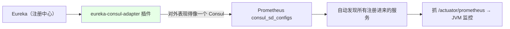
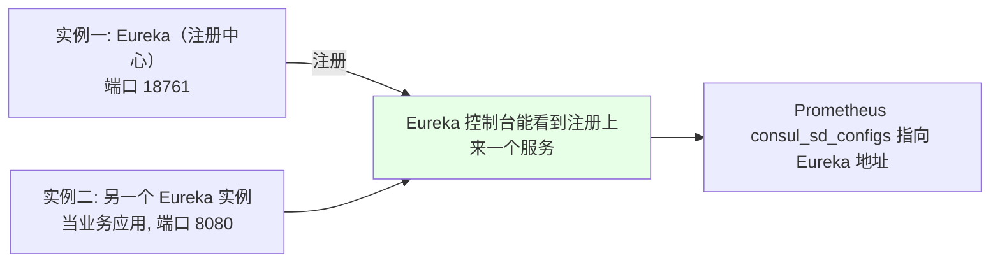
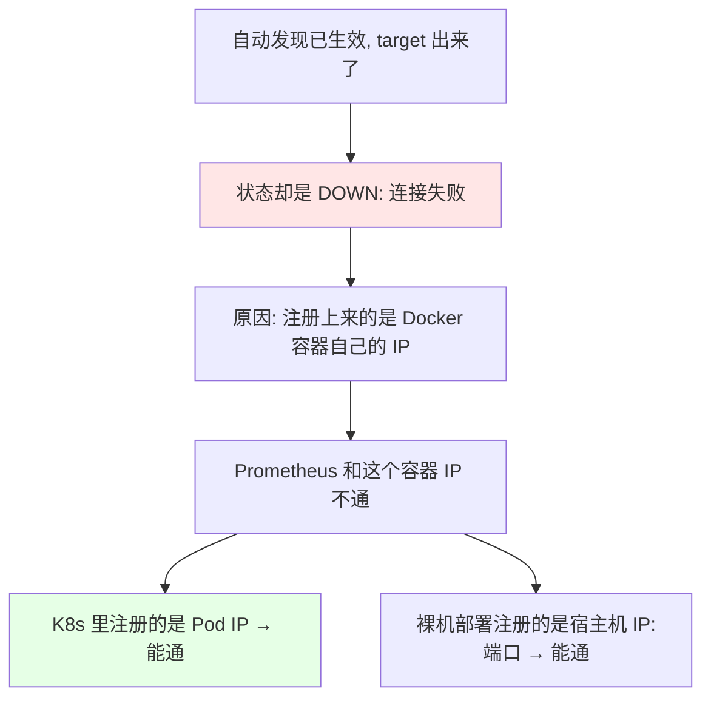
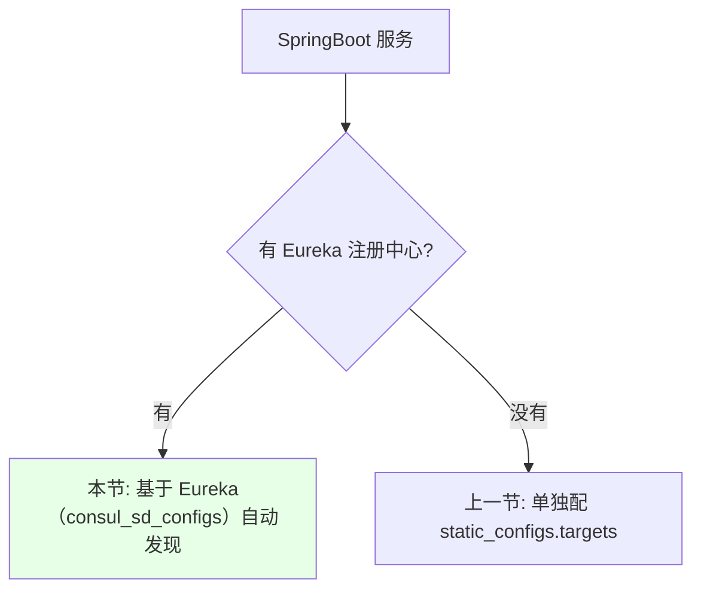

# Kubernetes 集群部署: 基于 Eureka 自动发现监控 Java JVM（eureka-consul-adapter 与 consul_sd_configs）

上一节是给**单个 SpringBoot 项目**做 JVM 监控。实际生产里不会只有一个 SpringBoot —— 用的是 **SpringCloud 全家桶**，服务都注册到 **Eureka** 里互相调用。二三十个微服务，一个个配 target 显然不现实。

结论先摆：

1. 思路是**复用 Eureka 的注册信息做服务发现** —— 服务名是注册中心给的，你根本没法手动改，只能靠自动发现；
2. 实现靠一个插件 **eureka-consul-adapter**：它让 Eureka 对外表现得像一个 Consul，于是 Prometheus 就能用现成的 **`consul_sd_configs`** 去发现它；
3. **插件版本要跟 SpringBoot 版本对应**（演示环境 SpringCloud 2.1.9 → 用 1.1.0，**不要盲目用最新**）；
4. 课程演示里**发现是成功的，但抓取是失败的** —— 因为注册上来的是 Docker 容器自己的 IP，与 Prometheus 不通；**放在 K8s 里注册的就是 Pod IP，天然能通**。

## 纲要

- 为什么单个配置不够用
- eureka-consul-adapter 的作用
- 步骤一：在 Eureka 里加插件依赖
- 步骤二：业务应用侧照旧加 micrometer
- 多模块仓库的依赖加在哪
- 演示：起两个实例，一个当注册中心一个当业务应用
- Prometheus 侧：consul_sd_configs 配置
- 坑：注册上来的是容器 IP 导致抓取失败
- 没有 Eureka 时怎么办

## 为什么单个配置不够用



| 场景 | 做法 |
| --- | --- |
| 单个 SpringBoot、没有注册中心 | **上一节的做法**：单独配 target |
| SpringCloud + Eureka 注册中心 | **本节**：基于 Eureka 的服务发现自动加监控 |

## eureka-consul-adapter 的作用



> Prometheus 的服务发现有很多种（Kubernetes、文件、DNS、Consul、Eureka…），这里**用一个 Consul 插件让 Eureka 兼容 Consul 协议**，于是直接复用 `consul_sd_configs`。

## 步骤一：在 Eureka 里加插件依赖

```xml
<!-- 加在 Eureka 的 pom.xml 里 -->
<dependency>
    <groupId>at.twinformatics</groupId>
    <artifactId>eureka-consul-adapter</artifactId>
    <version>1.1.0</version>
</dependency>
```

> 插件的 Maven 坐标以官方 README 为准，关键是**版本要和自己的 SpringCloud 版本对应**。

| 项 | 取值 | 说明 |
| --- | --- | --- |
| 插件 | eureka-consul-adapter | 让 Eureka 提供 Consul 风格的服务发现接口 |
| 版本 | **1.1.0** | **SpringCloud 2.1.x 用 1.1.x 以上**；课程里 SpringBoot 是 2.1.9，所以对应 1.1.0 |
| 选版本原则 | **跟自己的版本对应即可，不用追求最新** | 版本不对会起不来 |

> 加完依赖要**重新编译**（`mvn clean package -DskipTests`）。

## 步骤二：业务应用侧照旧加 micrometer

```xml
<dependency>
    <groupId>org.springframework.boot</groupId>
    <artifactId>spring-boot-starter-actuator</artifactId>
</dependency>
<dependency>
    <groupId>io.micrometer</groupId>
    <artifactId>micrometer-registry-prometheus</artifactId>
</dependency>
```

```properties
management.endpoints.web.exposure.include=*
management.endpoint.shutdown.enabled=false
management.metrics.tags.application=${spring.application.name}
```

> **每个要监控的业务模块都要加这一组依赖**（和上一节完全一样）。另外**服务注册地址是开发写在配置文件里的**，不是运维改的。

## 多模块仓库的依赖加在哪

```text
一个 git 仓库放多个模块时的两种加法:

仓库根目录
├── pom.xml                 ← 方式一：加在主控制文件（父 pom）里
│                               → 所有模块统一继承，一次搞定
├── module-user/
│   └── pom.xml             ← 方式二：加在子模块的 pom 里
├── module-order/
│   └── pom.xml
└── module-eureka/
    └── pom.xml             ← eureka-consul-adapter 加在这里
```

| 方式 | 适用 |
| --- | --- |
| 加在**根目录父 pom** | 模块多、想全部统一带上插件，一次改完 |
| 加在**单独子模块的 pom** | 只想给个别模块加 |

> 大部分情况一个 git 仓库只有一个模块，那就直接改那个 `pom.xml`。

## 演示：起两个实例，一个当注册中心一个当业务应用



业务应用侧要改的配置：

```properties
# 端口改成 8080（和注册中心区分开）
server.port=8080

# 注册地址指向 Eureka（注册中心）的地址
eureka.client.service-url.defaultZone=http://192.168.1.19:18761/eureka/

# 应用名改一下，模拟成另一个业务应用
spring.application.name=demo-service
```

```bash
# 起注册中心
java -jar eureka-server.jar

# 起业务应用（会注册到上面的 Eureka）
java -jar demo-service.jar --server.port=8080
```

> 课程里因为编译另一个模块老是失败（依赖别的模块、下载又慢），**直接起了两个 Eureka 实例来模拟**：一个当注册中心，一个当业务应用。刷新 Eureka 控制台能看到**已经注册上来一个服务**（界面上显示的不是 IP）。

## Prometheus 侧：consul_sd_configs 配置

还是在那份 `additionalScrapeConfigs` 里加一个 job：

```yaml
- job_name: 'jvm-auto-discovery'
  metrics_path: /actuator/prometheus
  consul_sd_configs:
    - server: '192.168.1.19:18761'    # ← 填 Eureka 的地址（插件已让它兼容 Consul）
      services: []                    # ← 留空 = 发现注册中心里的所有服务
  # 这里不再需要 static_configs.targets，可以去掉
```

| 字段 | 说明 |
| --- | --- |
| `consul_sd_configs.server` | **填 Eureka 的地址**（因为装了 consul 插件，Eureka 就能被当成 Consul 发现） |
| `services: []` | 留空表示**发现所有服务** |
| `metrics_path` | `/actuator/prometheus`，和上一节一致 |
| `static_configs` | **可以去掉了** —— 这就是自动发现的意义 |

## 坑：注册上来的是容器 IP 导致抓取失败



| 部署形态 | 注册上来的地址 | 能否连通 |
| --- | --- | --- |
| 课程演示（Docker 模拟） | **Docker 容器自己的 IP** | ❌ Prometheus 与它不通（**这个报错可以忽略**） |
| Kubernetes 里 | **Pod IP** | ✅ 通 |
| 裸机部署 | **宿主机 IP + 端口** | ✅ 通 |
| Docker 用 host 网络 | 宿主机网络 | ✅ 通（把网络模式改成 host 即可） |

> **发现的逻辑本身是成功的**，只是演示环境的网络不通。重点是学会这套配置方式。

## 没有 Eureka 时怎么办



> 到这里 Prometheus 这一章就讲完了：黑盒、白盒、中间件、宿主机、业务应用埋点、自动发现、邮件/微信告警都覆盖了。**各种告警方式配置都差不多，区别只在 `receiver`**。剩下的是举一反三 —— 按这些例子去监控其他类型的应用。

## API 速览

| 能力 | 做法 |
| --- | --- |
| 自动发现 Eureka 服务 | 装 **eureka-consul-adapter** 插件 + `consul_sd_configs` |
| 插件版本 | SpringCloud 2.1.x → **1.1.x**（演示用 1.1.0，**别用太新的**） |
| 插件加在哪 | Eureka 的 `pom.xml`，加完要重新编译 |
| 业务应用侧 | 照旧加 actuator + micrometer 依赖（**每个模块都要加**） |
| 多模块仓库 | 加在父 pom（全部继承）或子模块 pom（单个生效） |
| Prometheus 配置 | `consul_sd_configs.server` = Eureka 地址，`services: []` |
| metrics 路径 | `/actuator/prometheus` |
| 静态 target | **可以去掉**，交给自动发现 |
| 连通性 | K8s 里是 Pod IP（通）；裸机是宿主机 IP:端口（通）；**Docker 桥接 IP 不通** |
| 无注册中心 | 退回上一节的单独配置方式 |

## Demo 示例

```bash
# 1. Eureka 的 pom.xml 加 eureka-consul-adapter（版本与 SpringCloud 对应）
# 2. 业务模块的 pom.xml 加 actuator + micrometer
# 3. 业务模块配置里改端口、改 Eureka 注册地址、改应用名
# 4. 用 maven 容器编译两个包
mvn clean package -DskipTests

# 5. 起注册中心
java -jar eureka-server.jar

# 6. 起业务应用，确认 Eureka 控制台里能看到它注册上来
java -jar demo-service.jar --server.port=8080

# 7. Prometheus 侧加 consul_sd_configs（server 填 Eureka 地址）
kubectl get secret prometheus-k8s-additional -n monitoring \
  -o jsonpath='{.data.prometheus-additional\.yaml}' | base64 -d > prometheus-additional.yaml

kubectl create secret generic prometheus-k8s-additional \
  --from-file=prometheus-additional.yaml -n monitoring \
  --dry-run=client -o yaml | kubectl apply -f -

# 8. 等 Prometheus 刷新，看 target 是否被自动发现
#    （若状态 DOWN，先确认注册上来的地址 Prometheus 是否可达）
kubectl logs -n monitoring prometheus-k8s-0 -c prometheus | grep -i reload
```

### 总结

- **单个配置只适合没有注册中心的场景**：实际用 SpringCloud 全家桶时，服务都注册到 Eureka，二三十个微服务的 target **一个个手写不现实**，要用 Eureka 的注册信息做自动发现（**服务名是注册中心给的，没法手动改**）；
- **实现靠 eureka-consul-adapter 这个插件**：它让 Eureka 对外表现得像一个 Consul，于是 Prometheus 直接用现成的 **`consul_sd_configs`** 去发现 —— Prometheus 的服务发现种类很多（K8s / 文件 / DNS / Consul / Eureka），原理相通；
- **插件版本必须和 SpringCloud 版本对应**：演示环境 SpringBoot 2.1.9 → 用 **1.1.0**，**不要盲目追最新**；插件加在 **Eureka 的 `pom.xml`** 里，加完要重新编译；
- **业务模块侧照旧加 actuator + micrometer 依赖**（和上一节完全一样，**每个要监控的模块都要加**）；**多模块仓库**可以加在父 pom 让所有模块继承，也可以只改某个子模块的 pom；**服务注册地址是开发写在配置文件里的**；
- **Prometheus 侧配置极简**：`consul_sd_configs.server` 填 **Eureka 的地址**、`services: []` 表示发现所有服务、`metrics_path: /actuator/prometheus`，**`static_configs.targets` 可以去掉了** —— 这正是自动发现的意义；
- **演示环境的坑**：发现**成功**了但抓取**失败**，因为注册上来的是 **Docker 容器自己的 IP**，Prometheus 与它不通 —— **这个报错可以忽略**；在 K8s 里注册的是 **Pod IP**、裸机部署是**宿主机 IP:端口**，都能通（Docker 换成 host 网络也能通）；
- **没有 Eureka 注册中心就退回上一节的单独配置方式**；至此 Prometheus 这一章讲完（黑盒 / 白盒 / 中间件 / 宿主机 / 业务埋点 / 自动发现 / 邮件与微信告警），**各种告警方式配置都差不多，区别只在 `receiver`**，剩下的是举一反三去监控其他类型的应用。

