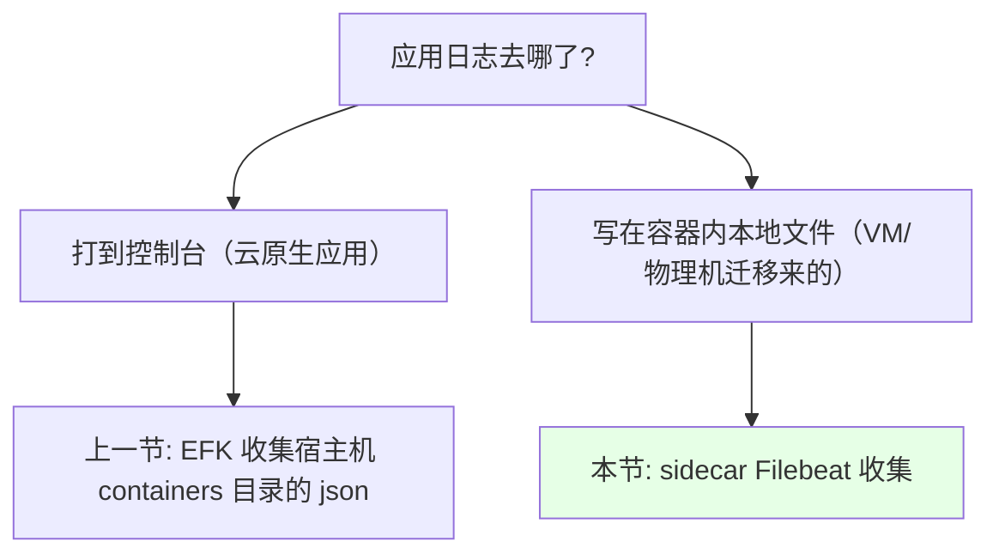
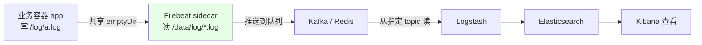
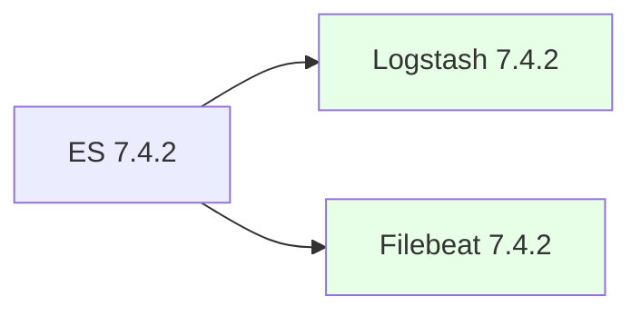
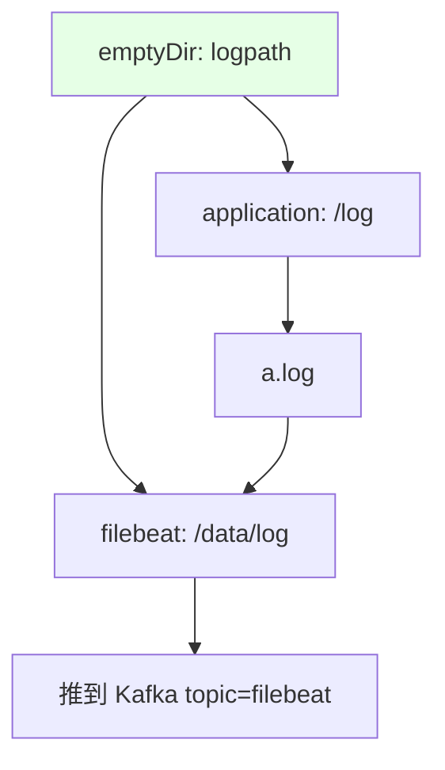

# Kubernetes 集群部署: 使用 Filebeat 收集容器内日志（sidecar 共享 emptyDir + Kafka 链路）

上一节的 EFK（Elasticsearch + Fluentd + Kibana）收集的是**宿主机 `/var/lib/docker/containers` 下的 json 日志文件** —— 也就是「应用把日志打到控制台」这一类。这一节解决另一类：**日志写在容器内部文件里的应用**（多是从虚拟机 / 物理机迁移过来的老应用）。

结论先摆：

1. **不要求开发改代码**：老应用迁移到容器后日志还是写本地文件，改成控制台输出对开发是实打实的工作量，所以**用技术手段把容器内日志收集起来**；
2. 做法是在业务 Pod 里**以 sidecar 形式注入一个 Filebeat 容器**，两个容器**共享一个 `emptyDir` 卷**，Filebeat 因此能读到业务容器的日志文件（Filebeat **非常轻量，占资源极少**）；
3. 链路是 **Filebeat → Kafka（队列，缓解 Logstash 压力）→ Logstash → Elasticsearch → Kibana**；
4. **版本必须对齐**：Filebeat / Logstash 的镜像版本**最好和 ES 完全一致**（课程里 ES 是 7.4.2，两者都用 7.4.2），不要跨版本。

## 纲要

- 两类日志场景的区别
- 整体架构：sidecar + emptyDir + 队列
- 步骤一：先把 Kafka / Zookeeper 起来
- 步骤二：Filebeat 的 ConfigMap
- 步骤三：Logstash 的 ConfigMap（含索引拆分）
- 步骤四：部署 Logstash
- 步骤五：业务 Pod 注入 sidecar
- 四个环境变量与 Downward API
- 版本对齐与 namespace 注意事项

## 两类日志场景的区别



| 场景 | 成因 | 收集方式 |
| --- | --- | --- |
| 日志到控制台 | 应用**基于容器开发**，设计之初就输出到控制台 | EFK 直接收宿主机 `/var/lib/docker/containers` |
| 日志到本地文件 | 应用**从虚拟机 / 物理机容器化迁移**过来，仍然打本地文件 | **本节**：Pod 内注入 Filebeat sidecar |

> 改代码让老应用输出到控制台？**对开发来讲是一整块工作量**，不如用技术手段收。

## 整体架构：sidecar + emptyDir + 队列



```text
一个 Pod 里的两个容器共享同一个卷:

Pod
├── volume: logpath（emptyDir）
│
├── container: application
│     └── mountPath: /log          ← 应用把日志写到这里（如 /log/a.log）
│
└── container: filebeat（sidecar）
      └── mountPath: /data/log     ← Filebeat 的收集路径，指着同一个卷
```

| 环节 | 说明 |
| --- | --- |
| 共享卷 | 就是前面讲过的 **`emptyDir`**，两个容器都挂它，日志文件就共享了 |
| 推送到队列 | **推荐推到 Kafka 或 Redis**，用来**缓解下游 Logstash 的压力**；也可以直接推其他中间件 |
| Logstash | 从队列里 Filebeat 指定的 **topic** 读取，再写进 ES |
| 之后 | 和 Fluentd 收集上时一样，用 Kibana 看日志 |

## 步骤一：先把 Kafka / Zookeeper 起来

```bash
# 课程里用之前讲过的 chart 起 kafka + zookeeper
helm install kafka kafka/zookeeper
kubectl get pod | grep -E 'kafka|zookeeper'
```

> **注意：如果之前已经起过 zookeeper，要先把它关掉**，否则 Kafka 这个 chart 会**自动再起一个新的 zookeeper**，导致多出来一套。

## 步骤二：Filebeat 的 ConfigMap

```yaml
apiVersion: v1
kind: ConfigMap
metadata:
  name: filebeat-config
  namespace: public-service        # ← 要和**业务容器**在同一个 namespace
data:
  filebeat.yml: |
    filebeat.inputs:
      - type: log                  # ← 还有标准输入等类型，这里是读文件
        paths:
          - /data/log/*.log        # ← 读取日志的路径（挂进来的共享卷）
        fields:
          pod_name:  ${POD_NAME}
          pod_ip:    ${POD_IP}
          namespace: ${POD_NAMESPACE}
          deployment: ${DEPLOYMENT_NAME}
        fields_under_root: true
    tags: ["test-filebeat"]
    output.kafka:
      hosts: ["kafka:9092"]        # ← 写 Kafka 的负载地址
      topic: "filebeat"            # ← 推到这个 topic
```

| 配置项 | 说明 |
| --- | --- |
| `tags` | 课程里改成 `test-filebeat`，这是 Filebeat 的**配置标识** |
| `type: log` | 读日志文件；**也有标准输入等其它 input 类型** |
| `paths` | **读取日志的路径**（挂进来的共享卷路径） |
| `fields`（四个变量） | `podname` / `podIP` / `deployment` / `podnamespace`，**这几个字段后面拿来做索引** |
| `output.kafka` | 写 **Kafka 的负载地址** + topic 名 |
| **namespace** | **这个 ConfigMap 必须和业务容器在同一个 namespace**（业务容器不一定在 `public-service`，也不一定和 Kafka 在一起） |

## 步骤三：Logstash 的 ConfigMap（含索引拆分）

```yaml
apiVersion: v1
kind: ConfigMap
metadata:
  name: logstash-config
  namespace: public-service
data:
  logstash.conf: |
    input {
      kafka {
        bootstrap_servers => "kafka:9092"
        topics => ["filebeat"]              # ← 读 Filebeat 推的那个 topic（可写多个）
        auto_commit_interval_ms => 5000     # ← 自动提交的延迟（毫秒）
      }
    }
    output {
      # 按 namespace 拆索引：public-service 单独一个索引
      if [namespace] == "public-service" {
        elasticsearch {
          hosts => ["http://elasticsearch:9200"]
          index => "public-service-%{+YYYY.MM.dd}"
        }
      } else {
        elasticsearch {
          hosts => ["http://elasticsearch:9200"]
          index => "k8s-%{+YYYY.MM.dd}"
        }
      }
    }
```

| 配置项 | 说明 |
| --- | --- |
| `topics` | 读 Filebeat 推送的那个 topic，**可以写多个** |
| `bootstrap_servers` | Kafka 地址 |
| `auto_commit_interval_ms` | **自动提交的延迟（毫秒）** |
| ES 地址 | 如果 **Logstash 和 ES 不在同一个 namespace，地址后面要带 `.namespace` 后缀**，别漏 |
| 索引拆分 | **按 namespace 判断**：`public-service` 走 `public-service-日期` 索引，其它一律扔到通用索引 |

> 索引用不用拆、怎么拆**按自己需求定**，K8s 里用同一个索引收也可以，也可以按不同 namespace 分。上面这段只是为了演示「可以用判断来拆分索引」。日志怎么切分属于 Logstash 的配置范畴，深入可以去看《EFK Stack》那本书。

## 步骤四：部署 Logstash

```yaml
apiVersion: apps/v1
kind: Deployment
metadata:
  name: logstash
  namespace: public-service
spec:
  replicas: 2                       # ← 可以起多个副本，没问题
  selector:
    matchLabels:
      app: logstash
  template:
    metadata:
      labels:
        app: logstash
    spec:
      containers:
        - name: logstash
          image: docker.elastic.co/logstash/logstash:7.4.2   # ← 和 ES 版本保持一致
```

| 注意点 | 说明 |
| --- | --- |
| 镜像版本 | **必须和 ES 对应**（ES 用 7.4.2，Logstash 就用 7.4.2）；版本不对应**可能导致推不进数据**等各种幺蛾子 |
| 副本 | 可以起多个 |
| ES 复用 | 课程里复用上一节建好的 ES，**不要重复创建**；如果是外部 ES，要格外注意版本 |



> **Filebeat / Logstash 的版本最好和 ES 一一对应**（各版本的 tag 基本都有）；实在对应不上也**别跨大版本**。

## 步骤五：业务 Pod 注入 sidecar

```yaml
apiVersion: apps/v1
kind: Deployment
metadata:
  name: app-demo
  namespace: public-service
spec:
  replicas: 1
  selector:
    matchLabels:
      app: app-demo
  template:
    metadata:
      labels:
        app: app-demo
    spec:
      volumes:
        - name: logpath
          emptyDir: {}                      # ← 共享卷
        - name: filebeat-config
          configMap:
            name: filebeat-config
      containers:
        - name: application
          image: busybox:1.36               # 演示用：手动往文件里写日志
          command:
            - sh
            - -c
            - 'while true; do echo "$(date) hello from app" >> /log/a.log; sleep 5; done'
          env:
            - name: POD_IP
              valueFrom:
                fieldRef:
                  fieldPath: status.podIP
            - name: POD_NAME
              valueFrom:
                fieldRef:
                  fieldPath: metadata.name
            - name: POD_NAMESPACE
              valueFrom:
                fieldRef:
                  fieldPath: metadata.namespace
            - name: DEPLOYMENT_NAME
              value: app-demo                # ← 手动指定，metadata 里取不到
          volumeMounts:
            - name: logpath
              mountPath: /log                # ← 应用输出日志的目录
        - name: filebeat
          image: docker.elastic.co/beats/filebeat:7.4.2
          volumeMounts:
            - name: logpath
              mountPath: /data/log           # ← Filebeat 的收集目录（同一个卷）
            - name: filebeat-config
              mountPath: /usr/share/filebeat/filebeat.yml
              subPath: filebeat.yml
```



**两个挂载点必须都挂到同一个 `logpath` 卷上**，Filebeat 才能看到业务容器写的文件。

## 四个环境变量与 Downward API

| 变量 | 取值方式 | 说明 |
| --- | --- | --- |
| `POD_IP` | `fieldRef: status.podIP` | Pod 的 IP |
| `POD_NAME` | `fieldRef: metadata.name` | Pod 的名称 |
| `POD_NAMESPACE` | `fieldRef: metadata.namespace` | namespace |
| `DEPLOYMENT_NAME` | **手动指定** | **deployment 的名称从 `metadata` 里取不到**，只能手写 |

> **为什么要这四个字段**？不加的话日志**名称不固定、不好找、不好搜**。加上之后可以在 Logstash 里用它们**生成 filter 和索引**，查日志时按 Pod / namespace / 应用维度一搜就出来。

## 版本对齐与 namespace 注意事项

| 事项 | 说明 |
| --- | --- |
| 镜像版本 | Filebeat / Logstash **和 ES 保持一致**（课程里都是 7.4.2），**不要跨版本** |
| Filebeat 的 ConfigMap | 必须**和业务容器在同一个 namespace**；不在 `public-service` 就改到自己那个 namespace |
| Kafka 地址 | 如果 Filebeat 和 Kafka **不在同一个 namespace**，ConfigMap 里的 Kafka 地址要改 |
| 部署时指定 namespace | `kubectl apply -f xxx.yaml -n <自己的 namespace>` |

## API 速览

| 能力 | 做法 |
| --- | --- |
| 收集容器内日志 | 业务 Pod 注入 **Filebeat sidecar** + 共享 **`emptyDir`** |
| 共享卷 | `volumes: emptyDir` → 应用挂日志目录、Filebeat 挂收集目录 |
| 采集配置 | Filebeat ConfigMap（`type: log` + `paths` + `tags` + `output.kafka`） |
| 索引字段 | 注入 `POD_IP` / `POD_NAME` / `POD_NAMESPACE` / `DEPLOYMENT_NAME` |
| 队列 | Kafka / Redis，**缓解 Logstash 压力** |
| 消费 | Logstash 从指定 topic 读（`topics` + `auto_commit_interval_ms`） |
| 索引拆分 | Logstash 里按 `[namespace]` 判断，分流到不同索引 |
| 版本 | Filebeat / Logstash **与 ES 版本一致** |
| namespace | Filebeat ConfigMap 与业务容器同 namespace；跨 namespace 的地址要带 `.namespace` |
| 查看 | Kibana |

## Demo 示例

```bash
NS=public-service

# 1. 起 Kafka + Zookeeper（先把旧的 zookeeper 关掉，否则会多起一套）
kubectl get pod | grep zookeeper

# 2. 建 Filebeat ConfigMap（和业务容器同一个 namespace）
kubectl apply -f filebeat-config.yaml -n $NS

# 3. 建 Logstash ConfigMap（topic 对齐 Filebeat，ES 地址按需带 .namespace）
kubectl apply -f logstash-config.yaml -n $NS

# 4. 部署 Logstash（镜像版本对齐 ES）
kubectl apply -f logstash-deploy.yaml -n $NS
kubectl get pod -n $NS | grep logstash

# 5. 部署带 Filebeat sidecar 的业务应用
kubectl apply -f app-demo.yaml -n $NS
kubectl get pod -n $NS | grep app-demo

# 6. 确认两个容器都起来了（等拉镜像）
kubectl describe pod -n $NS -l app=app-demo

# 7. 手动往共享卷里写点日志，验证链路
kubectl exec -n $NS deploy/app-demo -c application -- \
  sh -c 'echo "$(date) test log" >> /log/a.log'

# 8. 看 Filebeat 有没有读走
kubectl logs -n $NS deploy/app-demo -c filebeat

# 9. 到 Kibana 查索引（public-service-日期 或 k8s-日期）
```

### 总结

- **两类日志场景要分开处理**：基于容器开发的应用日志打到控制台，用上一节的 EFK 收宿主机 `/var/lib/docker/containers`；**从虚拟机 / 物理机迁移过来的老应用日志写在容器内本地文件**，改成控制台输出对开发是实打实的工作量，所以用技术手段收集；
- **做法是在业务 Pod 里以 sidecar 形式注入 Filebeat**（非常轻量、占资源极少），**两个容器共享一个 `emptyDir` 卷** —— 应用挂到自己的日志目录、Filebeat 挂到自己的收集路径，于是 Filebeat 就能读到业务容器的日志文件；
- **完整链路**：Filebeat → **Kafka / Redis 队列**（推荐，用来缓解下游 Logstash 的压力；也可以直接推其他中间件）→ Logstash 从 Filebeat 指定的 topic 读取 → 写进 ES → Kibana 查看；
- **Filebeat ConfigMap 要点**：`type: log` + `paths`（共享卷路径）+ `tags` + `output.kafka`（Kafka 负载地址 + topic）；里面引用的 **`podname` / `podIP` / `deployment` / `podnamespace` 四个字段后面拿来做索引**；**这个 ConfigMap 必须和业务容器在同一个 namespace**；
- **Logstash ConfigMap 要点**：`topics` 读 Filebeat 那个 topic（可写多个）、`auto_commit_interval_ms` 控制自动提交延迟；**跨 namespace 时 ES / Kafka 地址要带 `.namespace` 后缀**；可以按 `[namespace]` 做判断**把不同 namespace 拆到不同索引**（也可以全部共用一个索引，按需求定）；
- **四个环境变量靠 Downward API 注入**：`POD_IP` 取 `status.podIP`、`POD_NAME` 取 `metadata.name`、`POD_NAMESPACE` 取 `metadata.namespace`，**`DEPLOYMENT_NAME` 从 metadata 里取不到，只能手动指定**；加这些字段是为了**日志名称不固定时也能按 Pod / namespace / 应用维度快速检索**；
- **版本必须对齐**：**Filebeat 和 Logstash 的镜像版本要和 ES 一一对应**（课程里 ES 7.4.2 就都用 7.4.2），版本不对应可能推不进数据，实在对不上也**别跨大版本**；另外装 Kafka 前**要先把已有的 zookeeper 关掉**，否则会被自动再起一套。

