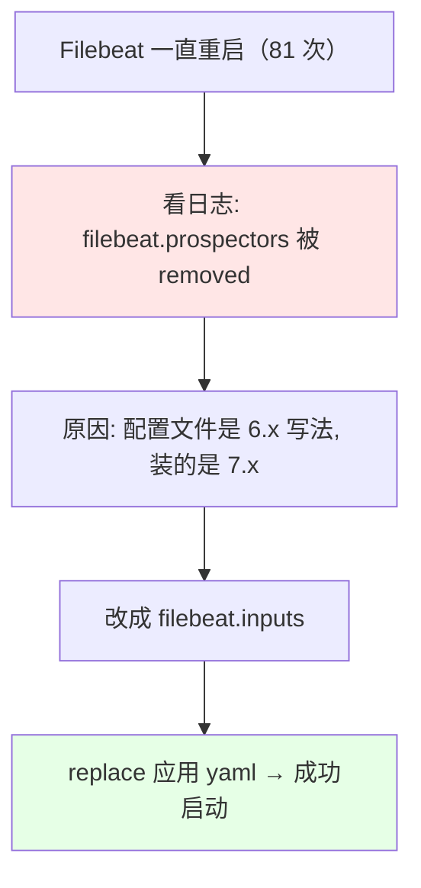
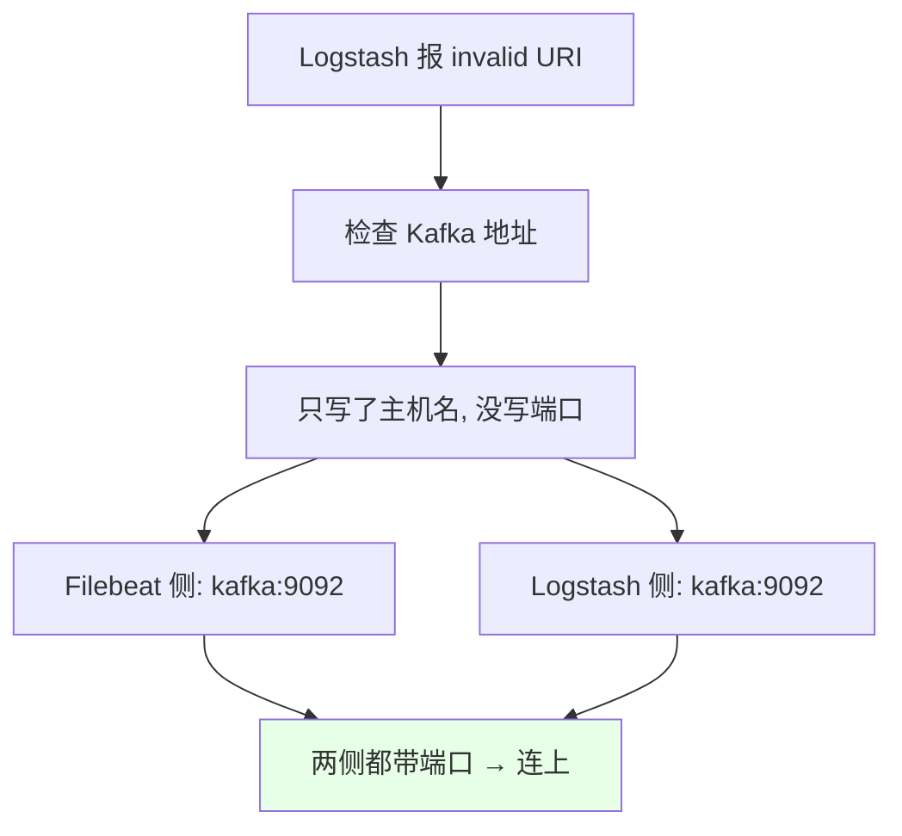
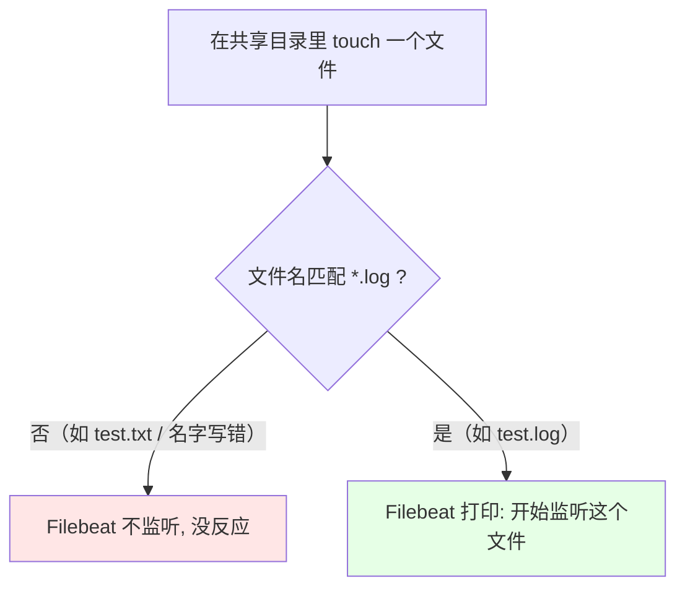
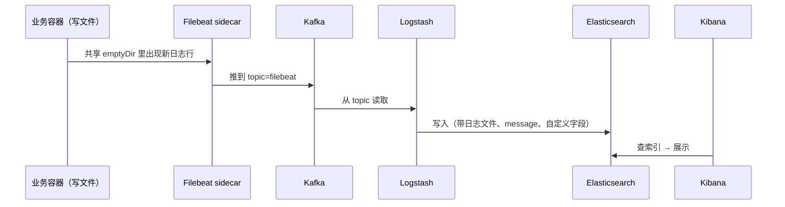
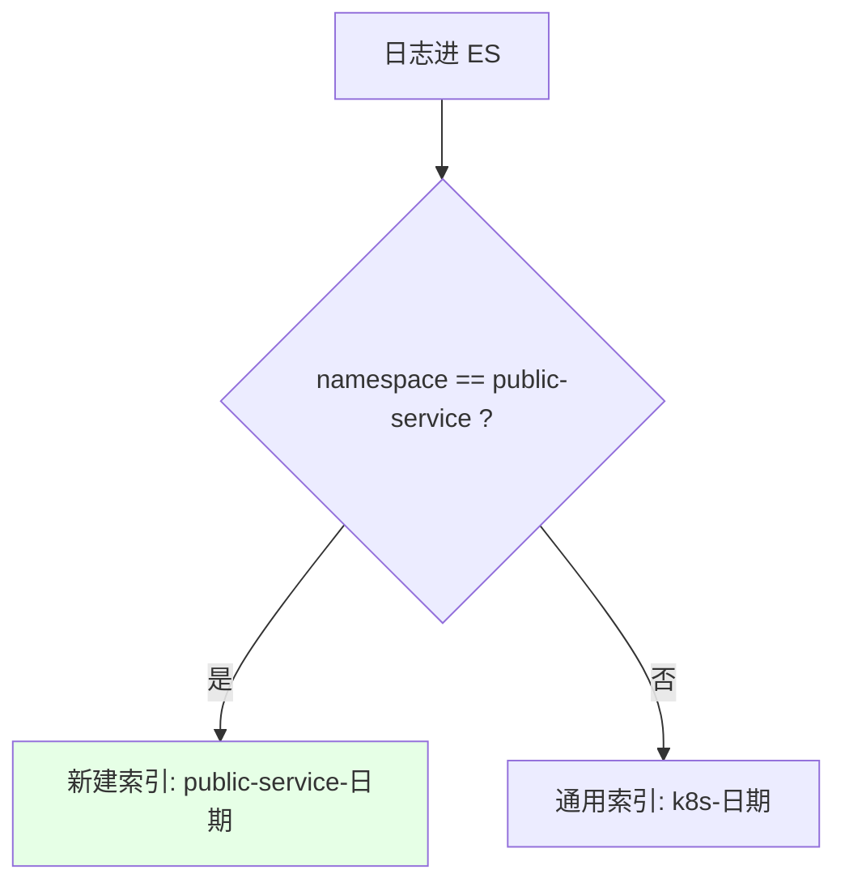
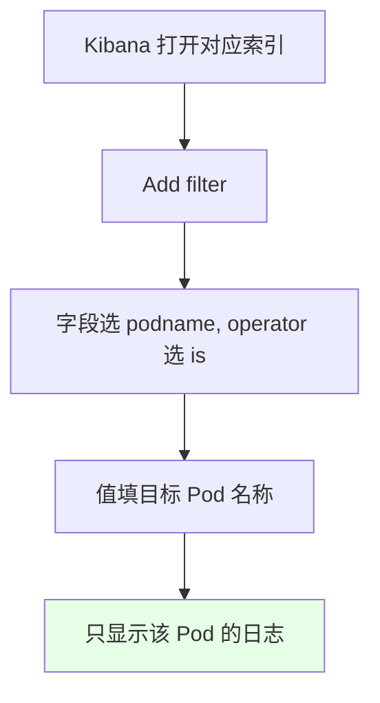
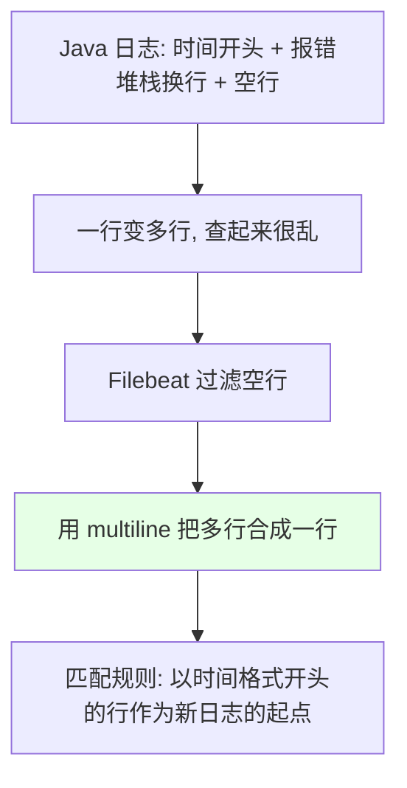

# Kubernetes 集群部署: 使用不同资源名称查询日志（Filebeat 排错 + Kibana 按字段过滤）

上一节把带 Filebeat sidecar 的应用部署上去了，但当时还在拉镜像、没起来。这一节先把**起不来和采不到的坑**排掉，再讲**日志进 ES 之后，怎么按 Pod / namespace / deployment 这些资源名称把日志捞出来**。

结论先摆：

1. **Filebeat 一直重启**（课程里重启了 81 次）的元凶是**配置版本不匹配**：`filebeat.prospectors` 是 **6.x 的写法，7.x 已经改成 `filebeat.inputs`**；
2. **Logstash 报 `invalid URI`** 是因为 **Kafka 地址没写端口号** —— Kafka 9092 在 Filebeat 和 Logstash 两侧**都要带端口**；
3. **日志文件名必须匹配采集规则的 `*.log`**，随便 `touch` 一个不带 `.log` 的文件 Filebeat 不会监听；
4. **要按资源查日志，靠上一节注入的那四个字段**（`podname` / `podIP` / `podnamespace` / `deployment`）—— 在 Kibana 里加一个 `podname is xxx` 的过滤就能只看某个 Pod 的日志。

## 纲要

- 坑一：filebeat.prospectors 被移除（6.x vs 7.x）
- 坑二：Kafka 地址缺端口号导致 invalid URI
- 坑三：文件名要匹配 *.log
- 验证链路：写一条日志看它怎么走
- ES 索引：匹配规则决定进哪个索引
- Kibana 里按资源名称过滤
- Filebeat 也能收宿主机目录
- Java 多行日志的合并（multiline）

## 坑一：filebeat.prospectors 被移除（6.x vs 7.x）



```yaml
# 6.x 的写法（7.x 已废弃，会报 removed）
filebeat.prospectors:
  - type: log
    paths:
      - /data/log/*.log

# 7.x 的正确写法
filebeat.inputs:
  - type: log
    paths:
      - /data/log/*.log
```

| Filebeat 版本 | 字段名 |
| --- | --- |
| 6.x | `filebeat.prospectors` |
| **7.x** | **`filebeat.inputs`** |

> 改完 `replace` 应用 yaml 即可。课程里因为只有 node02 把镜像拉下来了，还**顺手把 Pod 绑到了 node02**。启动后 `config path` 显示 `/data/log`，就是配置文件里配的那个路径。

## 坑二：Kafka 地址缺端口号导致 invalid URI



| 位置 | 写法 |
| --- | --- |
| Filebeat 的 `output.kafka.hosts` | **要带 9092** |
| Logstash 的 `bootstrap_servers` | **也要带 9092** |

> 这是课程里当天报错的直接原因 —— **Filebeat 的端口号忘了写，Logstash 的端口号也忘了写**。改完重启两边就能连上 Kafka 了。

## 坑三：文件名要匹配 *.log



| 挂载点 | 说明 |
| --- | --- |
| `/data/log/.../app` | Filebeat 侧的共享目录 |
| `/home/tomcat/.../target` | **业务容器输出日志的目录** |

```bash
NS=public-service
DEPLOY=app-demo
LOGDIR=/home/tomcat/target

# 文件名必须匹配采集规则里的 *.log
kubectl exec -n $NS deploy/$DEPLOY -c application -- \
  sh -c "touch ${LOGDIR}/test.log"

# 往里写一条数据
kubectl exec -n $NS deploy/$DEPLOY -c application -- \
  sh -c "echo 123 >> ${LOGDIR}/test.log"
```

> 课程里第一次建的文件**名字写错了**（不是 `.log` 结尾），所以没被监听到；改成 `test.log` 之后 Filebeat 立刻打印「开始监听这个文件」。

## 验证链路：写一条日志看它怎么走



```bash
NS=public-service

# 看 Filebeat 有没有把数据传走
kubectl logs -n $NS deploy/app-demo -c filebeat

# 看 Logstash 有没有打出详情（会把日志文件名、message、自定义变量都输出）
LOGSTASH_POD=$(kubectl get pod -n $NS -l app=logstash -o jsonpath='{.items[0].metadata.name}')
kubectl logs -n $NS $LOGSTASH_POD
```

> Logstash 侧会**打一条详情**，把日志文件、message（也就是它的名称）以及我们定义的那些变量全部输出出来，然后把数据推到 ES。

## ES 索引：匹配规则决定进哪个索引



- 在 Kibana 的 **Index Patterns** 里能看到这套匹配规则产生的索引；
- **匹配上规则**就新建对应的索引，**没匹配到**就落到通用索引；
- **索引怎么分完全按自己的需求定制**。

## Kibana 里按资源名称过滤



| 可用字段 | 来源 |
| --- | --- |
| `podIP` | 上一节注入的 `POD_IP`（`status.podIP`） |
| `podname` | `POD_NAME`（`metadata.name`） |
| `podnamespace` | `POD_NAMESPACE`（`metadata.namespace`） |
| `deployment` | `DEPLOYMENT_NAME`（**手动指定**） |

> **这个能力在生产里非常有用**：集群里 namespace 很多、资源类型很多、Pod 也很多，想看**某个 namespace 下某个 deployment 的日志**，直接在 Kibana 里加一个 `podname is xxx` 的过滤即可（字段值相等才会被筛出来）。

## Filebeat 也能收宿主机目录

```text
Filebeat 的两种收法:

1. 收容器内日志（本节）
   └── 共享 emptyDir：应用挂日志目录 + Filebeat 挂收集目录

2. 收宿主机目录
   └── 把宿主机的目录挂载到 Filebeat 的收集目录上，就能监听
```

| 工具 | 特点 |
| --- | --- |
| Fluentd | **配置都帮你做好了，几乎一键启动，不用做任何操作** |
| Filebeat | **需要自己配置索引、过滤规则等**，但**生产环境可能用得比 Fluentd 还多** —— 因为**大部分应用的日志是写在本地文件里的**（除非是按容器开发、直接输出控制台） |

## Java 多行日志的合并（multiline）



```yaml
filebeat.inputs:
  - type: log
    paths:
      - /data/log/*.log
    multiline.pattern: '^[0-9]{4}-[0-9]{2}-[0-9]{2}'
    multiline.negate: true
    multiline.match: after
```

| 参数 | 说明 |
| --- | --- |
| `multiline.pattern` | **正则**：Java 每行开头是时间格式，就拿它当新日志行的起点 |
| `multiline.negate` + `multiline.match` | 不匹配该模式的行**合并到上一行的后面** |
| 空行 | 顺带用 Filebeat **把空行过滤掉** |

> 这就是个正则写法，网上教程很多。课程里会把 7.x 的配置以及 multiline 的配置样例放到素材目录里供参考。

## API 速览

| 能力 | 做法 |
| --- | --- |
| 7.x 字段名 | **`filebeat.inputs`**（不是 `filebeat.prospectors`） |
| Kafka 地址 | **Filebeat 与 Logstash 两侧都要带端口 9092** |
| 采集匹配 | 文件名要匹配 `paths` 里的 `*.log` |
| 验证 Filebeat | `kubectl logs deploy/xxx -c filebeat` |
| 验证 Logstash | 看它有没有打出文件名 + message + 自定义字段的详情 |
| 索引路由 | Logstash 里按 `[namespace]` 判断，匹配上走专用索引，否则走通用索引 |
| 查日志 | Kibana → 选索引 → **Add filter: podname is xxx** |
| 可过滤字段 | `podname` / `podIP` / `podnamespace` / `deployment` |
| 收宿主机日志 | 把宿主机目录挂到 Filebeat 的收集目录 |
| Java 多行 | `multiline.pattern` 正则按时间开头合并 |
| 深入 Logstash | 用 `mutate` / `filter` 做更高级判断，参考《ELK Stack》 |

## Demo 示例

```bash
NS=public-service
DEPLOY=app-demo
LOGDIR=/home/tomcat/target

# 1. 6.x 配置换成 7.x：filebeat.prospectors → filebeat.inputs
kubectl apply -f filebeat-config.yaml -n $NS

# 2. Kafka 地址补上端口 9092（Filebeat 与 Logstash 两侧）
kubectl apply -f logstash-config.yaml -n $NS
kubectl rollout restart deploy/logstash -n $NS

# 3. 重建应用 Pod（必要时绑到已拉取镜像的节点）
kubectl replace -f app-demo.yaml -n $NS
kubectl get pod -n $NS -l app=app-demo

# 4. 建一个匹配 *.log 的文件，看 Filebeat 是否监听
kubectl exec -n $NS deploy/$DEPLOY -c application -- \
  sh -c "touch ${LOGDIR}/test.log"

# 5. 写几条日志
kubectl exec -n $NS deploy/$DEPLOY -c application -- \
  sh -c "echo 123 >> ${LOGDIR}/test.log"

# 6. 看 Filebeat / Logstash 的反应
kubectl logs -n $NS deploy/$DEPLOY -c filebeat
kubectl logs -n $NS -l app=logstash

# 7. Kibana: 建 Index Pattern（public-service-日期 / k8s-日期）
#    然后 Add filter → podname is <目标 Pod 名> → 只看该 Pod 的日志
```

### 总结

- **Filebeat 一直重启的根因是配置版本不匹配**：`filebeat.prospectors` 是 **6.x 的写法，7.x 已经改成 `filebeat.inputs`**（课程里重启了 81 次就是这个），改完 `replace` 应用 yaml 就能起来（必要时把 Pod 绑到已拉取镜像的节点）；
- **Logstash 报 `invalid URI` 是因为 Kafka 地址没写端口** —— **Filebeat 的 `output.kafka.hosts` 和 Logstash 的 `bootstrap_servers` 都要带 `9092`**，这是当天报错的直接原因；
- **采集文件名必须匹配规则**：随便建的文件不被监听，要建成 `*.log` 结尾，Filebeat 才会打印「开始监听这个文件」；两个挂载点分别是 Filebeat 侧的共享目录和业务容器输出日志的目录（`/home/tomcat/.../target`）；
- **验证链路**：往文件里写一条 → Filebeat 把数据传走 → **Logstash 打一条详情（日志文件名、message、自定义变量全部输出）** → 推到 ES；
- **ES 索引由 Logstash 的匹配规则决定**：`namespace == public-service` 走专用索引 `public-service-日期`，**没匹配到就落到通用索引** —— 索引怎么分**完全按自己的需求定制**；
- **按资源名称查日志靠上一节注入的四个字段**：`podname` / `podIP` / `podnamespace` / `deployment`（**deployment 是手动指定的**）；在 Kibana 里 **Add filter → `podname` is 目标 Pod 名** 就只看那个 Pod 的日志 —— 集群里 namespace / 资源类型 / Pod 都很多时这个能力非常有用；
- **Filebeat 与 Fluentd 的分工**：Fluentd 配置都帮你做好了、几乎一键启动；**Filebeat 需要自己配索引和过滤规则，但生产环境可能用得更多**（大部分应用日志写在本地文件而非控制台）。**Filebeat 也能收宿主机日志** —— 把宿主机目录挂到它的收集目录即可；
- **Java 的多行日志要用 `multiline` 合并**：以「时间格式开头」作为新日志行的正则起点，把堆栈换行和空行合并成一行（顺带过滤空行）；Logstash 侧还可以用 `mutate` / `filter` 做更高级的判断过滤，深入可以看《ELK Stack》。

