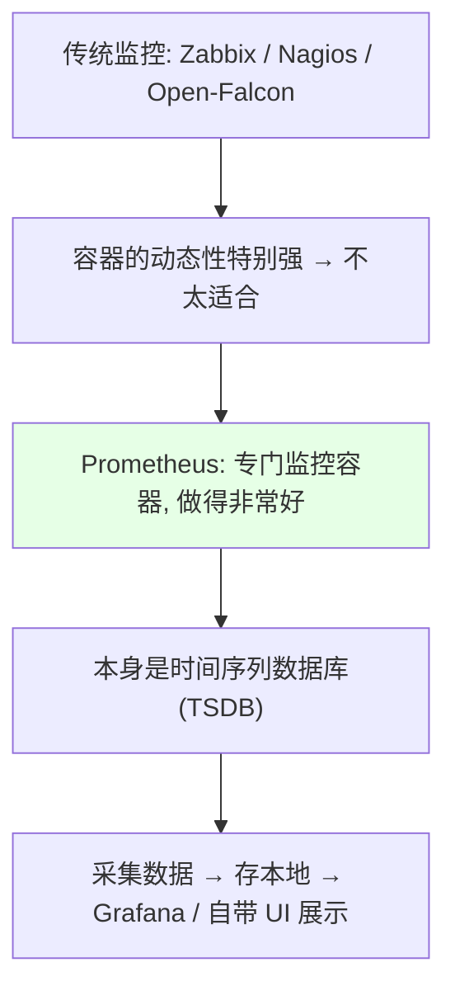
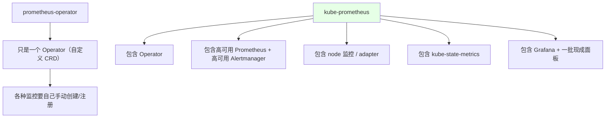
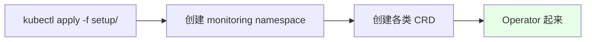
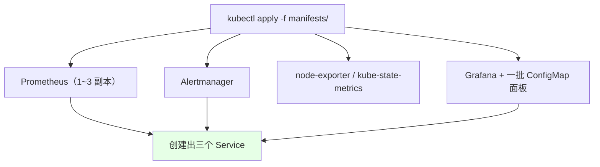
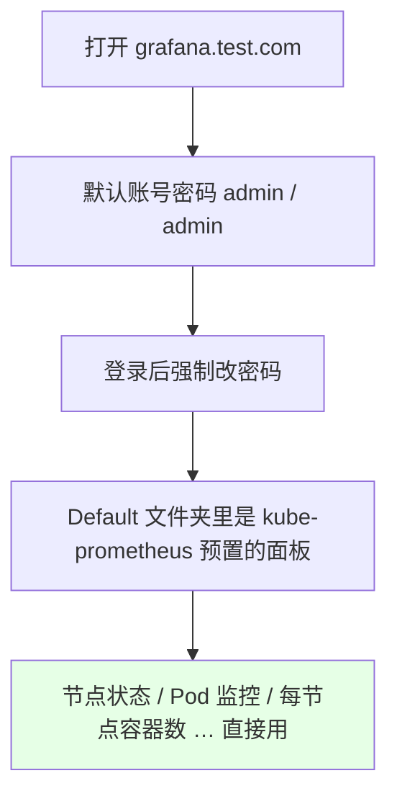
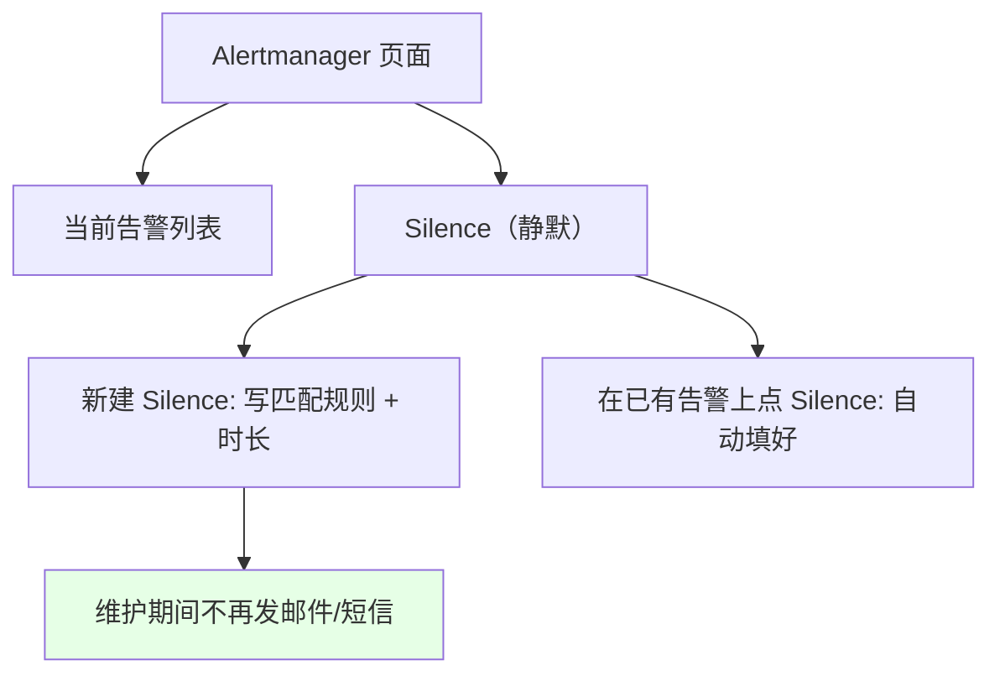
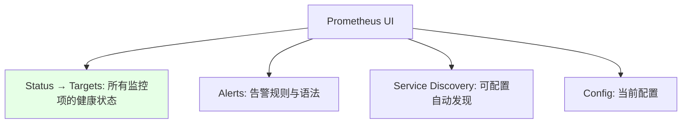
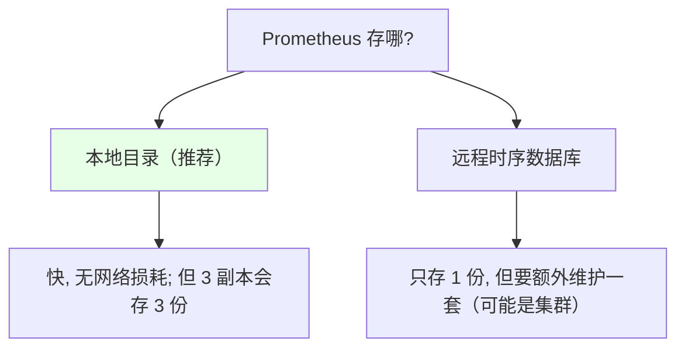

# Kubernetes 集群部署: Prometheus 安装及入门（kube-prometheus 部署与三个入口）

从这一节开始进入监控。**容器环境比传统环境动态得多**（Pod 随时生灭），Zabbix / Nagios / Open-Falcon 那一套在这种场景下并不合适，于是有了专门监控容器的 Prometheus。

结论先摆：

1. **Prometheus 本身是一个时间序列数据库（TSDB）**：自己采集、存到本地目录，数据可以交给 Grafana 展示，也可以用它自带的 UI 查；
2. 别装裸的 `prometheus-operator`，直接用 **kube-prometheus** —— 它把 Operator、高可用 Prometheus、高可用 Alertmanager、node-exporter、kube-state-metrics、Grafana 和一批现成面板**全打包好了**；
3. **生产部署建议**：Prometheus server **放在专用节点**上（起三个 server 就找三个专用节点），**用本地存储**（连远程时序数据库要多维护一套，得不偿失）；
4. 装完会出来**三个入口**：Prometheus（查数据 / 看 target）、Grafana（展示）、Alertmanager（告警与 Silence）。Grafana 的面板数据默认存在容器里，**生产要挂 PVC 持久化**，否则重启丢配置（kube-prometheus 已带 PVC 模板，改 `storageClassName` 即可）。

## 纲要

- 为什么容器监控要用 Prometheus
- Operator 与 kube-prometheus 的区别
- manifests 目录里都有什么
- 步骤一：先装 Operator
- 步骤二：创建 Prometheus 集群
- 步骤三：给三个 Service 配 Ingress
- Grafana：默认面板与默认密码
- Alertmanager：告警与 Silence
- Prometheus UI：target 与告警规则
- 存储选型的建议

## 为什么容器监控要用 Prometheus



| 能力 | 说明 |
| --- | --- |
| 本质 | **时间序列数据库**，采集数据后**存到本地目录** |
| 展示 | 交给 **Grafana**，或用 **Prometheus 自带的 UI** |
| 安装方式 | 二进制 / 容器都可以；**本节用 Operator 装** |

## Operator 与 kube-prometheus 的区别



| 项目 | 包含内容 | 适用 |
| --- | --- | --- |
| `prometheus-operator` | **只有 Operator（CRD）**，起集群、配监控全要自己来 | 想完全自己掌控 |
| **`kube-prometheus`** | Operator + 高可用 Prometheus + 高可用 Alertmanager + node 监控 / adapter + **kube-state-metrics** + **Grafana** | **推荐**，基本监控已集成好，改改就能用 |

```text
kube-prometheus 打包进来的组件:

kube-prometheus
├── Prometheus Operator          ← CRD 与控制器
├── Prometheus（高可用）          ← 采集 + 本地存储
├── Alertmanager（高可用）        ← 告警
├── node-exporter               ← 宿主机监控数据（比 Zabbix 更详细）
├── kube-state-metrics          ← deployment 副本数、每个容器状态
├── adapter
└── Grafana                     ← 展示数据 + 一批现成 dashboard
```

> **kube-state-metrics** 负责的是「我的 Deployment 起了几个副本、每个容器状态是什么」这一类指标。**只用 Operator 的话，这些全得自己手动装**。

> 课程用的是 `release-0.5`，对应的 **Prometheus 版本是 2.15**。

## manifests 目录里都有什么

```text
manifests/
├── setup/                  ← 第一步装 Operator 的地方
├── alertmanager-*.yaml     ← 部署 Alertmanager
├── prometheus-*.yaml       ← 部署 Prometheus server
├── prometheus-rules.yaml   ← 一些基本的告警规则
├── node-exporter-*.yaml    ← node-exporter（采集宿主机数据）
├── grafana-*.yaml          ← Grafana
└── *-dashboard*.yaml       ← 一堆 dashboard 的 ConfigMap
```

| 关注点 | 说明 |
| --- | --- |
| **Dashboard 用 ConfigMap 注入** | 面板的 json 放在 ConfigMap 里挂给 Grafana |
| **拆成很多个 ConfigMap** | **etcd 对单个对象有大小限制（默认约 1MB）**，ConfigMap 太大会影响性能，所以分开建 |
| **新增面板** | 容器部署的话要**把面板 json 做成 ConfigMap 挂进去**；**宿主机部署直接上传 json 即可** |

> **Grafana 的部署建议**：有存储就把存储挂上；**没有存储的话建议用宿主机部署** —— 因为模板/面板经常要改，容器部署改起来很麻烦。而且 **Grafana 只是展示，挂了不碍事**（只要告警链路不挂）；**告警用 Alertmanager 更灵活，不要在 Grafana 上做告警**。

## 步骤一：先装 Operator

```bash
# 必须先装 Operator，否则直接装上层目录会因为找不到 CRD 而报错
cd manifests/setup
kubectl apply -f .
```



> 就这两步，非常简单。**装完 Operator 之后所有东西都在 `monitoring` 这个 namespace 下面**。

## 步骤二：创建 Prometheus 集群

```bash
# 回到 manifests 上级目录
cd manifests
kubectl apply -f .
```

| 项 | 默认值 | 课程调整 | 生产建议 |
| --- | --- | --- | --- |
| Prometheus 副本数 | **3** | 改成 **1**（省资源） | **最少 3 个** |
| 多副本行为 | 通过**高可用协议**通讯 | — | **不会一个告警发三遍邮件** |



## 步骤三：给三个 Service 配 Ingress

```yaml
apiVersion: networking.k8s.io/v1
kind: Ingress
metadata:
  name: prometheus-ingress
  namespace: monitoring
spec:
  rules:
    - host: grafana.test.com
      http:
        paths:
          - path: /
            pathType: Prefix
            backend:
              service:
                name: grafana
                port:
                  number: 3000
    - host: alert.test.com
      http:
        paths:
          - path: /
            pathType: Prefix
            backend:
              service:
                name: alertmanager-main
                port:
                  number: 9093
    - host: prometheus.test.com
      http:
        paths:
          - path: /
            pathType: Prefix
            backend:
              service:
                name: prometheus-k8s
                port:
                  number: 9090
```

| 入口 | 域名示例 | 用途 |
| --- | --- | --- |
| **Alertmanager** | `alert.test.com` | 看当前有哪些告警、做 **Silence（静默）** |
| **Grafana** | `grafana.test.com` | **展示数据**、做查询 |
| **Prometheus** | `prometheus.test.com` | 创建/校验告警规则语法、查数据、看 **target** |

## Grafana：默认面板与默认密码



| 项 | 说明 |
| --- | --- |
| 默认账号密码 | **admin / admin**，登录后会要求改密码 |
| **没做持久化** | **Grafana 一重启就会让你重置密码** —— 这是个要注意的点 |
| Default 文件夹 | **kube-prometheus 默认已经做好的一批监控**，开箱即用（节点状态、Pod 监控、每个节点上跑了多少容器等） |
| 与裸 Operator 对比 | 只用 Operator 的话这些面板**都得自己手动创建** |

## Alertmanager：告警与 Silence



| 功能 | 说明 |
| --- | --- |
| 告警列表 | 看当前有多少告警 |
| **Watchdog** | 一条**集群正常也会触发**的告警（相当于心跳，告诉你告警链路是通的），**可以关掉** |
| **Silence** | **抑制告警** —— 比如要做维护，把某类告警停掉，免得一直发邮件/短信 |
| Silence 规则 | 自己写，比如「`namespace = kube-system` 的告警全停掉」 |
| 时长 | 可自定义，比如设 **24 小时** |
| 状态 | **active（生效中）/ pending（待生效）/ expired（已过期）** |

> 也可以直接在已存在的告警上点 Silence，规则会**自动帮你填好**，再设个时长点创建即可。

## Prometheus UI：target 与告警规则



| 项 | 说明 |
| --- | --- |
| **Targets** | 看**所有监控项**及其健康状态，可以只看不健康的 |
| 告警颜色 | **黄色 = 正在告警**；**红色（firing）= 已经触发**，可能还会再触发第二次 |
| 告警规则 | 能看到规则的语法（后面专门讲） |
| 服务发现 | 可以配置自动发现 |
| **已知问题** | **scheduler 和 controller-manager 默认访问不了** —— 因为它们的监控地址写的是 **`127.0.0.1`**，需要手动处理（后面讲） |

## 存储选型的建议



| 方案 | 优点 | 缺点 |
| --- | --- | --- |
| **本地存储** | **快**（连远程有网络损耗）；简单 | 三个 server 各存一份，**同一份数据存三份** |
| 远程时序数据库 | 只存一份 | **要多维护一套时序数据库（可能还是集群），增加复杂性** |

> **大部分安装方式都采用本地存储**。另外**建议给 Prometheus 找专用节点**：起三个 Prometheus server 就找三个专用节点来跑 —— **主要是 Prometheus server**，因为它要采集数据并写本地目录；Alertmanager 跑在哪都无所谓。

## API 速览

| 能力 | 做法 |
| --- | --- |
| 装 Operator | `cd manifests/setup && kubectl apply -f .` |
| 装整套 | 回上级目录 `kubectl apply -f .` |
| namespace | 全部落在 **`monitoring`** |
| 副本数 | 默认 3，**生产最少 3**（高可用协议通讯，不会重复发告警）；演示可改 1 |
| 三个入口 | Prometheus / Grafana / Alertmanager，各配一个 Ingress |
| Grafana 初始密码 | **admin / admin**，未持久化重启后要重置 |
| 面板来源 | kube-prometheus 预置在 **Default 文件夹**；新增面板做成 ConfigMap 挂载 |
| ConfigMap 拆多个 | **etcd 单对象约 1MB 限制**，太大影响性能 |
| 停告警 | Alertmanager 的 **Silence**（可手写规则或基于已有告警自动填） |
| Watchdog | 集群正常也会触发的心跳告警，**可关** |
| 看监控项健康 | Prometheus → **Status → Targets** |
| 已知坑 | **scheduler / controller-manager 监控地址是 127.0.0.1，默认不通** |

## Demo 示例

```bash
# 1. 下载 kube-prometheus（课程用 release-0.5，对应 Prometheus 2.15）
#    git clone ... && cd kube-prometheus/manifests

# 2. 先装 Operator（必须先做，否则找不到 CRD 会报错）
cd manifests/setup
kubectl apply -f .

# 3. 确认 CRD 已产生、Operator 已起来
kubectl get crd | grep monitoring
kubectl get pod -n monitoring

# 4. 回上级目录创建整套
cd ..
kubectl apply -f .

# 5. 看创建出来的 Service
kubectl get svc -n monitoring

# 6. 建 Ingress，给三个入口配域名
kubectl apply -f prometheus-ingress.yaml -n monitoring
kubectl get ingress -n monitoring

# 7. Grafana: 默认 admin/admin，登录后改密码
# 8. Alertmanager: 看告警 / 建 Silence
# 9. Prometheus: Status → Targets 看监控项是否健康
```

### 总结

- **容器环境动态性极强，传统监控（Zabbix / Nagios / Open-Falcon）不太适合**，Prometheus 是监控容器做得非常好的工具 —— 它**本身就是一个时间序列数据库**，采集数据后存到本地目录，交给 Grafana 或自带 UI 展示；
- **别装裸的 `prometheus-operator`**（装完只是一套 CRD，各种监控都要自己手动创建），直接用 **`kube-prometheus`**：它打包了 Operator、高可用 Prometheus、高可用 Alertmanager、node-exporter、**kube-state-metrics**（Deployment 副本数与容器状态）、adapter、**Grafana 和一批现成面板**，基本监控开箱即用，稍微改改就能上；
- **存储与调度建议**：Prometheus server **放专用节点**（三个 server 就三个专用节点，Alertmanager 跑哪都行）；**用本地存储** —— 远程时序数据库虽然只存一份，但要多维护一套（可能是集群），得不偿失，**大部分部署都走本地**；
- **安装分两步**：先 `cd manifests/setup && kubectl apply -f .` 装 Operator（**不装会因为找不到 CRD 报错**），再回上级目录 `kubectl apply -f .` 创建整套；**资源都在 `monitoring` 这个 namespace**；**副本数默认 3、生产最少 3**（多副本走高可用协议通讯，**不会一个告警发三遍**），演示可改 1；
- **装完是三个入口，各配一个 Ingress**：**Prometheus**（校验告警规则语法、查数据、看 target）、**Grafana**（展示，默认 **admin/admin** 且**未持久化时重启要重置密码**，Default 文件夹里是预置面板）、**Alertmanager**（看告警 + **Silence**）；
- **Alertmanager 的 Silence 用来做维护期静默**：可以手写规则（如 `namespace = kube-system` 的告警全停）设个时长（如 24 小时），也可以**在已有告警上点 Silence 让规则自动填好**；状态分 active / pending / expired；**Watchdog 是集群正常也会触发的心跳告警，可以关掉**；
- **Prometheus UI 的 Status → Targets 看所有监控项的健康状态**（可只看不健康的），告警黄色表示正在告警、红色（firing）表示已触发；**已知坑：scheduler 和 controller-manager 的监控地址默认写的是 `127.0.0.1`，访问不了，需要手动处理**；另外 **Grafana 建议有存储就挂存储、没存储就用宿主机部署**（面板经常要改），且**告警要用 Alertmanager 而不是 Grafana**。

