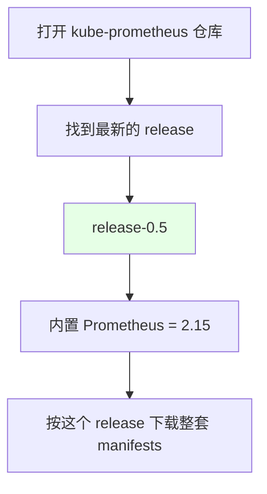
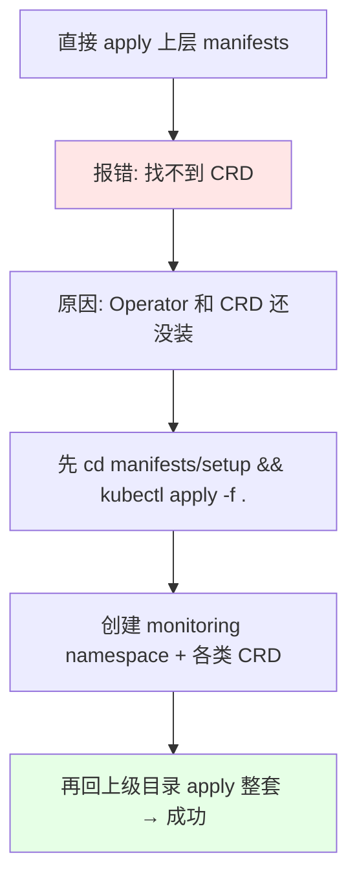
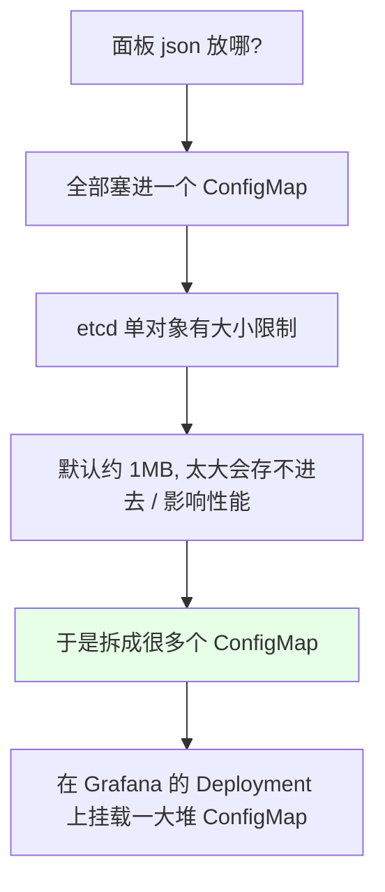
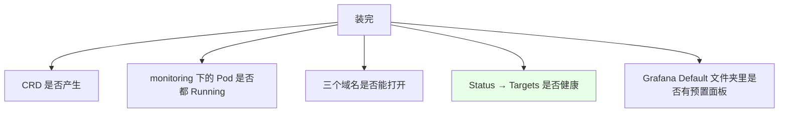
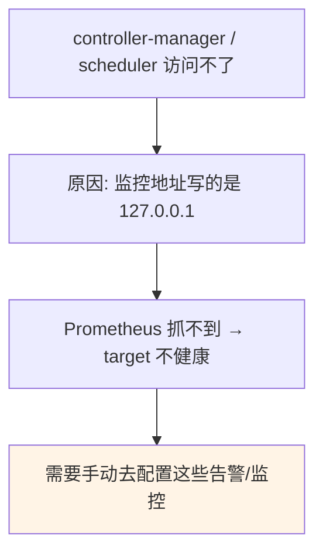

# Kubernetes 集群部署: Prometheus Latest 安装入门（版本对应关系与 manifests 目录结构）

这一节接着讲安装，把上一节没展开的两件事讲透：**版本怎么选**，以及 **`manifests` 目录里那一堆文件到底都是干什么的**。搞明白这两点，换版本、加面板、改副本数都不会抓瞎。

结论先摆：

1. **版本是绑死的**：kube-prometheus 的 `release-0.5` 对应的 **Prometheus 是 2.15** —— 下载时先找到 release 再确认它内置的 Prometheus 版本，别混着用；
2. **安装顺序不能反**：必须先装 `manifests/setup` 里的 Operator，**否则上层目录会因为找不到 CRD 直接报错**；
3. **目录里的文件是按组件分类的**：Alertmanager、Prometheus server、告警规则、node-exporter、Grafana、以及**一大堆 dashboard 的 ConfigMap**；
4. **dashboard 之所以拆成很多个 ConfigMap，是因为 etcd 对单个对象有约 1MB 的大小限制** —— 这不是随便拆的。

## 纲要

- 版本怎么选：release 与内置 Prometheus 的对应
- manifests 目录结构逐项解读
- 为什么必须先装 setup
- dashboard 与 ConfigMap：1MB 限制是怎么来的
- 副本数与 nodeSelector
- 三个 Service 与 Ingress
- 安装后的验证清单
- 默认就存在的告警问题

## 版本怎么选：release 与内置 Prometheus 的对应



| 项 | 取值 |
| --- | --- |
| kube-prometheus 版本 | **`release-0.5`**（课程时的最新版） |
| 内置 Prometheus 版本 | **2.15** |
| 下载方式 | 仓库里给了下载命令，下载完解压即可 |

> **release 版本号和它内置的 Prometheus 版本是对应关系**，先确认清楚再下载。整套 manifests 就是这个 release 里准备好的，「我们主要操作都在这些目录下」。

## manifests 目录结构逐项解读

```text
kube-prometheus/manifests
├── setup/                      ← 第一步：Operator（含 CRD）
├── alertmanager-*.yaml         ← 部署 Alertmanager（告警）
├── prometheus-*.yaml           ← 部署 Prometheus server
├── prometheus-rules.yaml       ← 一些基本的告警规则（已预置）
├── node-exporter-*.yaml        ← 采集宿主机监控数据
├── grafana-*.yaml              ← Grafana（含 datasource）
├── *-dashboard*.yaml           ← 一堆 dashboard 的 ConfigMap
└── …（adapter / kube-state-metrics 等）
```

| 文件 | 作用 |
| --- | --- |
| Alertmanager 相关 | 部署告警组件 |
| Prometheus server 相关 | 部署采集端 |
| 告警规则文件 | **预置了一些基本的 Prometheus 告警规则** |
| node-exporter | **采集宿主机的监控数据** —— **比用 Zabbix 监控到的更详细** |
| Grafana | 展示端，里面还有 **datasource** 的定义 |
| dashboard ConfigMap | **把面板 json 塞进 ConfigMap 挂给 Grafana** |

> 随便打开一个 dashboard 的 ConfigMap 看，里面就是**面板的 json 文件**。装完之后在 Grafana 里就能直接看到这些面板。

## 为什么必须先装 setup



```bash
# 第一步：装 Operator（会创建 monitoring namespace 和一堆 CRD）
cd manifests/setup
kubectl apply -f .

# 验证：CRD 有没有产生
kubectl get crd | grep monitoring
kubectl get pod -n monitoring

# 第二步：回上级目录创建整套
cd ..
kubectl apply -f .
```

> 就两步，非常简单。课程里因为**之前已经跑过一遍、镜像也提前拉好了**，所以 apply 完立刻就起来了。

## dashboard 与 ConfigMap：1MB 限制是怎么来的



| 部署形态 | 加一个新面板的做法 |
| --- | --- |
| **容器部署 + 无后端存储** | **按它这个方式新建一个 ConfigMap**，挂到 Grafana 的 Deployment 上，Grafana 就能读到这个面板 |
| **宿主机部署** | **直接上传面板 json** 即可，会存在宿主机上（课程就是用宿主机部署的） |

> **Grafana 建议**：有存储就挂存储；**没有存储建议用宿主机部署** —— 面板、模板会经常改，容器里改起来很麻烦。而且 **Grafana 只是展示，挂了不碍事**，只要告警链路不挂就行（**有了 Alertmanager 就不要在 Grafana 上做告警**，Alertmanager 更灵活）。

## 副本数与 nodeSelector

| 项 | 说明 |
| --- | --- |
| 默认副本数 | **3** |
| 课程调整 | 改成 **1**（演示环境省资源） |
| 生产建议 | **最少 3 个** —— 三个副本通过**高可用协议**通讯，**不会一个告警发三遍邮件** |
| nodeSelector | 课程里因为之前部署过，**保留了上次的状态直接部署到上次的节点**；**正常创建时不需要加**，除非你想固定调度到某些节点 |

## 三个 Service 与 Ingress

```yaml
apiVersion: networking.k8s.io/v1
kind: Ingress
metadata:
  name: prometheus-ingress
  namespace: monitoring
spec:
  rules:
    - host: alert.test.com
      http:
        paths:
          - path: /
            pathType: Prefix
            backend:
              service:
                name: alertmanager-main
                port:
                  number: 9093
    - host: grafana.test.com
      http:
        paths:
          - path: /
            pathType: Prefix
            backend:
              service:
                name: grafana
                port:
                  number: 3000
    - host: prometheus.test.com
      http:
        paths:
          - path: /
            pathType: Prefix
            backend:
              service:
                name: prometheus-k8s
                port:
                  number: 9090
```

| Service | 域名示例 | 用途 |
| --- | --- | --- |
| Alertmanager | `alert.test.com` | **看当前有哪些告警**、决定停掉哪些告警（Silence） |
| Grafana | `grafana.test.com` | **展示数据**、做查询语法练习 |
| Prometheus | `prometheus.test.com` | **创建/校验告警规则语法**、查数据、看 target |

> 没有图形化工具的话，直接把这份 Ingress yaml 导出来 `kubectl apply` 即可。

## 安装后的验证清单



| 检查项 | 位置 | 预期 |
| --- | --- | --- |
| CRD | `kubectl get crd \| grep monitoring` | 各类 CRD 已产生 |
| 面板 | Grafana → Default 文件夹 | **kube-prometheus 预置的一批监控**（节点状态、Pod 监控、每个节点跑多少容器等） |
| Grafana 密码 | 默认 **admin / admin** | 登录后强制改密码；**没做持久化的话重启就要重置** |
| 告警 | Alertmanager 页面 | 默认就有一个 **Watchdog**（集群正常也会触发的心跳告警，**可关**） |
| Silence | Alertmanager 页面 | 可新建（自己写规则，如 `namespace = kube-system` 全停，设 24 小时），也可**在已有告警上点 Silence 自动填好**；状态 active / pending / expired |
| 监控项 | Prometheus → Status → Targets | 可只看不健康的；**scheduler 默认是不健康的** |

## 默认就存在的告警问题



> **默认的 kube-prometheus 里，scheduler 和 controller-manager 是访问不了的** —— 因为它们的监控 **IP 地址写的是 `127.0.0.1`**。这些默认告警很多，**需要自己处理**，后面会讲。

## API 速览

| 能力 | 做法 |
| --- | --- |
| 版本对应 | `release-0.5` → **Prometheus 2.15** |
| 安装顺序 | **先 `manifests/setup`**（Operator + CRD），再上层目录 |
| namespace | 全部在 **`monitoring`** |
| 副本数 | 默认 3，生产最少 3（**不会重复发告警**） |
| nodeSelector | 正常不用加，除非要固定节点 |
| 面板注入 | 面板 json → **ConfigMap** → 挂到 Grafana Deployment |
| ConfigMap 拆多个 | **etcd 单对象约 1MB 限制** |
| 加新面板 | 容器部署建 ConfigMap；**宿主机部署直接上传 json** |
| 三入口 | Alertmanager / Grafana / Prometheus 各配 Ingress |
| Grafana 初始密码 | **admin / admin** |
| 停告警 | Alertmanager 的 **Silence** |
| 已知问题 | **scheduler / controller-manager 监控地址是 127.0.0.1** |

## Demo 示例

```bash
# 1. 下载并解压对应 release（release-0.5 → Prometheus 2.15）
# 2. 进 manifests

# 3. 先装 Operator
cd manifests/setup
kubectl apply -f .

# 4. 验证 CRD
kubectl get crd | grep monitoring

# 5. 回上级目录创建整套
cd ..
kubectl apply -f .

# 6. 看三个 Service
kubectl get svc -n monitoring

# 7. 建 Ingress 配三个域名
kubectl apply -f prometheus-ingress.yaml -n monitoring
kubectl get ingress -n monitoring

# 8. 看预置的 dashboard ConfigMap
kubectl get cm -n monitoring | grep dashboard

# 9. 打开 Prometheus → Status → Targets 看监控项健康状态
#    （scheduler / controller-manager 默认不健康，地址是 127.0.0.1）
```

### 总结

- **版本是绑死的**：先在 kube-prometheus 仓库找到最新 release（课程时是 **`release-0.5`**），再确认它**内置的 Prometheus 版本是 2.15**，按这个 release 下载整套 manifests，不要混着用；
- **目录按组件分类**：`manifests` 下有 Alertmanager、Prometheus server、预置告警规则、**node-exporter**（采集宿主机数据，比 Zabbix 更详细）、Grafana（含 datasource）、以及**一大堆 dashboard 的 ConfigMap** —— 打开任一个 dashboard ConfigMap 看到的就是面板 json；
- **安装顺序不能反**：**必须先 `apply manifests/setup` 装 Operator**（它会创建 `monitoring` namespace 和各种 CRD），**否则直接 apply 上层目录会因为找不到 CRD 报错**；然后回上级目录 apply 整套；
- **dashboard 之所以拆成很多个 ConfigMap，是因为 etcd 对单个对象有大小限制（默认约 1MB）**，太大存不进去也影响性能 —— 所以加新面板时要**按同样方式建 ConfigMap 挂到 Grafana 的 Deployment 上**（宿主机部署则直接上传 json）；**Grafana 建议有存储挂存储、没存储就宿主机部署**，它挂了不碍事，**告警交给 Alertmanager**；
- **副本数默认 3，生产最少 3**（三个副本走高可用协议通讯，**不会一个告警发三遍邮件**），演示可改 1；**nodeSelector 正常创建时不用加**，除非要固定调度到某些节点；
- **装完建三个 Ingress**：Alertmanager（看告警 + Silence）、Grafana（展示，默认 **admin/admin** 且**未持久化重启要重置密码**，Default 文件夹里有预置面板）、Prometheus（校验规则语法 + 看 target）；
- **验收清单**：CRD 已产生、Pod 都 Running、三个域名能开、**Status → Targets 健康**（可只看不健康的）、Grafana 能看到预置面板；**默认就有的 Watchdog 是集群正常也会触发的心跳告警，可以关掉**；
- **已知问题**：**scheduler 和 controller-manager 默认访问不了，因为它们的监控 IP 写的是 `127.0.0.1`**，target 不健康，这些默认告警很多，**需要后续手动处理**。

