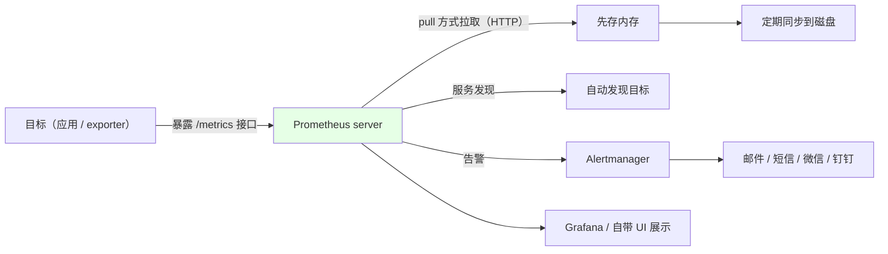
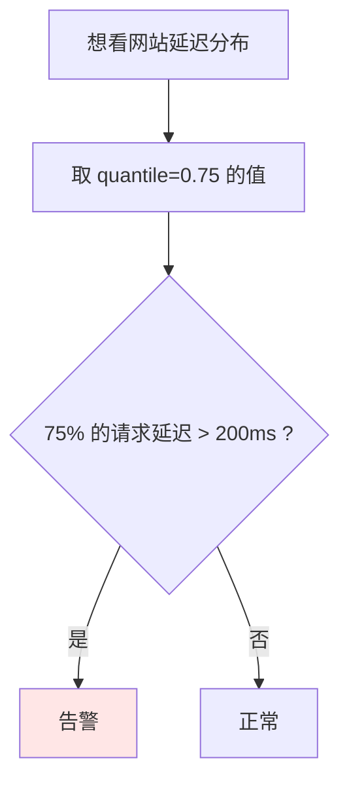
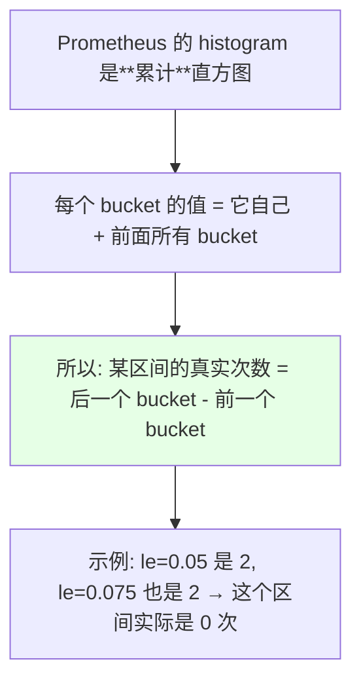
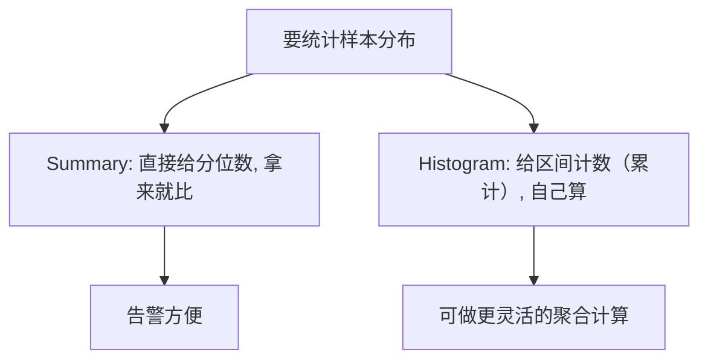
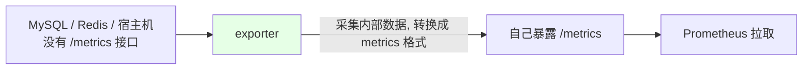
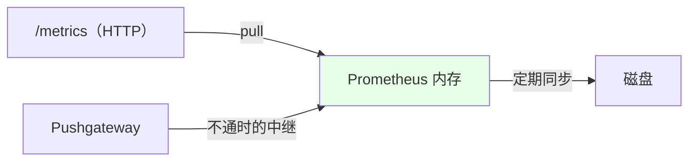

# Kubernetes 集群部署: Prometheus Metrics 类型（Counter / Gauge / Histogram / Summary）

装完之后要面对的第一个问题就是：**`/metrics` 里那一堆数据到底是什么、有几种**。这一节把 Prometheus 的**四种 metrics 数据类型**讲清楚 —— 后面写告警规则、自己暴露业务指标全都建立在这个基础上。

结论先摆：

1. **Prometheus 是 pull 模型**：server 主动去目标暴露的 `/metrics` 接口拉数据（HTTP 协议），拉回来先放内存，再定期同步到磁盘；
2. **只有四种类型**：**Counter（只增不减）、Gauge（可增可减）、Histogram（直方图）、Summary（分位数）**；
3. **Histogram 是「累计直方图」** —— 每个 bucket 的值**包含了它前面所有 bucket 的样本**，不是我们上学时学的那种独立区间直方图，这一点最容易搞错；
4. 没有 `/metrics` 接口的东西（宿主机、MySQL、Redis）靠 **exporter** 转一把，比自己写脚本详细得多。

## 纲要

- Prometheus 的整体数据流
- metrics 接口的格式：HELP / TYPE / 值
- Counter：只增不减
- Gauge：可增可减
- Summary：分位数
- Histogram：累计直方图
- Histogram 与 Summary 的区别
- 没有 metrics 接口怎么办：exporter
- 存储与 pull 模型

## Prometheus 的整体数据流



```text
Prometheus 官方架构里的几个角色:

Prometheus server          ← 采集 + 存储（生产最少 3 个）
├── pull 抓取               ← 主动拉目标的 /metrics
├── 本地存储                ← 查询快, 无网络带宽消耗
├── 服务发现                ← 自动找目标
└── 告警推送 → Alertmanager → 邮件/短信/微信/钉钉

Pushgateway                ← 中继：采集端与 server 不通时先 push 到这里
Grafana / Prom UI          ← 展示（自带 UI 不好看, 一般用 Grafana）
```

| 组件 | 说明 |
| --- | --- |
| Prometheus server | **生产最少 3 个**；本地存储查询快、无网络损耗 |
| 多副本的代价 | **几个 server 就存几份数据**，几份之间**可能有细微差异** —— Grafana 上刷新一下可能变成另一个值，但差别不大 |
| 远程时序数据库 | 对数据一致性要求极高时可以多 server 连同一个 TSDB，**但维护成本高、查询效率也会变低** |
| **Pushgateway** | 两种用途：① **需要聚合一批数据**；② **采集端和 Prometheus server 网络不通**时做中继 —— 先把数据 push 进去，Prometheus 再用 pull 拉 |
| 展示 | 自研 API client / Grafana / 自带 UI，**自带的 UI 不太好看，一般用 Grafana** |

## metrics 接口的格式：HELP / TYPE / 值

```text
# HELP prometheus_http_requests_total 请求总次数（说明文字）
# TYPE prometheus_http_requests_total counter        ← 类型
prometheus_http_requests_total{code="200"} 1024      ← 名称 + label + 值
```

| 部分 | 含义 |
| --- | --- |
| `# HELP` | **这个指标的说明** |
| `# TYPE` | **数据类型**（就是这四种之一） |
| 名称 + label | 指标名和它的标签 |
| 值 | 当前值 |

> **存储时的形态**：`值 @ 时间戳` —— 一个值后面跟一个时间戳，就这样一条条存进时序库。云原生应用（或按容器思路开发的）**一般会自带 `/metrics` 接口**，直接访问「端口 + `/metrics`」就能看到暴露的数据。

## Counter：只增不减


| 特征 | **只增不减**，一直往上累加（服务器不重置就不会归零） |
| --- | --- |
| 命名习惯 | 常以 `_total` 结尾 |
| 典型例子 | **HTTP 请求总次数**、**CPU 使用时间**、**错误次数** |
| 其他例子 | **访问量**、**容器重启次数**、200 响应的数量 |

## Gauge：可增可减


| 特征 | **可增可减**，反映当前这一刻的值 |
| --- | --- |
| 典型例子 | **CPU / 内存 / 磁盘使用率** |
| 其他例子 | **当前并发量**（动态变化） |

> 前两种（Counter / Gauge）比较简单，后两种稍复杂。

## Summary：分位数

```text
# TYPE go_gc_duration_seconds summary
go_gc_duration_seconds{quantile="0"}    1.2e-05
go_gc_duration_seconds{quantile="0.25"} 2.5e-05
go_gc_duration_seconds{quantile="0.5"}  3.1e-05     ← 中位数
go_gc_duration_seconds{quantile="0.75"} 4.8e-05
go_gc_duration_seconds{quantile="1"}    9.0e-05
go_gc_duration_seconds_sum   0.0054
go_gc_duration_seconds_count 54                      ← 次数（如 GC 了 54 次）
```

| 字段 | 含义 |
| --- | --- |
| `quantile="0.5"` | **中位数**：采集到的数据里**有 50% 低于这个值** |
| `quantile="0.25"` | 有 **25%** 的数据低于这个值 |
| `quantile="0.75"` | 有 **75%** 的数据低于这个值 |
| `_count` | **次数**（如 GC 次数 54 次） |
| `_sum` | **所有值的总和** |



> **用法举例**：假如我们认为 200 毫秒以内的延迟是正常的，**一旦有 75% 的数据都超过 200ms 就告警** —— 直接拿 `quantile="0.75"` 这条去比就行（自己写脚本实现同样的判断会麻烦得多）。

## Histogram：累计直方图

```text
# TYPE apiserver_request_duration_seconds histogram
apiserver_request_duration_seconds_bucket{le="0.005"} 1
apiserver_request_duration_seconds_bucket{le="0.01"}  1
apiserver_request_duration_seconds_bucket{le="0.025"} 1
apiserver_request_duration_seconds_bucket{le="0.05"}  2
apiserver_request_duration_seconds_bucket{le="0.075"} 2
apiserver_request_duration_seconds_bucket{le="0.1"}   2
apiserver_request_duration_seconds_bucket{le="0.25"}  3
apiserver_request_duration_seconds_bucket{le="0.5"}   4
apiserver_request_duration_seconds_sum   1.23
apiserver_request_duration_seconds_count 5
```



| 字段 | 含义 |
| --- | --- |
| `_bucket{le="x"}` | **值小于等于 x 的样本总数**（注意是**累计**的） |
| `_sum` | **所有数据的总和** |
| `_count` | **所有点数之和**（整个区间一共出现了多少次） |

> **这是最容易踩的一点**：它不是我们上学时学的那种「每个区间各画一根柱子」的直方图，而是**累计直方图** —— **每一个 bucket 的样本都包含了之前所有 bucket 的样本**。所以上面那段数据里，`le="0.05"` 是 2、`le="0.075"` 也是 2，说明 **0.05~0.075 这个区间实际出现了 0 次**。

> 之所以用累计直方图，是为了**减轻 Prometheus 的压力、降低维护成本**。

## Histogram 与 Summary 的区别

| 维度 | Summary | Histogram |
| --- | --- | --- |
| 记录什么 | **记录每次采集的数据**（并算出分位数） | **不记录具体数据**，只记录**每个区间内出现了多少次** |
| 输出 | `quantile=0 / 0.25 / 0.5 / 0.75 / 1` + `_sum` + `_count` | 一堆 `_bucket{le=...}` + `_sum` + `_count` |
| 区间语义 | 分位数（百分比低于该值） | **累计区间**，需做减法还原真实次数 |
| 适用场景 | 想直接看「75% 的请求延迟是多少」 | 想在一段时间范围内对数据做采样、按区间统计 |



> 自己写暴露数据的程序时才常会用到这两个；**不自写指标的话用得比较少**。

## 没有 metrics 接口怎么办：exporter



| 情况 | 做法 |
| --- | --- |
| 云原生应用 | **自带 `/metrics`**，直接访问端口 + `/metrics` |
| 宿主机 / MySQL / Redis / ES | **用 exporter**（`node_exporter` / `mysqld_exporter` / `redis_exporter` / `elasticsearch_exporter` 等） |

> **exporter 暴露的数据比自己写脚本、自己造轮子监控要详细得多** —— 比如 node 节点那套指标里，内存使用率、load average、CPU usage、各种 disk io 都有，只是面板上不一定全画出来，可以自己加图表展示。

## 存储与 pull 模型



- **默认是 pull**：Prometheus 主动去拉，不是应用推过来；
- 拉回来的数据**先在内存，再定期同步到磁盘**；
- **采集端和 server 不通**时，才需要 **Pushgateway** 做中继。

## API 速览

| 能力 | 做法 |
| --- | --- |
| 看指标 | 访问 `端口 + /metrics` |
| 数据格式 | `# HELP`（说明）+ `# TYPE`（类型）+ 指标名 + 值 |
| 存储形态 | `值 @ 时间戳` |
| Counter | **只增不减**（请求数、CPU 时间、错误次数、重启次数），常以 `_total` 结尾 |
| Gauge | **可增可减**（CPU / 内存 / 磁盘使用率、当前并发量） |
| Summary | `quantile`（0/0.25/0.5/0.75/1）+ `_sum` + `_count`，**直接读分位数做告警** |
| Histogram | `_bucket{le=...}`（**累计**）+ `_sum` + `_count` |
| 读 Histogram | **某区间真实次数 = 后一个 bucket − 前一个 bucket** |
| 无接口的应用 | 用 **exporter** 转换 |
| 网络不通 | 用 **Pushgateway** 中继 |
| 展示 | Grafana（自带 UI 不好看） |

## Demo 示例

```bash
NS=monitoring
SVC=prometheus-k8s

# 1. 起一个 curl Pod 访问任意目标的 /metrics
kubectl run curl-test --rm -it --image=curlimages/curl --restart=Never -n $NS -- \
  curl -s http://${SVC}.${NS}:9090/metrics

# 2. 只看某个指标的 HELP / TYPE 说明
kubectl run curl-test --rm -it --image=curlimages/curl --restart=Never -n $NS -- \
  curl -s http://${SVC}.${NS}:9090/metrics | grep '^# TYPE'

# 3. 看 histogram（注意 bucket 是累计的）
kubectl run curl-test --rm -it --image=curlimages/curl --restart=Never -n $NS -- \
  curl -s http://${SVC}.${NS}:9090/metrics | grep histogram

# 4. 看 summary 的分位数
kubectl run curl-test --rm -it --image=curlimages/curl --restart=Never -n $NS -- \
  curl -s http://${SVC}.${NS}:9090/metrics | grep '^# TYPE' | grep summary

# 5. node_exporter 的指标（宿主机监控，比自写脚本详细得多）
kubectl run curl-test --rm -it --image=curlimages/curl --restart=Never -n $NS -- \
  curl -s http://node-exporter.${NS}:9100/metrics | grep -c '^node_'
```

### 总结

- **Prometheus 是 pull 模型**：server 主动到目标暴露的 `/metrics` 接口拉数据（HTTP），**先放内存、再定期同步到磁盘**；生产**最少 3 个 server**，本地存储查询快、无网络损耗，代价是**几个 server 存几份、彼此可能有细微差异**（对一致性要求极高才上远程 TSDB，但维护成本高、查询变慢）；**采集端与 server 不通时用 Pushgateway 做中继**；
- **指标格式三件套**：`# HELP`（说明）+ `# TYPE`（类型）+ 指标名 + 值，存储时是 **`值 @ 时间戳`**；云原生应用一般自带 `/metrics`，直接访问端口 + `/metrics` 即可；
- **Counter（只增不减）**：HTTP 请求总次数、CPU 使用时间、**错误次数**（常以 `_total` 结尾）、访问量、容器重启次数 —— 只要服务器不重置就一直累加；
- **Gauge（可增可减）**：CPU / 内存 / 磁盘使用率、**当前并发量**（一会儿 2000 一会儿 3000），反映瞬时状态；
- **Summary（分位数）**：输出 `quantile=0 / 0.25 / 0.5 / 0.75 / 1`，`0.5` 就是中位数（**50% 的数据低于它**），另有 `_sum`（总和）和 `_count`（次数，如 GC 54 次）—— 用法很直接：**「如果 75% 的请求延迟超过 200ms 就告警」拿 `quantile=0.75` 比一下就行**；
- **Histogram（直方图）**：在一段时间范围内按区间（bucket）采样，输出一堆 `_bucket{le=...}` + `_sum` + `_count`；**关键坑：Prometheus 的 histogram 是累计直方图，每个 bucket 都包含它前面所有 bucket 的样本**，所以**某区间的真实次数要用后一个 bucket 减前一个**（示例里 `le=0.05` 和 `le=0.075` 都是 2，说明该区间实际为 0 次）—— 这么做是为了减轻 Prometheus 的压力；
- **两者区别**：**Summary 记录每次采集的数据并给出分位数**，**Histogram 不记录具体数据、只记录区间内出现了多少次**；不自写指标的话这两个用得比较少；
- **没有 `/metrics` 接口的对象（宿主机、MySQL、Redis、ES）用 exporter 转换**，exporter 暴露的数据**比自己写脚本监控详细得多**（node 那套指标里内存、load、CPU、disk io 全都有，面板没画出来的可以自己加图表）。

