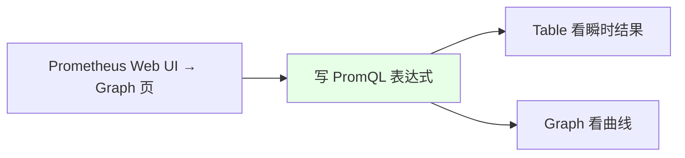
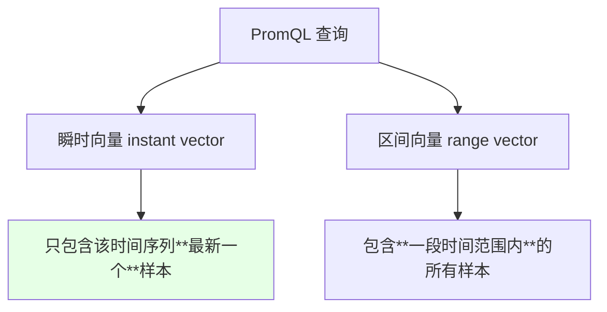
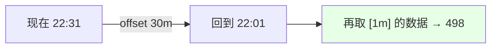
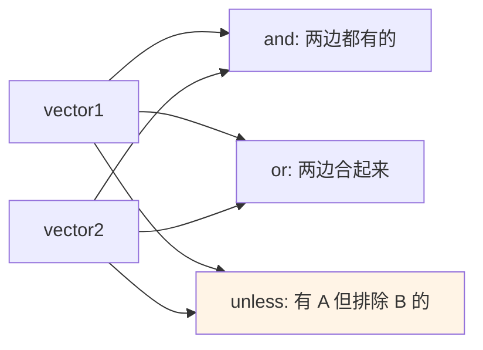
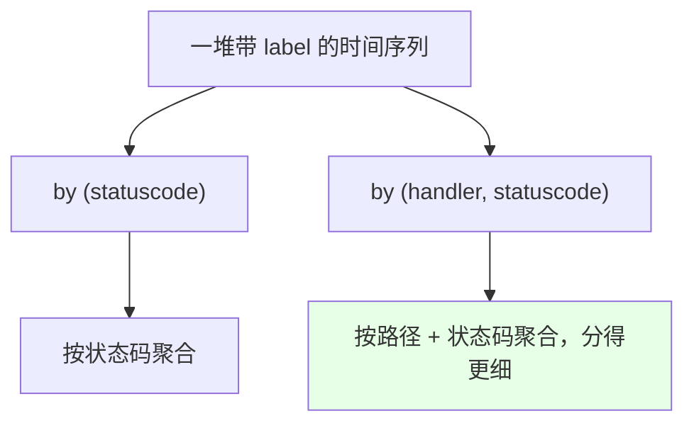

# Kubernetes 集群部署: PromQL 基本操作（瞬时向量、区间向量、过滤与聚合）

Prometheus 是时序数据库，和关系型数据库有 SQL 一样，它有自己的查询语法 **PromQL**。这一节把最常用的那部分讲完：向量类型、时间位移、标签过滤、数学与集合运算、聚合与排序。

结论先摆：

1. **查询结果分两种**：**瞬时向量**（最新一次样本）和**区间向量**（`[5m]` 这样一段时间内的所有样本）；
2. **过滤靠 label**：`metric{label="v"}` 绝对匹配，`=~` 正则匹配，`!=` / `!~` 取反；
3. **看历史数据用 `offset`**：`offset 30m`、`offset 1h`、`offset 1d`；
4. **聚合就那几个**：`sum` / `min` / `max` / `avg` / `count` / `count_values` / `topk` / `bottomk` / `quantile`，配合 `by (label)` 分组。

## 纲要

- PromQL 在哪写
- 瞬时向量与区间向量
- offset：查看多久之前的数据
- 标签过滤：绝对匹配与正则匹配
- 数学运算
- 比较运算与集合运算
- 运算符优先级
- 聚合操作
- 按 label 分组统计
- topk / bottomk / quantile

## PromQL 在哪写



> 就像数据库有 SQL 一样，**Prometheus 作为一个时序数据库也有自己的语法 —— PromQL**。它自带的 Web UI 的 Graph 页面就能直接查询。

## 瞬时向量与区间向量



| 类型 | 写法 | 含义 |
| --- | --- | --- |
| **瞬时向量** | `prometheus_http_requests_total` | **最新一次采样的值**（带时间戳，所以是「向量」不是单个数值） |
| **区间向量** | `prometheus_http_requests_total[5m]` | **最近 5 分钟**之内的所有采集数据 |

```text
# 瞬时向量：最新一个样本
prometheus_http_requests_total
  → 1        （并且带着时间戳）

# 区间向量：一段时间范围内的数据
prometheus_http_requests_total[1m]
prometheus_http_requests_total[5m]
  → 一堆带时间戳的样本
```

> 区间向量一定要带方括号和时间范围（`[1m]` / `[5m]`），查出来的是**一段时间内的多个样本**。

```text
一条 PromQL 表达式的构成:

metric_name{label="value"}[时间范围] offset 位移量
└───┬────┘ └────┬──────┘ └───┬───┘ └────┬─────┘
    │           │            │          └── 查多久之前（30m / 1h / 1d）
    │           │            └───────────── 区间向量（瞬时向量时省略）
    │           └────────────────────────── 过滤（= / != / =~ / !~）
    └────────────────────────────────────── 指标名

再往上叠:
├── 数学运算     / 1024 / 1024
├── 比较运算     < 3000
├── 集合运算     and / or / unless
├── 聚合         sum / min / max / avg / count … by (label)
└── 排序取头尾   topk(5, …) / bottomk(3, …) / quantile(0.5, …)
```

## offset：查看多久之前的数据

```text
# 查看 30 分钟之前、那之后 1 分钟的数据
prometheus_http_requests_total[1m] offset 30m

# 查看 1 小时之前的瞬时值
prometheus_http_requests_total offset 1h

# 查看 1 天之前的 5 分钟数据
prometheus_http_requests_total[5m] offset 1d
```

| 时间单位 | 写法 |
| --- | --- |
| 秒 / 分 / 时 | `s` / `m` / `h` |
| 天 | `d` |
| 周 / 月 / 年 | `w` / `y`（课程里提到「一年、一个月、十天、秒的都有」） |



> `offset` 就是**位移偏移量**，用来查「多久之前」的数据。**区间向量和瞬时向量都能加 `offset`**。

## 标签过滤：绝对匹配与正则匹配

```text
# 绝对匹配（=）
prometheus_http_requests_total{handler="/login"}

# 正则匹配（=~）：包含 login 的都出来
prometheus_http_requests_total{handler=~".*login.*"}

# 取反不包含（!~）
prometheus_http_requests_total{handler!~".*login.*"}

# 绝对不匹配（!=）
prometheus_http_requests_total{handler!="/login"}

# 正则取两个值
prometheus_http_requests_total{handler=~"/login|/password"}
```

| 运算符 | 含义 |
| --- | --- |
| `=` | **绝对匹配** |
| `!=` | **绝对不匹配**（取反） |
| `=~` | **正则匹配** |
| `!~` | **正则不匹配** |

```mermaid
flowchart TD
    A["同一指标有很多 label 组合"] --> B{"怎么挑出想要的?"}
    B -->|"精确值"| C["handler=\"/login\""]
    B -->|"模糊/包含"| D["handler=~\".*login.*\""]
    B -->|"排除"| E["handler!~\".*login.*\""]
    B -->|"多选"| F["handler=~\"/login|/password\""]
```

> 中间花括号里写的就是**过滤条件**，通俗说就是一个过滤器。正则里 `.*` 表示任意字符，所以 `.*login.*` 就是「包含 login」。

## 数学运算

```text
# node 内存是字节，转成 MB
node_memory_MemFree_bytes / 1024 / 1024
```

| 运算 | 说明 |
| --- | --- |
| `+` `-` `*` `/` `%` | 加、减、乘、除、**取余** |
| 还有 | 平方根等（课程提到「取余、平方根这类」） |

> 采出来的内存是**字节**，平时看 MB / GB 就得除以 1024 再除以 1024（课程里五个节点算出来约 3758 MB）。

## 比较运算与集合运算

```text
# 找出空闲内存小于 3000 MB 的节点
node_memory_MemFree_bytes / 1024 / 1024 < 3000

# and：且（前后都要符合）
node_memory_MemFree_bytes / 1024 / 1024 <= 2772 and node_memory_MemFree_bytes / 1024 / 1024 >= 2771

# or：或（并列关系）
node_memory_MemFree_bytes > 2771 or node_memory_MemFree_bytes < 2772

# unless：排除（前面有、后面没有的）
node_memory_MemFree_bytes >= 2772 unless node_memory_MemFree_bytes == 2772
```

| 运算符 | 含义 |
| --- | --- |
| `and` | **且**（交集），前后条件都要满足 |
| `or` | **或**（并集） |
| `unless` | **排除** —— 匹配到前面那批，再**剔除掉**后面那批里的元素 |



> `unless` 的例子：先匹配到「大于等于 2772」的 4 条记录，再**排除掉**等于 2772 的那条，最后**只剩 1 条**。

## 运算符优先级

```text
从高到低:

1. ^                          （幂，最高）
2. *  /  %
3. +  -
4. ==  !=  <=  <  >=  >
5. and  unless
6. or                         （最低）
```

> 和所有开发语言的优先级规则一样，不确定就加括号。

## 聚合操作

```text
# 总内存（求和后再换算成 GB）
sum(node_memory_MemFree_bytes) / 1024 / 1024

# 最小值
min(node_memory_MemFree_bytes / 1024 / 1024)

# 最大值
max(node_memory_MemFree_bytes / 1024 / 1024)

# 平均值
avg(node_memory_MemFree_bytes / 1024 / 1024)

# 计数（有多少条）
count(node_memory_MemFree_bytes)

# 标准差（用得少）
stddev(node_memory_MemFree_bytes / 1024 / 1024)
```

| 聚合函数 | 作用 |
| --- | --- |
| `sum` | **求和**（如五个节点的总内存 ≈ 16 GB） |
| `min` | **最小值** |
| `max` | **最大值** |
| `avg` | **平均值** |
| `count` | **计数**（有多少条记录） |
| `stddev` | **标准差**（用得较少） |
| `count_values` | **对「值」本身做统计**（给结果再加一个 label，看某个值出现了几次） |

> `count_values` 的效果：比如统计出来某个值出现了 3 次、另一个值各出现 1 次 —— **相当于对查询结果的值再做一次统计，并打上一个标签**。

## 按 label 分组统计

```text
# 按状态码统计请求数
count(prometheus_http_requests_total) by (statuscode)
  → 200 有 725 个，302 有 1 个，502 有 13 个

# 按 handler + statuscode 两个维度统计
count(prometheus_http_requests_total) by (handler, statuscode)

# 求和也支持 by
sum(prometheus_http_requests_total) by (statuscode)
```



> **想分得更细就多写几个 label** —— 比如按「路径 + 状态码」统计，就能看到每个路径的每个状态码各访问了多少次。

## topk / bottomk / quantile

```text
# 取前 5 位
topk(5, count(prometheus_http_requests_total) by (handler))

# 取后 3 位
bottomk(3, count(prometheus_http_requests_total) by (handler))

# 取中位数（0.5 就是中位数）
quantile(0.5, http_request_duration_seconds)

# 取 95 / 99 分位
quantile(0.95, http_request_duration_seconds)
quantile(0.99, http_request_duration_seconds)
```

| 函数 | 作用 |
| --- | --- |
| `topk(n, ...)` | **取前 n 位**（排序后取头部） |
| `bottomk(n, ...)` | **取后 n 位**（取尾部） |
| `quantile(q, ...)` | **分位数**，`q` 取值 **0~1**（`0.5` = 中位数，`0.95` / `0.99` 常用） |

> **分位数最有价值的用法是统计延迟**：比如自己的服务暴露了延迟指标，直接 `quantile(0.5, ...)` 就能看出延迟的中位数是多少。

## API 速览

| 能力 | 做法 |
| --- | --- |
| 查询入口 | Prometheus Web UI 的 **Graph** 页 |
| 瞬时向量 | `metric` —— 最新一个样本 |
| 区间向量 | `metric[5m]` —— 一段时间内的样本 |
| 历史数据 | 加 **`offset 30m` / `1h` / `1d`** |
| 绝对匹配 | `{label="v"}` |
| 正则匹配 | `{label=~".*v.*"}` |
| 取反 | `!=` / `!~` |
| 多选 | `{label=~"a\|b"}` |
| 数学运算 | `+ - * / %`（字节转 MB：`/1024/1024`） |
| 比较 | `< <= > >= == !=` |
| 集合 | `and`（且）/ `or`（或）/ `unless`（排除） |
| 优先级 | `^` → `* / %` → `+ -` → 比较 → `and unless` → `or` |
| 聚合 | `sum` / `min` / `max` / `avg` / `count` / `stddev` / `count_values` |
| 分组 | `... by (label1, label2)` |
| 排序取头尾 | `topk(n, ...)` / `bottomk(n, ...)` |
| 分位数 | `quantile(0.5 / 0.95 / 0.99, ...)` |

## Demo 示例

```bash
NS=monitoring
SVC=prometheus-k8s
API="http://${SVC}.${NS}:9090/api/v1/query"

# 1. 瞬时向量：最新一个样本
kubectl run curl-test --rm -it --image=curlimages/curl --restart=Never -n $NS -- \
  curl -s --data-urlencode 'query=prometheus_http_requests_total' "$API"

# 2. 区间向量：最近 5 分钟
kubectl run curl-test --rm -it --image=curlimages/curl --restart=Never -n $NS -- \
  curl -s --data-urlencode 'query=prometheus_http_requests_total[5m]' "$API"

# 3. 看 30 分钟之前的 1 分钟数据
kubectl run curl-test --rm -it --image=curlimages/curl --restart=Never -n $NS -- \
  curl -s --data-urlencode 'query=prometheus_http_requests_total[1m] offset 30m' "$API"

# 4. 标签正则过滤
kubectl run curl-test --rm -it --image=curlimages/curl --restart=Never -n $NS -- \
  curl -s --data-urlencode 'query=prometheus_http_requests_total{handler=~"/login|/password"}' "$API"

# 5. 内存字节转 MB
kubectl run curl-test --rm -it --image=curlimages/curl --restart=Never -n $NS -- \
  curl -s --data-urlencode 'query=node_memory_MemFree_bytes / 1024 / 1024' "$API"

# 6. 按状态码聚合计数
kubectl run curl-test --rm -it --image=curlimages/curl --restart=Never -n $NS -- \
  curl -s --data-urlencode 'query=count(prometheus_http_requests_total) by (statuscode)' "$API"

# 7. 取请求数前 5 的 handler
kubectl run curl-test --rm -it --image=curlimages/curl --restart=Never -n $NS -- \
  curl -s --data-urlencode 'query=topk(5, count(prometheus_http_requests_total) by (handler))' "$API"
```

### 总结

- **PromQL 是 Prometheus（时序数据库）自带的查询语法**，就像关系库有 SQL 一样；在它**自带 Web UI 的 Graph 页面**里就能直接写；
- **查询结果分两种**：**瞬时向量**（只包含该时间序列**最新一个**样本，带时间戳所以叫向量不是单值）和**区间向量**（加了 `[1m]` / `[5m]`，包含**一段时间范围内**的所有样本）；
- **看历史用 `offset`**：`offset 30m` / `1h` / `1d`（也支持 w / y 等更大单位），**瞬时向量和区间向量都能加**，比如「30 分钟之前的 1 分钟数据」就是 `metric[1m] offset 30m`；
- **标签过滤四件套**：`=` 绝对匹配、`=~` 正则匹配、`!=` 绝对不匹配、`!~` 正则不匹配；正则里用 `.*login.*` 做「包含」，用 `/login|/password` 一次取多个值；
- **数学运算**就是加减乘除取余（还有平方根等），最常见的用法是**把内存字节 `/1024/1024` 换成 MB**；**比较运算**可以直接当过滤器用（如找出空闲内存小于 3000 MB 的节点）；
- **集合运算**：`and` 是且（前后都符合）、`or` 是或（并列）、**`unless` 是排除**（先匹配前面那批，再剔除掉后面那批的元素 —— 课程例子里 4 条排除 1 条只剩 1 条）；**优先级**和开发语言一致：`^` → `* / %` → `+ -` → 比较 → `and unless` → `or`；
- **聚合就那几个**：`sum`（求和，如五个节点总内存 ≈16 GB）、`min` / `max` / `avg`、`count`（计数）、`stddev`（标准差，用得少）、**`count_values`**（对「值」本身再统计一次并加个 label）；配合 **`by (label1, label2)`** 做分组统计，label 写得越多分得越细；
- **`topk(n, ...)` 取前 n 位、`bottomk(n, ...)` 取后 n 位**（都会先排序），**`quantile(q, ...)` 取分位数，`q` 取值 0~1** —— 最常见的用法就是**统计自己服务暴露的延迟中位数 / 95 分位 / 99 分位**。

