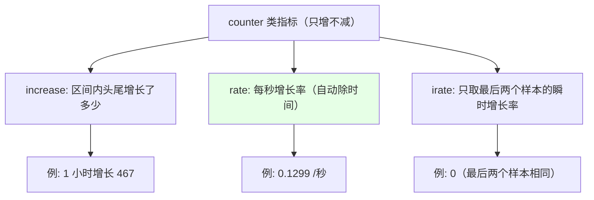
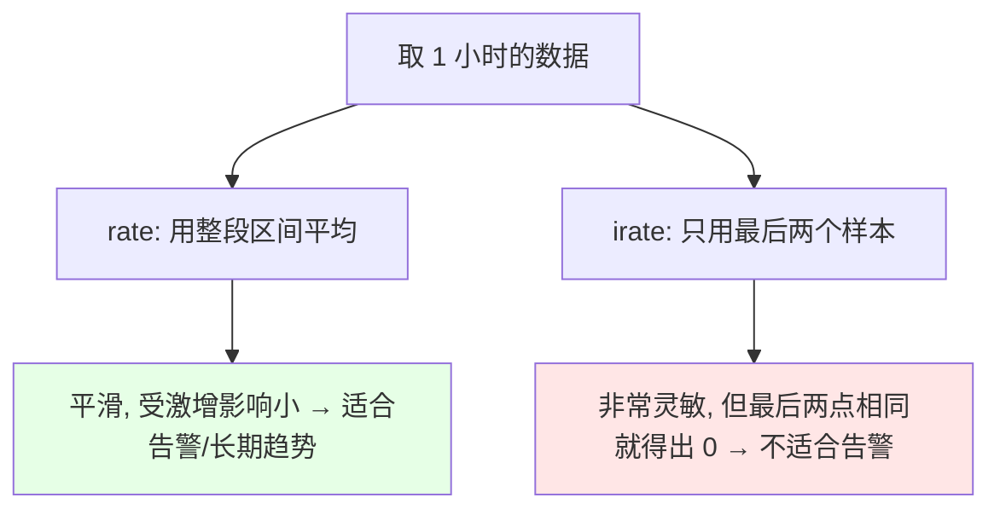
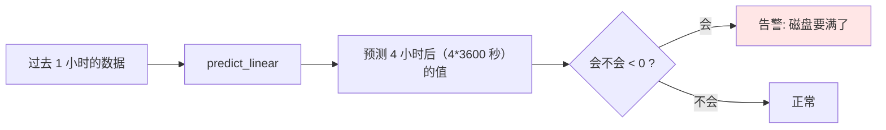
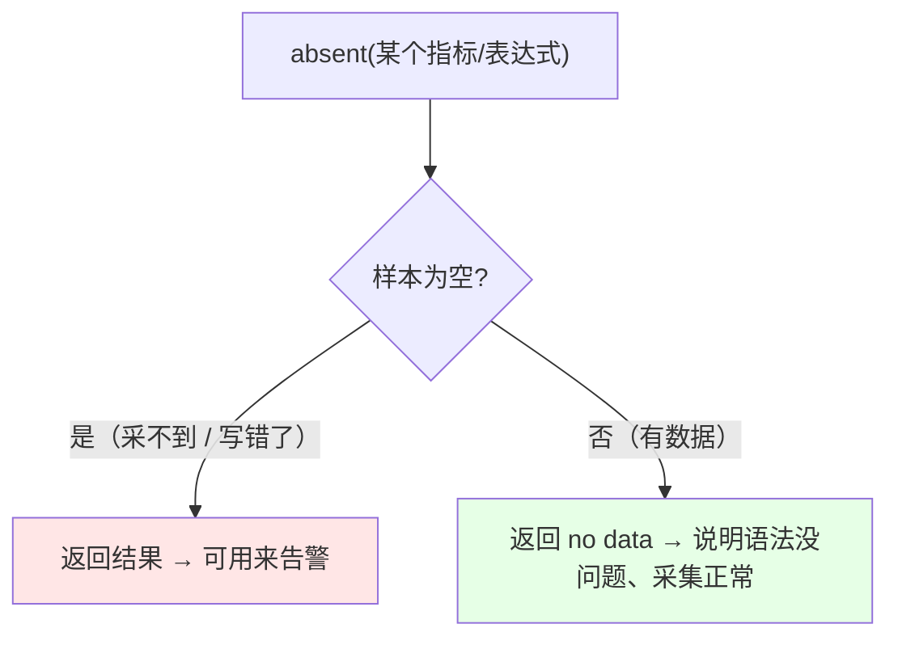
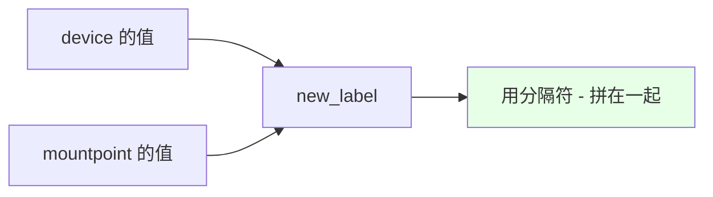
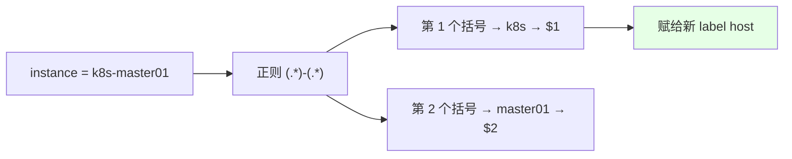

# Kubernetes 集群部署: PromQL 常用函数（rate / irate / predict_linear / label 处理）

上一节讲基本操作，这一节讲**内置函数** —— 增长率怎么算、磁盘会不会满能不能提前知道、指标采不到怎么发现、label 怎么二次加工。这几个是写告警规则时绕不开的。

结论先摆：

1. **增长率三兄弟**：`increase`（区间内增长了多少）、`rate`（每秒增长率，结果和 `increase/秒数` 一致）、`irate`（**只取最后两个样本**的瞬时增长率，**更灵敏但别拿来告警**）；
2. **告警和长期趋势一律用 `rate`** —— `irate` 太灵敏，不适合做长期趋势分析和告警规则；
3. **`predict_linear` 做预测性告警**：拿一段时间的数据预测未来某个时间点的值（如「4 小时后磁盘还剩多少」）；
4. **`absent` 用来监控「指标还在不在」** —— 采不到数据（或表达式写错）时立刻能发现。

## 纲要

- 增长率：increase / rate / irate
- 为什么告警要用 rate 而不是 irate
- predict_linear：预测性告警
- absent：指标还在不在
- 取整：round / ceil / floor
- delta：取差值
- sort / sort_desc：排序
- label_join：多个 label 合成一个新 label
- label_replace：正则提取后赋给新 label

## 增长率：increase / rate / irate



| 函数 | 算法 | 特点 |
| --- | --- | --- |
| `increase(metric[1h])` | **区间头和尾的差值** | 只算增长了多少个，**要自己再除以时间才是速率** |
| `rate(metric[1h])` | **区间内的平均每秒增长率** | 不用自己写除数，**和 `increase/3600` 结果一致** |
| `irate(metric[1h])` | **只取区间内最后两个样本**计算 | **最灵敏**，反映瞬时变化 |

```text
# 1 小时增长了多少个
increase(prometheus_http_requests_total[1h])
  → 467

# 换算成每秒（1 小时 = 3600 秒）
increase(prometheus_http_requests_total[1h]) / 3600
  → 0.1299

# rate 直接算每秒增长率，结果一致
rate(prometheus_http_requests_total[1h])
  → 0.1299

# irate 只取最后两个样本
irate(prometheus_http_requests_total[1h])
```

## 为什么告警要用 rate 而不是 irate



- **`rate` 与 `increase` 都有「长尾效应」** —— 区间内如果有一波访问量激增，会拉高整段区间的计算结果；
- **`irate` 只取最后两个数据点**，所以**更灵敏**，但也正因如此：**最后两个点一样时算出来就是 0**；
- **结论：`irate` 不适合做长期趋势分析，也不适合做告警规则** —— 这两类场景**建议用 `rate`**。

> 课程里 Grafana 预置面板用的就是 `rate`（统计 5 分钟增长率再做 `sum`），这些面板的语法都值得参考。

## predict_linear：预测性告警

```text
# 根据 1 小时的数据，预测 4 小时后磁盘剩余空间
predict_linear(node_filesystem_free_bytes{mountpoint="/"}[1h], 4 * 3600)

# 根据 8 小时的数据，预测 8 小时后内存还剩多少
predict_linear(node_memory_MemFree_bytes[8h], 8 * 3600)
```



| 要素 | 说明 |
| --- | --- |
| 第一个参数 | **区间向量**（拿哪段历史数据来拟合） |
| 第二个参数 | **往前预测多少秒**（如 `4 * 3600` = 4 小时） |
| 典型用途 | **磁盘分区会不会占满**、**内存会不会不够用** —— 这就是**预测性告警** |
| 数据保留 | **Prometheus 默认保存 1 天的数据**（可以改），所以历史区间别超过保留时长 |

> 没有这个函数的话，得自己写一大堆运算去做预测 —— 用它一行就够。

```text
本节函数按用途分类:

PromQL 常用函数
├── 增长率
│   ├── increase(metric[1h])       ← 区间增长量
│   ├── rate(metric[1h])           ← 每秒增长率（告警 / 趋势用这个）
│   └── irate(metric[1h])          ← 瞬时增长率（灵敏，别用来告警）
├── 预测
│   └── predict_linear(metric[1h], 4 * 3600)
├── 存活检查
│   └── absent(metric)             ← 采不到 / 写错才返回
├── 数值处理
│   ├── round / ceil / floor       ← 四舍五入 / 向上 / 向下
│   └── delta(metric[8h])          ← 差值（有正有负）
├── 排序
│   └── sort / sort_desc
└── label 加工
    ├── label_join(...)            ← 多个 label 原样拼成新 label
    └── label_replace(...)         ← 正则提取后赋给新 label
```

## absent：指标还在不在

```text
# 匹配不到数据时 absent 才会返回结果
absent(node_load1{instance="k8s-master01"})

# 表达式写错（比如多敲了个字符）→ 匹配不到 → absent 有返回值 → 说明采集/写法有问题
```



| 场景 | 作用 |
| --- | --- |
| **采集挂了** | 数据没了 → `absent` 有返回值 → **告警** |
| **表达式写错** | 匹配不到任何规则 → `absent` 有返回值 → **能发现写错的规则** |
| 正常 | 有数据 → 返回 no data |

> 简单说：**样本不为空则返回 no data；为空才返回结果**。可以专门用它做一条「监控指标本身是否正常」的告警。

## 取整：round / ceil / floor

```text
round(node_memory_MemFree_bytes / 1024 / 1024)   # 四舍五入
ceil(node_memory_MemFree_bytes / 1024 / 1024)    # 向上取整
floor(node_memory_MemFree_bytes / 1024 / 1024)   # 向下取整
```

| 函数 | 行为 |
| --- | --- |
| `round` | **四舍五入**，取最接近的整数（如 2.79 → 3） |
| `ceil` | **向上取整** |
| `floor` | **向下取整**（如 439.x → 439） |

> 课程里的例子：39.x 用 `round` 得到 40；同样的值用 `floor` 得到 39。

## delta：取差值

```text
# 当前值与 8 小时之前的差值
delta(node_memory_MemFree_bytes[8h])
```

| 特点 | 说明 |
| --- | --- |
| 作用 | **取一个区间内的差值** |
| 结果 | **有正有负**（不像 counter 只增不减） |
| 与 `increase` | 差不多，都是看变化量 |

## sort / sort_desc：排序

```text
sort(node_memory_MemFree_bytes)        # 正序（升序）
sort_desc(node_memory_MemFree_bytes)   # 倒序（降序）
```

> 和其它语言 / 数据库的 `order by asc|desc` 一个意思。

## label_join：多个 label 合成一个新 label

```text
label_join(node_filesystem_free_bytes, "new_label", "-", "device", "mountpoint")
```



| 参数位置 | 含义 |
| --- | --- |
| 第 1 个引号 | **新 label 的名称** |
| 第 2 个引号 | **分隔符**（如 `-`） |
| 后面若干个 | **要取值的那些 label** |

> 作用：**把数据中的一个或多个 label 的值，拼成一个新的 label**。自己写规则时可以靠它加自定义 label，后端再**按这个 label 做路由分发或告警分发**。

## label_replace：正则提取后赋给新 label

```text
# 把 instance（如 k8s-master01）按 - 拆开，取第一段赋给新 label host
label_replace(node_load1, "host", "$1", "instance", "(.*)-(.*)")

# 取第二段
label_replace(node_load1, "host", "$2", "instance", "(.*)-(.*)")
```



| 参数位置 | 含义 |
| --- | --- |
| 第 1 个引号 | **新 label 的名称** |
| 第 2 个引号 | **取哪个捕获组**（`$1` / `$2`） |
| 第 3 个引号 | **源 label**（对谁做匹配） |
| 第 4 个引号 | **正则表达式**（括号就是捕获组） |

> **和 `label_join` 的区别**：`label_join` 只是原样拼接 label 的值、**不做处理**；`label_replace` 会**对 label 的 value 做正则匹配再取值**，灵活得多。两者在自定义告警规则里都很常用。

## API 速览

| 能力 | 做法 |
| --- | --- |
| 区间增长量 | `increase(metric[1h])` |
| 每秒增长率 | **`rate(metric[1h])`**（告警/趋势用它） |
| 瞬时增长率 | `irate(metric[1h])`（灵敏，**别用来告警**） |
| 预测 | **`predict_linear(metric[1h], 4 * 3600)`** |
| 指标存活检查 | **`absent(metric)`**（采不到/写错才返回） |
| 取整 | `round` / `ceil` / `floor` |
| 差值 | `delta(metric[8h])`（有正有负） |
| 排序 | `sort` / `sort_desc` |
| 拼 label | `label_join(metric, "新名", "分隔符", "l1", "l2")` |
| 正则提取 label | `label_replace(metric, "新名", "$1", "源label", "正则")` |
| 数据保留 | 默认 **1 天**（可改），预测区间别超 |

## Demo 示例

```bash
NS=monitoring
SVC=prometheus-k8s
API="http://${SVC}.${NS}:9090/api/v1/query"

# 1. 1 小时的增长量
kubectl run curl-test --rm -it --image=curlimages/curl --restart=Never -n $NS -- \
  curl -s --data-urlencode 'query=increase(prometheus_http_requests_total[1h])' "$API"

# 2. 每秒增长率（告警用 rate）
kubectl run curl-test --rm -it --image=curlimages/curl --restart=Never -n $NS -- \
  curl -s --data-urlencode 'query=rate(prometheus_http_requests_total[1h])' "$API"

# 3. 瞬时增长率（灵敏，不适合告警）
kubectl run curl-test --rm -it --image=curlimages/curl --restart=Never -n $NS -- \
  curl -s --data-urlencode 'query=irate(prometheus_http_requests_total[1h])' "$API"

# 4. 预测 4 小时后根分区还剩多少
kubectl run curl-test --rm -it --image=curlimages/curl --restart=Never -n $NS -- \
  curl -s --data-urlencode 'query=predict_linear(node_filesystem_free_bytes{mountpoint="/"}[1h], 4 * 3600)' "$API"

# 5. 指标是否还在（为空才返回 → 说明采不到）
kubectl run curl-test --rm -it --image=curlimages/curl --restart=Never -n $NS -- \
  curl -s --data-urlencode 'query=absent(node_load1{instance="k8s-master01"})' "$API"

# 6. 用 label_replace 拆出主机名
kubectl run curl-test --rm -it --image=curlimages/curl --restart=Never -n $NS -- \
  curl -s --data-urlencode 'query=label_replace(node_load1, "host", "$1", "instance", "(.*)-(.*)")' "$API"
```

### 总结

- **增长率三个函数**：`increase` 算**区间头尾的增长量**（如 1 小时增长 467）；`rate` 直接给出**每秒增长率**，结果和 `increase/3600` 一致、不用自己除；`irate` 只取区间内**最后两个样本**，最灵敏；
- **告警和长期趋势一律用 `rate`** —— `rate` / `increase` 虽然有「长尾效应」（区间内一波激增会拉高结果），但 **`irate` 因为只看最后两点，两点相同就直接算出 0，不适合做长期趋势分析，更不适合做告警规则**；Grafana 预置面板用的也是 `rate`；
- **`predict_linear(区间向量, 预测秒数)` 做预测性告警**：如根据 1 小时数据预测 4 小时后（`4 * 3600` 秒）磁盘还剩多少、根据 8 小时数据预测 8 小时后内存够不够 —— **没有这个函数就得自己写一大堆运算**；注意 **Prometheus 默认只保存 1 天数据**（可改），历史区间别超；
- **`absent()` 用来监控「指标本身还在不在」**：**样本不为空返回 no data，为空才返回结果** —— 采集挂了、数据没了、或表达式写错了都能靠它发现，可以专门做一条告警；
- **取整三件套**：`round`（四舍五入）、`ceil`（向上取整）、`floor`（向下取整）—— 39.x 用 `round` 得 40、用 `floor` 得 39；**`delta`** 取区间差值，**结果有正有负**，和 `increase` 类似；
- **`sort` / `sort_desc`** 就是正序 / 倒序，和其它语言的 `order by asc|desc` 一个意思；
- **label 二次加工两个函数**：**`label_join(metric, "新label名", "分隔符", "l1", "l2")`** 把多个 label 的值**原样拼**成一个新 label；**`label_replace(metric, "新label名", "$1", "源label", "正则")`** 会对 label 的 value **做正则匹配再取捕获组**（如把 `k8s-master01` 按 `-` 拆开，`$1` 取到 `k8s` 赋给新 label `host`）—— 自己写规则时靠它们加自定义 label，**后端再按这些 label 做路由分发或告警分发**。

