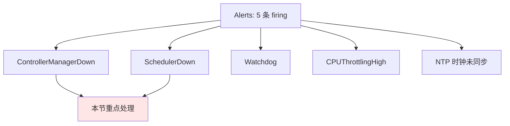
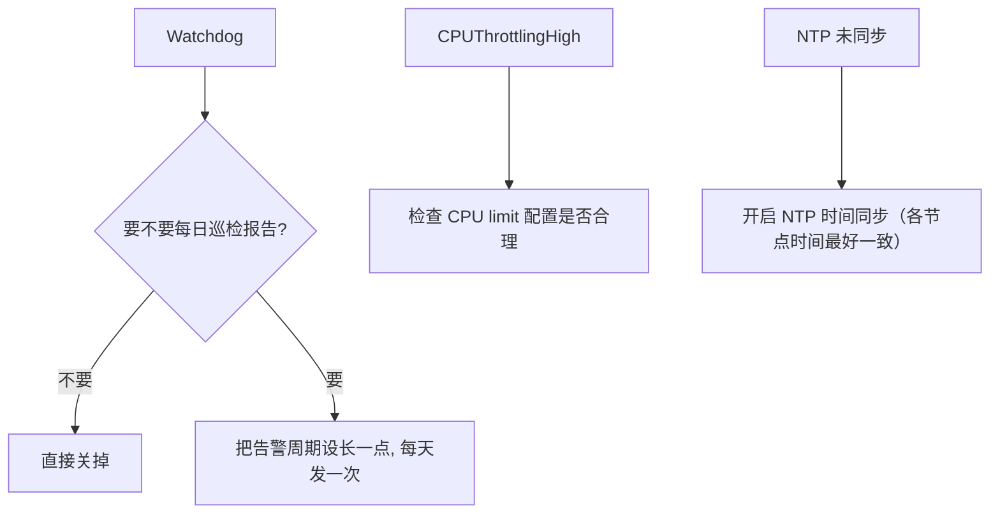
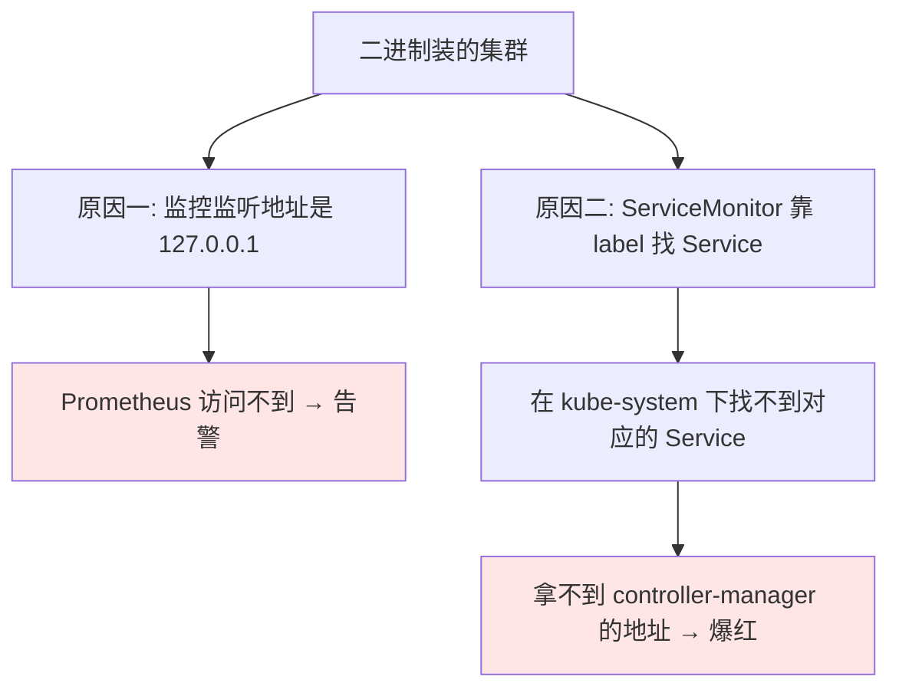
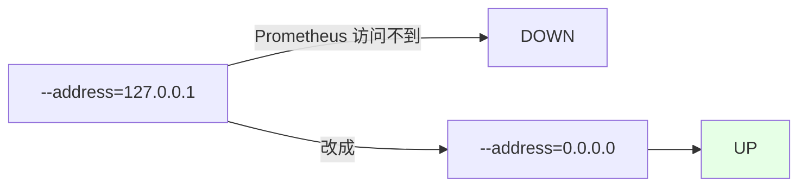
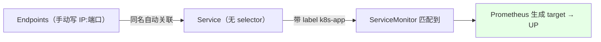
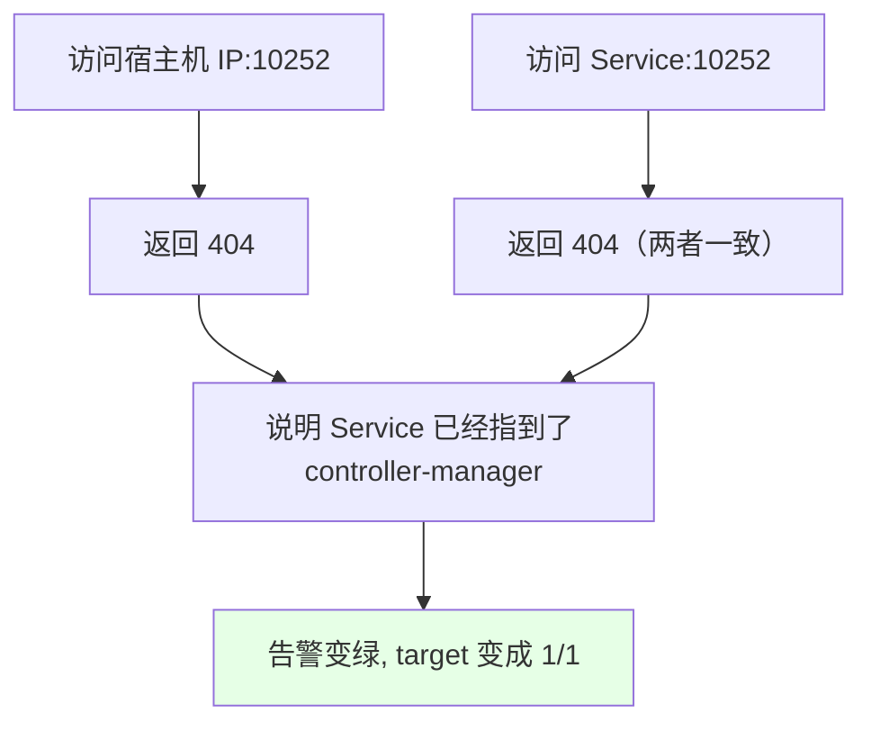

# Kubernetes 集群部署: 解决 Scheduler / ControllerManager 监控告警（监听地址 + 无 selector 的 Service）

kube-prometheus 装完之后，Alerts 页面**默认就有 5 条 firing 告警**。这一节把它们一个一个过一遍，重点解决 **`ControllerManagerDown` 和 `SchedulerDown`** —— 这两个是所有二进制部署的集群都会踩的。

结论先摆：

1. **只有二进制方式安装的集群才会红**，用 kubeadm 装的（以及 kube-prometheus 源码那套）一般是正常的；
2. 根因有两条：**① 监控监听地址是 `127.0.0.1`，Prometheus 根本访问不到；② ServiceMonitor 靠 label 在 `kube-system` 里找 Service，而这个 Service 压根不存在**；
3. 解法也就两步：**监听地址改成 `0.0.0.0`** + **建一个带对应 label 的「无 selector Service + 手动 Endpoints」指到宿主机 IP 的监听端口**；
4. 另外三条告警各有各的成因，**Watchdog 是心跳可以关**，CPU 节流和 NTP 属于环境配置问题，按需求处理。

## 纲要

- 装完默认有哪 5 条告警
- Watchdog / CPU 节流 / NTP 三条怎么处理
- ControllerManager 与 Scheduler 为什么会红
- 第一步：监听地址改成 0.0.0.0
- 关于 0.0.0.0 的安全性说明
- 第二步：建 Endpoints
- 第三步：建同名无 selector 的 Service
- 验证与结果
- Scheduler 同样处理

## 装完默认有哪 5 条告警



| 告警 | 成因 | 处理 |
| --- | --- | --- |
| **ControllerManagerDown** | 二进制装的集群，监听 `127.0.0.1` 且缺 Service | **本节处理** |
| **SchedulerDown** | 同上 | **同样方式处理** |
| Watchdog | 心跳，反映「监控系统本身是正常的」 | **可以关掉** |
| CPUThrottlingHigh | **CPU 节流过高**，一般是 **CPU limit 配置不合理** | 与演示服务器有关，课程未处理 |
| NTP 未同步 | **节点的 NTP 没开** | 生产环境应该开时间同步 |

> **CPU 节流和 NTP 这两条**，用正常服务器装的话**一般不会有**；课程里是因为演示机 limit 配得不合理、NTP 没开才出现的。

## Watchdog / CPU 节流 / NTP 三条怎么处理



| 告警 | 建议 |
| --- | --- |
| Watchdog | **不想收就关掉**；也可以**把告警周期设长一点**，当成每天一条的巡检报告 —— 按需求来 |
| CPUThrottlingHigh | **CPU 的 limit 配置不合理**引起的，要去调 limit |
| NTP | **生产环境服务器一定要有同步时间的操作**，每个节点的时间最好一致 |

## ControllerManager 与 Scheduler 为什么会红



| 根因 | 说明 |
| --- | --- |
| **监听地址** | controller-manager **监听在 `127.0.0.1`**，Prometheus 在别的 Pod 里，访问不了 |
| **缺少 Service** | ServiceMonitor 里写的是 **`k8s-app: kube-controller-manager`** 这个 label，它靠这个去 `kube-system` 找 Service —— **但没有这个 Service** |

```text
ServiceMonitor 的匹配逻辑:

ServiceMonitor（monitoring）
└── selector: k8s-app=kube-controller-manager
        │
        └──> 去 kube-system 找带这个 label 的 Service
                  │
                  └──> 找不到 ❌ → target 为空 → 告警 firing
```

> **kubeadm 方式安装的集群这两个其实是正常的、不会变红**；**只有二进制装的才会有这个问题**。

## 第一步：监听地址改成 0.0.0.0

```bash
# 改 kube-controller-manager 的启动参数：监听地址从 127.0.0.1 改成 0.0.0.0
--address=0.0.0.0
```



## 关于 0.0.0.0 的安全性说明

| 顾虑 | 说明 |
| --- | --- |
| 「开 0.0.0.0 不安全吧？」 | **master 节点一般在公司内网服务器里，不会暴露到公网** |
| 认证 | **组件间通讯是需要证书的、双向证书认证**，证书不可能随便泄露 |
| 结论 | **改成 `0.0.0.0` 没有问题**，不会像想象的那样不安全（总不至于把 controller-manager 和 apiserver 放公网上） |

## 第二步：建 Endpoints

```yaml
apiVersion: v1
kind: Endpoints
metadata:
  name: kube-controller-manager
  namespace: kube-system
  labels:
    k8s-app: kube-controller-manager      # ← 要和 ServiceMonitor 的 selector 一致
subsets:
  - addresses:
      - ip: 192.168.1.19                  # ← 主节点（宿主机）的 IP，多个主节点就写多个
    ports:
      - name: http-metrics                # ← 端口名称要和 ServiceMonitor 里的一致
        port: 10252
        protocol: TCP
```

| 字段 | 说明 |
| --- | --- |
| namespace | **必须是 `kube-system`**（ServiceMonitor 上配的就是这个） |
| label | **`k8s-app: kube-controller-manager`**，必须和 ServiceMonitor 的 selector 一致 |
| `addresses.ip` | **主节点的宿主机 IP**（多个主节点就都写上；课程里只剩一个就写一个） |
| `ports.port` | controller-manager 的监控端口（课程里是 **10252**） |
| `ports.name` | **要和 ServiceMonitor 里写的端口名称保持一致** |

## 第三步：建同名无 selector 的 Service

```yaml
apiVersion: v1
kind: Service
metadata:
  name: kube-controller-manager
  namespace: kube-system
  labels:
    k8s-app: kube-controller-manager      # ← 同样要匹配 ServiceMonitor
spec:
  ports:
    - name: http-metrics
      port: 10252
      targetPort: 10252
      protocol: TCP
  # 注意：没有 selector —— 它自己不会去选 Pod
```



> 这就是**之前讲过的「没有 selector 的 Service」**的典型使用场景：Service 本身不选 Pod，而是**和同名 Endpoints 建立连接**，Prometheus 通过 Service 就能连到宿主机上的 controller-manager。

## 验证与结果

```bash
NS=kube-system
SVC=kube-controller-manager
NODE_IP=192.168.1.19

# 直接访问宿主机的监控端口（返回 404 是正常的，说明进程在监听）
curl -k https://${NODE_IP}:10252/metrics

# 通过 Service 访问，结果应该一致
kubectl run curl-test --rm -it --image=curlimages/curl --restart=Never -n $NS -- \
  curl -k https://${SVC}.${NS}:10252/metrics

# 看 Service / Endpoints 是否创建成功
kubectl get svc,ep -n $NS | grep controller-manager
```



> 课程里访问本机端口和访问 Service **返回的结果是一样的**（都是 404），这就说明 **Service 已经正确指到了 controller-manager 的 10252**。之后告警**变绿、target 从 0/1 变成 1/1**。

## Scheduler 同样处理

```text
两个组件的处理方式完全一样，各做一套:

kube-system namespace
├── ServiceMonitor（kube-prometheus 自带，label: k8s-app=kube-scheduler）
├── Endpoints  kube-scheduler     ← 手动填主节点 IP + 它自己的监听端口
└── Service    kube-scheduler     ← 同名、无 selector、带同样 label

处理完两个:
└── Alerts 里 ControllerManagerDown / SchedulerDown 都变绿
```

| 步骤 | controller-manager | scheduler |
| --- | --- | --- |
| 改监听地址 | `--address=0.0.0.0` | 同样改成 `0.0.0.0` |
| 建 Endpoints | label `k8s-app=kube-controller-manager`，端口按实际监听端口（课程里 10252） | label `k8s-app=kube-scheduler`，**端口填它自己的实际监听端口** |
| 建 Service | 同名、无 selector、同样 label | 同上 |

> 课程里只演示了 controller-manager 一套，scheduler 是**完全相同的问题和解法**，照着做一遍即可。

## API 速览

| 能力 | 做法 |
| --- | --- |
| 改监听地址 | controller-manager / scheduler 的 `--address=0.0.0.0` |
| 匹配靠什么 | ServiceMonitor 的 **`k8s-app` label**，在 **`kube-system`** 下找 Service |
| 建 Endpoints | 手写 `subsets.addresses.ip`（主节点 IP）+ `ports`（端口名要和 ServiceMonitor 一致） |
| 建 Service | **同名、无 selector、带同样 label** → 自动关联同名 Endpoints |
| 验证 | 直接访问 IP:端口 与 访问 Service:端口 **返回结果一致** |
| 成功标志 | 告警变绿、**target 变成 1/1** |
| Watchdog | 心跳告警，可关或把周期设长当巡检报告 |
| CPUThrottlingHigh | CPU **limit 配置不合理**，去调 limit |
| NTP | 开时间同步，各节点时间保持一致 |
| 适用范围 | **仅二进制部署的集群**；kubeadm 装的这两个一般正常 |

## Demo 示例

```bash
NS=kube-system
NODE_IP=192.168.1.19

# 1. 改两个组件的启动参数，监听地址从 127.0.0.1 改成 0.0.0.0，然后重启

# 2. 建 Endpoints（填主节点 IP + 实际监听端口）
kubectl apply -f kube-controller-manager-ep.yaml -n $NS
kubectl get ep kube-controller-manager -n $NS

# 3. 建同名、无 selector 的 Service（label 要和 ServiceMonitor 一致）
kubectl apply -f kube-controller-manager-svc.yaml -n $NS
kubectl get svc kube-controller-manager -n $NS

# 4. 验证：直接访问 IP 与访问 Service 的返回应一致
curl -k https://${NODE_IP}:10252/metrics

kubectl run curl-test --rm -it --image=curlimages/curl --restart=Never -n $NS -- \
  curl -k https://kube-controller-manager.${NS}:10252/metrics

# 5. scheduler 照着做同样一套（改监听地址 + Endpoints + Service）

# 6. 回 Prometheus 看 Alerts 是否变绿、Target 是否 1/1
```

### 总结

- **kube-prometheus 装完默认就有 5 条 firing 告警**：ControllerManagerDown、SchedulerDown、Watchdog、CPUThrottlingHigh、NTP 未同步 —— **重点是前两条**；
- **另外三条各有成因**：**Watchdog 是反映「监控系统本身正常」的心跳，可以关掉**（也可以把告警周期设长，当每日巡检报告）；**CPUThrottlingHigh 是 CPU limit 配置不合理**引起的；**NTP 是节点没开时间同步**（生产环境必须开，各节点时间最好一致）—— 后两条用正常服务器装一般不会出现；
- **ControllerManager / Scheduler 变红只有二进制部署的集群才会发生**（kubeadm 装的一般是正常的），**两个根因**：① **监控监听地址是 `127.0.0.1`，Prometheus 访问不到**；② **ServiceMonitor 靠 `k8s-app` 这个 label 在 `kube-system` 下找 Service，而该 Service 不存在**；
- **解法第一步：把监听地址改成 `0.0.0.0`**。关于安全顾虑 —— **master 一般都在内网、不会暴露公网，而且组件通讯走双向证书认证**，所以开 `0.0.0.0` 没有问题；
- **解法第二步：建 Endpoints**，namespace 必须是 **`kube-system`**、label 必须是 **`k8s-app: kube-controller-manager`**（和 ServiceMonitor 的 selector 一致）、`addresses.ip` 填**主节点的宿主机 IP**（多主就都写上）、`ports.name` **要和 ServiceMonitor 里写的端口名一致**，端口按实际监听端口填（课程里 controller-manager 是 10252）；
- **解法第三步：建一个同名、无 selector、带同样 label 的 Service** —— 这正是「没有 selector 的 Service」的典型场景，它**自动和同名 Endpoints 建立连接**，Prometheus 通过它就能连到宿主机上的组件；
- **验证**：直接访问 `IP:端口` 和访问 `Service:端口` **返回结果一致**（课程里都是 404），说明 Service 已正确指过去，**告警变绿、target 从 0/1 变成 1/1**；**scheduler 是完全相同的问题和解法**，照着再做一套即可。

