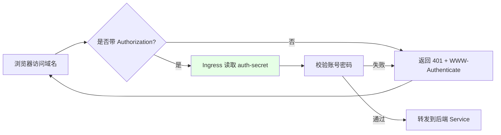
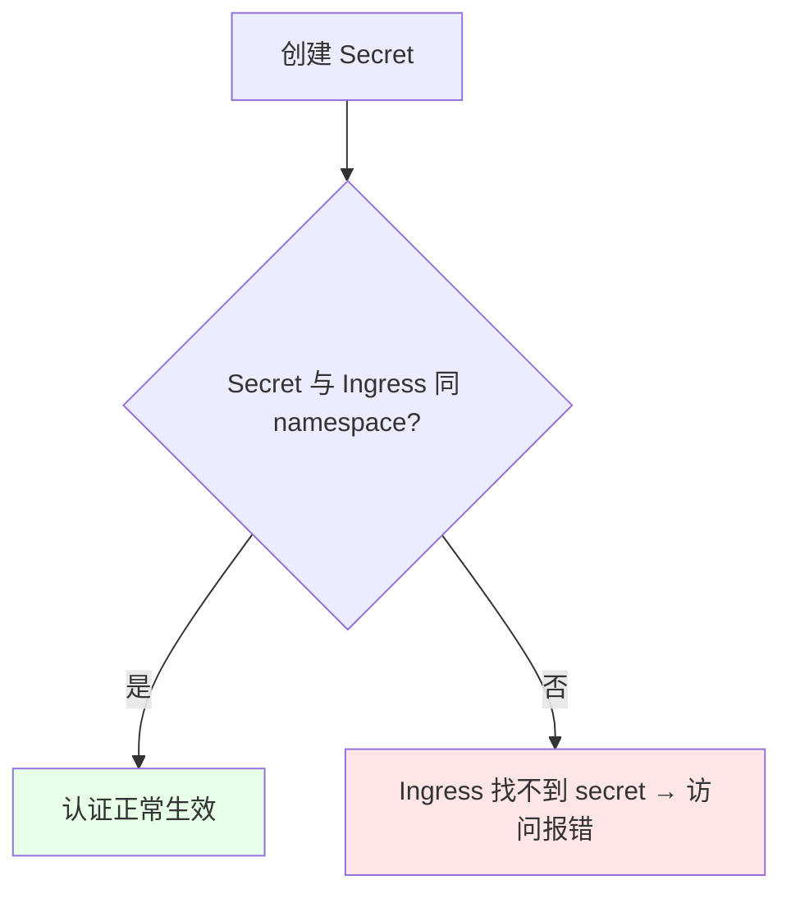

# Kubernetes 集群部署: Ingress Nginx 基本认证（Basic Auth 账号密码保护）

这一节讲如何给 Ingress 加上 Basic Auth（账号密码）保护。结论先摆：**只需要用 `htpasswd` 生成一个账号密码文件、做成 Secret，再给 Ingress 加 3 个 annotation 就够了**；最坑的一点是**这个 Secret 必须和 Ingress 在同一个 namespace**，否则 Ingress 找不到 Secret 会直接报错（503 / 找不到 secret）。

## 纲要

- 用 htpasswd 生成账号密码文件
- 把文件做成 Opaque 类型的 Secret
- 给 Ingress 加 auth-type / auth-secret / auth-realm 三个 annotation
- Secret 必须与 Ingress 同 namespace（否则报找不到 Secret）

## 基本认证的原理与所需 annotation

ingress-nginx 的 Basic Auth 全部通过 annotation 自动生成 nginx 的 `auth_basic` 配置，**不需要自己写 nginx 配置文件**，这点和原生 nginx 不一样，大大降低了配错的概率。



| annotation | 取值 | 说明 |
| --- | --- | --- |
| `nginx.ingress.kubernetes.io/auth-type` | `basic` | 认证类型，Basic Auth 固定写 `basic` |
| `nginx.ingress.kubernetes.io/auth-secret` | Secret 名 | 存放 htpasswd 文件的 Secret |
| `nginx.ingress.kubernetes.io/auth-realm` | 提示串 | 弹窗上显示的认证域信息（如 `"Authentication Required"`） |

> 注意：`auth-realm` 是可选的提示信息，但 `auth-type` 和 `auth-secret` 是必填的。ingress-nginx 会自动把这些 annotation 翻译成 nginx 的 `auth_basic` / `auth_basic_user_file` 指令。

## Secret 必须与 Ingress 同 namespace

这是这节课最容易踩的坑。Basic Auth 的 Secret **必须创建在 Ingress 所在的同一个 namespace**，否则 Ingress 控制器在它自己的 namespace 里找不到这个 Secret，会直接报「找不到 secret」的错误，域名访问直接失败。



| 场景 | 结果 |
| --- | --- |
| Secret 与 Ingress 同 namespace | ✅ 正常 |
| Secret 建在别的 namespace | ❌ Ingress 找不到，直接报错 |
| 改完 Ingress 后 | 一般立即生效，无需滚动更新（annotation 即时生效） |

## 目录结构

```text
Ingress Basic Auth 鉴权链路:

Ingress (demo)
├── annotation: auth-type=basic
├── annotation: auth-secret=ingress-basic-auth
├── annotation: auth-realm="Authentication Required"
└── Secret（必须与 Ingress 同 namespace）
    ├── type: Opaque
    └── data: auth  ← htpasswd 生成的账号密码文件
```

## API 速览

| 能力 | 做法 |
| --- | --- |
| 生成账号密码 | `htpasswd -c -b auth <用户名> <密码>` |
| 存成 Secret | `kubectl create secret generic ingress-basic-auth --from-file=auth -n demo` |
| 开启认证 | annotation `auth-type=basic` + `auth-secret=ingress-basic-auth` |
| 弹窗提示 | annotation `auth-realm="..."` |
| 生效方式 | annotation 即时生效，无需滚动更新 |
| 易错点 | **Secret 必须与 Ingress 同 namespace**，否则 503 / 找不到 secret |
| 作用范围 | 针对单个 Ingress（局部），不是全局 |

## Demo 示例

```bash
NS=demo
AUTH_SECRET=ingress-basic-auth

# 1. 用 htpasswd 生成账号密码文件（foo / bar 仅为示例）
htpasswd -c -b auth foo bar

# 2. 把文件创建成 Secret —— 必须建在 Ingress 所在的 namespace
kubectl create secret generic $AUTH_SECRET --from-file=auth -n $NS

# 3. 给 Ingress 加三个 annotation 即可开启 Basic Auth
kubectl annotate ingress demo \
  nginx.ingress.kubernetes.io/auth-type=basic \
  nginx.ingress.kubernetes.io/auth-secret=$AUTH_SECRET \
  nginx.ingress.kubernetes.io/auth-realm="Authentication Required" \
  -n $NS --overwrite

# 4. 验证：不带账号访问应返回 401
kubectl exec -n $NS deploy/curl -- curl -s -o /dev/null -w "%{http_code}\n" http://demo.local
```

### 总结

- **Basic Auth 只需三步**：`htpasswd` 生成账号密码文件 → 做成 Opaque 类型的 Secret → 给 Ingress 加 `auth-type` / `auth-secret` / `auth-realm` 三个 annotation，ingress-nginx 会自动生成 nginx 的 `auth_basic` 配置，不用自己写配置文件；
- **Secret 必须和 Ingress 同 namespace**，这是最容易踩的坑：建错 namespace 会导致 Ingress 找不到 Secret，域名访问直接报错，所以创建 Secret 时一定带上 `-n` 指定正确的命名空间；
- **Basic Auth 是 annotation 级别的局部配置**，改完即时生效、不需要滚动更新，只影响加了这些 annotation 的那一个 Ingress；
- **不要和全局配置混淆**：账号密码保护属于「针对某个域名」的需求，用 annotation 即可，没必要动 ConfigMap；
- 课程里 htpasswd 因为环境没网没演示，但思路一致，自己按官方文档粘贴即可，考试/生产里这种配置很常见。

