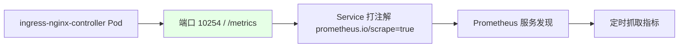
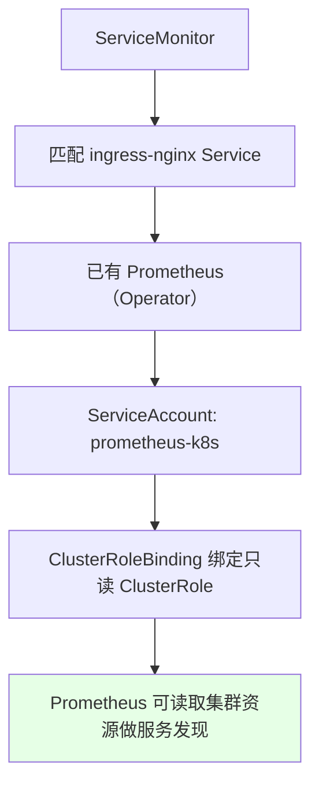
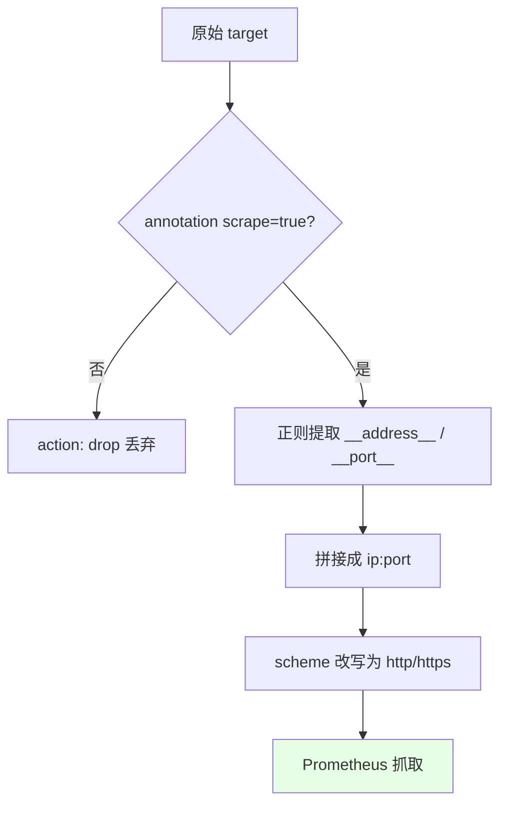

# Kubernetes 集群部署: Ingress Nginx 监控（上）— Prometheus 服务发现与指标抓取

这一节讲怎么用 Prometheus 监控 ingress-nginx。结论先摆：**ingress-nginx 控制器自带 `/metrics` 端点（端口 10254），只要给它的 Service 打上 `prometheus.io/scrape` 注解，Prometheus 就能通过 k8s 服务发现自动抓到指标**；我们不用像官方文档那样另起一套 Prometheus，直接集成进已有的 Prometheus（Operator 部署）即可，配合 ServiceMonitor 和一套只读 RBAC 就能跑起来。

## 纲要

- ingress-nginx 自带 /metrics 端点（端口 10254）
- 用 prometheus.io/scrape 注解声明可被服务发现
- 集成进已有的 Prometheus（Operator 部署）
- RBAC：给 prometheus-k8s 绑定只读 ClusterRole
- relabel_configs：按注解过滤、重写 scheme、拼接 ip:port

## ingress-nginx 的指标端点

ingress-nginx 控制器 Pod 内部起了一个 `10254` 端口，暴露 `/metrics` 接口，里面记录了请求数、连接数、证书信息等监控数据。只要让 Prometheus 能发现这个端点，就能抓到全部 Ingress 的运行状态。



| 项 | 值 | 说明 |
| --- | --- | --- |
| 指标端口 | `10254` | 控制器暴露的 metrics 端口 |
| 指标路径 | `/metrics` | Prometheus 抓取路径 |
| 发现注解 | `prometheus.io/scrape: "true"` | 声明该端点可被抓取 |
| 端口注解 | `prometheus.io/port: "10254"` | 告诉 Prometheus 抓哪个端口 |

> 因为 Ingress 通常有多个控制器实例，所以必须用「服务发现」机制自动把每个实例都纳进来，而不是手写固定的 target 列表。

## 集成进已有的 Prometheus（Operator 部署）

官方文档是新起一套 Prometheus + Grafana，但生产里我们直接把监控接进已部署的 Prometheus（用 Prometheus Operator）。核心两步：用 ServiceMonitor 纳管 ingress-nginx，以及给 Prometheus 的 ServiceAccount 配一套**只读**的 RBAC。



| 组件 | 作用 |
| --- | --- |
| ServiceMonitor | 声明要监控哪个 Service（按 label 匹配 ingress-nginx） |
| ClusterRole | 只读权限，能看几乎所有 k8s 资源（服务发现需要） |
| ClusterRoleBinding | 把 ClusterRole 绑给 `prometheus-k8s` ServiceAccount |
| 权限原则 | 实际可按需收紧；课程为省事给了一个很大的只读权限 |

## relabel_configs 的关键处理

Prometheus 抓取 ingress-nginx 时，要用 `relabel_configs` 做几件事：**只保留 `prometheus.io/scrape=true` 的端点**、把 `scheme` 重写为 `http`/`https`、再用正则从 `__address__` 和 `__port__` 两个捕获组里拼出 `ip:port` 作为真正的采集地址（如 `192.168.1.22:10254`）。不符合规则的目标用 `action: drop` 丢掉，符合的用 `action: keep` 保留。



| relabel 动作 | 说明 |
| --- | --- |
| 过滤 | 只保留 annotations 里 `prometheus.io/scrape=true` 的端点 |
| 重写 scheme | 把 `scheme` 改成 `http` 或 `https`（按正则） |
| 拼接地址 | 用正则捕获 `__address__` 与 `__port__`，合并成 `ip:port` 交给 Prometheus 采集 |
| 保留/丢弃 | `action: keep` 保留匹配项，`action: drop` 丢弃不匹配项 |

## 目录结构

```text
Ingress Nginx 监控接入:

Prometheus（已有）
├── ServiceAccount: prometheus-k8s
├── ClusterRole（只读）
│   └── ClusterRoleBinding → prometheus-k8s
└── ServiceMonitor
    └── 匹配 ingress-nginx Service
        └── annotation: prometheus.io/scrape=true
        └── annotation: prometheus.io/port=10254
        └── Pod :10254/metrics
```

## API 速览

| 能力 | 做法 |
| --- | --- |
| 暴露指标 | ingress-nginx 控制器自带 `:10254/metrics` |
| 自动发现 | Service 加 `prometheus.io/scrape=true` + `prometheus.io/port=10254` |
| Operator 接入 | 写 ServiceMonitor 匹配 ingress-nginx Service |
| 权限 | 给 `prometheus-k8s` SA 绑只读 ClusterRole（ClusterRoleBinding） |
| 地址改写 | `relabel_configs` 提取 `__address__`/`__port__`，重写 `scheme` |
| 过滤目标 | `action: keep/drop` 按注解正则过滤 |
| 不要另起 | 生产直接接已有 Prometheus，不必照官方新部署一套 |

## Demo 示例

```bash
NS=ingress-nginx

# 1. 确认控制器暴露了 /metrics（端口 10254）
kubectl get svc -n $NS
kubectl exec -n $NS deploy/ingress-nginx-controller -- \
  curl -s localhost:10254/metrics | head

# 2. 给 controller Service 打上自动发现注解
kubectl annotate svc ingress-nginx-controller \
  prometheus.io/scrape=true \
  prometheus.io/port=10254 \
  -n $NS --overwrite

# 3. 用 Prometheus Operator 的 ServiceMonitor 纳管
kubectl apply -f ingress-nginx-servicemonitor.yaml

# 4. 查看 Prometheus 是否已发现该 target
kubectl get servicemonitor -n monitoring
```

### 总结

- **ingress-nginx 自带监控端点**：控制器在 `10254` 端口暴露 `/metrics`，里面记录了请求、连接、证书等全部状态信息，不用额外装 exporter；
- **靠服务发现自动纳管**：给 ingress-nginx 的 Service 打 `prometheus.io/scrape=true` 和 `prometheus.io/port=10254` 两个注解，Prometheus 就能通过 k8s 服务发现把每个控制器实例都抓进来（Ingress 多实例时必须用服务发现，不能写死 target）；
- **接进已有 Prometheus 即可**：生产不用像官方文档那样另起一套 Prometheus + Grafana，直接写 ServiceMonitor 把 ingress-nginx 挂到已部署的 Prometheus 上；
- **RBAC 给只读权限**：给 `prometheus-k8s` ServiceAccount 绑一个只读 ClusterRole（ClusterRoleBinding）就能做服务发现，实际可按需收紧，课程为省事给了很大的只读权限；
- **relabel 做地址与过滤**：用 `relabel_configs` 只保留 `scrape=true` 的端点、把 `scheme` 改写为 http/https、并用正则从 `__address__`/`__port__` 拼出 `ip:port` 作为真实采集地址，不符合的用 `drop` 丢弃。

