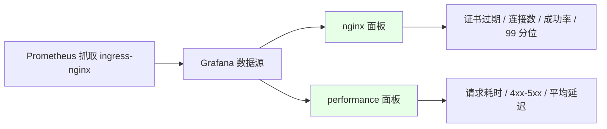
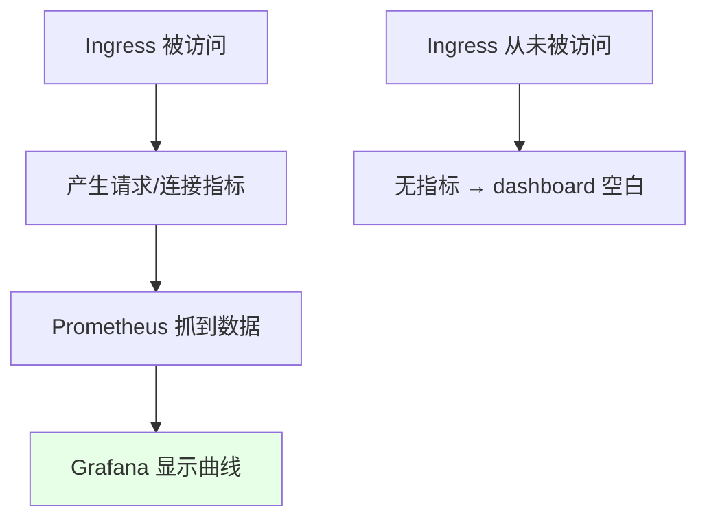
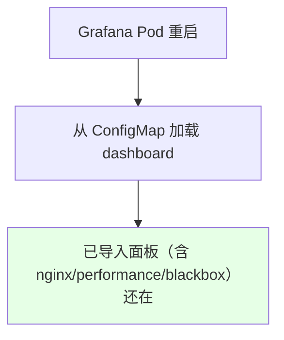

# Kubernetes 集群部署: Ingress Nginx 监控（下）— Grafana 面板、证书过期告警与持久化

这一节接着上一节，讲抓到指标之后怎么看、怎么告警。结论先摆：**官方给 ingress-nginx 提供了 `nginx` 和 `performance` 两个 Grafana 面板，在 Grafana 里点 + → Import 导入即可**；performance 看请求/响应时间、4xx/5xx、平均延迟，nginx 看得很细（含证书过期时间、连接数、成功率、99 分位延迟），都能据此配告警；还有个新发现——**新版本 Grafana 部署在 k8s 里时，导入的 dashboard 会被持久化进 ConfigMap，Pod 重启也不丢**。

## 纲要

- 官方提供 nginx / performance 两个 Grafana 面板
- performance 面板看请求耗时与错误率
- nginx 面板看证书过期、连接数、成功率、分位延迟
- 没流量就没有监控数据（dashboard 不显示）
- 新版本 Grafana 面板持久化进 ConfigMap

## 两个官方面板

ingress-nginx 官方提供了两类面板，在 Grafana 里导入后就能直接看：



| 面板 | 能看什么 | 典型告警 |
| --- | --- | --- |
| `performance` | 每个 path 的请求时间、响应时间、4xx/5xx 数量、平均延迟、报错 | 4xx/5xx 突增、平均延迟过高 |
| `nginx` | 证书过期时间、连接数、成功率、99 分位延迟等很细的指标 | **证书快过期**、成功率下降、P99 延迟过高 |

> 两个面板指标都很全，很多你没想到要监控的点官方都替你想好了，可以直接拿来做告警。

## 没流量就没有数据

一个容易忽略的点：**如果某个 Ingress 从来没被访问过，就不会产生监控数据**，对应的 dashboard 也就不显示曲线。所以配完面板后最好先真实打点流量，再看数据是否进来。



| 现象 | 原因 |
| --- | --- |
| dashboard 不显示数据 | 该 Ingress 没有真实访问流量 |
| 有访问后正常 | 指标产生后 Prometheus 才能抓到 |

## 新版本 Grafana 面板持久化进 ConfigMap

课程里有个新发现：新版本把 Grafana 部署在 k8s 里时，**导入的 dashboard 会被写进 ConfigMap 持久化**（连之前导入的 blackbox 黑盒监控面板、甚至登录账号密码都在）。也就是说 Grafana 的 Pod 重启后，你加的面板都还在——老版本是不持久化的。原理是先持久化到 ConfigMap 再回写，具体实现可以后续再查，但结论是：**新版本 Grafana 可以直接扔在容器里，不用单独找一台虚拟机来存面板**。



| 版本 | 面板是否持久化 |
| --- | --- |
| 老版本 Grafana | 重启后丢失（不持久化） |
| 新版本（k8s 内部署） | 持久化进 ConfigMap，重启还在 |

## 目录结构

```text
Grafana 看 Ingress Nginx 监控:

Grafana（k8s 内部署）
├── 数据源: Prometheus
├── 已导入 Dashboard（持久化在 ConfigMap）
│   ├── nginx          ← 证书过期 / 连接数 / 成功率 / P99
│   ├── performance    ← 请求耗时 / 4xx-5xx / 平均延迟
│   └── blackbox       ← 黑盒探测（也持久化了）
└── 告警规则
    ├── 证书即将过期
    ├── 5xx 比例过高
    └── P99 延迟过高
```

## API 速览

| 能力 | 做法 |
| --- | --- |
| 看监控 | Grafana 点 + → Import，导入 nginx / performance 两个官方面板 |
| 性能告警 | performance 面板看 4xx/5xx、平均延迟 |
| 证书告警 | nginx 面板看证书过期时间，据此配过期告警 |
| 细指标 | 连接数、成功率、99 分位延迟都在 nginx 面板 |
| 数据前提 | 必须先有真实访问流量，否则无数据不显示 |
| 持久化 | 新版本 Grafana 面板存进 ConfigMap，Pod 重启不丢 |
| 黑盒监控 | 之前导入的 blackbox 面板同样被持久化 |

## Demo 示例

```bash
NS=grafana

# 1. 查看 Grafana 中已持久化的 dashboard（新版本存进 ConfigMap）
kubectl get cm -n $NS -l grafana_dashboard=1

# 2. 把官方 nginx dashboard 存成 ConfigMap，让 Grafana 自动加载
kubectl create cm nginx-ingress-dashboard \
  --from-file=nginx.json -n $NS
kubectl label cm nginx-ingress-dashboard grafana_dashboard=1 -n $NS

# 3. 在 Grafana 界面点 + → Import，导入官方 nginx / performance 面板
#    （UI 操作，导入后即可看到请求耗时、4xx-5xx、证书过期等指标）
```

### 总结

- **官方给了现成面板**：ingress-nginx 有 `nginx` 和 `performance` 两个 Grafana 面板，在 Grafana 点 + → Import 导入就能用，不用自己画图；
- **performance 看耗时与错误**：请求时间、响应时间、每个 path 的耗时、4xx/5xx 数量、平均延迟都能看，据此配告警；
- **nginx 面板看得很细**：含证书过期时间（可做过期告警）、连接数、成功率、99 分位延迟等，很多监控点官方都替你想好了；
- **没流量就没数据**：Ingress 没被真实访问过就不会产生指标，dashboard 也不会显示曲线，配完记得先打点流量验证；
- **新版本 Grafana 面板持久化**：部署在 k8s 里时，导入的 dashboard（甚至 blackbox 面板、登录密码）都被写进 ConfigMap，Pod 重启后还在，所以新版本可以直接跑在容器里，不必单独找虚拟机。

