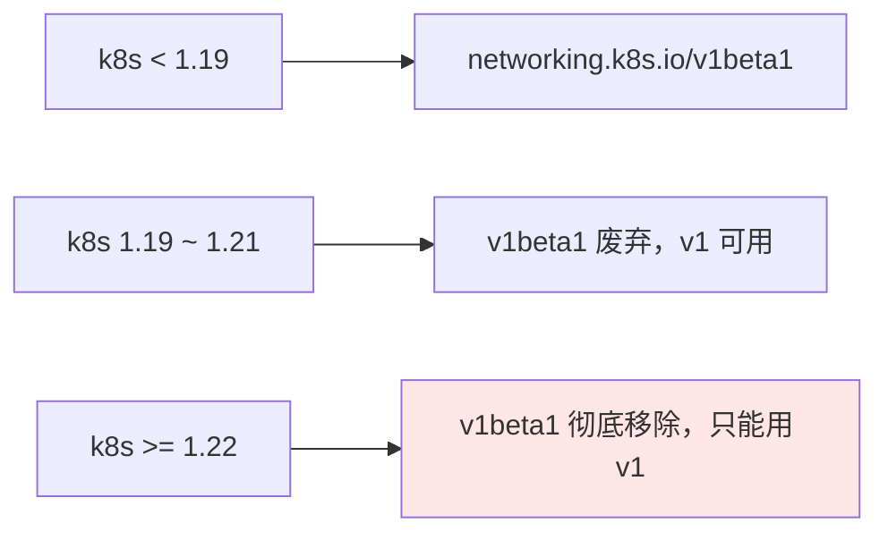
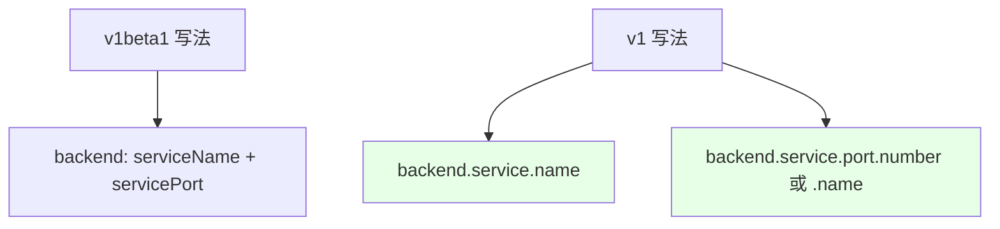
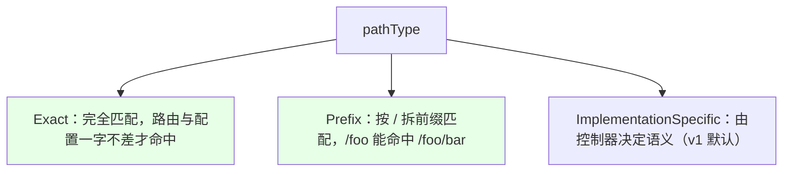

# Kubernetes 集群部署: k8s 1.19 下的 Ingress 配置（apiVersion 迁移与 pathType）

这一节讲 k8s 1.19 之后 Ingress 配置的变化。结论先摆：**1.19 起 `networking.k8s.io/v1beta1` 被废弃、`networking.k8s.io/v1` 成为正式版**；v1 里后端写法从 `serviceName/servicePort` 拆成了 `backend.service.name` + `backend.service.port.number/name`，并且**必须显式声明 `pathType`（Prefix / Exact / ImplementationSpecific）**。但要注意：**录制课程时 ingress-nginx 还没支持 v1，如果你的控制器不支持 v1，千万别强行用，否则参数解析不出来**。

## 纲要

- 1.19 起 apiVersion 从 v1beta1 迁到 v1
- v1 后端写法：service 被拆成 name + port
- 端口可用数字也可用容器端口名
- 必须声明 pathType（Prefix / Exact / ImplementationSpecific）
- 控制器是否支持 v1 要先查官方文档

## apiVersion 的迁移

在 1.19 之前，Ingress 用的是 `networking.k8s.io/v1beta1`；从 1.19 开始 v1beta1 被标记废弃，1.22 及之后版本会彻底不可用，正式版变成 `networking.k8s.io/v1`。用旧版创建时 kubectl 会提示 v1beta1 已过期。



| 版本区间 | apiVersion | 说明 |
| --- | --- | --- |
| `< 1.19` | `v1beta1` | 旧写法 |
| `1.19 ~ 1.21` | `v1`（v1beta1 仍可用但告警） | 过渡期，建议切 v1 |
| `>= 1.22` | `v1` | v1beta1 已移除，只能用 v1 |

## v1 的后端写法：service 被拆开

v1 里后端的 `serviceName` + `servicePort` 被拆成了 `backend.service.name` 和 `backend.service.port.number`（或 `.name`）。端口既可以是数字，也可以写成容器端口的名字。



| 维度 | v1beta1 | v1 |
| --- | --- | --- |
| 后端引用 | `serviceName` / `servicePort` | `backend.service.name` / `backend.service.port.number` |
| 端口类型 | 数字 | 数字或容器端口名（如 `web`） |
| pathType | 不需要 | **必须声明** |

## pathType 的含义

v1 新增了必填的 `pathType`，决定路径怎么匹配：



| pathType | 匹配规则 |
| --- | --- |
| `Exact` | 完全匹配，写 `/foo` 就只命中 `/foo`，多个路径都要一一列 |
| `Prefix` | 按 `/` 拆前缀，写 `/foo` 能命中 `/foo/bar` 等子路径（一般用这个） |
| `ImplementationSpecific` | 语义由具体 Ingress 控制器决定，是 v1 的默认值 |

## 控制器是否支持 v1 要先确认

这是这节课最重要的提醒：**录制时 ingress-nginx 官方还没支持 v1 配置**，Traefik、HAProxy 等也要看各自的文档。如果控制器不支持 v1，你强行写 v1 它解析不出参数，配了也白配。所以 1.22 之前还能用 v1beta1，但切 v1 前一定先去官方文档确认你的 Ingress 实现已经支持。

## 目录结构

```text
k8s 1.19 Ingress 配置要点:

Ingress 清单
├── apiVersion: networking.k8s.io/v1
├── spec.ingressClassName
├── spec.rules[].http.paths[]
│   ├── path
│   ├── pathType: Prefix | Exact | ImplementationSpecific
│   └── backend.service
│       ├── name
│       └── port.number（或 .name）
└── 前提：控制器必须支持 v1（先查官方文档）
```

## API 速览

| 能力 | 做法 |
| --- | --- |
| 迁移 apiVersion | `networking.k8s.io/v1`（1.19+；1.22 后 v1beta1 移除） |
| 后端引用 | `backend.service.name` + `backend.service.port.number/name` |
| 端口写法 | 数字或容器端口名均可 |
| 路径匹配 | 必填 `pathType`：`Prefix` / `Exact` / `ImplementationSpecific` |
| 一般选择 | 用 `Prefix` 即可（按 `/` 前缀匹配） |
| 前置条件 | **先确认 ingress-nginx / Traefik 等已支持 v1** |
| 过渡期 | 1.19~1.21 仍可暂用 v1beta1，但建议切 v1 |

## Demo 示例

```bash
NS=demo

# 1. 用 v1 写一个 Ingress（注意 backend 拆分 + 必填 pathType）
cat <<'EOF' | kubectl apply -n $NS -f -
apiVersion: networking.k8s.io/v1
kind: Ingress
metadata:
  name: demo
spec:
  ingressClassName: nginx
  rules:
  - host: test.example.com
    http:
      paths:
      - path: /foo
        pathType: Prefix
        backend:
          service:
            name: web
            port:
              number: 80
EOF

# 2. 端口也能用容器端口名（如 web）
kubectl get svc web -n $NS -o jsonpath='{.spec.ports[*].name}'

# 3. 若控制器还不支持 v1，先别切，仍用 v1beta1（1.22 之前可用）
kubectl explain ingress.spec.rules.http.paths.pathType
```

### 总结

- **1.19 起切 v1**：`networking.k8s.io/v1beta1` 在 1.19 被废弃、1.22 后彻底移除，正式版是 `networking.k8s.io/v1`；
- **后端写法变了**：v1 把 `serviceName/servicePort` 拆成 `backend.service.name` + `backend.service.port.number`，端口既可用数字也可用容器端口名；
- **pathType 必填**：v1 要求显式声明 `Prefix`（按 `/` 前缀匹配，一般用它）、`Exact`（完全匹配）或 `ImplementationSpecific`（由控制器决定，是默认）；
- **先确认控制器支持**：录制时 ingress-nginx 还没支持 v1，Traefik/HAProxy 也要查文档——控制器不支持 v1 就别强行用，否则参数解析不出来；1.22 之前还能暂用 v1beta1；
- **过渡期建议**：1.19~1.21 处于过渡期，建议确认控制器支持后尽早切到 v1 写法，避免 1.22 升级后清单直接失效。

