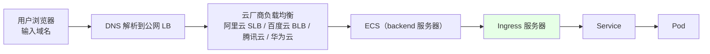
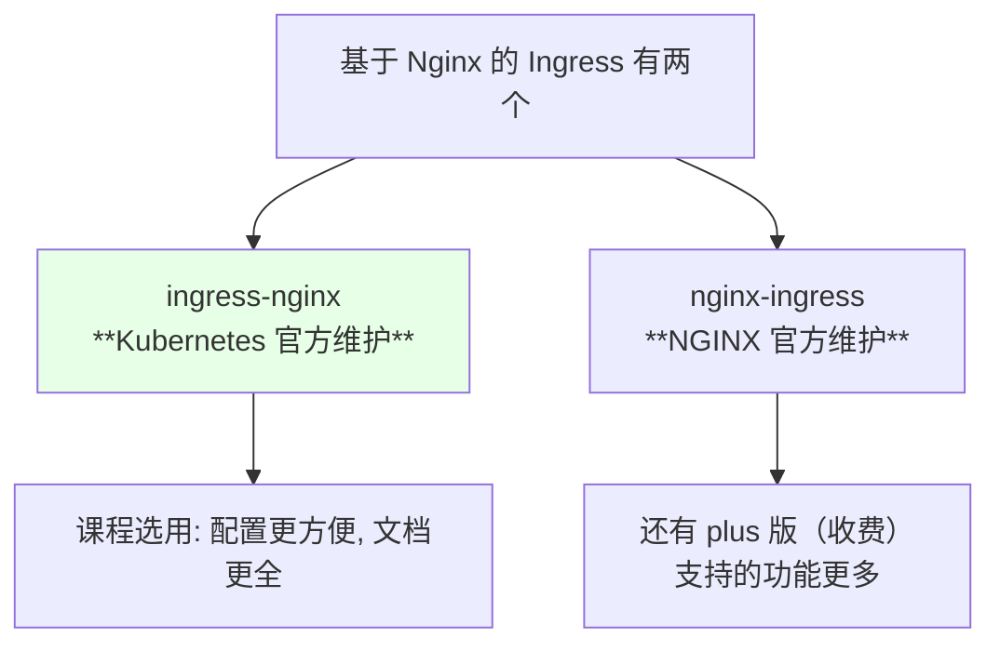
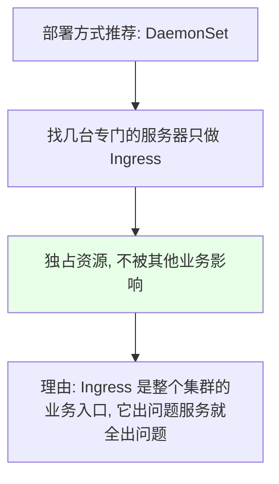
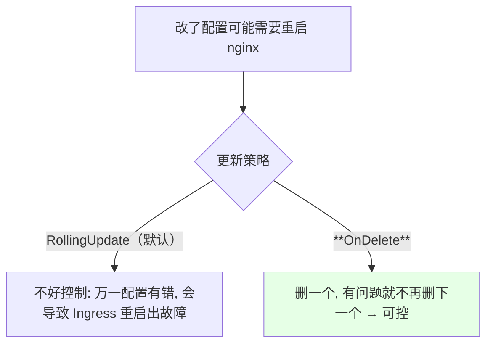
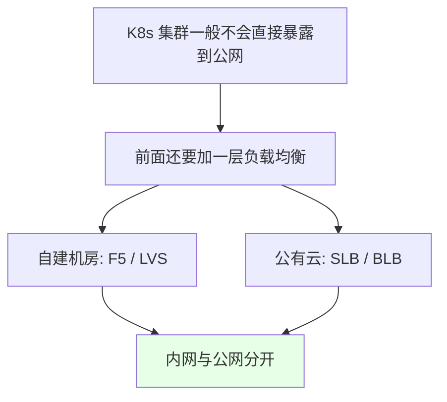
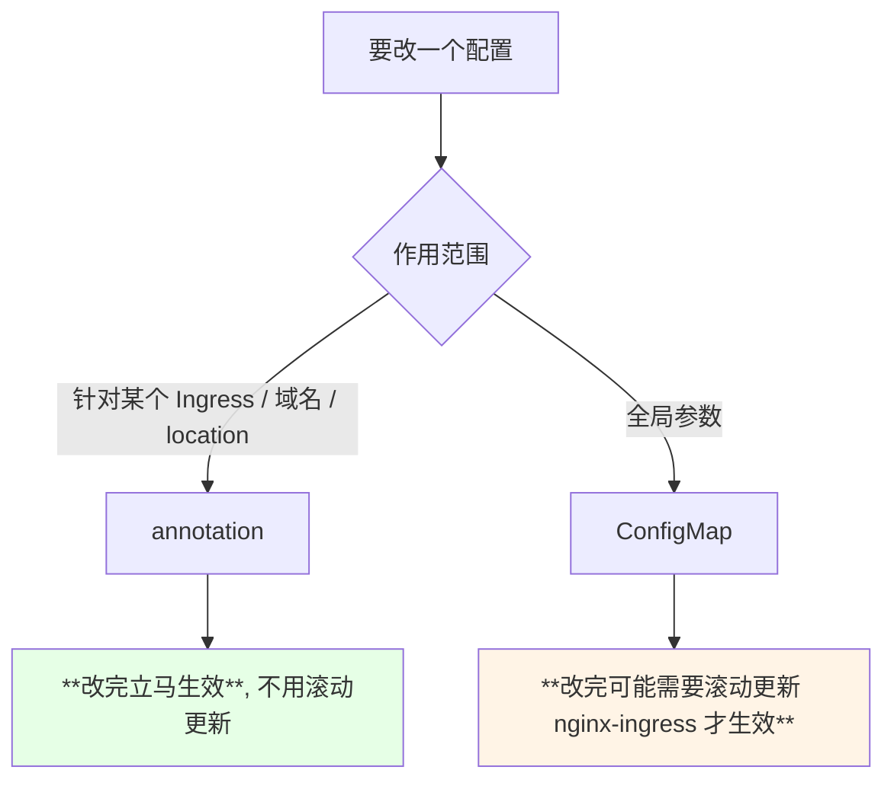

# Kubernetes 集群部署: Ingress Nginx 入门（集群入口链路、选型与部署要点）

这一章讲整个集群的入口 —— **Ingress**。前面几章解决了「服务怎么跑起来、怎么监控、日志怎么收」，最后一步是**让用户能用域名访问到它**。

结论先摆：

1. **用户是用域名访问的，不是 IP** —— 完整链路是「域名 → 云厂商负载均衡（SLB）→ ECS → Ingress」；
2. 有**两个名字很像的实现**别搞混：**`ingress-nginx`（Kubernetes 官方维护）** 和 **`nginx-ingress`（NGINX 官方维护，还有付费的 plus 版）** —— 课程选前者，**配置更方便、文档更全**；
3. 部署用 **DaemonSet + 独占节点**，并且**开 `hostNetwork`、把更新策略改成 `OnDelete`**；
4. **annotation 改完立刻生效，ConfigMap 常常要滚动更新才生效** —— 前者管「某个域名 / 某个 location」，后者管「全局参数」。

## 纲要

- 从域名到 Pod 的完整链路
- 两个别搞混的实现：ingress-nginx 与 nginx-ingress
- 还有哪些可选的 Ingress
- 部署要点一：DaemonSet + 独占节点
- 部署要点二：hostNetwork 与 dnsPolicy
- 部署要点三：更新策略改成 OnDelete
- Ingress 是集群入口，不是业务入口
- annotation 与 ConfigMap 的区别

## 从域名到 Pod 的完整链路



| 环节 | 说明 |
| --- | --- |
| 域名 → LB | **把域名的解析 IP 写成外网 SLB / BLB 的地址**，各家云都有自己的负载均衡 |
| LB → ECS | SLB 后面挂的是**具体的服务器**（backend 服务器） |
| ECS → Ingress | 最终指到 **Ingress 所在的服务器** |
| 内网场景 | 自建机房里，**前面也可能是 F5 或 LVS** |

> 之前讲过怎么搭：**用 DaemonSet 的方式在指定的服务器上安装 Ingress**。

## 两个别搞混的实现：ingress-nginx 与 nginx-ingress



| 维度 | `ingress-nginx`（K8s 官方） | `nginx-ingress`（NGINX 官方） |
| --- | --- | --- |
| 维护方 | **Kubernetes 官方** | **NGINX 官方**（另有付费 plus 版） |
| 底层 | 都是用 nginx 做的，**两者区别并不大** | 同左 |
| 配置方式 | 都通过 **annotation 声明式配置** | 同左 |
| 课程选择 | ✅ **选它** —— **配置更方便、文档更全，更能理解 K8s 使用者的需求和痛点** | 未选 |

> NGINX 官方也列出了两者的对比，有兴趣可以去看。**两者常用的功能都支持**，差别主要在配置体验和文档完整度上。

## 还有哪些可选的 Ingress

```text
常见的 Ingress / 入口方案:

Ingress Controller
├── ingress-nginx        ← Kubernetes 官方维护（课程选用）
├── nginx-ingress        ← NGINX 官方维护（含 plus 收费版）
├── Traefik              ← 比较新，据说更灵敏
├── HAProxy
└── Envoy（Istio）        ← 本身是服务网格，也能实现 Ingress 的功能
```

> **Traefik 之前体验过，配置上没有 ingress-nginx 那么简单**（现在是否变简单不好说）。课程最终还是选了 **K8s 官方的 ingress-nginx** —— 底层是我们熟悉的 Nginx、配置简单、又是官方自己维护。

## 部署要点一：DaemonSet + 独占节点



| 情况 | 做法 |
| --- | --- |
| **有专门服务器** | **找几台专门的服务器只做 Ingress 使用**，不做别的 —— **让 Ingress 独占资源** |
| **没有专门服务器** | 用 **resources 配置 `request` 和 `limit` 保持一致**，尽量保证它不被影响 |

> **Ingress 是整个集群的业务入口**，它一挂，服务就全出问题，所以资源上要给它特殊照顾。

## 部署要点二：hostNetwork 与 dnsPolicy

```yaml
spec:
  template:
    spec:
      hostNetwork: true                        # ← 直接用宿主机网络
      dnsPolicy: ClusterFirstWithHostNet       # ← 开了 hostNetwork 就要配套改这个
      containers:
        - name: controller
          resources:
            requests:
              cpu: 100m
              memory: 128Mi
            limits:
              cpu: 100m                        # ← 没有专用节点时 request 与 limit 保持一致
              memory: 128Mi
```

| 参数 | 说明 |
| --- | --- |
| `hostNetwork: true` | **直接使用宿主机的网络** —— 网络消耗比 NodePort 小，**性能更高** |
| `dnsPolicy: ClusterFirstWithHostNet` | 开了 `hostNetwork` 之后**要把 dnsPolicy 一起改掉** |
| 为什么不用 NodePort | **NodePort 的性能没有 hostNetwork 高**（走 iptables / IPVS 转发，性能没那么好） |
| request / limit | 没有专用节点时**两者配成一致** |

## 部署要点三：更新策略改成 OnDelete

```yaml
spec:
  updateStrategy:
    type: OnDelete          # ← 不用默认的滚动更新
```



> **DaemonSet 默认的滚动更新方式建议改成 `OnDelete`** —— 因为改了一些配置可能需要重启 nginx 才会生效，**滚动更新不好控制**，万一配置有错会把 Ingress 整体重启出故障；**`OnDelete` 是删一个、有问题就停手**，风险可控得多。

> 在 Kubernetes 里**所有安装都是 yaml 文件的形式**，照着官方文档 apply 即可。

## Ingress 是集群入口，不是业务入口



| 注意点 | 说明 |
| --- | --- |
| **集群入口 ≠ 业务入口** | Ingress 是**整个集群的入口**，前面通常还有一层负载均衡 |
| 要不要暴露公网 | **一般不会**；非要暴露的话，**可能只暴露 80 和 443 端口** |
| 混部 | **建议不要和业务应用混在一起**，还是找单独的服务器来做 |

## annotation 与 ConfigMap 的区别



| 维度 | annotation | ConfigMap |
| --- | --- | --- |
| **生效速度** | **改了 / 新增后立马生效**，不用滚动更新 | **改了配置可能需要滚动更新才能生效** |
| **作用范围** | **针对某个 Ingress、某个域名、某个 location** | **全局参数** |
| 典型配置 | 各类域名 / 路径级别的功能开关 | **日志路径、错误日志路径、超时时间、上传文件大小**等 |

> 支持的能力非常多 —— **SSL、TCP / UDP、FastCGI** 都支持，**几乎常用的 Nginx 配置在上面都能找到**，直接在官方文档里搜即可。

## API 速览

| 能力 | 做法 |
| --- | --- |
| 选型 | **`ingress-nginx`（K8s 官方维护）**，配置更方便、文档更全 |
| 部署形态 | **DaemonSet**，最好**独占节点**；没专用节点就把 request / limit 配成一致 |
| 网络 | **`hostNetwork: true`** + **`dnsPolicy: ClusterFirstWithHostNet`**（性能高于 NodePort） |
| 更新策略 | **`updateStrategy.type: OnDelete`**（避免配置错误导致整体重启） |
| 局部配置 | **annotation**（改完立刻生效） |
| 全局配置 | **ConfigMap**（常需滚动更新才生效） |
| 链路 | 域名 → 云 LB → ECS → Ingress → Service → Pod |
| 暴露公网 | 一般不加；要暴露也只开 **80 / 443**，且**不要和业务混部** |
| 其他实现 | Traefik / HAProxy / Envoy（Istio） |
| 支持能力 | SSL、TCP/UDP、FastCGI 等 |

## Demo 示例

```bash
NS=ingress-nginx

# 1. 按官方文档 apply 安装（DaemonSet 形态）
kubectl apply -f ingress-nginx-daemonset.yaml
kubectl get pod -n $NS -o wide

# 2. 给 Ingress 专用节点打标签，让它独占
kubectl label node node03 ingress-node=true
kubectl get node -l ingress-node=true

# 3. 确认 hostNetwork 已生效（Pod IP 就是宿主机 IP）
kubectl get pod -n $NS -o wide

# 4. 确认更新策略是 OnDelete
kubectl get ds -n $NS -o jsonpath='{.items[0].spec.updateStrategy.type}'

# 5. 看全局 ConfigMap（日志路径 / 超时 / 上传大小等）
kubectl get cm -n $NS
kubectl describe cm ingress-nginx-controller -n $NS

# 6. 改完 ConfigMap 若未生效，手动滚动更新
kubectl rollout restart ds/ingress-nginx-controller -n $NS

# 7. 改某个域名的配置用 annotation（改完立即生效）
kubectl annotate ingress demo nginx.ingress.kubernetes.io/rewrite-target=/ --overwrite
```

### 总结

- **用户是用域名访问服务的，不会用 IP**：完整链路是**域名 → 云厂商负载均衡（阿里云 SLB / 百度云 BLB / 腾讯云 / 华为云各自的 LB）→ ECS（backend 服务器）→ Ingress → Service → Pod**，自建机房里前面也可能是 **F5 或 LVS**；
- **有两个名字很像的实现别搞混**：**`ingress-nginx`（Kubernetes 官方维护）** 和 **`nginx-ingress`（NGINX 官方维护，另有付费的 plus 版）** —— 底层都是 Nginx、都通过 annotation 声明式配置，**区别并不大**，但课程选**前者**，因为**配置更方便、文档更全，更能理解 K8s 使用者的需求和痛点**；此外还有 **Traefik、HAProxy、Envoy（Istio）** 等可选；
- **部署要点一：用 DaemonSet 并尽量独占节点** —— 找几台专门的服务器**只做 Ingress**，因为**它是整个集群的业务入口，它出问题服务就全出问题**；没有专用服务器时就把 **`request` 和 `limit` 配成一致**，保证它不被影响；
- **部署要点二：开 `hostNetwork: true`，并把 `dnsPolicy` 配套改成 `ClusterFirstWithHostNet`** —— 直接走宿主机网络，**网络消耗比 NodePort 小、性能更高**（NodePort 走 iptables / IPVS 转发，性能没那么好）；
- **部署要点三：把 DaemonSet 的更新策略改成 `OnDelete`** —— 改配置常需要重启 nginx 才生效，**默认滚动更新不好控制，万一配置有错会导致 Ingress 整体重启出故障**；`OnDelete` 是**删一个、有问题就停手**，风险可控；
- **Ingress 是集群入口，不是业务入口** —— K8s 集群一般不会直接暴露公网，**前面还要有一层负载均衡（内网与公网分开）**；非要暴露的话**可能只开 80 和 443**，且**不要和业务应用混部**，找单独服务器；
- **annotation 与 ConfigMap 的分工**：**annotation 针对某个 Ingress / 域名 / location，改完立马生效、不用滚动更新**；**ConfigMap 管全局参数（日志路径、错误日志路径、超时、上传文件大小等），改完常常需要滚动更新 nginx-ingress 才生效** —— 支持的能力非常多（SSL、TCP/UDP、FastCGI 等），常用的 Nginx 配置在官方文档里基本都能找到。

