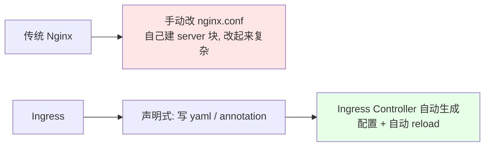
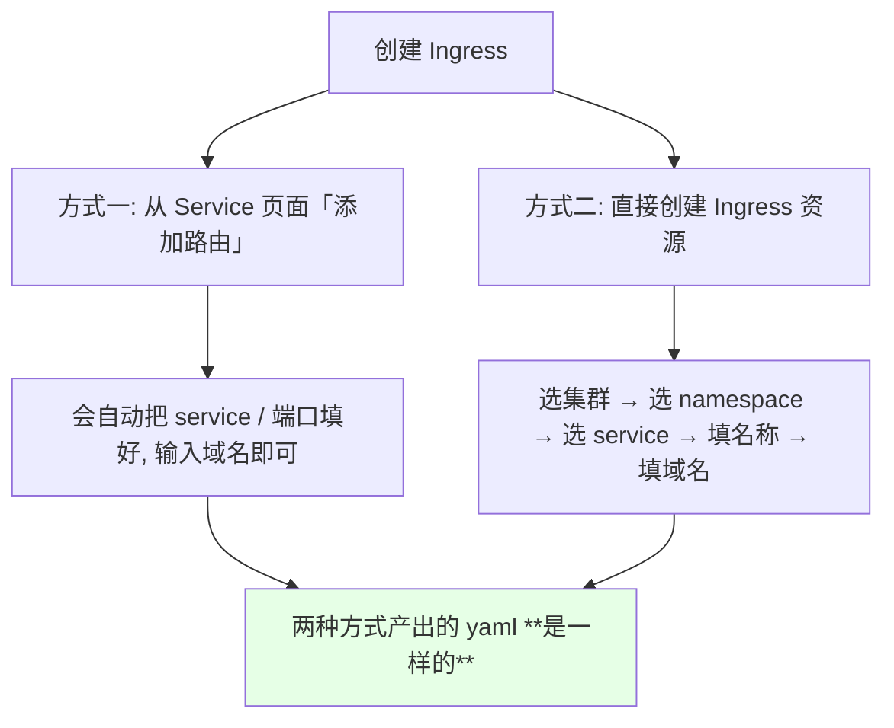
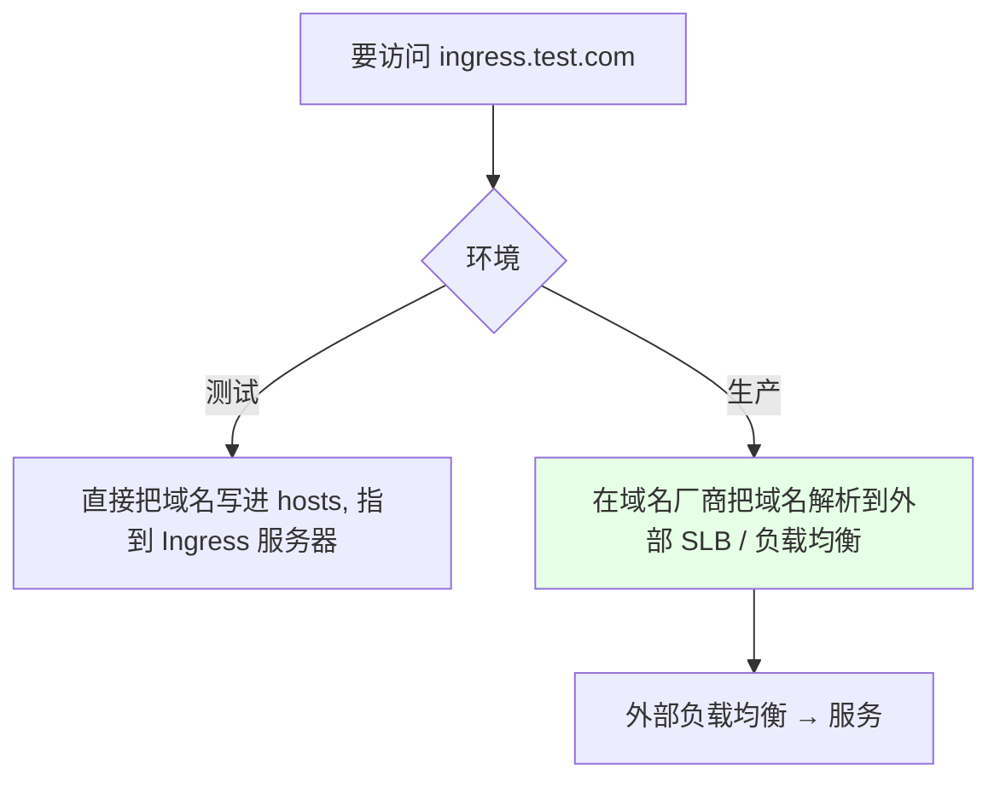
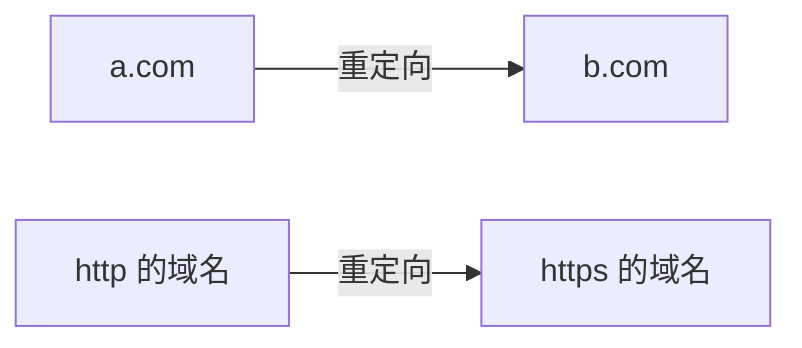
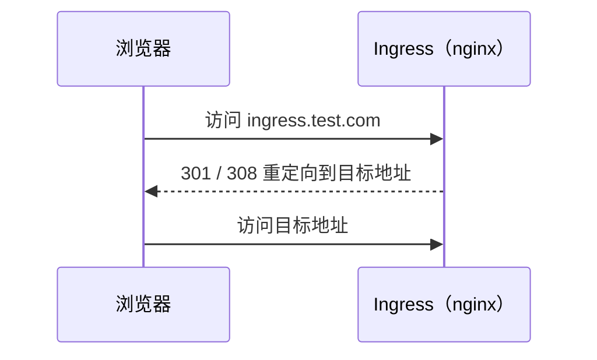
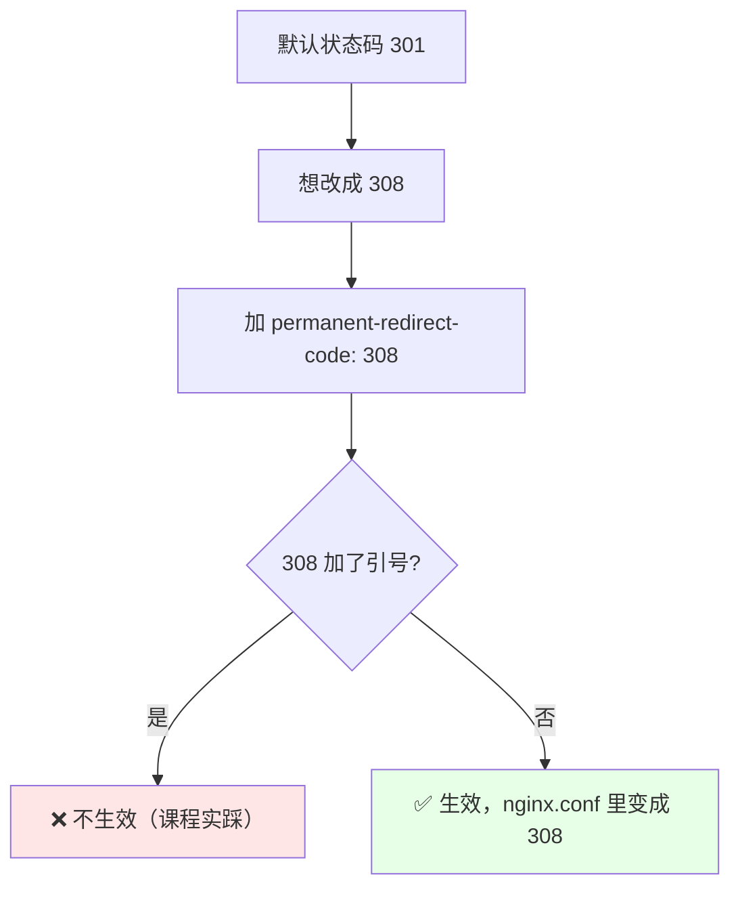

# Kubernetes 集群部署: Ingress Nginx 域名重定向（permanent-redirect 注解与 301 / 308）

用了 Ingress 之后，**所有 Nginx 配置都变成声明式的** —— 不用再去改 `nginx.conf`，Ingress Controller 会自动帮你生成。这一节用**域名重定向**这个功能来具体感受一下。

结论先摆：

1. **加一个 annotation 就够了**：`nginx.ingress.kubernetes.io/permanent-redirect` —— Controller 会**自动生成对应的 Nginx 配置并自动 reload**，不需要重启；
2. **默认返回 301**，可以用 `permanent-redirect-code` 改成 **308**（**这个值不要加引号，加了不生效**）；
3. 创建 Ingress 有两条路（从 Service 添加路由 / 直接创建 Ingress），**产出的 yaml 是一样的**；
4. **测试环境可以把域名写进 hosts 指向 Ingress 服务器**，但**生产不能这么干** —— 服务器不该直接暴露公网，域名要解析到外部负载均衡（SLB）上。

## 纲要

- 声明式配置带来的变化
- 准备一个演示用的 Nginx 服务
- 创建 Ingress 的两种方式
- 域名解析：测试用 hosts，生产用 SLB
- 重定向的典型场景
- 加 annotation 实现重定向
- 看自动生成的 nginx.conf
- 改状态码为 308（含引号坑）

## 资源拓扑（ASCII 目录树）

```text
namespace: demo
├── Deployment/nginx-demo        (1 副本, 容器端口 80)
│   └── 业务应用（以 nginx 举例）
├── Service/nginx-demo           (ClusterIP:80 → targetPort 80)
│   └── 被 Ingress 选中的后端
└── Ingress/nginx-demo
    ├── host: ingress.test.com
    ├── path: /  (Prefix → Service:80)
    ├── annotation: permanent-redirect
    └── 由 ingress-nginx Controller 翻译成
        └── nginx.conf (## start/end server 标记内自动生成 rewrite)
```

## 声明式配置带来的变化



> 用了 Ingress 之后配置变得简单，**也不会有「配置写错」的情况出现** —— 因为配置文件是它帮你生成的。

## 准备一个演示用的 Nginx 服务

```yaml
apiVersion: apps/v1
kind: Deployment
metadata:
  name: nginx-demo
spec:
  replicas: 1
  selector:
    matchLabels:
      app: nginx-demo
  template:
    metadata:
      labels:
        app: nginx-demo
    spec:
      containers:
        - name: nginx
          image: nginx
          imagePullPolicy: IfNotPresent
          ports:
            - containerPort: 80
---
apiVersion: v1
kind: Service
metadata:
  name: nginx-demo
spec:
  selector:
    app: nginx-demo
  ports:
    - port: 80
      targetPort: 80
```

> 这里只是**用 Nginx 举例子，假设它就是我们的业务应用** —— 业务应用本质也是暴露一个端口让我们去访问，原理完全一样。

## 创建 Ingress 的两种方式



```yaml
apiVersion: networking.k8s.io/v1
kind: Ingress
metadata:
  name: nginx-demo
spec:
  rules:
    - host: ingress.test.com
      http:
        paths:
          - path: /
            pathType: Prefix
            backend:
              service:
                name: nginx-demo
                port:
                  number: 80
```

| 项 | 说明 |
| --- | --- |
| 域名 | 例：`ingress.test.com` |
| 路径 | **最简单的场景路径什么都不用写** |
| path 的作用 | 把域名下的 `/abc` 指定到其它路径（前面讲过，这里不需要） |
| 效果 | **把 `ingress.test.com` 代理到 service 的 80 端口** |

> 用传统 Nginx 的话，得**自己创建 server 块**才能访问；用 Ingress **一个 yaml 就搞定**。

## 域名解析：测试用 hosts，生产用 SLB



> **生产环境不建议把域名直接指到服务器** —— 服务器不可能直接暴露到公网上。正确做法是**域名厂商处解析到外部 SLB 或负载均衡**，再由负载均衡转发到服务。

## 重定向的典型场景



| 场景 | 例子 |
| --- | --- |
| 域名换址 | `a.com` → `b.com` |
| 协议升级 | **把 http 的域名自动重定向到 https** |

> 重定向是**经常会用到**的功能。

## 加 annotation 实现重定向

```yaml
apiVersion: networking.k8s.io/v1
kind: Ingress
metadata:
  name: nginx-demo
  annotations:
    nginx.ingress.kubernetes.io/permanent-redirect: https://www.baidu.com
spec:
  rules:
    - host: ingress.test.com
      http:
        paths:
          - path: /
            pathType: Prefix
            backend:
              service:
                name: nginx-demo
                port:
                  number: 80
```



> **不加这个 annotation** 时，访问 `ingress.test.com` 会正常到达 Nginx 的 Pod；**加上之后**，访问就自动跳转到目标地址了。

## 看自动生成的 nginx.conf

```bash
NS=ingress-nginx
POD=$(kubectl get pod -n $NS -l app=ingress-nginx -o jsonpath='{.items[0].metadata.name}')

# 过滤出重定向那段配置
kubectl exec -n $NS $POD -- grep -A20 -B5 'redirect' /etc/nginx/nginx.conf
```

```text
Ingress 自动生成的 nginx.conf 片段:

## start server ingress.test.com          ← 开始标记
    server {
        server_name ingress.test.com ;
        ...
        rewrite / https://www.baidu.com permanent;      ← 自动生成的重定向配置
        ...
    }
## end server ingress.test.com            ← 结束标记
```

| 观察点 | 说明 |
| --- | --- |
| `## start server xxx` / `## end server xxx` | **Ingress 自动生成配置的起止标记** |
| 中间的 rewrite / redirect | **就是 annotation 翻译出来的 Nginx 配置** |
| 是否要重启 | **不需要** —— 它会自动重载（自动 reload） |

> 这段配置用传统 Nginx 得自己手写；**用 Ingress 只要声明式地写个 annotation，它自动生成并自动生效**。

## 改状态码为 308（含引号坑）

```yaml
  annotations:
    nginx.ingress.kubernetes.io/permanent-redirect: https://www.baidu.com
    nginx.ingress.kubernetes.io/permanent-redirect-code: 308   # ← 注意：不要加引号
```



| 项 | 说明 |
| --- | --- |
| 默认状态码 | **301** |
| 改成 308 | 加 `permanent-redirect-code: 308` |
| **坑** | **这个值不要加引号** —— 课程里加了引号导致没生效，**去掉引号后 nginx.conf 才从 301 变成 308** |

> 传统 Nginx 里自己写配置就得自己想这些细节；**Ingress 用 annotation 声明即可**，而且**传统 nginx.conf 里的配置几乎都能无缝转成对应的 annotation**，大部分都支持。

## API 速览

| 能力 | 做法 |
| --- | --- |
| 重定向 | `nginx.ingress.kubernetes.io/permanent-redirect: <目标地址>` |
| 改状态码 | `nginx.ingress.kubernetes.io/permanent-redirect-code: 308`（**不加引号**） |
| 默认状态码 | **301** |
| 是否要重启 | **不用**，Controller 自动生成配置并自动 reload |
| 验证 | 进 Controller Pod 看 `/etc/nginx/nginx.conf`（有 `## start server` / `## end server` 标记） |
| 创建 Ingress | 从 Service 添加路由 / 直接创建 Ingress，**产出 yaml 一致** |
| 测试解析 | 写 hosts 指向 Ingress 服务器 |
| 生产解析 | **域名解析到外部 SLB / 负载均衡** |
| 兼容性 | 传统 nginx.conf 的配置**几乎都能转成 annotation** |

## Demo 示例

```bash
NS=demo

# 1. 部署演示用的 nginx + service
kubectl apply -f nginx-demo.yaml -n $NS
kubectl get pod,svc -n $NS

# 2. 创建 Ingress（先把域名代理到 service）
kubectl apply -f nginx-demo-ingress.yaml -n $NS
kubectl get ingress -n $NS

# 3. 测试环境：把域名写进 hosts 指向 Ingress 服务器
#    （生产应该在域名厂商解析到外部 SLB）

# 4. 访问确认能到 nginx 页面
curl -I http://ingress.test.com

# 5. 加重定向 annotation（改成自己的目标地址）
kubectl annotate ingress nginx-demo \
  nginx.ingress.kubernetes.io/permanent-redirect=https://www.baidu.com \
  -n $NS --overwrite

# 6. 再访问，应返回 301
curl -I http://ingress.test.com

# 7. 改成 308（注意不要加引号）
kubectl annotate ingress nginx-demo \
  nginx.ingress.kubernetes.io/permanent-redirect-code=308 \
  -n $NS --overwrite
curl -I http://ingress.test.com

# 8. 看 Controller 自动生成的配置
IC_NS=ingress-nginx
IC_POD=$(kubectl get pod -n $IC_NS -l app=ingress-nginx -o jsonpath='{.items[0].metadata.name}')
kubectl exec -n $IC_NS $IC_POD -- grep -B3 -A10 'redirect' /etc/nginx/nginx.conf
```

### 总结

- **用了 Ingress 之后，所有 Nginx 配置都变成声明式的** —— 不用手动改 `nginx.conf`、不用自己建 server 块，**Ingress Controller 自动生成配置并自动 reload**，既简化了配置成本，也不会出现配置写错的情况；
- **创建 Ingress 有两条路**（从 Service 页面「添加路由」，或直接创建 Ingress 资源），**产出的 yaml 完全一样**；最简单的 Ingress 就是把一个域名代理到 Service 的某个端口，**路径不用写**（`path` 是把域名下的 `/abc` 指定到其它路径时才用）；
- **域名解析分环境**：**测试可以把域名写进 hosts 直接指到 Ingress 服务器**；**生产不能这么干** —— 服务器不该直接暴露公网，要**在域名厂商处把域名解析到外部 SLB / 负载均衡，再由它转发到服务**；
- **重定向的典型场景**：域名换址（`a.com` → `b.com`）、**把 http 的域名自动重定向到 https** —— 这是经常会用到的功能；
- **实现只要一个 annotation**：`nginx.ingress.kubernetes.io/permanent-redirect: <目标地址>`，**加完立刻跳转，Controller 自动生成 Nginx 配置并自动重载，不需要重启**；进 Controller Pod 看 `/etc/nginx/nginx.conf` 能看到 `## start server xxx` / `## end server xxx` 之间自动生成的 rewrite / redirect 配置；
- **状态码默认是 301**，用 `nginx.ingress.kubernetes.io/permanent-redirect-code: 308` 可以改成 308 —— **这个坑要注意：值不能加引号**，课程里加了引号导致没生效，**去掉引号后配置才从 301 变成 308**；
- **传统 nginx.conf 里的配置几乎都能无缝转成 annotation**，大部分都支持 —— 本节只是拿重定向举例，后面几节会继续讲 SSL、黑白名单、速率限制等常用配置。

