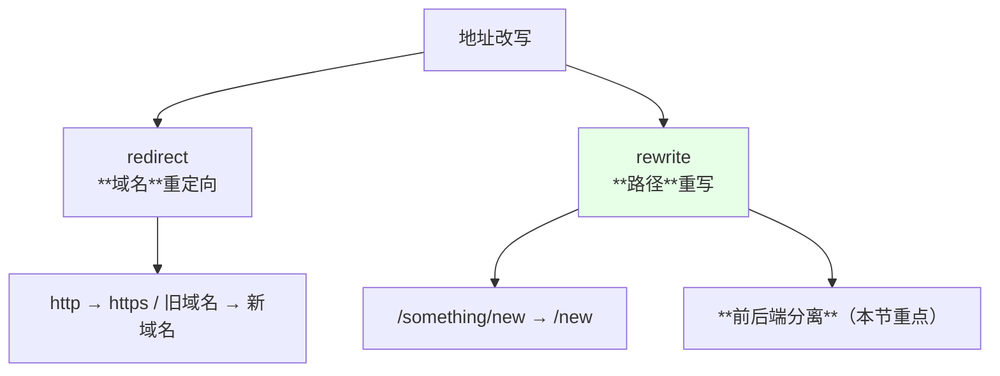
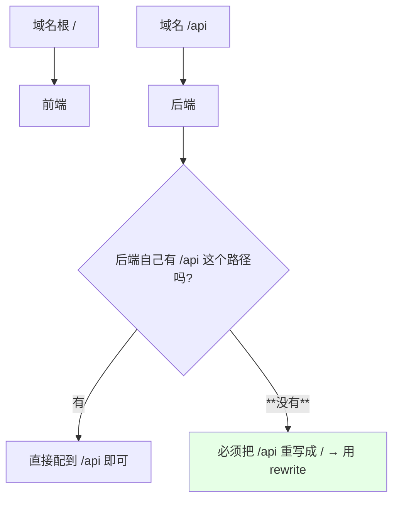
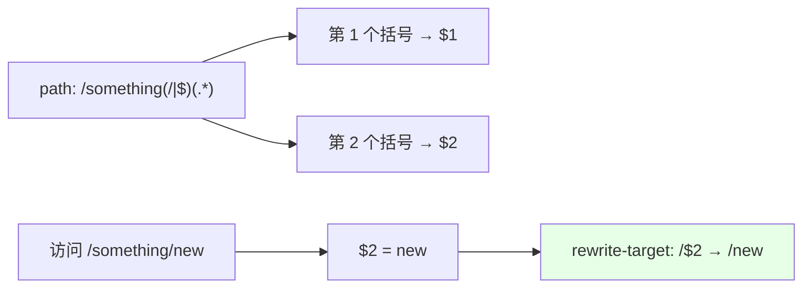
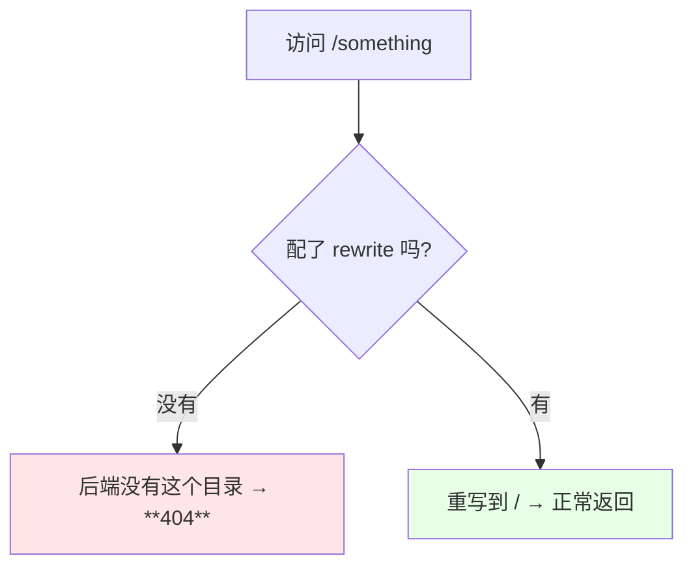
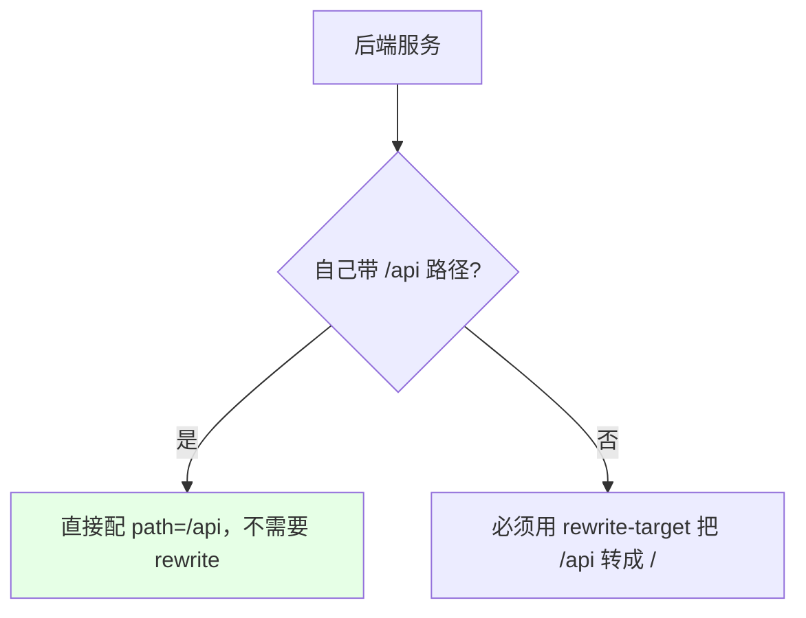

# Kubernetes 集群部署: Ingress Nginx 前后端分离（rewrite-target 路径重写与捕获组）

上一节的 `redirect` 是把**一个域名重定向到另一个域名**（http 升级 https、新旧域名替换）。这一节的 `rewrite` 能力更强，**redirect 能做的它也能做**，但它**更常用的场景是路径重写** —— 尤其是**前后端分离**。

结论先摆：

1. **典型场景**：根 `/` 走前端、`/api` 走后端，但**后端应用本身并没有 `/api` 这个路径** → 必须把 `/api/xxx` 重写成 `/xxx` 再发给后端；
2. 写法是**配对的两处**：`path` 写成带捕获组的正则 `/something(/|$)(.*)`，annotation 写 `nginx.ingress.kubernetes.io/rewrite-target: /$2`；
3. **括号就是捕获组**：`$1` 取第一个括号、`$2` 取第二个 —— 把 `$2` 拼到根路径后面就完成了重写；
4. **如果后端自己就有 `/api` 这个路径，就不需要 rewrite**，直接配到 `/api` 即可。

## 纲要

- redirect 与 rewrite 的分工
- 前后端分离到底要解决什么
- 配置：path 正则 + rewrite-target
- 捕获组 $1 / $2 怎么取
- 前后对比：不配会 404，配了就到根
- 平台上的自动生成方式
- 什么时候不需要 rewrite
- 相比改 nginx.conf 的好处

## redirect 与 rewrite 的分工



| 能力 | 处理对象 | 典型场景 |
| --- | --- | --- |
| `redirect` | **域名** | http 升级 https、新旧域名替换 |
| `rewrite` | **路径** | **路径重写**、前后端分离 / 动静分离 |

> rewrite 和 redirect 差不多，**redirect 能做的 rewrite 也能做**，但 rewrite 做得更多的是**路径的重写**。

## 前后端分离到底要解决什么



> 前端在根，**`/api` 要走到后端**，但**后端服务本身并没有 `/api` 这个目录** —— 这时候只能**用 rewrite 把 `/api` 转成后端的根**。这个功能**非常常用**。

## 配置：path 正则 + rewrite-target

```yaml
apiVersion: networking.k8s.io/v1
kind: Ingress
metadata:
  name: rewrite-demo
  annotations:
    nginx.ingress.kubernetes.io/rewrite-target: /$2
spec:
  rules:
    - host: rewrite.test.com
      http:
        paths:
          - path: /something(/|$)(.*)
            pathType: ImplementationSpecific
            backend:
              service:
                name: nginx-demo
                port:
                  number: 80
```

| 项 | 说明 |
| --- | --- |
| `path` | **带正则**：`/something(/|$)(.*)` —— 匹配根或者斜线结尾，后面任意内容 |
| `pathType` | 路径里带了正则，**要用 `ImplementationSpecific`**（交给 Controller 自己解释），否则正则可能不生效 |
| `rewrite-target` | **`/$2`** —— 把捕获组 2 的内容拼到根后面 |

## 捕获组 $1 / $2 怎么取



| 元素 | 含义 |
| --- | --- |
| `(/\|$)` | **第 1 个捕获组** —— 匹配斜线或结尾 |
| `(.*)` | **第 2 个捕获组** —— 斜线后面的所有东西 |
| `$1` / `$2` | **取对应捕获组的值** |
| 官方例子 | `rewrite.bar.com/something/new` → 后端收到 `/new` |

```text
路径重写的映射关系:

  访问                        →   后端实际收到
  /something                  →   /
  /something/new              →   /new
  /something/anything/here    →   /anything/here
```

> 括号就是之前讲过的**捕获组（元组）**，按顺序用 `$1` `$2` 取值。

## 前后对比：不配会 404，配了就到根



> 演示用的 Nginx 里**没有 `/something` 这个目录**，直接访问会报 **404**；加上 `rewrite-target` 之后，访问 `/something` 就**到了根路径**，正常返回。

## 平台上的自动生成方式

```text
用平台创建时的两种做法:

做法一（手写）:
└── 自己写 path 正则 + 加 rewrite-target 的 annotation

做法二（平台自动生成）:
└── 添加路由时把「rewrite / 去前缀」那个选项勾上
        ├── 自动生成 annotation
        ├── 自动把 path 改成带正则的形式
        └── 顺带把 Ingress 名称改一下（平台未完成开发的小瑕疵）
```

> 勾选之后平台会**自动帮你生成 annotation 和 path**，省心；课程里这个平台的这个功能**还没完全开发完**，会有一些自动改名的副作用，知道即可。

## 什么时候不需要 rewrite



> **如果你们公司的后端本身就有 `/api` 这个路径，那就不用 rewrite**，直接把 path 配成 `/api` 就行；**只有在后端没有这个路径、但又必须用这个域名路径时，才需要 rewrite**。

## 相比改 nginx.conf 的好处

```text
传统 Nginx（多实例）:

宿主机部署了 5 个 nginx 实例
├── 改 5 份配置文件
├── 要么做同步 / 一键更改
└── 改错一个就出问题

Ingress（声明式）:

写一条 annotation
├── 所有实例由 Controller 统一生成
└── 出错概率几乎为零
```

> 用 Ingress 的 annotation **不需要去改 nginx 实例的配置** —— 传统部署下有几个实例就得改几份配置文件，**用 Ingress 只需要声明一次**，而且**出错概率几乎为零**。

## API 速览

| 能力 | 做法 |
| --- | --- |
| 路径重写 | `nginx.ingress.kubernetes.io/rewrite-target: /$2` |
| 配套 path | `/something(/\|$)(.*)`（**带捕获组的正则**） |
| pathType | 路径带正则时用 **`ImplementationSpecific`** |
| 捕获组 | `$1` / `$2` 按顺序取括号内容 |
| 效果 | `/something/new` → 后端收到 `/new` |
| 不配会怎样 | 后端没有该目录 → **404** |
| 何时不需要 | **后端自带 `/api` 路径**时直接配 path 即可 |
| 平台创建 | 勾选「rewrite」选项会自动生成 annotation 与 path |
| 相比传统 | 不用改多份 nginx.conf，出错概率极低 |
| redirect vs rewrite | redirect 管域名，rewrite 管路径（rewrite 也能做 redirect 的事） |

## Demo 示例

```bash
NS=demo

# 1. 用之前的 nginx-demo 服务，先确认访问 /something 是 404
curl -s -o /dev/null -w "%{http_code}\n" http://rewrite.test.com/something

# 2. 写 path 正则 + rewrite-target 的 Ingress
kubectl apply -f rewrite-demo-ingress.yaml -n $NS
kubectl get ingress rewrite-demo -n $NS -o yaml

# 3. 再访问，应被重写到根路径
curl -s -o /dev/null -w "%{http_code}\n" http://rewrite.test.com/something
curl -s -o /dev/null -w "%{http_code}\n" http://rewrite.test.com/something/new

# 4. 看 Controller 自动生成的配置
IC_NS=ingress-nginx
IC_POD=$(kubectl get pod -n $IC_NS -l app=ingress-nginx -o jsonpath='{.items[0].metadata.name}')
kubectl exec -n $IC_NS $IC_POD -- grep -B3 -A10 'rewrite' /etc/nginx/nginx.conf
```

### 总结

- **redirect 管域名、rewrite 管路径** —— 两者功能相近（**redirect 能做的 rewrite 也能做**），但 **rewrite 更常用的是路径重写**，尤其是**前后端分离 / 动静分离**；
- **典型场景**：域名根 `/` 走前端、**`/api` 走后端**，但**后端服务本身并没有 `/api` 这个路径** —— 这时只能把 `/api/xxx` 重写成 `/xxx` 再发给后端，这个功能**非常常用**；
- **写法是配对的两处**：`path` 写成带正则的 **`/something(/|$)(.*)`**，annotation 写 **`nginx.ingress.kubernetes.io/rewrite-target: /$2`**；因为路径里带了正则，**`pathType` 要写成 `ImplementationSpecific`**，否则正则可能不生效；
- **括号就是捕获组**：`(/|$)` 是 `$1`、`(.*)` 是 `$2`，**把 `$2` 拼到根后面就完成了重写** —— 于是 `/something` → `/`、`/something/new` → `/new`；
- **效果对比**：演示的 Nginx 里没有 `/something` 这个目录，**不配 rewrite 直接访问就是 404**，配上之后**就到了根路径**正常返回；
- **用平台创建时可以勾选「rewrite / 去前缀」**，它会自动帮你生成 annotation 和 path（课程里该平台这个功能还没完全开发完，会有自动改名的副作用）；
- **后端自带 `/api` 路径时完全不需要 rewrite**，直接把 path 配成 `/api` 即可 —— **只有在后端没有这个路径、但又必须用这个域名路径时才需要**；
- **相比传统 Nginx 的好处**：宿主机部署 5 个 nginx 实例就得改 5 份配置文件（还得做同步），**用 Ingress 只需声明一条 annotation，由 Controller 统一生成所有实例的配置，出错概率几乎为零**。

