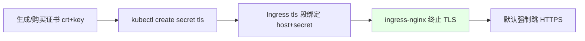
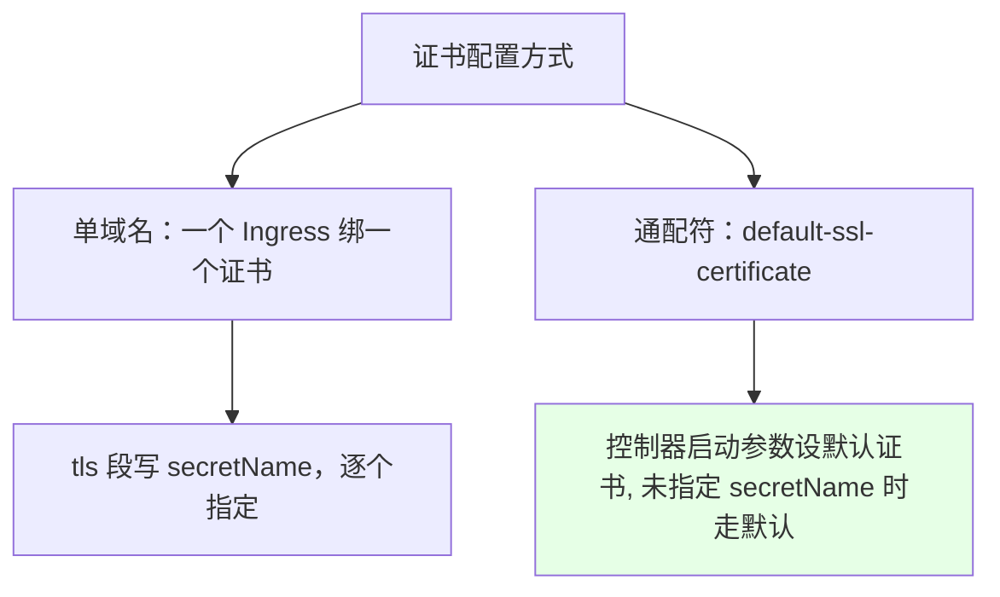
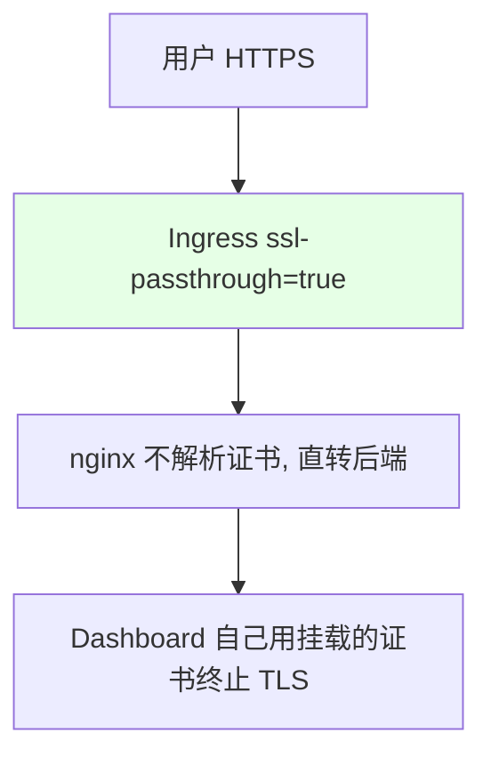

# Kubernetes 集群部署: Ingress Nginx SSL 配置（单域名/通配符证书与强制跳转）

这一节讲怎么在 Ingress 上配置 HTTPS。结论先摆：**生产用厂商购买的受信任证书（如 DigiCert/Symantec），测试可自签**；做法就是 `openssl` 生成证书 → 做成 `kubernetes.io/tls` 类型的 Secret → 在 Ingress 的 `tls` 段绑定 host 与 secretName。配了 HTTPS 后 **ingress-nginx 默认强制把 HTTP 跳转 HTTPS**，要关就在 ConfigMap 里设 `ssl-redirect: "false"`。另外讲了一个特殊场景：**Kubernetes Dashboard 内部自己终止 TLS，需要 `ssl-passthrough` + `backend-protocol: "HTTPS"` 把证书透传后端**。

## 纲要

- 证书来源：生产买受信任证书，测试自签
- 做法：TLS 类型 Secret + Ingress tls 段
- 单域名证书 vs 通配符证书（default-ssl-certificate）
- 默认强制 HTTP→HTTPS 跳转，关闭需改 ConfigMap
- Kubernetes Dashboard 透传 TLS 的场景

## 证书来源与做法

生产中对外域名必须用厂商购买的、浏览器认可的证书；测试环境可以自签（浏览器会报不安全，属正常）。无论哪种，都是先生成 `server.crt` + `server.key`，再做成 `kubernetes.io/tls` 类型的 Secret。



| 步骤 | 命令/字段 |
| --- | --- |
| 生成自签证书 | `openssl req -x509 -nodes -days 365 -newkey rsa:2048` |
| 做成 Secret | `kubectl create secret tls tls-test --cert=server.crt --key=server.key` |
| 绑定 Ingress | `spec.tls[].hosts` + `spec.tls[].secretName` |
| 类型 | Secret 类型必须是 `kubernetes.io/tls` |

## 单域名证书 vs 通配符证书

两种常见姿势：



| 场景 | 做法 |
| --- | --- |
| 一个域名一个证书 | Ingress `tls` 段写 `hosts` + `secretName`，逐个绑定（适合多域名且非通配符） |
| 通配符域名（如 `*.a.com`） | 在 ingress-nginx 控制器启动参数里设 `default-ssl-certificate`，Ingress 不写 `secretName` 时自动用默认证书 |

> 通配符证书适合公司买了 `*.a.com` 这种通配符证书的情况，省得每个 Ingress 都写一个 secretName。

## 强制跳转与关闭

只要配了 TLS，ingress-nginx **默认就会强制把 HTTP 跳转 HTTPS**（既然都上 HTTPS 了，没必要留 HTTP）。旧版本用 annotation 控制，新版本是在 ConfigMap 里设 `ssl-redirect: "false"` 来全局关闭（注意浏览器 HSTS 缓存可能导致不生效，必要时两个相关参数都置 false）。

## Kubernetes Dashboard 透传 TLS

Kubernetes Dashboard 比较特殊：它**内部自己终止 TLS**（默认自生成证书，浏览器不认）。生产里我们用自己的受信任证书挂载进去，并关掉它的自动生成。因为证书是 Dashboard 自己解析的，所以 Ingress 不能由 nginx 终止 TLS，而要**把 TLS 透传给后端**：加 `ssl-passthrough: "true"`（nginx 不解析证书，直接扔给后端）+ `backend-protocol: "HTTPS"`（后端只认 HTTPS）。

> **前提坑**：`ssl-passthrough` 在 ingress-nginx 里**默认是关闭的**，必须在 controller 的启动参数里加 `--enable-ssl-passthrough` 才会生效，否则这个注解会被直接忽略。



| 参数 | 取值 | 说明 |
| --- | --- | --- |
| `nginx.ingress.kubernetes.io/ssl-passthrough` | `"true"` | nginx 不终止 TLS，透传给后端 |
| `nginx.ingress.kubernetes.io/backend-protocol` | `"HTTPS"` | 后端只接受 HTTPS |
| Dashboard 启动参数 | `auto-generate-certificates=false` | 关闭自生成证书，用挂载的 |
| 挂载 | 把 TLS Secret 挂到 Dashboard 读证书的目录 | 让 Dashboard 用受信任证书 |

## 目录结构

```text
Ingress TLS 配置:

证书
├── 生产: 厂商购买（DigiCert/Symantec）
└── 测试: openssl 自签
    └── Secret(kubernetes.io/tls): server.crt + server.key
        └── Ingress tls 段: hosts + secretName

特殊场景（Dashboard）
├── ssl-passthrough=true
├── backend-protocol=HTTPS
└── Dashboard 挂载自有证书 + 关闭自动生成
```

## API 速览

| 能力 | 做法 |
| --- | --- |
| 生成证书 | `openssl req -x509 -nodes -days 365 -newkey rsa:2048` |
| 存证书 | `kubectl create secret tls tls-test --cert=server.crt --key=server.key` |
| 绑域名 | Ingress `spec.tls[].hosts` + `secretName` |
| 通配符 | 控制器启动参数 `default-ssl-certificate`（未指定时走默认） |
| 强制跳转 | 默认 HTTP→HTTPS；关闭在 ConfigMap 设 `ssl-redirect: "false"` |
| Dashboard 透传 | `ssl-passthrough: "true"` + `backend-protocol: "HTTPS"` |
| Dashboard 证书 | 挂自有 TLS Secret，关 `auto-generate-certificates` |

## Demo 示例

```bash
NS=demo
TLS_SECRET=tls-test

# 1. 生成自签名证书（测试用；生产请购买受信任证书）
openssl req -x509 -nodes -days 365 -newkey rsa:2048 \
  -keyout server.key -out server.crt \
  -subj "/CN=test.example.com"

# 2. 创建 TLS 类型 Secret（必须和 Ingress 同 namespace）
kubectl create secret tls $TLS_SECRET \
  --cert=server.crt --key=server.key -n $NS

# 3. 在 Ingress 上绑定域名与证书（HTTPS 默认强制跳转）
kubectl apply -f - -n $NS <<'EOF'
apiVersion: networking.k8s.io/v1
kind: Ingress
metadata:
  name: demo
spec:
  ingressClassName: nginx
  tls:
  - hosts: ["test.example.com"]
    secretName: tls-test
  rules:
  - host: test.example.com
    http:
      paths:
      - path: /
        pathType: Prefix
        backend:
          service:
            name: web
            port:
              number: 80
EOF

# 4. 关闭全局强制跳转（如确需保留 HTTP）—— 改 ConfigMap
kubectl edit cm ingress-nginx-controller -n ingress-nginx
# 添加: ssl-redirect: "false"
```

### 总结

- **证书先做成 TLS Secret**：生产用厂商购买的受信任证书，测试可 `openssl` 自签；都是 `crt+key` 做成 `kubernetes.io/tls` 类型的 Secret，再在 Ingress 的 `tls` 段绑定 `hosts` + `secretName`；
- **两种绑定姿势**：单域名就逐个写 secretName；公司买了通配符证书（`*.a.com`）就在控制器启动参数设 `default-ssl-certificate` 作为默认证书，Ingress 不写 secretName 时自动走默认；
- **默认强制跳 HTTPS**：只要配了 TLS，ingress-nginx 默认把 HTTP 强转 HTTPS；要保留 HTTP 需在 ConfigMap 设 `ssl-redirect: "false"`（注意浏览器 HSTS 缓存可能让它看着不生效）；
- **Dashboard 要透传 TLS**：Kubernetes Dashboard 内部自己终止 TLS，所以 Ingress 不能由 nginx 解析证书，需加 `ssl-passthrough: "true"` + `backend-protocol: "HTTPS"`，并把受信任证书挂进 Dashboard、关掉它的 `auto-generate-certificates`；
- **证书类型要对**：Secret 类型必须用 `kubernetes.io/tls`，且和生产买的真证书区分开——自签证书浏览器会报不安全，生产访问会被拦。

