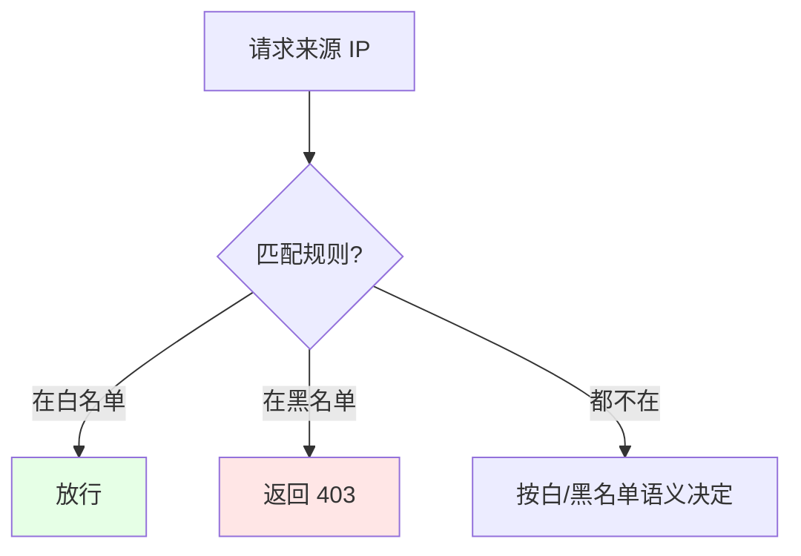
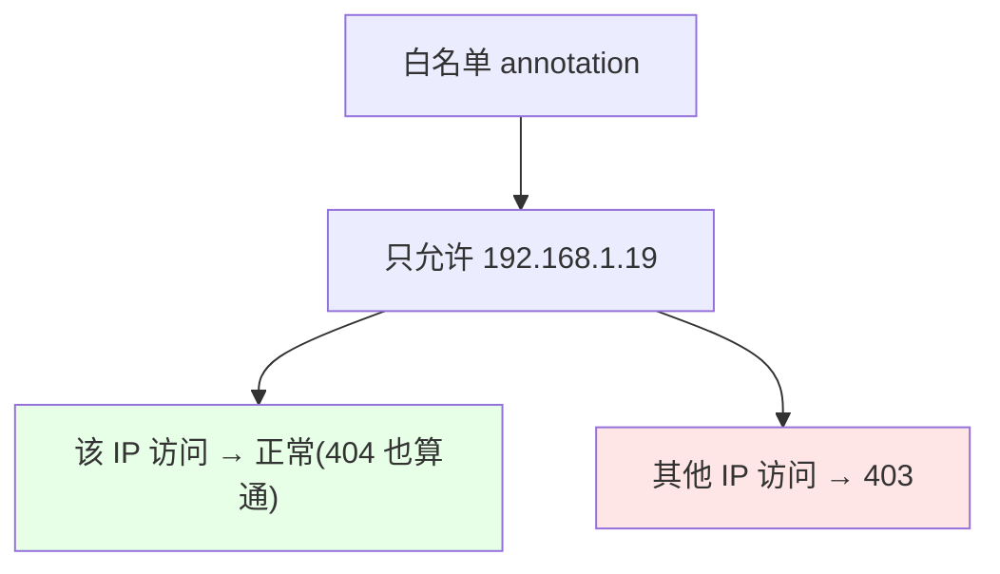
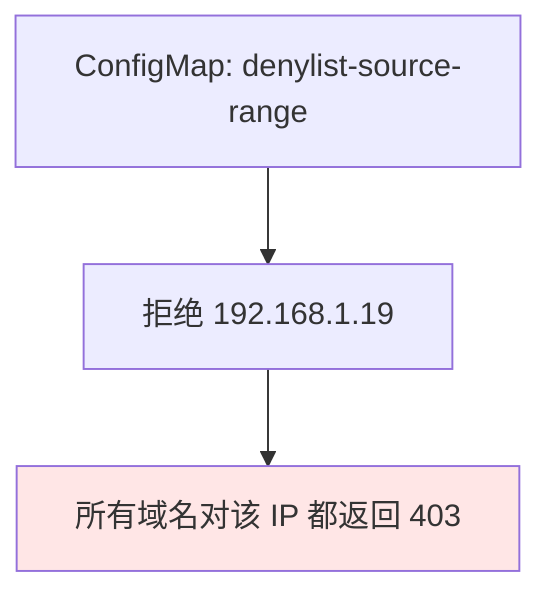

# Kubernetes 集群部署: Ingress Nginx 黑白名单（IP 白名单与黑名单）

这一节讲 Ingress 的 IP 黑白名单。结论先摆：**白名单（只允许某些 IP）用 annotation `whitelist-source-range` 按 Ingress 配置；黑名单（拒绝恶意 IP）因为要对全集群生效，用 ConfigMap 更高效**；优先级上 **annotation 高于 ConfigMap**。要注意一个坑：**ingress-nginx 没有「单域名黑名单」的 annotation，想对某个域名拒绝某 IP，只能用 `configuration-snippet` 写 nginx 的 `deny` 指令**。

## 纲要

- 白名单与黑名单的概念
- annotation 与 ConfigMap 两种配置方式，annotation 优先级更高
- 白名单建议用 annotation（避免误伤其他域名）
- 黑名单建议用 ConfigMap（全局高效）
- 单域名黑名单只能用 configuration-snippet

## 两种方式与优先级

ingress-nginx 支持黑白名单，配置可以用 annotation（针对单个 Ingress）或 ConfigMap（全局生效）。当两者都配时，**annotation 优先级高于 ConfigMap**。



| 方式 | 作用范围 | 优先级 |
| --- | --- | --- |
| annotation | 单个 Ingress | **高**（覆盖 ConfigMap） |
| ConfigMap | 全局（整个 Ingress 控制器） | 低 |

## 白名单用 annotation

白名单语义是「默认拒绝所有，只允许列出来的 IP」。因为默认拒绝，如果配在 ConfigMap 里会连累其他域名都不能访问，所以**白名单建议用 annotation 针对单个 Ingress 配**。配完之后，只有允许的 IP 能访问（返回 404 也是「能访问」的表现），其他 IP 直接 403。



| 场景 | 推荐方式 |
| --- | --- |
| 只允许某 IP 访问某域名 | annotation `whitelist-source-range` |
| 配在 ConfigMap 的风险 | 默认拒绝会误伤其他域名 |

## 黑名单用 ConfigMap（全局）

黑名单语义是「拒绝某个恶意 IP/网段」。既然是恶意 IP，通常希望所有域名都不让它访问，所以**用 ConfigMap 全局拒绝最高效**。改完 ConfigMap 一般需要等控制器重新加载（更新策略是 OnDelete 时手动删一个 Pod 触发）。



| 场景 | 推荐方式 |
| --- | --- |
| 拒绝恶意 IP（全集群） | ConfigMap `denylist-source-range` |
| 单域名黑名单 | 无 annotation，用 `configuration-snippet` 写 `deny` |

## 单域名黑名单只能写 server snippet

ingress-nginx **没有提供单域名黑名单的 annotation**，想对某个 Ingress 拒绝某 IP，只能用 `configuration-snippet`（server 段）写原生 nginx 的 `deny` 指令。这样 `deny` 只对这个域名生效，不影响其他域名。

## 目录结构

```text
Ingress 黑白名单配置:

黑白名单
├── 白名单（单域名）
│   └── annotation: whitelist-source-range
├── 黑名单（全局）
│   └── ConfigMap: denylist-source-range
└── 单域名黑名单（无 annotation）
    └── configuration-snippet: deny <ip>;
        └── 只对该域名生效, 不影响其他
```

## API 速览

| 能力 | 做法 |
| --- | --- |
| 单域名白名单 | annotation `nginx.ingress.kubernetes.io/whitelist-source-range: "192.168.1.19"` |
| 全局黑名单 | ConfigMap `denylist-source-range: "192.168.1.19"` |
| 单域名黑名单 | `configuration-snippet: "deny 192.168.1.19;"`（无对应 annotation） |
| 优先级 | annotation > ConfigMap |
| 白名单建议 | 用 annotation，避免默认拒绝误伤其他域名 |
| 黑名单建议 | 用 ConfigMap，全局高效 |
| 生效 | ConfigMap 改完通常需重载（OnDelete 下删 Pod 触发） |

## Demo 示例

```bash
NS=demo
ING=demo

# 1. 单 Ingress 白名单（只允许 192.168.1.19，其余返回 403）
kubectl annotate ingress $ING \
  nginx.ingress.kubernetes.io/whitelist-source-range="192.168.1.19" \
  -n $NS --overwrite

# 2. 全局黑名单（ConfigMap，拒绝恶意 IP，整个 Ingress 生效）
kubectl edit cm ingress-nginx-controller -n ingress-nginx
# 添加: denylist-source-range: "192.168.1.19"

# 3. 单域名黑名单（ingress-nginx 无 annotation，用 server snippet 写 deny）
kubectl annotate ingress $ING \
  nginx.ingress.kubernetes.io/configuration-snippet="deny 192.168.1.19;" \
  -n $NS --overwrite
```

### 总结

- **两种方式，annotation 优先**：黑白名单既可用 annotation（单 Ingress）也可用 ConfigMap（全局），两者冲突时 annotation 覆盖 ConfigMap；
- **白名单用 annotation**：白名单是「默认拒绝、只放列出来的 IP」，若配在 ConfigMap 会误伤其他域名，所以建议用 `whitelist-source-range` 按单个 Ingress 配；
- **黑名单用 ConfigMap**：拒绝恶意 IP 通常希望全集群生效，用 ConfigMap `denylist-source-range` 最省事高效，改完一般要等控制器重载（OnDelete 下删一个 Pod 触发）；
- **单域名黑名单没 annotation**：ingress-nginx 没有提供单域名黑名单的 annotation，只能写 `configuration-snippet` 把原生 nginx 的 `deny` 指令塞进去，这样只对该域名生效、不影响其他；
- **和原生 nginx 写法一致**：`configuration-snippet` 里的语法就是普通 nginx 配置（deny/allow 等），想写更复杂的 location 级逻辑也都在这里写。

