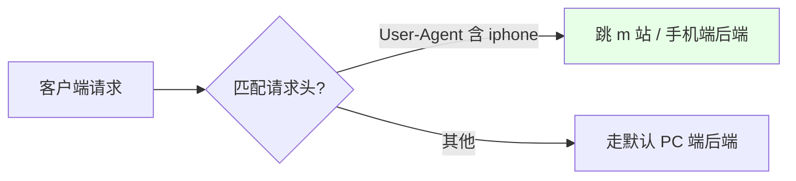
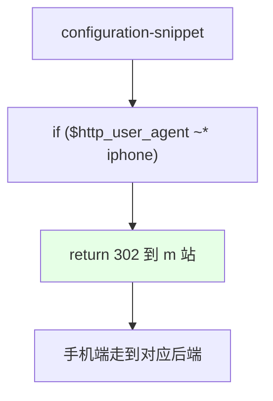

# Kubernetes 集群部署: Ingress Nginx 匹配请求头（按 User-Agent / 自定义头路由）

这一节讲如何根据请求头（Request Header）来做路由。结论先摆：**可以用 `$http_*` 变量匹配请求头，把不同客户端/登录用户分到不同后端，常用于手机端/PC 端分流或灰度**；ingress-nginx 没有专门的「匹配请求头」annotation，要用 `configuration-snippet`（server 段）写原生 nginx 的 `if` 判断，匹配到了就 `return` 跳转或重写。

## 纲要

- 按请求头分流的用途（手机端/PC 端、灰度）
- 用 $http_* 变量匹配请求头
- 通过 configuration-snippet 写 if 判断
- 复杂语法都走 configuration-snippet

## 按请求头分流的用途

典型场景：网站有手机端和 PC 端，两套后端不一样；或者想按登录用户做灰度。思路就是读请求里的某个头（如 `User-Agent`、`X-User`），匹配到了就跳到对应后端。



| 场景 | 匹配头 | 动作 |
| --- | --- | --- |
| 手机端分流 | `User-Agent` 含 `iphone` | 跳转到 m 站 |
| 登录用户灰度 | 自定义头（如 `X-User`） | 路由到新版本后端 |
| 客户端区分 | `User-Agent` / 自定义头 | 不同后端不同处理 |

## 用 configuration-snippet 写 if 判断

ingress-nginx 没有「匹配请求头」的现成 annotation，要写 `configuration-snippet`。nginx 里请求头对应 `$http_<name>` 变量（横杠变下划线，全小写），用正则 `~*` 不区分大小写匹配，命中就 `return` 重定向。



| 元素 | 说明 |
| --- | --- |
| `$http_user_agent` | nginx 变量，对应请求头 `User-Agent` |
| `~*` | 正则、不区分大小写 |
| `return 302` | 命中后跳转（也可用 rewrite 到别的后端） |
| 变量命名 | 头名横杠转下划线、全小写，如 `X-User` → `$http_x_user` |

## 复杂语法都走 configuration-snippet

前面讲的黑白名单如果要做「按 path 拒绝」这种 location 级逻辑，也没有现成 annotation，同样要用 `configuration-snippet` 写 location 语法。**简单的有模板直接用，复杂的（请求头、location 级 deny 等）都在这文件里手写**。这正是 server snippet 的价值。

## 目录结构

```text
Ingress 匹配请求头:

按头路由
├── 读取请求头: $http_<name>
│   ├── User-Agent   → $http_user_agent
│   └── X-User       → $http_x_user
└── configuration-snippet
    └── if ($http_user_agent ~* iphone) { return 302 https://m.example.com; }
        └── 命中即跳转 / 重写到对应后端
```

## API 速览

| 能力 | 做法 |
| --- | --- |
| 匹配请求头 | 用 `$http_<name>` 变量（头名转小写、横杠转下划线） |
| 手机端分流 | `if ($http_user_agent ~* "iphone") { return 302 ...; }` |
| 灰度按用户 | 匹配自定义头（如 `X-User`）后路由到新版本 |
| 写法位置 | annotation `nginx.ingress.kubernetes.io/configuration-snippet` |
| 正则 | `~*` 不区分大小写，`~` 区分大小写 |
| 复杂逻辑 | location 级 deny/allow 等也都写在 snippet 里 |
| 没有现成 annotation | 请求头匹配本身无专门 annotation，必须手写 snippet |

## Demo 示例

```bash
NS=demo
ING=demo

# 按 User-Agent 匹配：手机端跳转到 m 站
kubectl annotate ingress $ING \
  nginx.ingress.kubernetes.io/configuration-snippet='if ($http_user_agent ~* "iphone") { return 302 https://m.example.com; }' \
  -n $NS --overwrite

# 按自定义头做灰度：命中 X-Canary 的用户路由到新版本（配合金丝雀发布）
kubectl annotate ingress $ING \
  nginx.ingress.kubernetes.io/configuration-snippet='if ($http_x_canary = "true") { return 302 https://canary.example.com; }' \
  -n $NS --overwrite
```

### 总结

- **按头分流很实用**：读请求头（User-Agent、自定义头）可以把手机端/PC 端或不同登录用户分到不同后端，常用于客户端适配和灰度；
- **用 `$http_*` 变量**：nginx 里请求头对应 `$http_<name>` 变量，规则是头名转小写、横杠转下划线（如 `User-Agent` → `$http_user_agent`）；
- **写 configuration-snippet**：ingress-nginx 没有「匹配请求头」的现成 annotation，要在 `configuration-snippet` 里写 `if ($http_user_agent ~* "iphone") { return 302 ...; }`，`~*` 表示不区分大小写正则；
- **复杂逻辑都在这**：前面黑白名单要做 location 级拒绝等没有 annotation 的场景，也得用 `configuration-snippet` 手写 nginx 语法，它是放复杂配置的统一入口；
- **和金丝雀发布配合**：匹配请求头做灰度，思路和下一节的金丝雀发布（`canary-by-header`）一致，简单场景直接 snippet 即可，更标准的按头灰度建议用 canary 系列 annotation。

