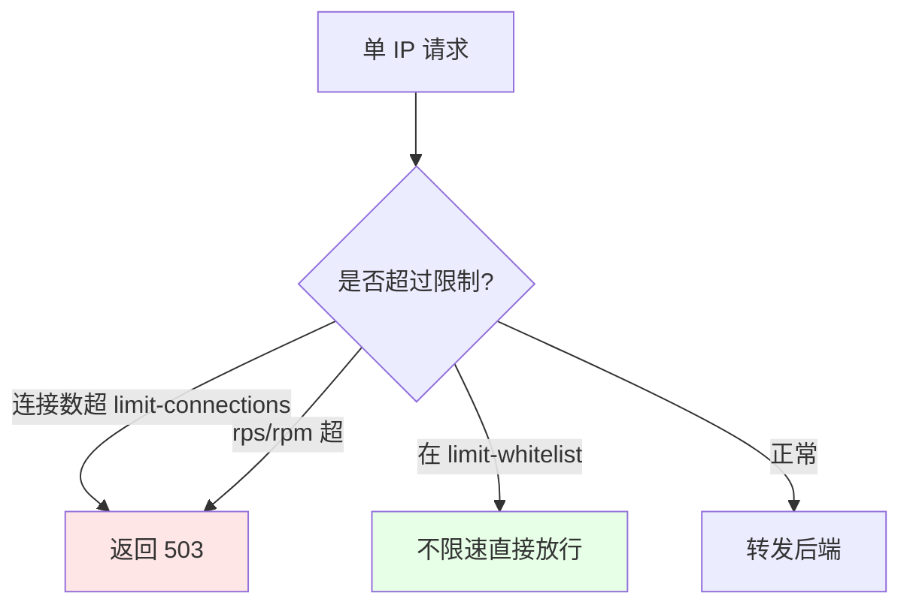
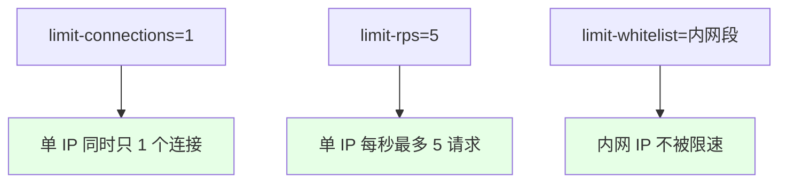

# Kubernetes 集群部署: Ingress Nginx 速率限制（连接数/请求速率/带宽与白名单）

这一节讲 Ingress 的速率限制。结论先摆：**全是 annotation 配置，不用关心底层 nginx 怎么写**（有兴趣可看生成的配置）。常用五个：`limit-connections`（单 IP 最大连接数，超了返 503）、`limit-rps`（每秒请求数）、`limit-rpm`（每分钟请求数）、`limit-rate`（带宽限速，单位字节/秒，如 `1k`）、`limit-whitelist`（哪些 IP 不限速，如内网）。

## 纲要

- 速率限制都是 annotation 配置
- 限制单 IP 连接数：limit-connections
- 限制请求速率：limit-rps / limit-rpm
- 限制带宽：limit-rate
- 内网白名单不限速：limit-whitelist

## 五个速率限制 annotation

ingress-nginx 把 nginx 的限流能力封装成一串 annotation，直接在 Ingress 上加就行，不需要自己写 `limit_req` / `limit_conn` 配置。



| annotation | 含义 | 超限表现 |
| --- | --- | --- |
| `limit-connections` | 单 IP 最大并发连接数 | 超过返回 503 |
| `limit-rps` | 单 IP 每秒请求数 | 超过限流 |
| `limit-rpm` | 单 IP 每分钟请求数 | 超过限流 |
| `limit-rate` | 单连接带宽上限（字节/秒，如 `1k`） | 限速传输 |
| `limit-whitelist` | 不限速的 IP/CIDR 列表（逗号分隔） | 直接放行 |

## 连接数 / 请求速率

`limit-connections` 限制同一 IP 的并发连接（比如设 1，同一时刻只能有一个连接，再多就 503）；`limit-rps` 限制每秒请求数（设 1 就一秒一个，设 5 一般够用）；`limit-rpm` 是分钟粒度。注意：一个域名可能同时发多个请求，所以 rps 设太小容易误伤，按需调大。



| 参数 | 建议 |
| --- | --- |
| `limit-connections` | 演示设 1 效果明显；生产按需 |
| `limit-rps` | 太小易误伤（页面常并发多请求），一般设 5+ |
| `limit-rpm` | 分钟粒度，适合宽松限制 |
| `limit-whitelist` | 把公司内网段加进去，避免自测被限 |

## 带宽限速与白名单

`limit-rate` 限制单连接下载带宽，单位是字节/秒，写 `1k` 表示 1KB/s（注意是小写 k，且是每连接）。`limit-whitelist` 填逗号分隔的 CIDR，命中就完全不限速——公司内网一般要加进去，否则自己和同事访问也会被限。

## 目录结构

```text
Ingress 速率限制:

限流 annotation
├── limit-connections  ← 单 IP 最大连接数（超 503）
├── limit-rps         ← 单 IP 每秒请求数
├── limit-rpm         ← 单 IP 每分钟请求数
├── limit-rate        ← 带宽（字节/秒, 如 1k）
└── limit-whitelist   ← 不限速的 IP/CIDR（内网）
```

## API 速览

| 能力 | 做法 |
| --- | --- |
| 单 IP 连接数 | `nginx.ingress.kubernetes.io/limit-connections: "1"` |
| 每秒请求数 | `nginx.ingress.kubernetes.io/limit-rps: "5"` |
| 每分钟请求数 | `nginx.ingress.kubernetes.io/limit-rpm: "60"` |
| 带宽限速 | `nginx.ingress.kubernetes.io/limit-rate: "1k"`（字节/秒） |
| 不限速白名单 | `nginx.ingress.kubernetes.io/limit-whitelist: "192.168.1.0/24,10.0.0.0/8"` |
| 超限表现 | 连接/请求超限返回 503；带宽超限则降速 |
| 生效 | annotation 即时生效，按需叠加配置 |

## Demo 示例

```bash
NS=demo
ING=demo

# 1. 单 IP 最大并发连接数=1，超过返回 503
kubectl annotate ingress $ING \
  nginx.ingress.kubernetes.io/limit-connections=1 \
  -n $NS --overwrite

# 2. 单 IP 每秒请求数=5
kubectl annotate ingress $ING \
  nginx.ingress.kubernetes.io/limit-rps=5 \
  -n $NS --overwrite

# 3. 单 IP 每分钟请求数=60（可选）
kubectl annotate ingress $ING \
  nginx.ingress.kubernetes.io/limit-rpm=60 \
  -n $NS --overwrite

# 4. 单连接带宽上限 1KB/s
kubectl annotate ingress $ING \
  nginx.ingress.kubernetes.io/limit-rate=1k \
  -n $NS --overwrite

# 5. 内网段不加限速（避免自测被限）
kubectl annotate ingress $ING \
  nginx.ingress.kubernetes.io/limit-whitelist="192.168.1.0/24,10.0.0.0/8" \
  -n $NS --overwrite
```

### 总结

- **全是 annotation 配置**：速率限制不用写 nginx，直接给 Ingress 加 `limit-*` 系列 annotation 即可，底层配置自动生成；
- **连接数限制**：`limit-connections` 限制单 IP 并发连接，超过直接返 503（演示设 1 效果最直观，生产按需）；
- **请求速率**：`limit-rps`（每秒）/ `limit-rpm`（每分钟）限制请求频率；rps 设太小容易误伤（一个页面常并发多个请求），一般设 5 以上；
- **带宽与白名单**：`limit-rate`（如 `1k`，单位字节/秒，逐连接）限速带宽；`limit-whitelist` 填内网 CIDR，命中的 IP 完全不限速，避免自己和同事访问被限；
- **按需叠加**：这几个限制可以叠加在同一个 Ingress 上一起生效，按业务需要组合即可，都是即时生效、不需要滚动更新。

