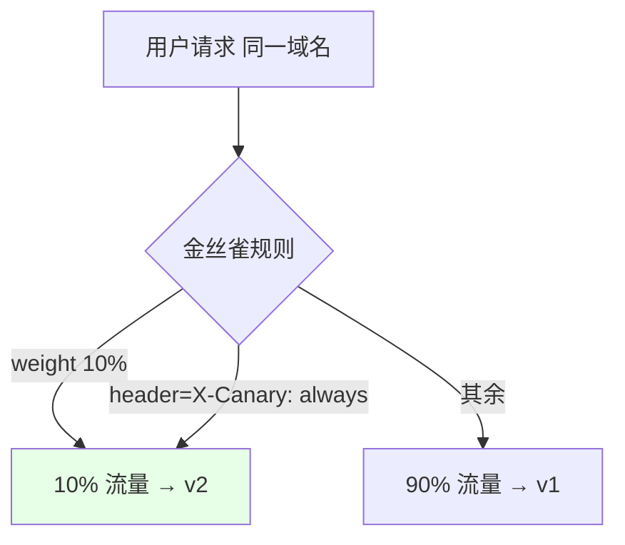
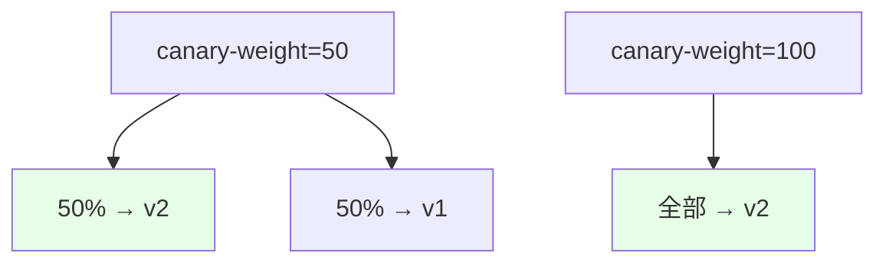
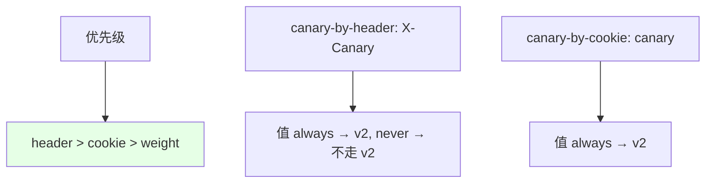

# Kubernetes 集群部署: Ingress Nginx 灰度金丝雀发布（权重/Header/Cookie 路由）

这一节讲用 Ingress 做灰度/金丝雀发布。结论先摆：**同时部署 v1 和 v2，用同一个域名、两个 Ingress（金丝雀那个加 `canary: "true"`）来切流**；切流有三种方式——`canary-weight`（按百分比）、`canary-by-header`（按请求头值 always/never）、`canary-by-cookie`（按 Cookie 值），**优先级是 header > cookie > weight**。注意 Ingress 只管南北向（外部→前端）流量，服务之间的灰度要靠服务网格（Istio/Zuul 等）。

## 纲要

- 灰度/金丝雀发布是什么
- 两个 Ingress 同域名，金丝雀需 canary: true
- 按权重切流：canary-weight
- 按请求头/ Cookie 切流：canary-by-header / canary-by-cookie
- 优先级 header > cookie > weight；服务间灰度靠服务网格

## 灰度发布是什么

新版本（v2）稳定性没把握时，不一把全量，而是和老版本（v1）同时部署，把一小部分流量（或指定用户）慢慢引到 v2，观察没问题再全量。这是同一个域名、不同的 Ingress 在控制流量比例。



| 概念 | 说明 |
| --- | --- |
| 灰度 / 金丝雀 | 新版本小流量验证，逐步放量 |
| 同域名两 Ingress | 一个稳定版，一个金丝雀版（必须开 `canary: true`） |
| 不开 canary | 同域名不允许配两个 Ingress |

## 按权重切流：canary-weight

最基础的按比例切流。`canary-weight` 填百分比，比如 50 就是一半流量去 v2，80 就是八成。改权重即时生效，刷新就能看到 v1/v2 交替。



| 值 | 效果 |
| --- | --- |
| `10` | 10% 流量到金丝雀 v2 |
| `50` | 一半流量到 v2 |
| `100` | 全部流量到 v2 |

## 按请求头 / Cookie 切流

更精细的按「人」切流：
- `canary-by-header`：指定头名，值 `always` → 路由到 v2，`never` → 绝不路由到 v2（其他值走权重逻辑）；
- `canary-by-header-value`：精确匹配某个头值（如 `canary`）才路由；
- `canary-by-cookie`：按 Cookie 名，值 `always`/`never` 同理。



| annotation | 说明 |
| --- | --- |
| `canary-by-header` | 头名；值 `always` 全走 v2，`never` 不走 v2 |
| `canary-by-header-value` | 头值精确匹配（如 `canary`）才走 v2 |
| `canary-by-cookie` | Cookie 名；值 `always`/`never` 控制是否走 v2 |
| 优先级 | **header > cookie > weight** |

## Ingress 只管南北向流量

Ingress 是集群入口，控制的是「外部用户→前端」的流量，所以能做前端层面的金丝雀。但**两个后端服务之间的调用不经过 Ingress，Ingress 控制不了**——那种服务间灰度要靠服务网格（Istio）或网关（Zuul）来做。

## 目录结构

```text
Ingress 金丝雀发布:

同一域名
├── 稳定版 Ingress (v1)
└── 金丝雀 Ingress (v2)
    ├── canary: "true"            ← 必须开, 否则同域名不允许
    ├── canary-weight: 50         ← 按百分比
    ├── canary-by-header: X-Canary
    │   └── always → v2 / never → 不走 v2
    ├── canary-by-header-value: canary
    └── canary-by-cookie: canary
        └── 优先级: header > cookie > weight

适用范围: 南北向(外部→前端); 服务间灰度靠服务网格
```

## API 速览

| 能力 | 做法 |
| --- | --- |
| 开启金丝雀 | 金丝雀 Ingress 加 `nginx.ingress.kubernetes.io/canary: "true"` |
| 按权重 | `canary-weight: "50"`（百分比） |
| 按头 | `canary-by-header: "X-Canary"`（值 always/never） |
| 按头值 | `canary-by-header-value: "canary"`（精确匹配） |
| 按 Cookie | `canary-by-cookie: "canary"`（值 always/never） |
| 优先级 | **header > cookie > weight** |
| 范围 | Ingress 管南北向；服务间灰度用服务网格（Istio/Zuul） |

## Demo 示例

```bash
NS=demo

# 1. 稳定版 Ingress（v1）
cat <<'EOF' | kubectl apply -n $NS -f -
apiVersion: networking.k8s.io/v1
kind: Ingress
metadata:
  name: demo
spec:
  ingressClassName: nginx
  rules:
  - host: demo.example.com
    http:
      paths:
      - path: /
        pathType: Prefix
        backend:
          service:
            name: web-v1
            port:
              number: 80
EOF

# 2. 金丝雀版 Ingress（v2）：50% 权重
cat <<'EOF' | kubectl apply -n $NS -f -
apiVersion: networking.k8s.io/v1
kind: Ingress
metadata:
  name: demo-canary
  annotations:
    nginx.ingress.kubernetes.io/canary: "true"
    nginx.ingress.kubernetes.io/canary-weight: "50"
spec:
  ingressClassName: nginx
  rules:
  - host: demo.example.com
    http:
      paths:
      - path: /
        pathType: Prefix
        backend:
          service:
            name: web-v2
            port:
              number: 80
EOF

# 3. 按请求头切流：X-Canary: always 才进 v2
kubectl annotate ingress demo-canary \
  nginx.ingress.kubernetes.io/canary-by-header="X-Canary" -n $NS --overwrite
```

### 总结

- **同域名两 Ingress 切流**：灰度发布是 v1/v2 同时部署、同一域名，靠两个 Ingress 控制流量；金丝雀那个必须加 `canary: "true"`，否则同域名不允许配两个 Ingress；
- **按权重最常用**：`canary-weight` 填百分比（10/50/100）即可按比例放量，改完即时生效；
- **按人更精细**：`canary-by-header` / `canary-by-header-value` 按请求头、`canary-by-cookie` 按 Cookie 切流，值 `always` 走 v2、`never` 不走 v2，常用来按登录用户做灰度；
- **优先级 header > cookie > weight**：三者同时配时，请求头优先，其次 Cookie，最后才是权重比例；
- **Ingress 只管南北向**：它控制的是外部→前端的入口流量，两个后端服务之间的调用不经过 Ingress、控制不了，那种服务间灰度要靠服务网格（Istio）或网关（Zuul）来做。

