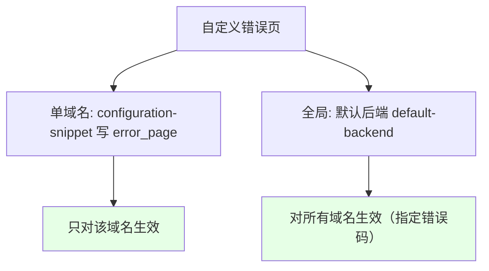
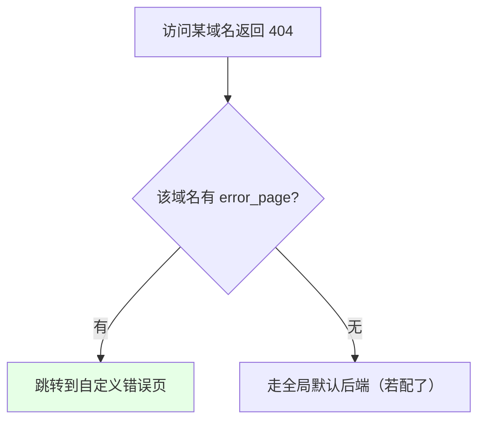
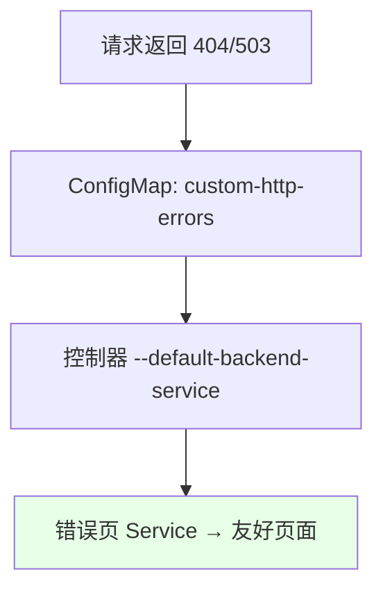

# Kubernetes 集群部署: Ingress Nginx 自定义错误页面（errorpage 与默认后端）

这一节讲 Ingress 的自定义错误页面。结论先摆：**两种方式——单域名用 `configuration-snippet` 写 `error_page` 跳转（ingress-nginx 没有 errorpage 的现成 annotation），全局用「默认后端」**：部署一个放静态错误页的 Deployment+Service，在 ConfigMap 配 `custom-http-errors`（如 `404,503`），再给控制器设 `--default-backend-service`。**`error_page` 优先级高于默认后端**。

## 纲要

- 两种自定义错误页方式
- 单域名：configuration-snippet 写 error_page
- 全局：默认后端（custom-http-errors + default-backend-service）
- error_page 优先级高于默认后端

## 两种方式总览

ingress-nginx 支持错误页，分局部和全局两种。局部针对单个域名，全局对所有域名生效。



| 方式 | 作用范围 | 优先级 |
| --- | --- | --- |
| `configuration-snippet` + `error_page` | 单域名（局部） | **高** |
| 默认后端（default-backend） | 全局 | 低 |

## 单域名：configuration-snippet 写 error_page

ingress-nginx **没有 errorpage 的现成 annotation**，想对单个域名自定义错误页，要用 `configuration-snippet` 写原生 nginx 的 `error_page` 指令，把 404 等跳到你自己的页面（如百度，或你们自己写的友好提示页）。注意 `error_page` 只在对应 location 内生效——如果请求命中了别的 location 规则就不会走这个 error_page。



| 元素 | 说明 |
| --- | --- |
| 位置 | annotation `configuration-snippet` |
| 语法 | `error_page 404 = https://error.example.com;` |
| 生效范围 | 仅该域名（且在该 location 内） |
| 限制 | 没有现成 annotation，必须手写 snippet |

## 全局：默认后端

全局方式要部署一个「错误页服务」：一个 Deployment（里面放静态错误页）+ Service。然后两处配置：

1. ConfigMap 加 `custom-http-errors: "404,503"` —— 声明哪些错误码走自定义页；
2. 给 ingress-nginx 控制器加启动参数 `--default-backend-service=<namespace>/<service>` —— 指向你部署的错误页 Service。

这样访问遇到 404/503 时，就由默认后端返回友好页面。改完控制器一般要重载（OnDelete 下删 Pod 触发），生产别一次性全删。



| 配置点 | 值 |
| --- | --- |
| ConfigMap | `custom-http-errors: "404,503"` |
| 控制器参数 | `--default-backend-service=ingress-nginx/custom-errors` |
| 后端 | 一个 Deployment + Service，存静态错误页 |

## 优先级：error_page 高于默认后端

如果某个域名既配了 `error_page`（局部），又配了全局默认后端，**error_page 优先级更高**，先走域名的局部配置。所以「这个域名想用自己的错误页、别的走默认」完全没问题。

## 目录结构

```text
Ingress 自定义错误页:

错误页配置
├── 单域名（局部）
│   └── configuration-snippet: error_page 404 = https://error.example.com;
│       └── 优先级高, 仅本域名
└── 全局（默认后端）
    ├── 错误页 Deployment + Service（静态页）
    ├── ConfigMap: custom-http-errors: "404,503"
    └── 控制器参数: --default-backend-service=ingress-nginx/custom-errors
        └── 优先级低, 对所有域名生效
```

## API 速览

| 能力 | 做法 |
| --- | --- |
| 单域名错误页 | annotation `configuration-snippet: "error_page 404 = https://error.example.com;"` |
| 全局错误码 | ConfigMap `custom-http-errors: "404,503"` |
| 全局后端 | 控制器启动参数 `--default-backend-service=ingress-nginx/custom-errors` |
| 后端组成 | Deployment + Service，存放静态错误页 |
| 优先级 | **error_page（局部）> 默认后端（全局）** |
| 生效 | `error_page` 即时生效；默认后端改完需重载控制器 |
| 注意 | 无 errorpage 现成 annotation，局部必须手写 snippet |

## Demo 示例

```bash
NS=demo
ING=demo

# 1. 单域名错误页（ingress-nginx 无现成 annotation，用 server snippet 写 error_page）
kubectl annotate ingress $ING \
  nginx.ingress.kubernetes.io/configuration-snippet="error_page 404 = https://error.example.com;" \
  -n $NS --overwrite

# 2. 全局默认后端：先部署错误页 Deployment + Service
kubectl apply -f custom-error-pages.yaml -n ingress-nginx

# 3. ConfigMap 声明哪些错误码走自定义页
kubectl edit cm ingress-nginx-controller -n ingress-nginx
# 添加: custom-http-errors: "404,503"

# 4. 给控制器设默认后端 Service（OnDelete 下删 Pod 触发重载）
kubectl edit deploy ingress-nginx-controller -n ingress-nginx
# 容器启动参数加: --default-backend-service=ingress-nginx/custom-errors
```

### 总结

- **两种方式**：自定义错误页有局部（单域名）和全局（默认后端）两种，局部用 `configuration-snippet` 写 `error_page`，全局用默认后端；
- **单域名靠 snippet**：ingress-nginx 没有 errorpage 的现成 annotation，只能手写 `configuration-snippet` 里的 `error_page 404 = ...`，且只在对应 location 内生效，命中别的 location 规则就不走；
- **全局靠默认后端**：部署一个放静态页的 Deployment+Service，ConfigMap 配 `custom-http-errors: "404,503"`，再给控制器加 `--default-backend-service` 指向它；改完需重载控制器（OnDelete 下删 Pod 触发，生产别全删）；
- **优先级局部更高**：同一域名如果既配了 `error_page` 又有全局默认后端，`error_page` 优先，所以「个别域名用自己的页、其余走默认」完全可行；
- **页面自己写**：错误页是你们自己写的友好提示页（官方也提供一个简单的可复用），把镜像里的页面替换掉或用官方镜像都行，按公司需求定制即可。

