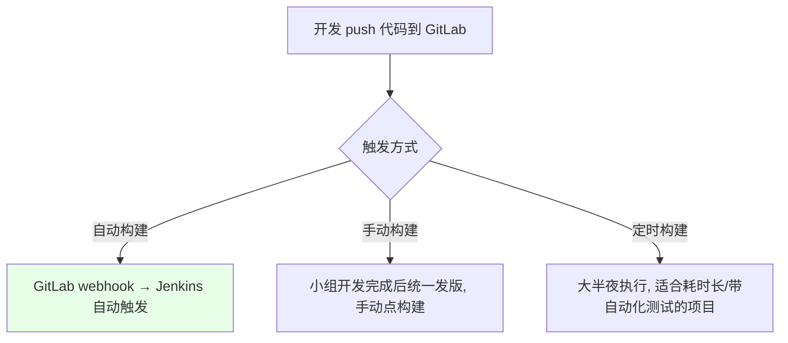
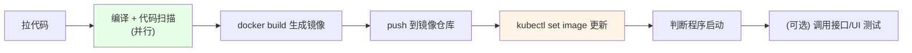
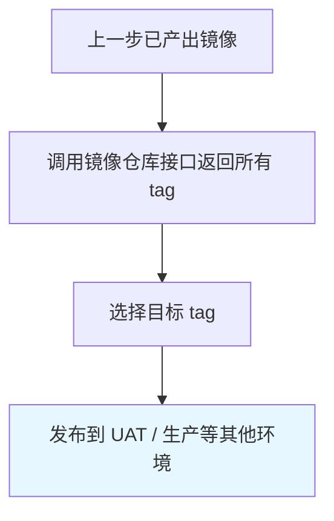

# Kubernetes 集群部署: Jenkins 自动构建流水线设计（步骤拆解与镜像发布）

开篇文章：一条自动构建流水线到底由哪些步骤组成？结论先摆——标准链路是「**拉代码 → 并行编译+扫描 → docker build 打镜像 → push 仓库 → kubectl 仅更新镜像 → 判断启动**」，其中编译与代码扫描并行，发布最简单的形式就是只改镜像、不动其他配置。

## 纲要

- 新项目与构建触发方式（自动 / 手动 / 定时）
- 构建在 Kubernetes Pod 中执行的好处
- 自动构建流水线的步骤拆解
- Dockerfile 的统一化思路
- 最简单的发布：只更新镜像
- 判断程序启动与可选的接口测试
- 选择镜像发布流水线（非构建类）

## 构建触发方式



| 触发方式 | 适用场景 | 配置点 |
| --- | --- | --- |
| 自动构建 | 每次提交都触发集成 | GitLab 项目 Settings → webhook 指向 Jenkins |
| 手动构建 | 多人开发、希望攒一批再发版 | Jenkins 任务手动 Build |
| 定时构建 | 构建/测试耗时数小时，避免占用工作时间 | Jenkins 定时（cron）触发器 |

## 为什么在 Kubernetes Pod 中执行构建

```text
Jenkins 构建执行形态:

构建执行
├── 传统: 在 Jenkins slave 节点上装好依赖环境
└── K8s 方式: Jenkins 调 K8s 创建 Pod 作为 slave
    ├── 基于镜像, 无需预装依赖 (maven / node 镜像)
    ├── 不排队: K8s 资源够就能起无数个 Pod
    └── 每个 Pod 跑各自项目/人员的任务
```

| 维度 | 传统 slave | K8s Pod 作为 slave |
| --- | --- | --- |
| 依赖环境 | 需提前装好 maven / node 等 | Pod 自带镜像，无需预装 |
| 并发 | 容易排队 | 资源够即可无限并行 |
| 隔离 | 弱 | 每个任务独立 Pod |

## 自动构建流水线的步骤



| 步骤 | 说明 |
| --- | --- |
| 1 拉代码 | 从 GitLab 拉取对应分支 |
| 2 编译 + 扫描 | **两者并行**；任一不过则发通知、报错、结束 |
| 3 打镜像 | 用项目内/独立仓库的 Dockerfile 构建 |
| 4 推仓库 | 推到 Docker Hub 或阿里云仓库 |
| 5 更新发布 | 最简单形式：**只更新镜像**，不改其他配置（也可走 Helm） |
| 6 判断启动 | `kubectl rollout status --watch` 或自定义脚本 |
| 7 接口测试 | 启动后调用接口/UI 测试（无自动化测试可不执行） |

> 代码编译与代码扫描一般耗时都长，所以**并行执行**。编译产物（jar / 静态文件 / node 源码）只要拷贝进基础镜像即可，启动命令可放到 Deployment 里配置，Dockerfile 越简单越好。

## Dockerfile 统一化

```dockerfile
# 以 Java 为例: 编译产物是 jar 包, 拷贝进基础镜像即可
FROM openjdk:8-jre
COPY target/*.jar /opt/app.jar
EXPOSE 8080
# 启动命令放到 Deployment 的 command 中注入, 不在 Dockerfile 写死
```

| 语言 | 编译产物 | 镜像内动作 |
| --- | --- | --- |
| Java | jar / war 包 | `COPY` 到基础镜像 |
| NodeJS / PHP | 源码（src 下全部） | `COPY` 到工作目录，`node server.js` 启动 |
| 前端 H5 | HTML | 拷到 Nginx 根目录 |

> 建议把「拷贝命令」参数化，使 Dockerfile 尽量统一；步骤越多构建越慢，镜像里不要做过多步骤。

## 最简单的发布：只更新镜像

```bash
# 只更新镜像, 不改动 deployment 其他配置
NAMESPACE=demo
DEPLOY_TYPE=deployment
IMAGE_NAME=springcloud-demo
REGISTRY_ADDRESS=registry.cn-hangzhou.aliyuncs.com
TAG=$(git log -1 --format=%H | cut -c1-14)

# 用标签选择器一次更新被同一标签管理的多个资源
kubectl -n $NAMESPACE set image $DEPLOY_TYPE/$IMAGE_NAME \
  $IMAGE_NAME=$REGISTRY_ADDRESS/demo/$IMAGE_NAME:$TAG -l app=$IMAGE_NAME
```

## 判断程序启动

```bash
# 方式一: kubectl 自带等待 (StatefulSet 的 --watch 有时卡住不退出)
kubectl -n $NAMESPACE rollout status deployment/$IMAGE_NAME --watch

# 方式二: 自定义脚本探测 (更可控, 避免卡死)
for i in $(seq 1 30); do
  if kubectl -n $NAMESPACE get pod -l app=$IMAGE_NAME | grep -q Running; then
    echo "应用已启动"; break
  fi
  sleep 5
done
```

## 选择镜像发布流水线（非构建类）



> 这种方式不再构建，只从仓库选 tag 发版。具体怎么设计要按公司场景来，没有统一模板。

## API 速览

| 能力 | 做法 |
| --- | --- |
| 触发构建 | GitLab webhook 自动 / 手动 Build / 定时 cron 三种 |
| 执行环境 | Jenkins 调 K8s 创建 Pod 作 slave，基于镜像、不排队、可并行 |
| 编译+扫描 | 并行执行，任一失败即通知报错结束 |
| 打镜像 | 项目内或独立仓库的 Dockerfile，建议统一化、只做拷贝 |
| 推仓库 | Docker Hub 或阿里云镜像仓库 |
| 发布 | 最简单即 `kubectl set image` 只更新镜像；也可走 Helm |
| 判断启动 | `kubectl rollout status --watch` 或自定义探测脚本 |
| 流水线分类 | 自动构建流水线 / 选择镜像发布流水线（非构建） |

## Demo 示例

```bash
# 完整自动构建发布示例（简化版）
REPO=https://gitlab.example.com/group/springcloud-demo.git
BRANCH=master
NAMESPACE=demo
IMAGE_NAME=springcloud-demo
REGISTRY_ADDRESS=registry.cn-hangzhou.aliyuncs.com
TAG=$(date +%Y%m%d)-$(git log -1 --format=%h)

# 1. 拉代码
git clone -b $BRANCH $REPO src && cd src

# 2. 编译（与代码扫描并行，此处省略扫描）
mvn clean package -DskipTests

# 3. 打镜像并推送
docker build -t $REGISTRY_ADDRESS/demo/$IMAGE_NAME:$TAG .
docker push $REGISTRY_ADDRESS/demo/$IMAGE_NAME:$TAG

# 4. 仅更新镜像
kubectl -n $NAMESPACE set image deployment/$IMAGE_NAME \
  $IMAGE_NAME=$REGISTRY_ADDRESS/demo/$IMAGE_NAME:$TAG

# 5. 判断启动
kubectl -n $NAMESPACE rollout status deployment/$IMAGE_NAME --watch
```

### 总结

- **构建触发有三种**：GitLab webhook 自动触发、多人攒批后手动触发、以及耗时长/带自动化测试项目的定时（半夜）构建；
- **构建放进 K8s Pod 作为 slave 收益明显**：基于镜像无需预装 maven/node 依赖，且只要 K8s 资源够就不会排队、可无限并行；
- **标准步骤是「拉代码 → 编译+扫描(并行) → 打镜像 → 推仓库 → 更新发布 → 判断启动 → (可选)接口测试」**，编译与扫描并行，任一不过即报错结束；
- **Dockerfile 应统一化、只做拷贝**：把拷贝命令参数化，启动命令放到 Deployment 注入，镜像里步骤越多构建越慢；
- **最简单的发布是「只更新镜像」**：用 `kubectl set image` 且通过 `-l` 标签选择器可一次更新被同一标签管理的多个资源；判断启动优先用 `rollout status --watch`，卡住时可改自定义探测脚本。

