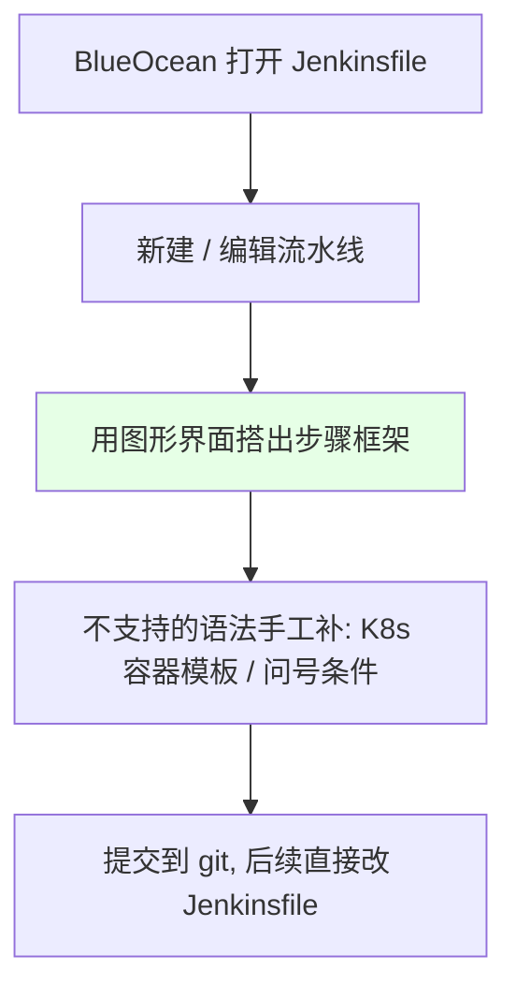
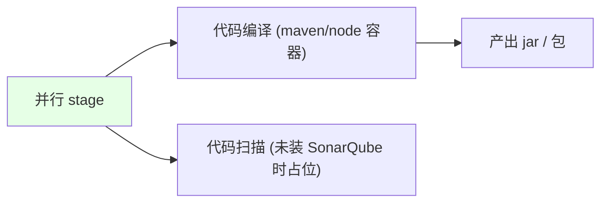

# Kubernetes 集群部署: BlueOcean 创建 Jenkinsfile（框架生成与变量/分支处理）

开篇文章：用 BlueOcean 可视化生成 Jenkinsfile 骨架后还要做哪些手工改造？结论先摆——BlueOcean 只能搭出**框架**，真正跑起来必须手工补上 **Kubernetes agent 容器模板、分支变量兼容（手动/自动触发）、基于 git 信息生成唯一镜像 tag、以及引用凭证做 docker push**。

## 纲要

- 用 BlueOcean 生成流水线框架
- 分支变量兼容：手动触发 vs GitLab webhook 自动触发
- 用 git 信息生成唯一镜像 tag
- 编译、代码扫描步骤
- docker build / push 的变量化与凭证引用
- 部署步骤：kubectl set image + 多集群 use-context

## BlueOcean 生成框架



> BlueOcean 不支持直接配置 Kubernetes agent（会报错），所以生成框架后要在文本编辑器里手工把 pod 模板等补进去。注意：**任何脚本里、root 节点里都不能写中文**，否则保存不上；保存后再加中文没问题。

## 分支变量兼容

```text
分支来源两种:

分支变量
├── 手动触发: 用户选 $BRANCH (参数化 list 分支)
└── GitLab webhook 自动触发: 自动生成分支变量 (提交到哪个分支就取哪个)
```

| 触发方式 | 取分支的写法 | 说明 |
| --- | --- | --- |
| 手动触发 | `$BRANCH` | 构建时由用户选择要构建的分支 |
| GitLab 自动触发 | GitLab 注入的分支变量 | 提交到哪条分支就拉哪条；该值为空说明是手动触发 |

> 用 `when { expression { ... } }` 判断：自动触发变量为空时走 `$BRANCH`，否则取其值。两个条件二选一即可兼容多分支。

## 用 git 信息生成唯一 tag

```bash
# 取最近一条提交信息 / commit id（标准输出）
COMMIT_MSG=$(git log -1 --pretty=%s)
COMMIT_ID=$(git log -1 --pretty=%H)

# 取时间（去掉换行/回车，只留前 14 位）
BUILD_TIME=$(date +%Y%m%d%H%M%S | cut -c1-14)

# tag = 时间 + commitID + 分支
TAG=${BUILD_TIME}-${COMMIT_ID}-${BRANCH}
echo "生成的镜像 tag: $TAG"
```

| 要素 | 来源 | 作用 |
| --- | --- | --- |
| 时间 | `date` | 区分每次构建 |
| commitID | `git log` | 关联代码版本 |
| 分支 | `$BRANCH` | 区分环境/来源（可能为空，需兜底） |

> 注意 `BRANCH` 可能为空，需加一步把兜底值赋给变量。双引号会解析变量、单引号不会，写脚本时务必用双引号。

## 编译与代码扫描（并行）



| 步骤 | 容器 | 命令 |
| --- | --- | --- |
| 编译 | `build`（maven/node 镜像） | `mvn clean package` / `npm install` |
| 扫描 | 同容器或独立 | SonarQube；未装则占位 |

> 编译命令应**参数化**，不同项目编译命令不同（install / package），交给开发确认。

## docker build / push 变量化与凭证

```bash
# 三个变量可参数化: 仓库地址 / 命名空间(或 project) / 应用名
REGISTRY_ADDRESS=registry.cn-hangzhou.aliyuncs.com
NAMESPACE=demo
IMAGE_NAME=springcloud-demo
TAG=$(date +%Y%m%d%H%M%S | cut -c1-14)

# 构建 (Dockerfile 放在项目根目录, 非根目录用 -f 指定)
docker build -t $REGISTRY_ADDRESS/$NAMESPACE/$IMAGE_NAME:$TAG .

# push 需要登录, 账号密码存于 Jenkins 凭证, 引用为变量
docker login $REGISTRY_ADDRESS -u $USERNAME -p $PASSWORD
docker push $REGISTRY_ADDRESS/$NAMESPACE/$IMAGE_NAME:$TAG
```

| 变量 | 含义 |
| --- | --- |
| `REGISTRY_ADDRESS` | 镜像仓库地址（阿里云/Hardor/Docker Hub 一致） |
| `NAMESPACE` | 阿里云叫命名空间，Harbor 叫 project 目录 |
| `IMAGE_NAME` | 应用镜像名称 |

> push 必须登录；账号密码放在 Jenkins 凭证里，用 `withDockerRegistry` 之类插件绑定变量，不要明文写密码（明文会直接显示，不安全）。

## 部署步骤：更新镜像 + 多集群切换

```bash
# 1. 切到目标集群上下文
kubectl config use-context $CLUSTER     # 例如 test / UAT / prod

# 2. 用标签选择器一次性更新多个同类资源
DEPLOY_TYPE=deployment
kubectl -n $NAMESPACE set image $DEPLOY_TYPE/$IMAGE_NAME \
  $IMAGE_NAME=$REGISTRY_ADDRESS/$NAMESPACE/$IMAGE_NAME:$TAG -l app=$IMAGE_NAME
```

> 用 `-l` 标签选择器的原因：一个容器可能被多个 Deployment/StatefulSet 使用，它们通常共享同一标签和镜像名，可一次更新多个。多集群通过 kubeconfig 的 context 切换。

## API 速览

| 能力 | 做法 |
| --- | --- |
| 生成骨架 | BlueOcean 图形化搭框架，不支持的语法手工补 |
| 分支兼容 | 手动 `$BRANCH` / GitLab 自动变量；`when` 二选一 |
| 唯一 tag | 时间 + commitID + 分支（分支空时兜底） |
| 并行 | 编译与扫描并行 stage |
| 镜像构建 | `docker build -t $ADDR/$NS/$NAME:$TAG .`，Dockerfile 根目录 |
| 凭证 | `withDockerRegistry` 绑定账号密码变量，不明文 |
| 部署 | `kubectl set image` + `-l` 标签；多集群 `config use-context` |
| 注意 | 脚本/root 节点不写中文；双引号解析变量、单引号不解析 |

## Demo 示例

```bash
# 在 Jenkins pipeline 的 shell step 中生成唯一 tag 并构建推送
COMMIT_ID=$(git log -1 --pretty=%H)
BUILD_TIME=$(date +%Y%m%d%H%M%S | cut -c1-14)
TAG=${BUILD_TIME}-${COMMIT_ID}-${BRANCH}

REGISTRY_ADDRESS=registry.cn-hangzhou.aliyuncs.com
NAMESPACE=demo
IMAGE_NAME=springcloud-demo

docker build -t $REGISTRY_ADDRESS/$NAMESPACE/$IMAGE_NAME:$TAG .
docker login $REGISTRY_ADDRESS -u $USERNAME -p $PASSWORD
docker push $REGISTRY_ADDRESS/$NAMESPACE/$IMAGE_NAME:$TAG

# 切集群并仅更新镜像
kubectl config use-context $CLUSTER
kubectl -n $NAMESPACE set image deployment/$IMAGE_NAME \
  $IMAGE_NAME=$REGISTRY_ADDRESS/$NAMESPACE/$IMAGE_NAME:$TAG -l app=$IMAGE_NAME
```

### 总结

- **BlueOcean 只负责搭框架**：生成的 Jenkinsfile 不支持 Kubernetes agent 等语法，必须切到文本编辑器手工补 pod 模板和条件判断，且脚本/root 节点内不能写中文；
- **分支变量要兼容「手动 + 自动」两种触发**：手动用 `$BRANCH` 参数，GitLab 自动触发读其注入变量，用 `when` 二选一即可支持多分支；
- **用 git 信息拼出唯一镜像 tag**：`时间 + commitID + 分支`，分支可能为空要兜底；写变量一律用双引号（单引号不解析变量）；
- **docker build/push 全参数化**：仓库地址、命名空间、应用名都抽成变量，push 登录的账号密码必须走 Jenkins 凭证引用，禁止明文；
- **部署用 `kubectl set image` + `-l` 标签选择器**：一个容器被多个资源共用时可一次更新，多集群通过 `kubectl config use-context` 切换目标集群。

