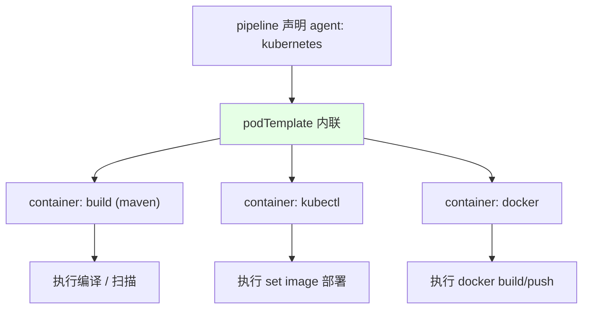
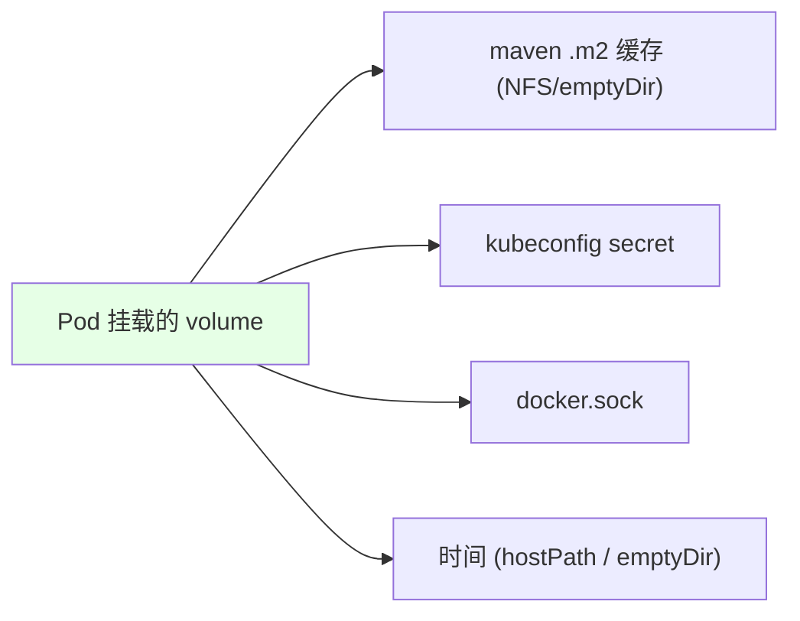

# Kubernetes 集群部署: Jenkins 使用 Kubernetes Pod 执行（Pod 模板与容器步骤）

开篇文章：声明式流水线怎么真正在 K8s 里跑起来？结论先摆——把 `agent` 改成 **kubernetes**，在 Jenkinsfile 里内联一个 **Pod 模板**（maven 编译容器 + kubectl 部署容器 + docker 构建容器），用 host 的 `docker.sock` 挂载解决容器内 build 镜像的问题，并用凭证绑定避免明文密码。

## 纲要

- 把 agent 改为 kubernetes 并内联 Pod 模板
- 三个容器：maven 编译 / kubectl 部署 / docker 构建
- docker 构建挂载宿主机 docker.sock
- 多种 volume：maven 缓存 / kubeconfig secret / docker.sock / 时间
- 引号规则：双引号解析变量、单引号不解析
- 用凭证引用镜像仓库账号密码

## agent 改为 kubernetes



> BlueOcean 不支持配置 K8s，所以生成框架后要在文本里手动把 `agent { kubernetes { ... } }` 和 pod 模板粘进去。Pod 模板里 `yaml` 字段指定 Pod 定义，`namespace` 指定用于构建的集群命名空间（如 `kubernetes-default`）。

## 三个容器与各司其职

```text
Pod 模板内的容器:

podTemplate
├── build    ← maven 镜像, 跑 mvn 编译
├── kubectl  ← 挂载 kubeconfig, 跑 set image 部署
└── docker   ← 挂载宿主机 docker.sock, 跑 build/push
```

| 容器 | 镜像 | 职责 |
| --- | --- | --- |
| `build` | maven | 执行 `mvn clean install`，编译 Java |
| `kubectl` | 带 kubectl 客户端 | 执行 `kubectl set image` 等发版命令 |
| `docker` | docker 客户端 | `docker build` / `docker push` 镜像 |

> 不同语言换编译镜像即可：NodeJS 用 node 镜像、gRPC/Go 用对应镜像。Pod 基于镜像，无需在节点预装依赖。

## docker 构建挂载宿主机 docker.sock

```yaml
# Pod 模板中 docker 容器的 volume 挂载（示意）
volumes:
  - hostPath:
      path: /var/run/docker.sock
    name: docker-sock
containers:
  - name: docker
    image: docker:20
    volumeMounts:
      - name: docker-sock
        mountPath: /var/run/docker.sock
```

| 方案 | 说明 |
| --- | --- |
| 挂载 `docker.sock` | 复用宿主机 docker 守护进程 build/push，最省事 |
| docker-in-docker | 容器内再起 dockerd，不如挂 sock 好用 |

> 容器内不能起 dockerd，所以挂宿主机的 `docker.sock` 让 docker 客户端复用宿主机守护进程来构建和推送镜像。

## 多种 volume



| volume | 用途 |
| --- | --- |
| maven `.m2` 缓存 | 缓存第三方依赖，避免每次重下（NFS 或空目录均可） |
| kubeconfig secret | 把多集群 kubeconfig 挂进 `kubectl` 容器 |
| docker.sock | docker 构建/推送复用宿主机 |
| 时间 | 容器内时间与宿主机对齐 |

## 引号规则与凭证引用

```bash
# 双引号解析变量, 单引号不解析 —— 写脚本一律用双引号
TAG="${BUILD_TIME}-${COMMIT_ID}-${BRANCH}"

# 用 withDockerRegistry 绑定凭证, 账号密码成为变量, 不明文
docker login $REGISTRY_ADDRESS -u $USERNAME -p $PASSWORD
```

> `withDockerRegistry` 这类插件把凭证 ID 绑定后，密码复制到 `$PASSWORD`、用户名到 `$USERNAME`；直接写明文密码会显示在日志里，不安全。

## API 速览

| 能力 | 做法 |
| --- | --- |
| agent | `agent { kubernetes { yaml ... namespace 'kubernetes-default' } }` |
| 编译容器 | `build`（maven/node 等），执行编译与扫描并行 |
| 部署容器 | `kubectl`，挂载 kubeconfig secret，执行 set image |
| 构建容器 | `docker`，挂载宿主机 `docker.sock` |
| 缓存 | maven `.m2` 挂 NFS/emptyDir，跨节点共享 |
| 凭证 | `withDockerRegistry` 绑定账号密码变量，禁止明文 |
| 引号 | 双引号解析变量；单引号不解析 |
| 不变量 | BlueOcean 改的手工语法不会在保存时被顶替，放心改 |

## Demo 示例

```bash
# 在 kubectl 容器中切集群并仅更新镜像
kubectl config use-context $CLUSTER
kubectl -n $NAMESPACE set image deployment/$IMAGE_NAME \
  $IMAGE_NAME=$REGISTRY_ADDRESS/$NAMESPACE/$IMAGE_NAME:$TAG

# 在 docker 容器中登录并推送 (账号密码来自凭证变量)
docker login $REGISTRY_ADDRESS -u $USERNAME -p $PASSWORD
docker build -t $REGISTRY_ADDRESS/$NAMESPACE/$IMAGE_NAME:$TAG .
docker push $REGISTRY_ADDRESS/$NAMESPACE/$IMAGE_NAME:$TAG
```

### 总结

- **跑在 K8s 要把 `agent` 改成 kubernetes 并内联 Pod 模板**：BlueOcean 不支持 K8s 配置，需手工把 pod 模板粘进 Jenkinsfile，`namespace` 指定构建用的集群命名空间；
- **Pod 内三个容器各管一段**：`build` 用 maven/node 跑编译、`kubectl` 挂载 kubeconfig 跑部署、`docker` 跑 build/push，不同语言只换编译镜像；
- **docker 构建靠挂载宿主机 `docker.sock`**：容器内无法起 dockerd，挂宿主机的 sock 复用守护进程最省事，比 docker-in-docker 好用；
- **缓存与配置用 volume 解决**：maven `.m2` 缓存挂 NFS/emptyDir 跨节点共享，kubeconfig 用 secret 挂载，再挂时间和 docker.sock；
- **引号与凭证是坑点**：双引号才解析变量、单引号不解析；push 登录必须走 `withDockerRegistry` 之类凭证绑定，绝不能把密码明文写进脚本。

