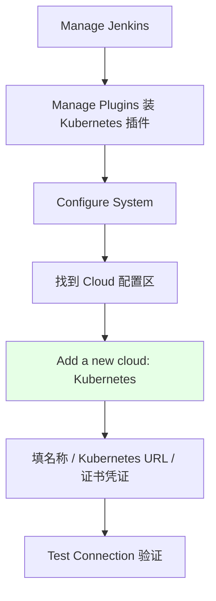
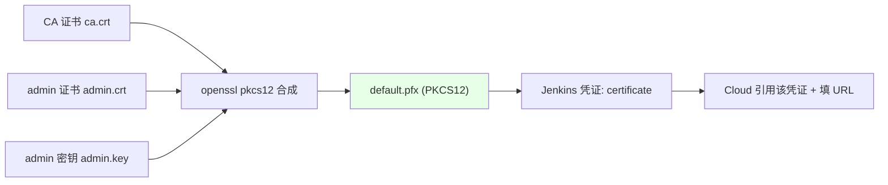

# Kubernetes 集群部署: Jenkins 配置 Kubernetes 多集群（Cloud 与证书凭证）

开篇文章：Jenkins 怎么连上 K8s 去创建构建 Pod？结论先摆——在 **Manage Jenkins → Configure System → Cloud** 里添加一个 Kubernetes Cloud，填上**集群 API 地址**与一个 **PKCS12 证书凭证**（由 CA 证书 + admin 证书 + admin 密钥用 openssl 合成），配好 Jenkins URL 与 slave 端口（50000）后测试连接即可；多集群就是重复添加、名字不重。

## 纲要

- 进入 Jenkins 的 Cloud 配置
- 单集群最简配置（默认 kubeconfig 路径）
- 多集群：用 PKCS12 证书凭证
- openssl 合成证书
- 填写 API 地址与测试连接
- slave 端口 50000 与多集群扩展

## 配置入口



| 步骤 | 位置 | 说明 |
| --- | --- | --- |
| 装插件 | Manage Plugins | 搜索 Kubernetes，装全部相关插件 |
| 进配置 | Configure System | 新版 Cloud 配置换了位置，旧版直接在下方 |
| 加云 | Add a new cloud | 选 Kubernetes |
| 验证 | Test Connection | 连通即说明可用 |

## 单集群最简配置

```text
单集群 (无多集群需求时):

Cloud 配置
├── Kubernetes URL: 留空即可
│   └── Jenkins 默认找 /var/jenkins_home/.kube/config
└── 直接 Test Connection
```

> 如果 Jenkins 宿主机上已有 `/.kube/config`，URL 可以不填，Jenkins 会直接读该文件，填完保存即可连通。仅当有多个集群时才需要证书凭证方式。

## 多集群：PKCS12 证书凭证



| 材料 | 来源 |
| --- | --- |
| CA 证书 | `/etc/kubernetes/pki/ca.crt` |
| 服务端证书 | `admin.crt`（admin 证书） |
| 中间证书 | `ca.crt`（合成时作为中间证书） |
| 密钥 | `admin.key` |

## openssl 合成证书

```bash
# 用 openssl 把 CA + admin 证书 + admin 密钥合成 PKCS12 文件
openssl pkcs12 -export \
  -out default.pfx \
  -inkey /etc/kubernetes/pki/admin.key \
  -in /etc/kubernetes/pki/admin.crt \
  -certfile /etc/kubernetes/pki/ca.crt \
  -passout pass:123456

# 把 default.pfx 上传到 Jenkins 凭证 (类型: Certificate), 密码 123456
```

> PKCS12 是把密钥对、服务器证书、中间证书合成进一个文件，之后 Jenkins 能把它分解成各种证书使用。原理与 HTTPS 访问域名类似。

## 填写并测试连接

```text
Cloud 配置项:

Kubernetes Cloud
├── Name: kubernetes-default   ← 名字不要重复
├── Kubernetes URL: https://<apiserver>:6443
├── Credentials: 选刚上传的 certificate 凭证
├── Jenkins URL: http://<jenkins>:8080
├── Namespace: default
└── 点击 Test Connection → 显示 connected
```

| 配置项 | 值 |
| --- | --- |
| Name | 任意，多集群时各不重复 |
| Kubernetes URL | API Server 地址 |
| Credentials | 上传的 PKCS12 certificate |
| Jenkins URL | Jenkins 自身访问地址 |
| Namespace | 构建 Pod 所属命名空间（如 default） |

## slave 端口与多集群扩展

```bash
# Jenkins master 与 K8s 中 slave 通讯需要开端口, 一般固定 50000 (避免随机被防火墙拦)
JENKINS_SLAVE_PORT=50000
```

> 多集群 = 重复上述步骤再添加一个 Cloud，名字不重复即可：导入 `ca.crt`、填 URL、起名、上传证书凭证、保存。课程场景一般一个就够。

## API 速览

| 能力 | 做法 |
| --- | --- |
| 入口 | Manage Jenkins → Configure System → Cloud → Add Kubernetes |
| 单集群 | URL 留空，读 `/.kube/config`，直接 Test Connection |
| 多集群 | 用 PKCS12 证书凭证区分 |
| 合成证书 | `openssl pkcs12 -export` 合成 ca+admin 证书+密钥 |
| 凭证类型 | Jenkins 里选 Certificate，上传 .pfx，设密码 |
| 连通验证 | Test Connection 显示 connected |
| slave 端口 | 固定 50000，避免防火墙拦截 |
| 多集群扩展 | 重复添加 Cloud，Name 不重复 |

## Demo 示例

```bash
# 1. 合成 PKCS12 证书凭证
openssl pkcs12 -export \
  -out default.pfx \
  -inkey /etc/kubernetes/pki/admin.key \
  -in /etc/kubernetes/pki/admin.crt \
  -certfile /etc/kubernetes/pki/ca.crt \
  -passout pass:123456

# 2. 在 Jenkins 上传 default.pfx (Credentials → Certificate, 密码 123456)

# 3. Configure System → Cloud → Kubernetes:
#    Name = kubernetes-default
#    Kubernetes URL = https://$APISERVER:6443
#    Credentials = 刚上传的 certificate
#    Jenkins URL = http://$JENKINS:8080
#    Namespace = default
#    点 Test Connection
```

### 总结

- **Jenkins 连 K8s 走 Cloud 配置**：入口是 Manage Jenkins → Configure System → Cloud → Add a new cloud (Kubernetes)，前提装好 Kubernetes 插件；
- **单集群最简单**：Jenkins 宿主机有 `/.kube/config` 时 Kubernetes URL 留空，直接 Test Connection 即可连通；
- **多集群靠 PKCS12 证书凭证区分**：用 `openssl pkcs12 -export` 把 `ca.crt` + `admin.crt` + `admin.key` 合成一个 `.pfx`，上传为 Jenkins 的 Certificate 类型凭证（设密码），Cloud 里引用它并填 API 地址；
- **填完关键项后必须 Test Connection**：Name（多集群不重复）、Kubernetes URL、Credentials、Jenkins URL、Namespace 配齐后连通即说明可用；
- **slave 通讯固定 50000 端口**：master 与 K8s 内 slave 通过该端口通讯，固定避免随机端口被防火墙拦截；再加集群只需重复添加 Cloud、名字不重复。

