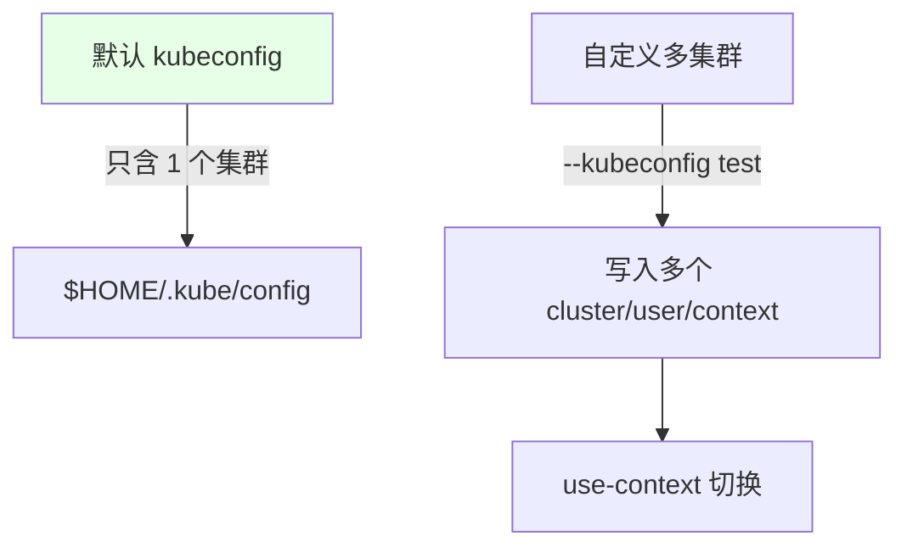

# Kubernetes 集群部署: KUBECONFIG 多集群配置（上下文切换与 Secret 挂载）

开篇文章：一份 kubeconfig 怎么管多个集群？结论先摆——用 `kubectl config` 把多个 **cluster / user / context** 写进同一个 kubeconfig 文件，靠 `kubectl config use-context` 切换目标集群；再把这份文件做成 **generic Secret** 挂进 Jenkins 构建 Pod 的 `$HOME/.kube/config`，流水线就能按变量切集群发版。

## 纲要

- 默认 kubeconfig 只含一个集群
- 用 `--kubeconfig` 生成多集群配置
- 添加 cluster / user / context
- use-context 切换目标集群
- 把 kubeconfig 做成 Secret 挂进 Pod
- 名称不可重复，否则被覆盖

## 多集群 kubeconfig 结构（ASCII 目录树）

```text
kubeconfig 文件 (test)
├── clusters
│   ├── test   (server=https://$APISERVER:6443, CA)
│   └── UAT    (server=https://$UAT_APISERVER:6443, CA)
├── users
│   ├── admin-test   (client-cert / client-key)
│   └── admin-uat    (client-cert / client-key)
└── contexts
    ├── test   (cluster=test + user=admin-test)
    └── UAT    (cluster=UAT + user=admin-uat)
        │
        └── 落地到 Pod：generic Secret(kubeconfig-secret)
            └── 挂载 $HOME/.kube/config + KUBECONFIG 变量
```

## 默认与自定义



| 文件 | 说明 |
| --- | --- |
| 默认 | 搭集群时生成的 `$HOME/.kube/config`，只保存一个集群（名为 `kubernetes`） |
| 自定义 | 用 `--kubeconfig` 指定新文件，按同样逻辑追加多个集群 |

## 添加 cluster / user / context

```bash
# 1. 添加集群 (URL 与证书, 名称不可与已有重复)
kubectl config --kubeconfig=test set-cluster test \
  --server=https://$APISERVER:6443 \
  --certificate-authority=/etc/kubernetes/pki/ca.crt

# 2. 添加用户 (用 admin 证书/密钥, 名称不可重复)
kubectl config --kubeconfig=test set-credentials admin-test \
  --client-certificate=/etc/kubernetes/pki/admin.crt \
  --client-key=/etc/kubernetes/pki/admin.key

# 3. 设置上下文 (cluster + user 绑定)
kubectl config --kubeconfig=test set-context test \
  --cluster=test --user=admin-test

# 4. 再添加一个 UAT 集群 (同理, 名称换 UAT)
kubectl config --kubeconfig=test set-cluster UAT \
  --server=https://$UAT_APISERVER:6443 \
  --certificate-authority=/etc/kubernetes/pki/ca.crt
kubectl config --kubeconfig=test set-credentials admin-uat \
  --client-certificate=/etc/kubernetes/pki/admin.crt \
  --client-key=/etc/kubernetes/pki/admin.key
kubectl config --kubeconfig=test set-context UAT \
  --cluster=UAT --user=admin-uat
```

> **cluster 名称和 user 名称都不能重复**，否则会互相覆盖。证书可复用同一套（模拟多集群时共用）。

## use-context 切换

```bash
# 切到 test 集群
kubectl config --kubeconfig=test use-context test
kubectl get node

# 切到 UAT 集群
kubectl config --kubeconfig=test use-context UAT
kubectl get node

# 不指定 --kubeconfig 时默认读 $HOME/.kube/config
kubectl config use-context test
```

| 命令 | 作用 |
| --- | --- |
| `use-context test` | 把当前上下文切到 test 集群 |
| `use-context UAT` | 切到 UAT 集群 |
| 不加 `--kubeconfig` | 读默认 `$HOME/.kube/config` |

## 把 kubeconfig 做成 Secret 挂进 Pod

```bash
# 生成 secret: 从 kubeconfig 文件创建
kubectl create secret generic kubeconfig-secret \
  --from-file=config=test \
  -n $NAMESPACE
```

```yaml
# Pod 内挂载示意: 挂到 $HOME/.kube/config, 并设 KUBECONFIG 环境变量
env:
  - name: KUBECONFIG
    value: /root/.kube/config
volumeMounts:
  - name: kubeconfig
    mountPath: /root/.kube/config
    subPath: config
volumes:
  - name: kubeconfig
    secret:
      secretName: kubeconfig-secret
```

> 流水线里 `kubectl config use-context $CLUSTER` 配合该 secret 即可按变量切集群发版。这个配置做一次基本就不动了，除非新增集群。

## API 速览

| 能力 | 做法 |
| --- | --- |
| 默认文件 | `$HOME/.kube/config`，初始只一个集群 |
| 多集群 | `--kubeconfig=test` 追加 cluster/user/context |
| 添加集群 | `config set-cluster` 指定 server + CA |
| 添加用户 | `config set-credentials` 指定 client 证书/密钥 |
| 上下文 | `config set-context` 绑定 cluster+user |
| 切换 | `config use-context <name>` |
| 防覆盖 | cluster / user 名称必须唯一 |
| Pod 内使用 | secret 挂到 `$HOME/.kube/config` + `KUBECONFIG` 变量 |

## Demo 示例

```bash
# 1. 构造多集群 kubeconfig
kubectl config --kubeconfig=test set-cluster test \
  --server=https://$APISERVER:6443 --certificate-authority=/etc/kubernetes/pki/ca.crt
kubectl config --kubeconfig=test set-credentials admin-test \
  --client-certificate=/etc/kubernetes/pki/admin.crt --client-key=/etc/kubernetes/pki/admin.key
kubectl config --kubeconfig=test set-context test --cluster=test --user=admin-test

# 2. 做成 secret 供 Jenkins Pod 挂载
kubectl create secret generic kubeconfig-secret --from-file=config=test -n $NAMESPACE

# 3. 流水线中切集群发版
kubectl config use-context $CLUSTER
kubectl -n $NAMESPACE set image deployment/$IMAGE_NAME \
  $IMAGE_NAME=$REGISTRY_ADDRESS/$NAMESPACE/$IMAGE_NAME:$TAG -l app=$IMAGE_NAME
```

### 总结

- **默认 kubeconfig 只有一个集群**：搭集群时生成的 `$HOME/.kube/config` 初始只保存名为 `kubernetes` 的一个集群，多集群要自定义文件；
- **用 `kubectl config` 三步走**：`set-cluster`（server+CA）→ `set-credentials`（client 证书/密钥）→ `set-context`（绑定 cluster+user），按同样逻辑追加即可；
- **切换靠 `use-context`**：`kubectl config use-context test/UAT` 切目标集群，不加 `--kubeconfig` 时读默认文件；
- **cluster 与 user 名称必须唯一**：重复会被覆盖，这是最常踩的坑；证书在模拟多集群时可复用同一套；
- **Pod 内用 secret 挂载使用**：把 kubeconfig 做成 generic Secret 挂到 `$HOME/.kube/config` 并设 `KUBECONFIG` 环境变量，流水线按 `$CLUSTER` 变量切集群发版，此配置基本一次定型。

