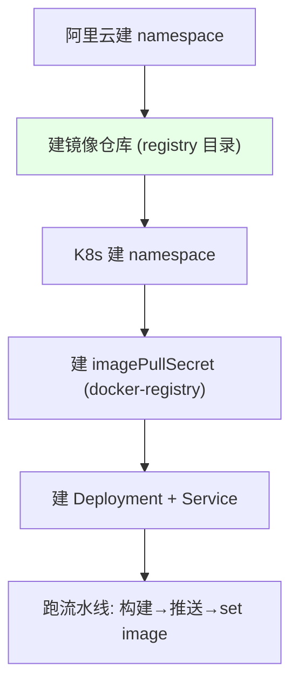
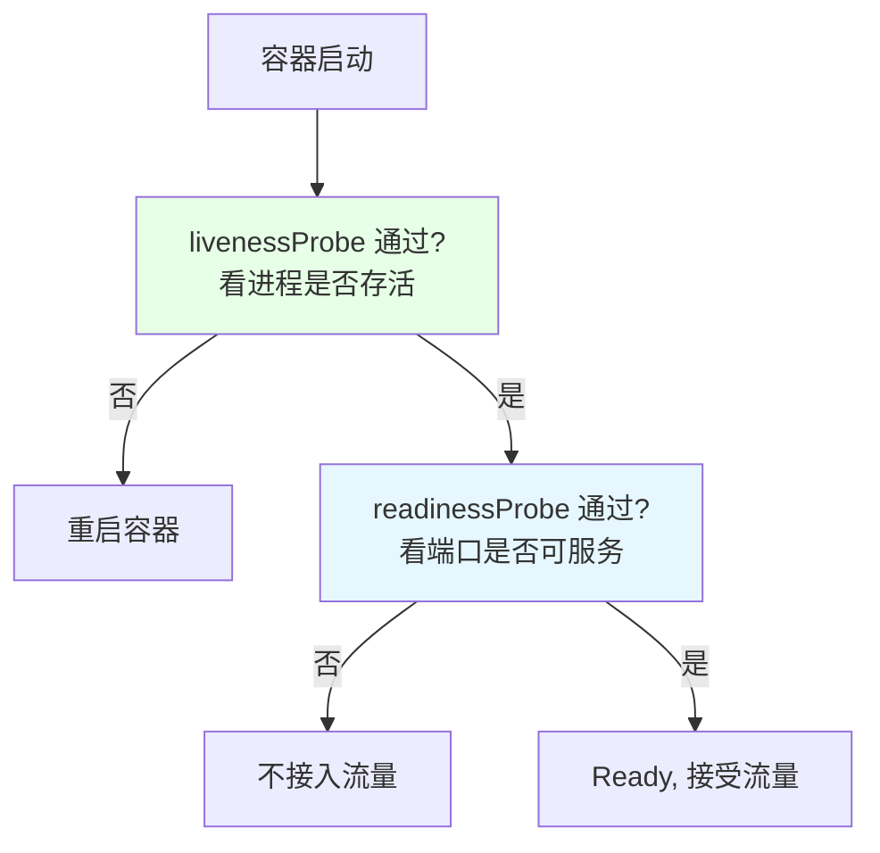

# Kubernetes 集群部署: Jenkins 自动化构建 Java 应用（上·构建与部署验证）

开篇文章：一条 Java 应用的 Jenkins 流水线怎么真跑通并部署到 K8s？结论先摆——先在阿里云建 **namespace / 镜像仓库**，用 **imagePullSecret** 拉私有镜像，Deployment 用 Dashboard 生成（注意**存活探针看进程、就绪探针看端口**的区别），再把镜像 tag 通过 `kubectl set image` 自动更新，最后用 `deploy` 开关决定是否发版。

## 纲要

- 准备 namespace 与镜像仓库
- 创建 imagePullSecret 拉私有镜像
- 用 Dashboard 生成 Deployment 与 Dockerfile
- 存活探针与就绪探针的区别
- 用 deploy 开关控制是否自动发版
- 构建缓存挂载（maven .m2）

## 准备工作



| 准备项 | 说明 |
| --- | --- |
| 镜像仓库 | 阿里云需手动建 namespace（仓库目录）；Docker Hub 只需建 project |
| K8s namespace | 如 `javatest` |
| imagePullSecret | 拉私有镜像的密钥，docker-registry 类型 |

## 创建 imagePullSecret

```bash
# 创建 docker-registry 类型 secret 用于拉取私有镜像
kubectl -n javatest create secret docker-registry registry-secret \
  --docker-server=registry.cn-hangzhou.aliyuncs.com \
  --docker-username=$USERNAME \
  --docker-password=$PASSWORD \
  --docker-email=dev@example.com
```

> 若没配这个 secret，创建资源文件时需指定镜像仓库密钥，否则 Pod 拉不到私有镜像。也可按之前讲过的命令创建 docker 类型 secret。

## Dockerfile 与 Deployment

```dockerfile
# 基础镜像可用 openjdk:8-jre; 注意 OpenJDK 不含 Oracle 私有库
FROM openjdk:8-jre
COPY target/*.jar /opt/app.jar
EXPOSE 8761
# 启动命令不写死, 由 Deployment 的 command 注入: java -jar /opt/*.jar
```

```text
Deployment 资源结构:

Deployment
├── name: eureka-demo
├── container: eureka-demo
├── image: registry.../demo/eureka-demo:<tag>
├── imagePullSecret: registry-secret
├── ports: 8761
├── livenessProbe:  看进程 (进程在=健康)
└── readinessProbe: 看端口 (端口通=可接流量)
```

> 基础镜像可选 OpenJDK（开源、小巧）或自带 Oracle JDK 的镜像；若公司代码基于 Oracle JDK 且用了私有库，OpenJDK 会缺类导致起不来，需注意。启动命令通过 Deployment 注入，不在 Dockerfile 写死。

## 存活探针与就绪探针的区别



| 探针 | 判断什么 | 失败后果 |
| --- | --- | --- |
| livenessProbe（存活） | **进程是否存活** | 重启容器 |
| readinessProbe（就绪） | **端口是否可服务** | 不接入流量（但进程仍在） |

> 端口起得慢容易被判超时误杀，可改存活探针为「看进程」，就绪探针保持「看端口」。两者都健康才认为可接流量。

## 用 deploy 开关控制发版

```bash
# 流水线参数 deploy (choice: true/false), 默认 false
# 只有 deploy=true 才执行 kubectl set image
if [ "$DEPLOY" = "true" ]; then
  kubectl -n $NAMESPACE set image deployment/$IMAGE_NAME \
    $IMAGE_NAME=$REGISTRY_ADDRESS/$NAMESPACE/$IMAGE_NAME:$TAG -l app=$IMAGE_NAME
fi
```

> 资源文件还没建时先把 `deploy` 设 false，只构建镜像验证；建好后再勾 true 自动发版。

## 构建缓存挂载

```text
各语言依赖缓存目录 (建议挂共享存储, 如 NFS):

缓存目录
├── Java (maven):  ~/.m2
├── NodeJS (npm):  node_modules
└── PHP:           vendor
```

> 没有共享存储时可临时挂 emptyDir / hostPath；正式环境应挂 NFS，让任意节点都能复用缓存，避免每次重下依赖。

## API 速览

| 能力 | 做法 |
| --- | --- |
| 镜像仓库 | 阿里云建 namespace；Docker Hub 建 project |
| 拉私有镜像 | `create secret docker-registry` 做 imagePullSecret |
| Dockerfile | `FROM openjdk:8-jre` + `COPY *.jar` + `EXPOSE`；启动命令注入 |
| 探针 | 存活看进程、就绪看端口，二者都健康才接流量 |
| 发版开关 | `deploy` 参数 true/false 控制是否 `set image` |
| 更新镜像 | `kubectl set image deployment/... -l app=...` |
| 依赖缓存 | Java `~/.m2` / Node `node_modules` / PHP `vendor` 挂 NFS |
| Dashboard | 支持 PV/PVC、Ingress 等，可直接编辑生成资源 |

## Demo 示例

```bash
# 1. 准备命名空间与拉镜像密钥
kubectl create namespace javatest
kubectl -n javatest create secret docker-registry registry-secret \
  --docker-server=registry.cn-hangzhou.aliyuncs.com \
  --docker-username=$USERNAME --docker-password=$PASSWORD

# 2. 构建并推送镜像 (流水线内)
docker build -t $REGISTRY_ADDRESS/demo/$IMAGE_NAME:$TAG .
docker push $REGISTRY_ADDRESS/demo/$IMAGE_NAME:$TAG

# 3. 仅在 deploy=true 时更新镜像
if [ "$DEPLOY" = "true" ]; then
  kubectl -n javatest set image deployment/$IMAGE_NAME \
    $IMAGE_NAME=$REGISTRY_ADDRESS/demo/$IMAGE_NAME:$TAG -l app=$IMAGE_NAME
fi

# 4. 观察探针与启动
kubectl -n javatest get pod -l app=$IMAGE_NAME
kubectl -n javatest describe pod -l app=$IMAGE_NAME
```

### 总结

- **正式跑通前先备齐资源**：阿里云建 namespace/镜像仓库（Docker Hub 只建 project）、K8s 建 namespace、用 `create secret docker-registry` 做 imagePullSecret 拉私有镜像；
- **Dockerfile 只做拷贝、启动命令注入**：`FROM openjdk:8-jre` + `COPY target/*.jar`，注意 OpenJDK 不含 Oracle 私有库，启动命令放到 Deployment 的 command；
- **存活探针与就绪探针职责不同**：存活看「进程在不在」（不在就重启），就绪看「端口通不通」（不通就不接流量），两者都健康才接流量，端口起慢时可把存活改成看进程避免误杀；
- **用 `deploy` 开关兜住发版时机**：资源文件未建时设 false 只构建验证，建好后再设 true 自动 `kubectl set image`，通过 `-l` 标签一次更新；
- **依赖缓存要挂共享存储**：Java 的 `~/.m2`、Node 的 `node_modules`、PHP 的 `vendor` 建议挂 NFS，避免每个节点重复下载。

