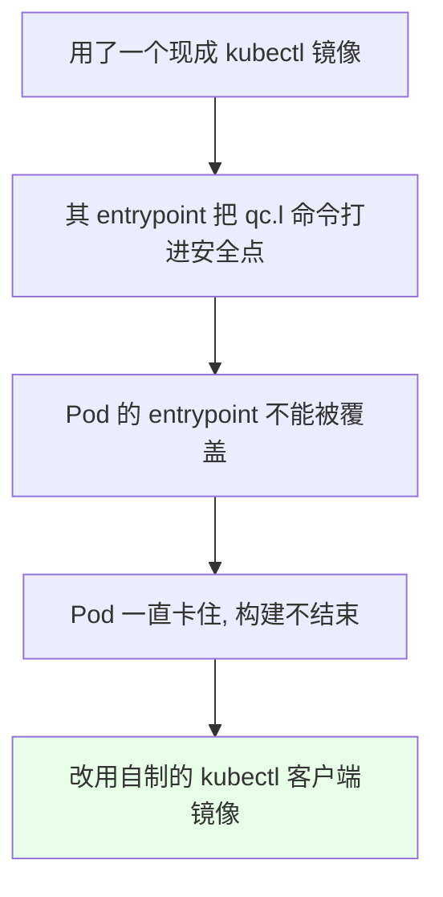
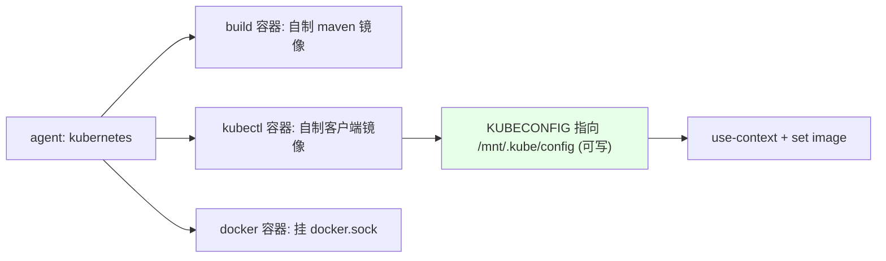

# Kubernetes 集群部署: Jenkins 自动化构建 Java 应用（下·镜像与挂载排错）

开篇文章：上一节流水线卡住/发版失败，根因是什么？结论先摆——两个坑：**① 选错了 kubectl 客户端镜像**（其 entrypoint 把 `kubectl` 写死导致 Pod 不正常）；**② kubeconfig 挂载后变成只读**，无法 `use-context` 切换，需重定向到新文件（如 `/mnt/.kube/config`）再操作。另外 StatefulSet 的 `--watch` 有时不退出，要注意超时。

## 纲要

- 坑一：kubectl 客户端镜像选错导致 Pod 不正常
- 坑二：kubeconfig 挂载后只读，无法切换 context
- 重定向 kubeconfig 到可写新文件
- StatefulSet 的 --watch 可能不退出
- 最终可用 Jenkinsfile 的要点
- 镜像与目录两个注意点总结

## 坑一：kubectl 镜像的 entrypoint 写死



| 现象 | 原因 | 解决 |
| --- | --- | --- |
| 流水线一直卡在某步 | 镜像 entrypoint 写死了命令，无法覆盖 | 自己做一个干净的 kubectl 客户端镜像 |
| 排查改参数无效 | 不是参数问题，是镜像本身问题 | 换自制镜像 |

> 网上随便找的 kubectl 镜像可能把命令写进 entrypoint，导致 Jenkins 创建的 Pod 不正常、一直卡住。换成自己上传的 kubectl 客户端镜像即可。

## 坑二：kubeconfig 挂载后只读

```text
挂载 kubeconfig 的问题:

只读挂载
├── 直接挂到 $HOME/.kube/config
├── 该文件变为只读 (secret/configmap 挂载默认只读)
├── 无法 use-context 切换 (不能改写文件)
└── 解决: 重定向到一个新文件再操作
```

| 问题 | 说明 |
| --- | --- |
| 挂载即只读 | secret/configmap 挂进去后 `$HOME/.kube/config` 变只读 |
| 无法切换 context | 不能改写文件，`use-context` 失效 |
| 还有 lock 问题 | `$HOME/.kube` 目录也不能只读（有 config.lock 锁文件） |

## 重定向到可写新文件

```bash
# 把 kubeconfig 挂载到 /mnt/.kube/config (可写路径), 操作这个文件
export KUBECONFIG=/mnt/.kube/config

# 切集群 (写的是 /mnt 下的新文件, 不再受只读限制)
kubectl config use-context $CLUSTER

# 之后正常 set image 发版
kubectl -n $NAMESPACE set image deployment/$IMAGE_NAME \
  $IMAGE_NAME=$REGISTRY_ADDRESS/$NAMESPACE/$IMAGE_NAME:$TAG -l app=$IMAGE_NAME
```

> 因为挂载进来的是只读，我们把它重定向到一个新文件（如 `/mnt/.kube/config`），之后的操作都针对这个新文件，便能正常切 context。

## StatefulSet 的 --watch 可能不退出

```bash
# StatefulSet 的 --watch 有时一直停着不退出
kubectl -n $NAMESPACE rollout status statefulset/$IMAGE_NAME --watch

# 建议加超时, 避免卡死
timeout 300 kubectl -n $NAMESPACE rollout status statefulset/$IMAGE_NAME --watch
```

| 资源 | --watch 行为 |
| --- | --- |
| Deployment | 一般正常结束 |
| StatefulSet | 偶尔卡住不退出，建议加 `timeout` |

## 最终可用 Jenkinsfile 要点



## API 速览

| 能力 | 做法 |
| --- | --- |
| kubectl 镜像 | 用自制的干净 kubectl 客户端镜像，别用 entrypoint 写死的 |
| 只读挂载 | secret/configmap 挂 kubeconfig 后只读 |
| 解决只读 | 重定向到 `/mnt/.kube/config` 等新文件再操作 |
| context 切换 | 针对可写新文件 `use-context` |
| StatefulSet | `--watch` 可能不退出，加 `timeout` |
| 发版 | `kubectl set image` + `-l` 标签 |
| 启动判断 | 用 `--watch` 或自定义脚本（注意超时） |

## Demo 示例

```bash
# 1. 设置可写的 kubeconfig 路径
export KUBECONFIG=/mnt/.kube/config

# 2. 切到目标集群
kubectl config use-context $CLUSTER

# 3. 仅更新镜像 (标签选择器一次更新多个资源)
kubectl -n $NAMESPACE set image deployment/$IMAGE_NAME \
  $IMAGE_NAME=$REGISTRY_ADDRESS/$NAMESPACE/$IMAGE_NAME:$TAG -l app=$IMAGE_NAME

# 4. 判断启动 (加超时避免卡死)
timeout 300 kubectl -n $NAMESPACE rollout status deployment/$IMAGE_NAME --watch
```

### 总结

- **坑一在镜像**：现成 kubectl 镜像若把命令写进 entrypoint，Jenkins 创建的 Pod 会不正常、一直卡住，必须换成自制的干净 kubectl 客户端镜像；
- **坑二在只读挂载**：secret/configmap 把 kubeconfig 挂进 `$HOME/.kube/config` 后变为只读，且 `.kube` 目录也不能只读（有 lock），导致无法 `use-context` 切换；
- **解决只读靠重定向**：把 kubeconfig 重定向到一个可写新文件（如 `/mnt/.kube/config`），之后的切换与发版都操作这个新文件；
- **StatefulSet 的 `--watch` 可能不退出**：Deployment 一般正常，StatefulSet 偶尔卡死，建议一律加 `timeout` 保护；
- **最终 Jenkinsfile 要点**：agent 用 kubernetes，build 用自制 maven 镜像、kubectl 用自制客户端镜像并指向可写 kubeconfig、docker 挂宿主机 sock，发版用 `set image -l`。

