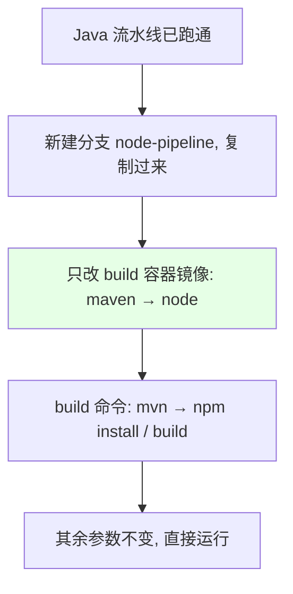
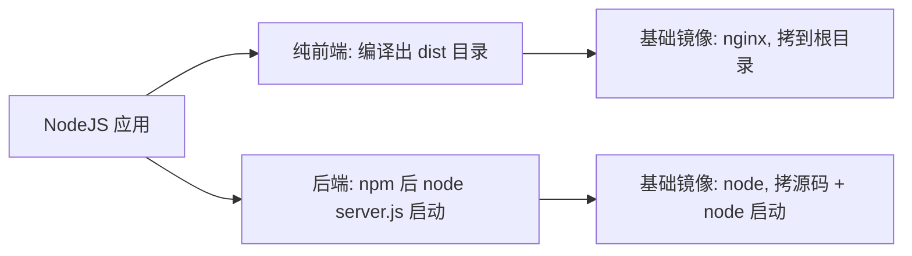

# Kubernetes 集群部署: Jenkins 自动化构建 NodeJS 应用（构建镜像与缓存）

开篇文章：Java 流水线跑通后，NodeJS 应用怎么快速复用？结论先摆——NodeJS 与 Java 的流水线**几乎一样，只改编译镜像为 node**，其余参数化部分不用动；关键是 **node 版本要和开发确认**、以及 **node_modules 缓存不能直接覆盖 workspace，要挂到别的目录再拷贝**。

## 纲要

- NodeJS 复用 Java 流水线的思路
- node 版本必须与开发对齐
- NodeJS 的两种形态：纯前端 / 后端
- node_modules 缓存的处理
- 用复制 job 快速新建任务
- 部署验证（端口 / Ingress）

## 复用 Java 流水线



| 改动点 | Java | NodeJS |
| --- | --- | --- |
| 编译镜像 | maven | node |
| 构建命令 | `mvn clean package` | `npm install` / `npm run build` |
| 缓存目录 | `~/.m2` | `node_modules` |

> 因为大量内容已参数化，NodeJS 只需改编译镜像与构建命令两处，其他（registry、namespace、镜像名、部署步骤）完全不变。

## node 版本必须与开发对齐

```text
NodeJS 镜像版本注意:

node 版本
├── 过高 → 可能构建失败 / 产物不一致
├── 过低 → 同上
└── 必须: 与开发确认公司使用的 node 版本
```

| 风险 | 说明 |
| --- | --- |
| 版本不匹配 | 构建不成功或打出的代码与开发不一致 |
| 解决方法 | 问开发确认 node 版本，选对应 tag 的基础镜像 |

> `Dockerfile` 里 `FROM node:xx` 的版本要和公司实际一致（课程 demo 用的是 4.2.3 这类旧版本，实际按自己情况来）。

## NodeJS 的两种形态



| 形态 | 产物 | 基础镜像 | 启动 |
| --- | --- | --- | --- |
| 纯前端 | `dist/` | nginx | 静态文件放到根目录 |
| 后端 | 整个 src | node | `node server.js` |

## node_modules 缓存处理

```text
node_modules 缓存的坑:

直接挂载
├── Jenkins 默认给容器挂 workspace 卷 (home/jenkins/agent/workspace)
├── 若把共享存储直接挂到 node_modules 目录 → 会覆盖代码目录
└── 解决: 挂到其他目录, 再拷贝进去
```

```bash
# 间接缓存: 把共享存储挂到别的目录, 构建时拷进 workspace
CACHE_DIR=/cache/node_modules/$JOB_NAME
cp -r $CACHE_DIR/. ./node_modules/ 2>/dev/null || true
npm install
cp -r ./node_modules/. $CACHE_DIR/
```

| 做法 | 说明 |
| --- | --- |
| 直接挂 node_modules | 会被 workspace 卷覆盖，不可用 |
| 挂别的目录再拷贝 | 复用缓存，加速 `npm install` |
| 持久化 workspace | 也可直接持久化该目录 |

> node_modules 缓存后可大幅加快 `npm install`；若不加缓存每次都要重下，非常慢。

## 用复制 job 快速新建任务

```bash
# Jenkins 中从已有 job 复制 (概念示意)
# New Item → 输入 nodejs-demo → 选择 "复制现有 job" → 选 java-demo
# 然后改: 仓库地址 / build 命令 / 镜像名
```

> 不用一步步重新加参数，复制 job 后只改几项即可，省去重复劳动。

## 部署验证

```bash
# 部署后访问验证 (端口按应用, 如 3000)
kubectl -n nodetest get svc
curl -H "Host: $INGRESS_HOST" http://$NODE_IP:3000
```

| 项 | 说明 |
| --- | --- |
| Service | 暴露应用端口（如 3000） |
| Ingress | 配域名访问 |
| 验证 | 改代码提交 → 重新构建 → 看镜像 tag 更新 |

## API 速览

| 能力 | 做法 |
| --- | --- |
| 复用流水线 | 复制 Java 流水线，只改编译镜像与命令 |
| node 版本 | 必须与开发确认，避免产物不一致 |
| 前端/后端 | 前端 `dist` + nginx；后端 node + `node server.js` |
| 缓存 | `node_modules` 挂别的目录再拷贝，勿覆盖 workspace |
| 建任务 | 从现有 job 复制，改仓库/命令/镜像名 |
| 部署 | Service + Ingress，端口按应用 |
| 发版验证 | 改代码重构建 → `set image` → 镜像 tag 更新 |

## Demo 示例

```bash
# 1. 间接缓存 node_modules, 再构建
CACHE_DIR=/cache/node_modules/$JOB_NAME
mkdir -p $CACHE_DIR
cp -r $CACHE_DIR/. ./node_modules/ 2>/dev/null || true
npm install
cp -r ./node_modules/. $CACHE_DIR/

# 2. 打镜像并推送
docker build -t $REGISTRY_ADDRESS/demo/$IMAGE_NAME:$TAG .
docker push $REGISTRY_ADDRESS/demo/$IMAGE_NAME:$TAG

# 3. 更新镜像
kubectl -n nodetest set image deployment/$IMAGE_NAME \
  $IMAGE_NAME=$REGISTRY_ADDRESS/demo/$IMAGE_NAME:$TAG -l app=$IMAGE_NAME
```

### 总结

- **NodeJS 流水线几乎等于 Java 流水线**：从已跑通的 Java job 复制分支/任务，只把编译镜像由 maven 换成 node、构建命令换成 `npm install/build`，其余参数化部分不动；
- **node 版本必须和开发对齐**：版本过高或过低都会导致构建失败或产物不一致，务必问开发确认公司实际使用的 node 版本；
- **NodeJS 分纯前端与后端两种**：纯前端编译出 `dist` 用 nginx 镜像、后端用 node 镜像并以 `node server.js` 启动；
- **node_modules 缓存不能直接覆盖 workspace**：Jenkins 默认给容器挂了 workspace 卷，直接挂缓存目录会被覆盖，应挂到别的目录再拷贝进去以加速 `npm install`；
- **用复制 job 提效**：新建 NodeJS 任务时从现有 job 复制，只改仓库地址、build 命令、镜像名即可，部署验证用 Service + Ingress。

