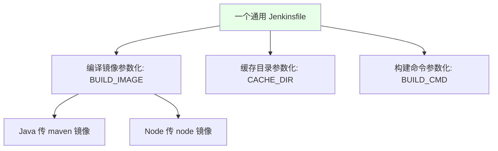

# Kubernetes 集群部署: Docker 镜像高级优化与统一 Jenkinsfile 建议

开篇文章：28 个项目的 Jenkinsfile 该怎么维护？镜像怎么做得更小、拉得更快？结论先摆——把**编译镜像、缓存目录都参数化，做到「一个 Jenkinsfile 通吃所有语言」**；镜像优化靠**选小基础镜像 + 拆分依赖层与源码层**（依赖不变就复用层），Java 可参考 Spring Cloud 官方 Dockerfile，或用 **Jib** 直接从 pom 打极简镜像。

## 纲要

- 统一 Jenkinsfile：参数化编译镜像与缓存目录
- 为什么镜像要小（拉取慢、容灾痛）
- 选小基础镜像：alpine / slim / busybox / scratch
- 镜像分层：依赖层与源码层拆分
- Java / Node / PHP 各自的依赖缓存目录
- Google Jib 工具打极简镜像

## 统一 Jenkinsfile



| 参数 | 作用 |
| --- | --- |
| `BUILD_IMAGE` | 编译用基础镜像（maven / node / 其他），注入即可 |
| `CACHE_DIR` | 依赖缓存目录，统一挂载 |
| `BUILD_CMD` | 构建命令（install / package），按项目不同传入 |

> 若把编译镜像、缓存目录、构建命令都参数化，一个 Jenkinsfile 就能服务所有应用，维护只改一处（如加邮件通知），不用改十几个文件。也可用共享 library 复用。

## 为什么镜像要小

```text
大镜像的代价:

镜像体积
├── 新节点拉镜像特别慢
├── 灾难恢复拉镜像慢, 过程痛苦
└── 占用仓库/节点存储
```

| 维度 | 大镜像 | 小镜像 |
| --- | --- | --- |
| 首次拉取 | 慢 | 快 |
| 容灾恢复 | 痛苦 | 轻松 |
| 存储 | 浪费 | 节省 |

## 选小基础镜像

```dockerfile
# 推荐顺序: 越小越好, 但要有动态库和应用能起来
FROM node:slim          # 比完整版小, 已带动态库
# FROM alpine           # 更小, 但可能缺库, 需注意
# FROM busybox          # 极小
# FROM scratch          # 空镜像, 无动态库, 仅适合静态二进制
```

| 基础镜像 | 特点 |
| --- | --- |
| `slim` | 在动态库基础上裁剪，体积小且能跑 |
| `alpine` | 更小，但可能缺共享库，需确认 |
| `busybox` | 极简，工具少 |
| `scratch` | 空镜像，无 libc，仅适合静态链接二进制 |

> 编译型语言若指定**静态库**编译，就不依赖宿主机动态库，可直接用更小的镜像。过小导致应用起不来也不行，要兼顾基本工具。

## 镜像分层：依赖层与源码层拆分

```dockerfile
# Java: 先拷依赖, 再拷源码 → 依赖不变时复用该层
FROM maven:3-jdk-8 AS build
WORKDIR /app
COPY pom.xml .
RUN mvn dependency:go-offline          # 只下载依赖, 形成独立层
COPY src ./src
RUN mvn package

FROM openjdk:8-jre
COPY --from=build /app/target/*.jar /opt/app.jar
EXPOSE 8080
```

```text
分层效果:

镜像层
├── 依赖层 (pom/package 决定, 常不变)  ← 复用, 不重复拉
└── 源码层 (每次改几 KB)             ← 只拉这一小层
```

| 语言 | 依赖缓存目录 | 拆分方式 |
| --- | --- | --- |
| Java | 依赖打进 jar（用 `dependency:go-offline` 分层） | 依赖层 / 源码层 |
| NodeJS | `node_modules` | 先拷 `node_modules` 再拷 `src` |
| PHP | `vendor` | 先拷 `vendor` 再拷代码 |
| Go | 二进制包 | 二进制直接拷，天然小 |

> 不拆分时，每次把整个带依赖的 jar（如 100M，依赖占 80M）打成一层，每次都重拉 80M；拆分后源码改几 KB 只拉几 KB，依赖层复用。Spring Cloud 官方 Dockerfile 就是这么建议的。

## Google Jib 打极简镜像

```bash
# Jib 直接读 pom, 无需写 Dockerfile, 自动推到镜像仓库
mvn clean compile jib:build \
  -Djib.to.image=$REGISTRY_ADDRESS/demo/$IMAGE_NAME:$TAG
```

| 特性 | 说明 |
| --- | --- |
| 无需 Dockerfile | 直接从 `pom.xml` 构建 |
| 分层极细 | 每层很小，改一个文件只增几 KB 层 |
| 直接推仓库 | 构建完自动 push 到镜像库 |
| 结合 maven | 执行 `mvn clean` 时指定 jib 插件即可 |

> Jib 是 Google 开源工具，和 maven 结合，自动打出最精简镜像并推送到仓库，连 Dockerfile 都不用写。

## API 速览

| 能力 | 做法 |
| --- | --- |
| 通用流水线 | 参数化 `BUILD_IMAGE` / `CACHE_DIR` / `BUILD_CMD`，一个 Jenkinsfile 服务所有语言 |
| 镜像体积 | 越小拉取/容灾越快 |
| 基础镜像 | 选 `slim`/`alpine`/`busybox`/`scratch`，兼顾动态库 |
| 分层优化 | 依赖层与源码层拆分，依赖不变即复用 |
| Java | `dependency:go-offline` 分层；参考 Spring Cloud 官方 Dockerfile |
| Node/PHP | 先拷 `node_modules`/`vendor` 再拷源码 |
| Jib | `mvn jib:build` 免 Dockerfile 打极简镜像 |

## Demo 示例

```bash
# 统一 Jenkinsfile 用法示意 (参数化)
BUILD_IMAGE=maven:3-jdk-8
CACHE_DIR=/cache/.m2
BUILD_CMD="mvn clean package -DskipTests"

# Java 分层构建 (依赖层复用)
docker build -t $REGISTRY_ADDRESS/demo/$IMAGE_NAME:$TAG .

# 或用 Jib 免 Dockerfile
mvn clean compile jib:build -Djib.to.image=$REGISTRY_ADDRESS/demo/$IMAGE_NAME:$TAG

# 推仓库后更新
kubectl -n $NAMESPACE set image deployment/$IMAGE_NAME \
  $IMAGE_NAME=$REGISTRY_ADDRESS/demo/$IMAGE_NAME:$TAG -l app=$IMAGE_NAME
```

### 总结

- **维护靠统一 Jenkinsfile**：把编译镜像、缓存目录、构建命令都参数化，一个文件服务所有语言，加功能只改一处，也可用共享 library 复用；
- **镜像必须小**：大镜像拉取慢、容灾恢复痛苦，选 `slim`/`alpine`/`busybox`/`scratch` 等小基础镜像，但要有动态库、保证应用能起；
- **分层是核心优化**：把依赖层与源码层拆分，依赖不变时该层被复用，源码只改几 KB 就只拉几 KB，Java 可用 `dependency:go-offline` 或参考 Spring Cloud 官方 Dockerfile；
- **各语言缓存目录不同**：Java 依赖打进 jar（分层处理）、Node 的 `node_modules`、PHP 的 `vendor`，都应先拷依赖再拷源码；
- **Jib 免 Dockerfile 打极简镜像**：Google 开源工具直接读 `pom.xml` 分层构建并推送仓库，改一个文件只增几 KB 层，极大加速发布。

