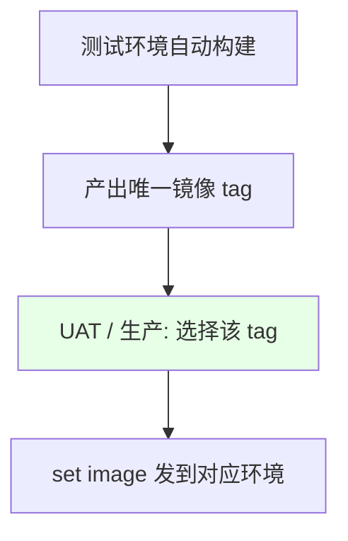

# Kubernetes 集群部署: 生产环境与 UAT 环境流水线（选择镜像发版）

开篇文章：测试环境自动构建了镜像，UAT / 生产怎么发？结论先摆——K8s 里 UAT / 生产**不重复构建**，而是**选择测试环境产出的镜像 tag**，通过 Harbor / 阿里云接口拉取 tag 列表，用 **Active Choices Reactive 参数**让用户选 tag，再 `set image` 发到对应集群（按 namespace 或按多集群 context 隔离）。

## 纲要

- K8s 中 UAT / 生产不发版方式：选镜像而非重构建
- 从镜像仓库获取 tag 列表（Harbor / 阿里云）
- Active Choices Reactive 参数让用户选 tag
- 资源用同一名称 + 同一 label，便于无缝迁移
- 多集群：切换 kubeconfig context 发版
- 生产环境配置要点

## 选镜像而非重构建



| 环境 | 做法 |
| --- | --- |
| 测试环境 | 自动构建，产出镜像 |
| UAT / 生产 | **不重复构建**，选测试环境的镜像 tag 直接发 |
| 隔离方式 | 不同集群 / 不同 namespace / 同一 label |

> 传统方式以编译产物（jar）为基础放制品仓库再选；K8s 里以镜像为基础，选测试环境镜像发到目标环境即可，原理一致。

## 获取 tag 列表

```bash
# Harbor: 调 API 获取某 project 的 tags
REGISTRY_ADDRESS=registry.cn-hangzhou.aliyuncs.com
NAMESPACE=demo
IMAGE_NAME=nodejs-demo

# 阿里云用客户端工具获取 (去掉引号, sh 不支持)
TAGS=$(aliyun cr tags --namespace $NAMESPACE --repo $IMAGE_NAME | grep -v '"' )

# 拼出完整镜像地址后用于发版
echo "可选 tags: $TAGS"
```

| 仓库 | 获取 tag 方式 |
| --- | --- |
| Harbor | 请求 Harbor API（`/api/repositories/.../tags`） |
| Docker Hub | 请求 Docker Hub API |
| 阿里云 | 用阿里云客户端工具获取 |

> 课程用 Groovy 脚本（在 Active Choices 里）调用 shell 获取 tag，注意引号：外层双引号内层要改单引号，否则变量冲突。

## Active Choices Reactive 参数

```text
Jenkins 参数配置:

参数
├── 类型: Active Choices Reactive Parameter
├── 名称: IMAGE_TAG
├── 脚本: 调 shell 获取 tag 列表 (echo 打印)
└── 返回: 单选下拉, 让用户选要发的 tag
```

| 要点 | 说明 |
| --- | --- |
| 参数类型 | Active Choices Reactive Parameter |
| 脚本语言 | Groovy 里用 `echo` 打印，纯 shell 用 `sh` 执行 |
| 引用顺序 | 被引用的变量要定义在引用它的参数之前 |
| 错误处理 | 获取失败可返回默认 error 值 |

> 用 `echo` 而非 `sh` 时，是在用 Groovy 执行；前面定义的变量要在引用它的参数后面才找得到，注意顺序。

## 同一名称 + 同一 label

```bash
# 测试/UAT/生产 的 Deployment 用同一名称与 label, 便于迁移管理
NAMESPACE=uat
DEPLOY_TYPE=deployment
IMAGE_NAME=nodejs-demo

kubectl -n $NAMESPACE set image $DEPLOY_TYPE/$IMAGE_NAME \
  $IMAGE_NAME=$REGISTRY_ADDRESS/$NAMESPACE/$IMAGE_NAME:$IMAGE_TAG -l app=$IMAGE_NAME
```

| 建议 | 说明 |
| --- | --- |
| 同名 Deployment | 测试/UAT/生产同名，管理简单 |
| 同 label | 用 `-l app=xxx` 一次更新 |
| 无缝迁移 | 复制资源文件即可跨环境 |

## 多集群发版（切换 context）

```bash
# 多集群 kubeconfig: 切到 UAT context 再发版
export KUBECONFIG=/mnt/.kube/config
kubectl config use-context $CLUSTER          # 如 uat / prod
kubectl -n $NAMESPACE set image deployment/$IMAGE_NAME \
  $IMAGE_NAME=$REGISTRY_ADDRESS/$NAMESPACE/$IMAGE_NAME:$IMAGE_TAG -l app=$IMAGE_NAME
```

> agent 为 none 时在 Jenkins master 执行，需保证 master 上有 kubeconfig 文件与 kubectl 客户端；未配环境变量时会默认读 `$HOME/.kube/config`，找不到就报错。

## API 速览

| 能力 | 做法 |
| --- | --- |
| 发版方式 | UAT/生产**不重建**，选测试镜像 tag 发版 |
| 取 tag | Harbor/Docker Hub API 或阿里云客户端 |
| 选 tag | Active Choices Reactive 参数（Groovy 调 shell） |
| 资源管理 | 各环境 Deployment 同名 + 同 label，便于迁移 |
| 多集群 | `kubectl config use-context` 切换后 `set image` |
| agent 注意 | none 时在 master 跑，需 kubeconfig + kubectl |
| 隔离 | 按集群 / namespace / label 隔离 |

## Demo 示例

```bash
# 1. 获取可选 tag (示意: 阿里云)
TAGS=$(aliyun cr tags --namespace $NAMESPACE --repo $IMAGE_NAME)

# 2. 用户在 Active Choices 下拉中选好 IMAGE_TAG 后, 执行发版
export KUBECONFIG=/mnt/.kube/config
kubectl config use-context $CLUSTER

kubectl -n $NAMESPACE set image deployment/$IMAGE_NAME \
  $IMAGE_NAME=$REGISTRY_ADDRESS/$NAMESPACE/$IMAGE_NAME:$IMAGE_TAG -l app=$IMAGE_NAME

# 3. 观察滚动更新
timeout 300 kubectl -n $NAMESPACE rollout status deployment/$IMAGE_NAME --watch
```

### 总结

- **UAT / 生产不重复构建**：K8s 里以镜像为基础，直接选择测试环境产出的镜像 tag 发到目标环境，做到「一次构建、多次部署」；
- **从仓库拉 tag 列表**：Harbor / Docker Hub 走 API，阿里云走客户端工具；Groovy 脚本获取时注意引号（外层双引号内层改单引号）与变量定义顺序；
- **用 Active Choices Reactive 参数选 tag**：让用户在下拉里选要发的镜像版本，被引用变量要定义在引用参数之前；
- **资源同名同 label 便于迁移**：测试/UAT/生产用同一 Deployment 名称与 label，复制资源文件即可跨环境，用 `-l` 一次更新；
- **多集群靠 context 切换**：agent 为 none 时在 master 执行需备好 kubeconfig 与 kubectl，发版前 `use-context` 切到 UAT/生产再 `set image`；生产环境与 UAT 做法一致。

